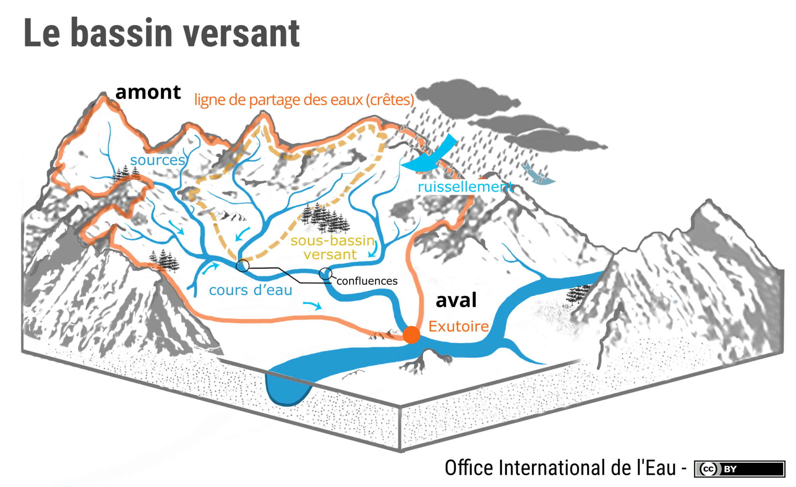
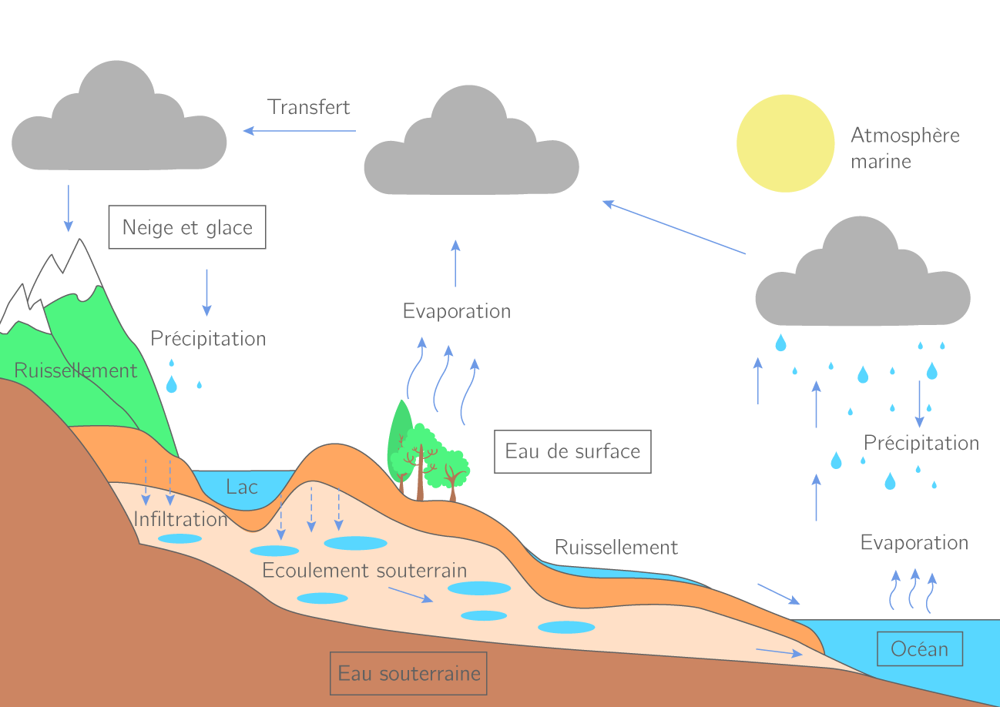

```{r Charger_librairies, include=F, message=F, warning=F}


library("ggpubr") # pour la fonction ggarrange 
library("ggplot2")
library("car")

# ggpubr qui permet de rassembler plusieurs plots
library("ggplot2") # to do sophisticated ("high-level") plots
library("stats") # 

# library() # list available libraries (not necessarily loaded)
# library(lib.loc=.Library)
library("car") # pour la fonction "scatterplot"
library("psych") # pour la fonction "describe"
library("ggfortify", warn.conflicts=T) 
# to do sophisticated ("high-level") plots, namely "autoplot"
# install.packages("skimr")
# library("skimr")
# "skimr" permet d'obtenir des stats et des mini-histogrammes
# install.packages("DataExplorer")
# library(DataExplorer)
# "DataExplorer" pour obtenir un rapport html des statistiques de base

# installed.packages() 
# (.packages()) # to list loaded libraries at startup.

# .libPaths() # where libraries read from.

# or...
# .packages(all.available = TRUE) # to list all packages installed
# ... but not necessarily loaded with command "library"

# system.file(package='stats') # to check where is package
# find.package("utils")
# (.packages()) # to list loaded libraries

```

```{r set_dir, include=F}
# setwd("C:/Users/mrdos/OneDrive/Documents/Shippagan_mai_aout_2024/Analyse_R_sum/Github")
# getwd()
# list.files()

# Répertoire pour Gaël
 setwd("~/Shippagan_mai_aout_2024/Analyse_R_sum/Ranalyse")


# Répertoire pour Alain
# setwd("/media/alain/ap2To/UMCS_bak/Documents/SUPERVISION/Gael/github_Gael")
# Je préfère y aller par le menu au début d'une session d'analyse:
# Session > Set Working Directory > To Source File Location

getwd()
# list.files()
list.files(all.files=T, pattern="RData")
```


```{r charger_Pok2001.2022.RData, include=F}

load("./Pok2001.2022.RData")

```


```{r Charger_chimie, eval=F, include=F, message=F, warning=F}

Pok2001.2022=read.csv2("Qualite_eau_CGERP_2001-2022.csv")
dim(Pok2001.2022) # 198 et 80
str(Pok2001.2022)
```

```{r Variable_Date, eval=F, include=F, message=F, warning=F}
# Créer la nouvelle variable "Date" au format "date".
Pok2001.2022$Date=format(as.Date(Pok2001.2022$DateSampled,format="%Y-%m-%d"))
Pok2001.2022$Date=as.Date(Pok2001.2022$Date)
summary(Pok2001.2022$Date)
```


```{r Uniformiser_variables,  eval=F, include=F, message=F, warning=F}

# Uniformiser la variable "AnalysisSurfaceWater" 
# (qui prend parfois des majuscules et d'autres fois des minuscules) 
# et l'attribuer à la nouvelle variable "Station":

Pok2001.2022$Station[Pok2001.2022$AnalysisSurfaceWater=="Pok-1"] <- "Pok-01"
Pok2001.2022$Station[Pok2001.2022$AnalysisSurfaceWater=="POK-1"] <- "Pok-01"

Pok2001.2022$Station[Pok2001.2022$AnalysisSurfaceWater=="Pok-2"] <- "Pok-02"
Pok2001.2022$Station[Pok2001.2022$AnalysisSurfaceWater=="POK-2"] <- "Pok-02"

Pok2001.2022$Station[Pok2001.2022$AnalysisSurfaceWater=="Pok-3"] <- "Pok-03"
Pok2001.2022$Station[Pok2001.2022$AnalysisSurfaceWater=="POK-3"] <- "Pok-03"

Pok2001.2022$Station[Pok2001.2022$AnalysisSurfaceWater=="Pok-4"] <- "Pok-04"
Pok2001.2022$Station[Pok2001.2022$AnalysisSurfaceWater=="POK-4"] <- "Pok-04"

Pok2001.2022$Station[Pok2001.2022$AnalysisSurfaceWater=="Pok-5"] <- "Pok-05"
Pok2001.2022$Station[Pok2001.2022$AnalysisSurfaceWater=="POK-5"] <- "Pok-05"

Pok2001.2022$Station[Pok2001.2022$AnalysisSurfaceWater=="Pok-6"] <- "Pok-06"
Pok2001.2022$Station[Pok2001.2022$AnalysisSurfaceWater=="POK-6"] <- "Pok-06"

Pok2001.2022$Station[Pok2001.2022$AnalysisSurfaceWater=="Pok-7"] <- "Pok-07"
Pok2001.2022$Station[Pok2001.2022$AnalysisSurfaceWater=="POK-7"] <- "Pok-07"

Pok2001.2022$Station[Pok2001.2022$AnalysisSurfaceWater=="Pok-8"] <- "Pok-08"
Pok2001.2022$Station[Pok2001.2022$AnalysisSurfaceWater=="POK-8"] <- "Pok-08"

Pok2001.2022$Station[Pok2001.2022$AnalysisSurfaceWater=="Pok-9"] <- "Pok-09"
Pok2001.2022$Station[Pok2001.2022$AnalysisSurfaceWater=="POK-9"] <- "Pok-09"

Pok2001.2022$Station[Pok2001.2022$AnalysisSurfaceWater=="Pok-10"] <- "Pok-10"
Pok2001.2022$Station[Pok2001.2022$AnalysisSurfaceWater=="POK-10"] <- "Pok-10"

Pok2001.2022$Station[Pok2001.2022$AnalysisSurfaceWater=="Pok-11"] <- "Pok-11"
Pok2001.2022$Station[Pok2001.2022$AnalysisSurfaceWater=="POK-11"] <- "Pok-11"

Pok2001.2022$Station[Pok2001.2022$AnalysisSurfaceWater=="Pok-12"] <- "Pok-12"
Pok2001.2022$Station[Pok2001.2022$AnalysisSurfaceWater=="POK-12"] <- "Pok-12"

head(Pok2001.2022$Station)
```

```{r Station_facteur, eval=F, include=F, message=F, warning=F}
# Convertir le type de la variable "Station" en type "facteur"
Pok2001.2022$Station=as.factor(Pok2001.2022$Station)
summary(Pok2001.2022$Station)
```

```{r Variable_Station2,  eval=F, include=F, message=F, warning=F}

# Créer la nouvelle variable "Station2" avec des variables plus parlantes:
Pok2001.2022$Station2[Pok2001.2022$Station=="Pok-01"] <- "br. sud amont 01"
Pok2001.2022$Station2[Pok2001.2022$Station=="Pok-02"] <- "Suggary 02"
Pok2001.2022$Station2[Pok2001.2022$Station=="Pok-03"] <- "Branche sud aval 03"
Pok2001.2022$Station2[Pok2001.2022$Station=="Pok-04"] <- "Pok amont 04"
Pok2001.2022$Station2[Pok2001.2022$Station=="Pok-05"] <- "McConnell Six Rd 05"
Pok2001.2022$Station2[Pok2001.2022$Station=="Pok-06"] <- "Morrison 06"
Pok2001.2022$Station2[Pok2001.2022$Station=="Pok-07"] <- "Waugh sanct. 07"
Pok2001.2022$Station2[Pok2001.2022$Station=="Pok-08"] <- "Sewell 08"
Pok2001.2022$Station2[Pok2001.2022$Station=="Pok-09"] <- "Trout Val-Doucet 09"
Pok2001.2022$Station2[Pok2001.2022$Station=="Pok-10"] <- "Pollard 10"
Pok2001.2022$Station2[Pok2001.2022$Station=="Pok-11"] <- "Malt 11"
Pok2001.2022$Station2[Pok2001.2022$Station=="Pok-12"] <- "Dempsey 12"
```


```{r Ordonner_tableau,  eval=F, include=F, message=F, warning=F}
# Ordonner les valeurs de la variables "Station2" de l'amont vers l'aval:

strwrap("AP 2024-06-04 Le bloc suivant ordonne les stations de l'ouest vers l'est (dans le sens du courant). C'est l'ordre qui est affiché quand on fait des graphiques de type box-plot. On pourrait (on devrait) choisir d'autres manières d'ordonner les stations, par exemple, en fonction de la distance entre la station et la tête du ruisseau.")

Pok2001.2022$Station2=ordered(Pok2001.2022$Station2,
levels=c("Pok amont 04",      "Suggary 02",          "Morrison 06", 
         "br. sud amont 01",  "Branche sud aval 03", "Trout Val-Doucet 09", 
         "Sewell 08",         "Dempsey 12",          "Pollard 10",
         "Malt 11",           "Waugh sanct. 07",     "McConnell Six Rd 05"))

summary(Pok2001.2022$Station2)
```


```{r Trier_tableau,  eval=F, include=F}
# Trier le tableau selon la station et la date
class(Pok2001.2022$Station2)
summary(Pok2001.2022$Station2)
# Trier le tableau selon la station et la date
Pok2001.2022=Pok2001.2022[order(Pok2001.2022$Station2,Pok2001.2022$Date),]
Pok2001.2022[1:5,1:5]
dim(Pok2001.2022) 
# 198 x 83 au 2024-06-26

```

```{r Doublons, eval=F, include=F}
strwrap("Normalement le tableau devrait comprendre 12 stations x 4 années x 
4 sorties/année = 192 objets stations-dates.")
strwrap("Le fait que le fichier contient 198 rangées plutôt que 192 s'explique 
par la présence de doublons. La fonction 'aggregate' permettra leur éliminiation.")
strwrap("Nous avons 102 enregistrements (rangées) pour la période 2001-2002 et 96 
pour la période 2021-2022 jusqu'au 04 juin.")

# Montrer les doublons

strwrap("La station Pok-10 a été échantillonnée cinq fois en 2001 (plutôt que quatre fois).
Les stations 1 et 8 ont été échantillonnées chacune cinq fois en 2002.
La station 2 a été échantillonnée cinq fois en 2001 et en 2002.
Voyons comment diffèrent ces données.")

table(Pok2001.2022$Date, Pok2001.2022$Station)
Doublons_Pok01_2002_10_31=subset(Pok2001.2022, 
                                 (Station=="Pok-01" & Date=="2002-10-31"))
Doublons_Pok01_2002_10_31

# Les valeurs se ressemblent. Prenons les moyennes avec la fonction "aggregate".
```

```{r Aggregate,  eval=F, include=F}
strwrap("Les cinq doublons peuvent servir à vérifier la qualité des données: 
si les mesures se ressemblent (par rapport à la variabilité entre dates et stations) 
pour une station à une date, c'est que le instruments
et les manipulations sont fiables.")

test=aggregate(Pok2001.2022, by=list(Station=Pok2001.2022$Station,
                                     Date=Pok2001.2022$Date,
                                     Station2=Pok2001.2022$Station2), FUN="mean", na.rm=TRUE)
dim(test) # 192, comme attendu:
12 * 4 * 4
# str(test)
# Vérifier que les autres valeurs sont les mêmes (sauf pour les doublons):
subset(Pok2001.2022,select=c(Station, Date, Sodium_mg_L, Potassium_mg_L))[1:5,]
subset(test,select=c(Station, Date, Sodium_mg_L, Potassium_mg_L))[1:5,]

# SUPPRIMER LES VARIABLES CRÉÉES EN TROP (DOUBLONS)
names(test)

test[1:5,c(2,84)]
test[1:5,c(1,85)]
test[1:5,c(3,86)]

# Supprimer les colonnes 84 (Date.1), 85 (Station.1) et 86 (Station2.1)
test2=test[,-c(84:86)]
dim(test2)
# 192 x 83
names(test2)
# Accepter le résultat:
Pok2001.2022 <- test2
dim(Pok2001.2022)
names(Pok2001.2022)
str(Pok2001.2022)
class(Pok2001.2022$Date)
# Pok2001.2022$Date
```

```{r Variable_year, eval=F, include=F, message=F, warning=F}
# Extraire les éléments d'année et en faire une variable "Year"   
# https://stackoverflow.com/questions/36568070/extract-year-from-date
Pok2001.2022$Year=as.factor(format(Pok2001.2022$Date, "%Y"))
summary(Pok2001.2022$Year)
class(Pok2001.2022$Year)
table(Pok2001.2022$Year,Pok2001.2022$Station)

```


```{r Variable_Period,  eval=F, include=F, message=F, warning=F}
# Créer une variable "Period" qui désigne la période 2001-2002 ou 2021-2022.
Pok2001.2022$Period[Pok2001.2022$Year==2001] <- "2001-2002"
Pok2001.2022$Period[Pok2001.2022$Year==2002] <- "2001-2002"
Pok2001.2022$Period[Pok2001.2022$Year==2021] <- "2021-2022"
Pok2001.2022$Period[Pok2001.2022$Year==2022] <- "2021-2022"
Pok2001.2022$Period=as.factor(Pok2001.2022$Period)

summary(Pok2001.2022$Period)
```

```{r Campagne,  eval=F, include=F}
# Créer une variable CampagneNo
table(Pok2001.2022$Date,Pok2001.2022$Year)
# 2001
Pok2001.2022$Campagne[Pok2001.2022$Date=="2001-08-01"] <- 1
Pok2001.2022$Campagne[Pok2001.2022$Date=="2001-08-28"] <- 2
Pok2001.2022$Campagne[Pok2001.2022$Date=="2001-09-26"] <- 3
Pok2001.2022$Campagne[Pok2001.2022$Date=="2001-10-31"] <- 4
# 2002
Pok2001.2022$Campagne[Pok2001.2022$Date=="2002-07-29"] <- 5
Pok2001.2022$Campagne[Pok2001.2022$Date=="2002-08-28"] <- 6
Pok2001.2022$Campagne[Pok2001.2022$Date=="2002-10-02"] <- 7
Pok2001.2022$Campagne[Pok2001.2022$Date=="2002-10-31"] <- 8
# 2021
Pok2001.2022$Campagne[Pok2001.2022$Date=="2021-07-28"] <- 9
Pok2001.2022$Campagne[Pok2001.2022$Date=="2021-08-31"] <- 10
Pok2001.2022$Campagne[Pok2001.2022$Date=="2021-10-05"] <- 11
Pok2001.2022$Campagne[Pok2001.2022$Date=="2021-10-28"] <- 12
# 2022
Pok2001.2022$Campagne[Pok2001.2022$Date=="2022-07-28"] <- 13
Pok2001.2022$Campagne[Pok2001.2022$Date=="2022-09-01"] <- 14
Pok2001.2022$Campagne[Pok2001.2022$Date=="2022-10-03"] <- 15
Pok2001.2022$Campagne[Pok2001.2022$Date=="2022-11-01"] <- 16
Pok2001.2022$Campagne

```


```{r Structure_tableau,  eval=F, include=F,  message=F, warning=F}
# Comprendre la structure du tableau
# Ce 06 juin on a maintenant pour chaque période 96 données enrégistrées.
strwrap("La fonction ''table'' produit un tableau de contingence 
        indiquant le nombre de rangées de données pour chaque combinaison:")
table(Pok2001.2022$Date, Pok2001.2022$Year)
table(Pok2001.2022$Station, Pok2001.2022$Year)
table(Pok2001.2022$Date)
```


 
```{r Niveaux,  eval=F, include=F, message=F, warning=F}
levels(Pok2001.2022$Station2)
levels(Pok2001.2022$Period)
```


```{r Charger_longueur, eval=F,  include=F}
# Charger les données de longueurs et d'ordre des tributaires
# Nom du fichier original: 

ordres=read.csv2("Pokemouche_longueurs_ordres.csv")
dim(ordres) # 12 x 24
ordres$Station=as.factor(ordres$Station)
str(ordres)
# Attention à ajouter des décimales dans Excel pour que les valeurs soient
# considérées comme des valeurs numériques et non des entiers.
describe(ordres)

# Ordre1_m_amont: Longueur totale (m) de tous les cours d’eau d'ordre 1 en amont de la station
# Somme_ordre_1-5: longueur totale (m) de tous les cours d'eau (ordre 1 à 5) en amont de la station
# Dist_amont_station_m: le parcours entre la station et le point en amont le plus reculé
#   tel que mesuré par AP avec qGIS.
# Longueur_totale_m_ordre1: longueur totale (m) de tous les cours d'eau d'ordre 1 
#    dans le sous-bassin versant

```


```{r Carte_stations, eval=F, include=F}
# summary(ordres$Long)
plot(ordres$Long, ordres$Lat, pch="", xlim=c(2590000, 2623000))
text(ordres$Long, ordres$Lat,  ordres$Station)
grid()

```

```{r Carte_stations2, include=F}
plot(Pok2001.2022$Long, Pok2001.2022$Lat, pch="", xlim=c(2590000, 2623000))
text(Pok2001.2022$Long, Pok2001.2022$Lat,  Pok2001.2022$Station)
grid()

```

```{r relations_long, include=F}
# Y a-t-il une tendance dans la longueur des chemins et la longitude?
pairs(subset(Pok2001.2022, select=c(Long,
  Ordre1_m_amont, Ordre2_m_amont, Ordre3_m_amont, Ordre4_m_amont, Ordre5_m_amont,
  Somme_ordre_1.5)))

```

```{r relations_lat, include=F}
# Y a-t-il une tendance dans la longueur des chemins et la latitude?
pairs(subset(Pok2001.2022, select=c(Lat,
  Ordre1_m_amont, Ordre2_m_amont, Ordre3_m_amont, Ordre4_m_amont, Ordre5_m_amont,
  Somme_ordre_1.5)))
```

```{r longueur3_long,  include=F}
# Tendance à l'augmentation de la longueur des cours d'eau d'ordre 3
# de l'ouest vers l'est (dans le sens du courant):
plot(Pok2001.2022$Long, Pok2001.2022$Ordre3_m_amont, pch="", xlim=c(2590000, 2623000))
text(Pok2001.2022$Long, Pok2001.2022$Ordre3_m_amont, Pok2001.2022$Station)

```


```{r Charger_caract_bv, eval=F, include=F}
# 2024-06-20 à la maison
# Charger le fichier que Manar a produit des caractéristiques des bassins versants
# Nom du fichier original: 
# https://liveumoncton-my.sharepoint.com/personal/alain_umoncton_ca/Documents
# /Pokemouche_2021_CGERP_%C3%A9chantillonnage_20_ans/travail%20stage%20excel.xlsx
caract.bv=read.csv2("caract_bv2.csv")
# caract_bv2.csv est la version qui contient les valeurs pour Pok-03
# après que j'eu signalé leurs absences à Manar.
dim(caract.bv) 
# 12 rangées x 319 colonnes
# 12 x 321 au 2024-06-24
str(caract.bv)
caract.bv$Station=as.factor(caract.bv$Station)
class(caract.bv$Station)
levels(caract.bv$Station)
```

```{r graphiques_bv, eval=F, include=F}
strwrap(" AP 2024-06-20
Les 'couches' (fichiers géomatiques) disponibles du ministère du N.-B., sur le site geonb.ca
incluent 'Forest' (F, forêt), 'Non Forest' (NF, tout ce qui n'est pas considéré comme de la forêt),
Water (WA, plans d'eau) et Wetland (WL, terres humides). Ces quatre couches de polygones (surfaces)
sont cencés couvrir tout le territoire et devraient être mutuellement exclusives.

Comme nous avons rencontré des problèmes de chevauchement entre les couches F et NF, Émilie
et Kyle nous a proposé de travailler avec les fichiers 'Landbase' qui combinent dans un seul
fichier les quatre couches F, NF, WA, WL. Ce fichier Landbase contient une variable supplémentaire
par rapport aux couches initiales: CAT qui désignent si l'élément (rangée du tableau attributaire)
provient de F, NF, WL ou WA.
        ")

# Cibler les variables prioritaires et les placer dans un ordre commode:
# names(caract.bv)
caract.bv2=subset(caract.bv, 
 select=c(Station, sup_km2_sbv, sup_drainee_km2_sbv, longueur_route_km_sbv,
          WA_km2_supdrainee_2020,  WL_km2_supdrainee_2020, NF_km2_supdrainee_2020, FO_km2_supdrainee_2020,
          
          AGR_km2_supdrainee_2020, IND_km2_supdrainee_2020, INF_km2_supdrainee_2020, SET_km2_supdrainee_2020,
          REC_km2_supdrainee_2020, WIL_km2_supdrainee_2020,
          
          C_km2_supdrainee_2020, F_km2_supdrainee_2020, N_km2_supdrainee_2020, 
          B_km2_supdrainee_2020, NULL_km2_supdrainee_2020,
          
          WA_km2_supdrainee_1990, WL_km2_supdrainee_1990, NF_km2_supdrainee_1990, FO_km2_supdrainee_1990,
          
          AGR_km2_supdrainee_1990, IND_km2_supdrainee_1990, INF_km2_supdrainee_1990, SET_km2_supdrainee_1990, 
          # REC et WIL manquants en 1990
          C_km2_supdrainee_1990, F_km2_supdrainee_1990, N_km2_supdrainee_1990, 
          B_km2_supdrainee_1990, NULL_km2_supdrainee_1990))

dim(caract.bv2) # 12 x 32
# N'y a-t-il pas REC et WIL en 1990?

plot(subset(caract.bv2, select=c(AGR_km2_supdrainee_2020,AGR_km2_supdrainee_1990)))
grid()
# Les superficies agricoles sont plus grandes en 2020 qu'en 1990...

# La superficie qui draine vers la station en fonction de la superficie totale:
plot(caract.bv2$sup_km2_sbv, caract.bv2$sup_drainee_km2_sbv,pch="", xlim=c(0,120))
text(caract.bv2$sup_km2_sbv, caract.bv2$sup_drainee_km2_sbv,  caract.bv2$Station)

caract.bv2$fraction.drainee=caract.bv2$sup_drainee_km2_sbv/caract.bv2$sup_km2_sbv 
subset(caract.bv2, select=c(Station, sup_km2_sbv, sup_drainee_km2_sbv,fraction.drainee))
summary(caract.bv2$fraction.drainee)
# Les stations sont localisées généralement au point où environ 66% de la 
# superficie du bassin est drainée (donc plutôt en aval, ce qui donne une 
# bonne idée de l'influence du bassin)

plot(caract.bv2$sup_km2_sbv, caract.bv2$longueur_route_km_sbv,pch="", xlim=c(0,120))
text(caract.bv2$sup_km2_sbv, caract.bv2$longueur_route_km_sbv,  caract.bv2$Station)

subset(caract.bv2, select=c(Station, longueur_route_km_sbv))

plot(caract.bv2$sup_km2_sbv, caract.bv2$WL_km2_supdrainee_2020, pch="", xlim=c(0,120))
text(caract.bv2$sup_km2_sbv, caract.bv2$WL_km2_supdrainee_2020,  caract.bv2$Station)

# Couche Landbase, CAT=Forest
plot(caract.bv2$sup_km2_sbv, caract.bv2$FO_km2_supdrainee_2020, pch="", xlim=c(0,120))
text(caract.bv2$sup_km2_sbv, caract.bv2$FO_km2_supdrainee_2020,  caract.bv2$Station)

# Couche Landbase, CAT=Non Forest
plot(caract.bv2$sup_km2_sbv, caract.bv2$NF_km2_supdrainee_2020, pch="", xlim=c(0,120))
text(caract.bv2$sup_km2_sbv, caract.bv2$NF_km2_supdrainee_2020,  caract.bv2$Station)

# Couche Landbase, CAT=Non-Forest, variable=PLU (Primary Land Use)
# AGR	Terre surtout utilisée pour cultiver des produits agricoles 
#     et des produits non ligneux ainsi que les champs et pâturages
# DND	Terre surtout utilisée pour l'entraînement et les exercices de la Défense nationale
# IND	Terre surtout utilisée à des fins industrielles, notamment les installations de traitement
# INF	Terre surtout utilisée pour le transport, les communications et/ou les services publics
# REC	Terre surtout utilisée pour les activités sportives, récréatives, culturelles et/ou de divertissement
# SET	Terre surtout utilisée à des fins résidentielles en milieu urbain ou rural
# WIL	Terre où il est impossible de cultiver des arbres et qui ne subit pas l'incidence de l'activité humaine

plot(caract.bv2$sup_drainee_km2_sbv, caract.bv2$AGR_km2_supdrainee_2020, pch="", xlim=c(0,120))
text(caract.bv2$sup_drainee_km2_sbv, caract.bv2$AGR_km2_supdrainee_2020,  caract.bv2$Station)
# Pour Pok-05, environ 4 km2 d'AGR pour une superficie de 20 km2, soit 1/5 ou 20%.

plot(caract.bv2$sup_drainee_km2_sbv, caract.bv2$IND_km2_supdrainee_2020, pch="", xlim=c(0,120))
text(caract.bv2$sup_drainee_km2_sbv, caract.bv2$IND_km2_supdrainee_2020,  caract.bv2$Station)
# Pok-05 se démarque par des superficies plus grande d'industrie par rapport aux autres.

plot(caract.bv2$sup_drainee_km2_sbv, caract.bv2$INF_km2_supdrainee_2020, pch="", xlim=c(0,120))
text(caract.bv2$sup_drainee_km2_sbv, caract.bv2$INF_km2_supdrainee_2020,  caract.bv2$Station)

plot(caract.bv2$sup_drainee_km2_sbv, caract.bv2$SET_km2_supdrainee_2020, pch="", xlim=c(0,120))
text(caract.bv2$sup_drainee_km2_sbv, caract.bv2$SET_km2_supdrainee_2020,  caract.bv2$Station)

plot(caract.bv2$sup_drainee_km2_sbv, caract.bv2$REC_km2_supdrainee_2020, pch="", xlim=c(0,120))
text(caract.bv2$sup_drainee_km2_sbv, caract.bv2$REC_km2_supdrainee_2020,  caract.bv2$Station)
# La variable REC contient beaucoup de zéros.

plot(caract.bv2$sup_drainee_km2_sbv, caract.bv2$WIL_km2_supdrainee_2020, pch="", xlim=c(0,120))
text(caract.bv2$sup_drainee_km2_sbv, caract.bv2$WIL_km2_supdrainee_2020,  caract.bv2$Station)
# La variable WIL contient beaucoup de zéros.

# Couche Landbase, CAT=Forest, variable ORIG
# Origine du peuplement (B, C, F, N, W)
# B	Burn		Brûlis
# C	Clear cut (not partial cut)		Coupe à blanc (pas une coupe partielle)
# F	Field		Champ
# N	Natural Succession		Succession naturelle
# W	Windthrow	2015	Chablis
# M	Mining	2015	Mine
# G	Windthrow	2015	Chablis

plot(caract.bv2$sup_drainee_km2_sbv, caract.bv2$C_km2_supdrainee_2020, pch="", xlim=c(0,120))
text(caract.bv2$sup_drainee_km2_sbv, caract.bv2$C_km2_supdrainee_2020,  caract.bv2$Station)
# AP 2024-06-24 Comment expliquer que Pok-03 présente de grandes superficies coupées
# alors que les bassin en amont en ont si peu

plot(caract.bv2$sup_drainee_km2_sbv, caract.bv2$F_km2_supdrainee_2020, pch="", xlim=c(0,120))
text(caract.bv2$sup_drainee_km2_sbv, caract.bv2$F_km2_supdrainee_2020,  caract.bv2$Station)

plot(caract.bv2$sup_drainee_km2_sbv, caract.bv2$N_km2_supdrainee_2020, pch="", xlim=c(0,120))
text(caract.bv2$sup_drainee_km2_sbv, caract.bv2$N_km2_supdrainee_2020,  caract.bv2$Station)

plot(caract.bv2$sup_drainee_km2_sbv, caract.bv2$B_km2_supdrainee_2020, pch="", xlim=c(0,120))
text(caract.bv2$sup_drainee_km2_sbv, caract.bv2$B_km2_supdrainee_2020,  caract.bv2$Station)

plot(caract.bv2$sup_drainee_km2_sbv, caract.bv2$NULL_km2_supdrainee_2020, pch="", xlim=c(0,120))
text(caract.bv2$sup_drainee_km2_sbv, caract.bv2$NULL_km2_supdrainee_2020,  caract.bv2$Station)
# Vérifier avec Emily ou Kyle ce que contient NULL


```

```{r Merge1, eval=F, include=F}
# Joindre le tableau des longueurs à celui des caractéristiques territoriales

dim(ordres) # 12 x 24
dim(caract.bv2) # 12 x 33

summary(ordres$Station)
summary(caract.bv2$Station)

bv1=merge(ordres,caract.bv2, by="Station", all=TRUE)
dim(bv1) # 12 x 56
24+33-1

```

```{r Relations_ordre_caract, eval=F, include=F}
# names(bv1)
summary(bv1$sup_km2_sbv)

subset(bv1, select=c(Station, sup_km2_sbv, Longueur_totale_m_sous_bassin))

plot(bv1$sup_km2_sbv, bv1$Longueur_totale_m_sous_bassin, pch="", xlim=c(20,40))
text(bv1$sup_km2_sbv, bv1$Longueur_totale_m_sous_bassin,  bv1$Station)
# Pok-07 est plus sec (moins bien irrigué) que les autres bassins 
# relativement à la taille du bassin (comme Pok-04).
# TODO Calculer les valeurs de longueurs pour POK3: 
# Manar s'en occupe.

```


```{r Merge2, eval=F, include=F}

# Joindre Pok2001.2022 (données de chimie) à bv1 (données de territoire
# comprenant les longueurs, ordres et couvertures)

dim(Pok2001.2022) 
# 192 x 86
class(Pok2001.2022$Station)
levels(Pok2001.2022$Station)
summary(Pok2001.2022$Station)

dim(bv1)
# 12 x 56
class(bv1$Station)
levels(bv1$Station)
summary(bv1$Station)

chimie.bv=merge(Pok2001.2022, bv1, by="Station", all=TRUE)
dim(chimie.bv) # 192 x 141
86 + 56 - 1

# Accepter le résultat:
Pok2001.2022 <- chimie.bv
dim(Pok2001.2022) # 192 x 405

# Supprimer les objets devenus inutiles

rm(ordres, caract.bv, caract.bv2, bv1, chimie.bv, test, test2)

```

```{r charger_meteo, eval=F, include=F}
strwrap("Charger le fichier des données météo de la station Bas-Caraquet
        que Manar a préparé.")
meteo=read.csv2("./meteo_Bac-Caraquet.csv")
dim(meteo)
# 16 x 57 le 2024-06-25
str(meteo)
summary(meteo)
meteo$Date<-as.Date(meteo$Date)
class(meteo$Date)
summary(meteo$Date)
# skim(meteo)
# DataExplorer::create_report(meteo)
# skim et DataExplorer ne donnent rien de plus que "summary" ou "str"...

```

```{r meteo_gr_precip, eval=F, include=F}
barplot(rbind(meteo$precip.tot.2jours,
              meteo$precip.tot.7jours, 
              meteo$precip.tot.14jours,
              meteo$precip.tot.21jours), 
        col=c(1,2,3,4),
        beside=T,
        names.arg=meteo$Date,
        las=3,
        ylab="Précipitations totales (mm)",
        main="Précipitations cumulées 2, 7, 14 et 21 jours avant l'échantillonnage")
# col = c("darkblue", "red")


```

```{r meteo_gr_temp01, eval=F, include=F}
barplot(rbind(meteo$temp_min_C, meteo$temp_moy_C, meteo$temp_max_C), 
        col=c(1,2,3),
        beside=T,
        names.arg=meteo$Date,
        las=3,
        ylab="Température de l'air (°C)",
        main="Températures quotidiennes à Bas-Caraquet, min, moyenne, max")
```


```{r meteo_gr_temp02, eval=F, include=F}
barplot(rbind(meteo$Tmax2jours, meteo$Tmax4jours, meteo$Tmax7jours), 
        col=c(1,2,3),
        beside=T,
        names.arg=meteo$Date,
        las=3,
        ylab="Température de l'air (°C)",
        main="Moyennes des températures maximales sur 2, 4 et 7 jours avant l'échantillonnage")
strwrap("Manar a vérifié le 2024-06-26 sur le site d'Environnement Canada et a
        constaté que les données de température min max moy sont manquantes pour
        cette seule journée du 2022-07-28")

```

```{r merge03, eval=F, include=F}

# Joindre les données de météo au tableau de chimie et territoire


# subset(Pok2001.2022, is.na(Date),select=c("Date","Station"))
# Il ne devrait pas manquer de dates

summary(Pok2001.2022$Date)
class(Pok2001.2022$Date)
dim(Pok2001.2022)
# 192 x 141

summary(meteo$Date)
class(meteo$Date)
dim(meteo) # 16 x 57

chimie.bv.meteo=merge(Pok2001.2022, meteo, by="Date", all=TRUE)

dim(chimie.bv.meteo) 
# 192 x 197 
141 + 57 -1


# Accepter le résultat
Pok2001.2022 <- chimie.bv.meteo
dim(Pok2001.2022)
# 192 x 197
# Sauvegarder le tableau dans le format RData
# save(Pok2001.2022, file="Pok2001.2022.RData")
# file.info("Pok2001.2022.RData")
# 28,8 Ko
```


```{r Sous_groupes, tributaires, echo=F, eval=F, warning=F, include=F}
# Créer des sous-groupes par tributaire (à complèté si néccessaire)
Malt=subset(Pok2001.2022, Station2=="Malt 11")
dim(Malt) # 16 x 85
summary(Malt$Date)

strwrap("Faire de même pour les onze autres stations (pendant l'été 2024).")

```


```{r Tableau_2001_etc,  include=F, message=F, warning=F}
# Créer un tableau par année
Year2001=subset(Pok2001.2022, Year=="2001")
dim(Year2001)
levels(Pok2001.2022$Station2)

Year2002=subset(Pok2001.2022, Year=="2002")
dim(Year2002)
levels(Pok2001.2022$Station2)

Year2021=subset(Pok2001.2022, Year=="2021")
dim(Year2021)
levels(Pok2001.2022$Station2)

Year2022=subset(Pok2001.2022, Year=="2022")
dim(Year2022)
levels(Pok2001.2022$Station2)
```


```{r Periods, include=F, message=F, warning=F, include=F}
# Créer un tableau avec les données de la période 1 seulement 2001_2002:
Period1=subset(Pok2001.2022, Period=="2001-2002")
dim(Period1)
# Créer un tableau avec les données de la période 2 seulement 2021_2022:
Period2=subset(Pok2001.2022, Period=="2021-2022")
dim(Period2)
```

```{r analyses_chimie_bv_meteo_2, include=F}

strwrap("2024-06-26 Le tableau complet des données de chimie, 
        caractéristiques territoriales et météo est enfin assemblé
        et prêt à être analysé.")

ggplot(Pok2001.2022,aes(x=temp_moy_C,y=Temp_eau_YSI_degC)) +
geom_point()


ggplot(Pok2001.2022,aes(x=Temp_eau_YSI_degC,y=Conductivity_microS_cm)) +
geom_point()

sub2=subset(Pok2001.2022,!is.na(Temp_eau_YSI_degC),
            select=c(Ordre1_m_amont, Ordre2_m_amont,Ordre3_m_amont,
                    Temp_eau_YSI_degC, Conductivity_microS_cm, pH_units,SS_mg_L))

dim(sub2)
pairs(sub2)

```


```{r INTRO_PCA, include=F}

# Montrer la ressemblance (ou la distance) entre les stations
# en termes de température lors de la première campagne (2001-08-01)

y1=subset(Pok2001.2022,Date=="2001-08-01", 
          select=c("Station","Temp_eau_YSI_degC", "Conductivity_microS_cm",
                   "pH_units", "Colour_TCU","Carbon_Total_Organic_mg_L"))
dim(y1)
class(y1)
str(y1)
summary(y1)
summary(y1$Temp_eau_YSI_degC)

# Utiliser png("titre"...) pour exporter un graphique.
# Ne pas oublier d'éteindre le moteur graphique avec dev.off()
# png("slide01_temp_1_axis.png", width=800, height=200, units="px", pointsize=12)
plot(0, xlim = c(0, 30),  axes=FALSE, type = "n", xlab = "", ylab = "")
axis(3, at = y1$Temp_eau_YSI_degC, labels = y1$Temp_eau_YSI_degC)
axis(1, at = y1$Temp_eau_YSI_degC, labels = y1$Station, las=3)
# dev.off()

# On peut dire que les station Pok-05 et Pok-04 se ressemblent.
# Au contraire, les stations Pok-05 et Pok-12 ne se ressemblent pas...
# du moins si on ne tient compte que de la température

```

```{r pH_vs_temp, include=F}

# On considérant une 2e variable (2e dimenstion, 2e axe), on constate
# que Pok-05 et Pok-01 sont aussi différents que Pok-05 et Pok-
summary(y1$Temp_eau_YSI_degC)
# png("slide02_temp_pH.png", width=800, height=800, units="px", pointsize=18)
plot(y1$Temp_eau_YSI_degC, y1$pH_units,pch="", xlim=c(7,28))
text(y1$Temp_eau_YSI_degC, y1$pH_units, y1$Station)
# dev.off()

# On pourrait répéter le processus avec 3 axes...
# Montrer la projection d'un stylo ou tout autre objet
# Montrer qu'il existe une orientation de l'objet qui permet 
# de maximiser l'information projetée en deux dimensions. 

```

```{r Couleur_vs_COT, include=F}
# Couleur et carbone
summary(y1$Carbon_Total_Organic_mg_L)
# png("slide03_couleur_COT.png", width=660, height=660, units="px", pointsize=18)
plot(y1$Carbon_Total_Organic_mg_L,y1$Colour_TCU,  pch="",xlim=c(0.5,3.5))
text(y1$Carbon_Total_Organic_mg_L,y1$Colour_TCU, y1$Station)
# dev.off()
cor(y1$Colour_TCU, y1$Carbon_Total_Organic_mg_L)
cor(y1$Carbon_Total_Organic_mg_L, y1$Colour_TCU)
# On pourrait créer un seul axe qui retiendrait 90% de l'info...
# Retenons que Pok-07 et Pok-12 présentent de fortes valeurs de COT et de couleur
# tandis que Pok-09 et Pok-04 présentent de faibles valeurs.
```


```{r PCA_couleur_COT, include=F}

rownames(y1)=y1$Station

y1pca=subset(y1,select=c(Colour_TCU,Carbon_Total_Organic_mg_L))
pca1=prcomp(y1pca, scale=T)
summary(pca1)
# png("slide04_pca_couleur_COT.png", width=700, height=700, units="px", pointsize=18)
biplot(pca1)
# dev.off()
# On retrouve le même groupement de stations le long du premier axe
# qui renferme 97% de la variation conjointe.


```

```{r PCA_5_params, include=F}
y2pca=subset(y1,select=c("Temp_eau_YSI_degC", "Conductivity_microS_cm",
                   "pH_units", "Colour_TCU","Carbon_Total_Organic_mg_L"))
pca2=prcomp(y2pca, scale=T)
summary(pca2)
# png("slide05_pca_5_params.png", width=800, height=800, units="px", pointsize=18)
biplot(pca2)
# dev.off()

# On pourra distinguer les années, saison ou stations lorsque le jeu de
# données complet sera utilisé, grâce à "autoplot"
autoplot(pca2, label=T, data=y1, 
         size=3, colour="Station", shape='Station', loadings=T, 
         loadings.label=T, loadings.label.size=4) +
 scale_shape_manual(values=1:nlevels(y1$Station)) +
  theme_bw() + 
  theme(legend.position = "bottom") + 
  ggtitle("ACP, 5 paramètres 2001-08-01")
```

```{r pH_vs_cond, include=F}

strwrap("La précédente ACP suggère que le pH et la conductivité sont liés. 
        Voyons voir avec un grahpique de dispersion.")


plot(y1$Conductivity_microS_cm, y1$pH_units, pch="")
text(y1$Conductivity_microS_cm, y1$pH_units, y1$Station)

strwrap("Les eaux douces sont plus saturées en CO2 (respiration microbienne, etc.) et donc
        plus acides ques les eaux marines où l'activité photosynthétique peut-être plus élevée...
        À vérifier ou confirmer.")
```


# INTRODUCTION 

#	La qualité de l’eau
##	Les estuaires et les eaux de surface.
Les estuaires sont des rivières côtières sous l’influence des marées. Les eaux de surface sont constituées d’un ensemble d’eaux douces et d’eaux de mers. Les estuaires sont des milieux côtiers où se rencontre l’eau douce et l’eau de mer. Ces estuaires sont des milieux riches en nutriment et en diverses espèces aquatiques. En plus de ces richesses, elles sont des écosystèmes servant d’atout pour la biodiversité et pour les zones côtières. En dépit de toutes les lagunes, les baies, les estuaires et les marais côtiers et d’autres parties du littoral font tous partie des eaux côtières et ne présente pas de critères pour les différencier [@albaret_peuplements_1999]. Les estuaires sont des milieux naturels qui contiennent une grande colonie de production biologique. Ces estuaires sont très souvent exposés à plusieurs condition et facteur tel que les activités humaines susceptibles d’endommager son intégrité et sa gestion durable [@savenkoff_concept_2017].

En dehors des estuaires, on distingue d’autres formes d’eau de surface, on en distingue trois types : les eaux douces, les zones humides, les estuaires ou les eaux côtières.
Les eaux douces, superficielles, sont des plans d’eau, communément appelés les cours d’eau. Ces eaux douces sont caractérisées par les ruisseaux, les rivières, les lacs, les étangs, les fleuves, les marécages disponibles à de la surface de la Terre. Ces réserves d’eau sont grandes, certaines plus que d’autres, et s’alimentent entre elles ou directement par la précipitation et le cycle de l’eau. Ces réserves abritent une variété importante d’espèces, de plantes et d’animaux aquatiques. Elles leur servent d’habitat et sont particulièrement riches en biodiversité en fonction de la qualité de l’eau pour la vie aquatique.  La santé de la planète dépend de notre implication à la préservation de ces écosystèmes et à la survie de toutes les espèces qu’ils abritent. La ressource d’eau douce facilement d’accès aux humains se trouve dans les lacs et les rivières, de même que les eaux souterraines. Cependant, toute analyse des ressources en eau doit prendre en compte l’interconnexion entre toutes les sources d’eau [@chazournes_fresh_2021].  
Les zones humides sont des espaces naturels avec des caractéristiques spécifiques où l’eau joue un rôle déterminant dans la constitution de l’écosystème et de la biodiversité. Les zones humides offrent plusieurs avantages comme la rétention d’eau en cas d’inondation, la conservation des ressources en eau en période de sécheresse, elles peuvent amortir le coup de l’érosion, servir de régulation climatique, l’épuration de l’eau, le stockage du carbone, et l’habitat de diverses espèces, etc.[@alikhani_urban_2021]. Ce sont des milieux naturels à fonctionnement hydrologique particulier, remplis de bonnes populations aquatiques [@qninba_sebkhet_nodate]. Ces zones humides sont souvent des tourbières, des lagunes, les prairies inondées, des marais et des mangroves, etc. La conservation de ces zones humides se fait, par l’adoption des rôles prépondérants de conservation du littoral [@verger_zones_nodate].

Parmi toutes les ressources en eau de la terre, les estuaires ne sont qu’une infirme partie. La totalité des eaux de la planète occupe 72% de la terre, soit environ 509 millions de kilomètres carrés de la surface du globe. Cependant, 97,2% de ces eaux sont des eaux salées tandis que les eaux douces représentent 2,8% de la terre. En outre, 2,1% des eaux douces sont sous forme de calotte glaciaire et 0,7% d’eau douce est accessible. Parmi les 0,7% d’eaux douces, on retrouve les eaux souterraines et les eaux de surface. Bien que la quantité de ces eaux soit minime par rapport aux eaux salées, leur qualité dépend de plusieurs facteurs internes et externes qui les influencent. (Mishra 2023). Le Canada est un des principaux acteurs mondiaux du domaine maritime. Ce sont ces océans arctiques, atlantiques et pacifiques qui lui confèrent ce titre. Le Canada a le plus long littoral du monde (Morley et al. 2018), soit 25% du littoral de la planète Terre avec une longueur de 243 792 km. Les eaux douces du Canada constituent un ensemble de deux millions de lacs et de rivières. Ses eaux douces représentent 7,6% des eaux douces de tout le continent soit 755 000 km2 [@savenkoff_concept_2017].

##	La qualité des eaux de surfaces

Les eaux de surface sont moins bonnes pour la consommation, mais adéquates pour la vie aquatique et d’autre usage [@alam_water_2007].
Les eaux douces de surface sont celles inférieures en quantité de toutes les eaux de la terre. Cependant elles sont les plus exposées à des facteurs naturels et humains qui influencent sa qualité [@zodekon_problematique_2024]. 
L’eau est une ressource indispensable à la vie, elle contribue à l’équilibre et l’existence de la vie autour de l’être vivant. L’importance de la qualité de l’eau des rivières (des eaux de surfaces) vise la préservation de la vie aquatique et pour les différents usages auxquels elles serviront. Les eaux de surface sont aussi utilisées à des fins économiques, culturelles et surtout pour la production, etc. ((référence))
La qualité de ces eaux est influencée par plusieurs sources de pollutions (pollution industrielle, agricole, domestique) et aussi par des facteurs naturels (l’érosion des sols, la décomposition de la matière organique). ((référence))
La mauvaise qualité de l’eau entraîne des conséquences qui impact la santé humaine (les maladies d’origine hydrique et l’effet des polluants sur de longs termes), les écosystèmes (la perturbation de la faune et de la flore aquatiques et le déséquilibre des écosystèmes riverains) et aussi cela impact l’économie (le coût pour protégés et assurés le traitement de l’eau et la perte de la biodiversité et des ressources naturelles. ((référence))

##	Les paramètres qui définissent la qualité de l’eau.

Une eau propre, incolore, inodore et transparente ne suffit pas pour définir la qualité de l’eau. Les paramètres qui définissent la qualité de l’eau sont répartis en trois catégories. La catégorie des paramètres physiques, chimiques et microbiologiques qui nous informe sur la santé de l’eau. Ils sont composés d’un certain nombre de sous paramètres important qu’il faut pour définir la qualité de l’eau en fonction de la nature de l’eau, de la santé humaine, de la vie aquatique et de l’usage au quelle elle servira. La surveillance de ces paramètres nous renseigne sur diverses sources de dégradation de la qualité, de contamination, leur provenance et leur origine dans le bassin.
La bonne qualité de l’eau étant une recommandation importante pour la santé de l’écosystème et de l’environnement, il est établi des standards pour préserver la qualité de l’eau. L’objectif de l’évaluation de la qualité de l’eau est pour assurer la bonne santé de la vie aquatique, de tout le système aquatique, mais aussi la préservation de la ressource en eaux afin d’assurer une disponibilité adéquate de sa bonne qualité pour divers usages. La conductivité sert d’indicateur à la concentration en ions dissous dans l’eau, elle renseigne aussi sur la capacité de cette eau à conduire le courant et le degré de salinité de l’eau.
Parmi les paramètres physiques, on a la température qui est un paramètre qui influence les réactions chimiques, biologiques et exerce des effets sur les organismes aquatiques. La turbidité qui permet de mesurer la clarté de l’eau, d’identifier les sources de turbidité et les impacts sur les écosystèmes. La couleur nous renseigne sur les causes naturelles et anthropiques. Les paramètres chimiques tels que le pH nous permettent d’évaluer les sources d’acidification ou d’alcalinisation de l’eau. Quant à l’oxygène, dissous un des paramètres importants dans le processus biologique et l’influence de la teneur en oxygène des eaux. Les nutriments (le nitrate et le phosphore) sont les paramètres de la qualité de l’eau qui impacts et qui sont des sources de l’eutrophisation et d’apport responsable de l’eau. Les carbones organiques dissous nous montrent l’importance dans les processus biologiques et chimiques. Les coliformes sont des paramètres biologiques qui révèlent et indiquent la contamination en matière fécale de la ressource. Elle est une cause d’implication à la santé publique.


##	Les normes et recommandation sur la qualité de l’eau.

Les normes et recommandation sont des standards mis en place par des organisations agrées pour assurer la protection et la gestion efficaces des ressources en eau. Étant donné l’importance de la qualité de l’eau, les normes et recommandations ont été établis selon divers milieux et pour divers usages. On distingue les normes internationales tels que ceux établir par l’Organisation mondiale de la santé (OMS) et ceux de l’Organisation des Nations unies (ONU). Ici au Canada nous disposons aussi des normes nationales telles que celui de santé Canada et celui du conseil canadien des ministres de l’Environnement. Le conseil canadien des ministres de l’environnement (CCME) est l’une de ces organisations, mais qui est basées à l’échelle national au Canada. Le CCME à établir plusieurs recommandations sur la qualité de l’environnement. Notamment sur les sédiments, les sols et eaux souterraine, les résidus dans les tissus, les eaux destinées à l’agriculture, et les eaux pour la vie aquatique.  Ce sont ces recommandations pour la vie aquatique qui nous sera utile pour nos recommandations. Le CCME à établir environs 90 recommandation sur des éléments de la qualité de l’eau pour la vie aquatique dans les milieux d’eau douces et d’eau de mer (). Les paramètres à l’études et les recommandations du CCME sur ces recommandations sont énuméré dans le tableau ci-dessous.((reference))

## Tableau : 
 

#	Bassin versant

##	Le bassin versant dans son ensemble.

Les bassins versants sont des territoires hydrographiques délimités par des lignes de partage des courants d’eaux. Aussi appelés bassin hydrographique, ils sont constitués de plusieurs sous-bassins. La totalité de ces surfaces permet de converger l’ensemble des eaux vers l’exutoire du bassin situé en aval. L’exutoire désigne le point le plus bas du bassin versant. C’est la zone où se déversent toutes les eaux du territoire. Cette zone peut être une rivière, un lac, un fleuve ou un océan. Dans ce système dynamique, les tributaires situés généralement sur le sous-bassin sont déversés dans la rivière principale avant de rejoindre l’exutoire. Dans le bassin versant, la pente et le ruissellement sont des éléments qui favorisent l’écoulement de l’eau, le transport des particules et des sédiments vers l’exutoire. Lors d’une grande pente, le ruissellement peut engendrer des érosions. Ces facteurs, dont le ruissellement, l’érosion, le transport des particules et des sédiments, influencent la qualité de l’eau. Quant à l’amont, elle est la tête et le point le plus haut du bassin versant. 
Dans ce système dynamique, on distingue aussi une variété d’usages du sol et de diverses couvertures territoriales. Nous avons les prairies, les forêts, les résidences, les routes, les terres humides, les plans d’eaux, les terres dénudées, les terres agricoles et d’élevages, les terres déboisées, les zones urbaines, les tourbières et les zones industrielles, etc. Ces types de couverture dépendent de l’usage du territoire prévu pas les populations locales. Cela peut être des constructions, les activités humaines, les champs, la production végétale, la culture du sol, etc. Le type de couverture du bassin a un impact important sur la qualité de l’eau (par l’infiltration, le ruissellement, et l’évapotranspiration). Les étendues naturelles de végétation réduisent l’effet du ruissellement et de l’érosion ce qui favorise la diminution du lessivage au niveau du territoire et la dégradation de la qualité de l’eau. Ces diverses couvertures du sol ont leurs avantages comme inconvénients à travers tout le bassin sur la qualité de l’eau dans le bassin.



##	Le cycle de l’eau.

Le cycle de l’eau est le processus naturel au cours duquel l’eau se déplace à travers la terre et l’atmosphère. Durant ce cycle, l’eau prend son parcours par la condensation où les vapeurs se refroidissent en altitude et forment des nuages. Parfois, cette condensation se produit aussi au sol par la rosée et les givres lors des hivers. Ces nuages rechargés en gouttelettes d’eau, une fois lourde, elles libèrent l’eau sous forme de pluie, de neige ou de grêle, c’est ainsi qu’on obtient la précipitation. Les précipitations tombées sous forme de pluie ont une partie qui est absorbée par les plantes, une partie qui ruisselle et une autre partie qui s’infiltre dans le bassin. La partie de la précipitation qui ruisselle fait un lessivage du sol et draine les eaux du bassin vers le point le plus bas du bassin hydrographique (les rivières et les océans). L’eau qui ruisselle à travers le bassin vers les rivières et l’océan à une partie d’elle qui s’évapore sous l’effet du soleil durant le parcours. Au cours de ce processus de ruissellement, l’eau fait un lessivage du territoire et apporte des nutriments et des matières à la surface sur le sol. Ce processus naturel contribue à la dégradation de la qualité de l’eau dépendamment de la couverture du territoire et des conditions météorologiques. 
Le cycle de l’eau est un phénomène naturel très important pour la vie sur terre. Ce phénomène naturel favorise la régulation du climat en stabilisant la température, en répartissant et en réduisant la chaleur sur la terre. Le cycle de l’eau permet aussi d’alimenter ou de recharger les eaux douces de la planète. Dans l’écosystème le cycle de l’eau contribue à maintenir et soutenir les habitats naturels.
L’évaporation est un processus du cycle de l’eau au cours de laquelle le rayon solaire reflète la lumière sur la surface des océans, des rivières et des lacs. Lors de ce processus, l’eau commence à s’évaporer sous forme de vapeur vers l’atmosphère. 
Le ruissellement est un processus naturel au cours de laquelle l’eau qui tombe sous forme de précipitation, s’écoule sur l’étendue d’un territoire allant d’un point A à un point B. Par opposition à l’infiltration lors de son parcours, elle emporte avec elle les particules en fonction de son volume, du débit d’écoulement et la pente du sol. Il est le facteur conducteur des pollutions causées par l’agriculture et de l’utilisation du sol qui sont drainées vers les eaux de surface » [@delestre_simulation_2010].
Ce processus est favorisé par le biais de la pente dans le bassin. 
Le ruissellement est un processus naturel au cours de la quel l’eau de la surface se déplace d’un point à un autre par opposition à l’infiltration. Lors du parcours elle emporte avec elle les particules en fonction de son volume, du débit d’écoulement et la pente du sol. Il est le facteur conducteur de l’aggravation des pollutions causées par l’agriculture et de l’utilisation du sol qui est drainé vers les eaux de surface » [@delestre_simulation_2010].
L’évapotranspiration (ET) est un processus naturel au cours de laquelle l’eau qui ruisselle à travers le territoire est absorbée par la végétation pour leur croissance avant d’être rejetée à l’atmosphère sous forme de transpiration. C’est un processus très important aux cycles mondiaux des eaux, du carbone et de l’énergie. Ce cycle exposé à une forte influence de la température, des rayons solaires et les différents changements relier à l’utilisation des terres et impacts le système climatique. Cependant, l’influence de ces changements sur ce processus peut causer des sécheresses et de l’humidité. Ceci vient impacter le fonctionnement et la structure de l’écosystème et menace la sécurité des ressources en eau et la stabilité de l’espace écologique. L’ET est nécessaire à la croissance des plantes, à l’usage des ressources en eaux, au changement du climat, à la protection et aux survies de l’environnement [@wu_evapotranspiration_2024]. Ce processus constitue 40% de l’eau tombé sous forme de précipitation dans un bassin naturellement boisé [@paul_streams_2001] .



#	Impacts des caractéristiques naturels du bassin versant sur la qualité de l’eau.

L’impact du bassin versant sur la qualité de l’eau provient de plusieurs sources, les sources naturelles, et celle liée aux activités humaines.

##	Caractéristique naturelle du bassin versant.

En général le bassin versant peut influencer la qualité de l’eau sous plusieurs formes. Dans le cas des caractéristiques naturelles, nous avons la topographie du bassin versant qui est un atout dans l’impact à la qualité de l’eau. La pente et la forme du bassin versant sont les facteurs de la topographie qui favorise l’écoulement de l’eau dans tout le bassin. Cette pente et la forme du bassin déterminent l’impact sur l’érosion et le transport des sédiments. La géologie du sol est une des caractéristiques du bassin qui influence la qualité de l’eau par la caractéristique, le type de sol et de roche présent dans le bassin versant. Elle est déterminante à la présence des minéraux dans l’eau. La végétation constitue une partie de la couverture du bassin et elle constitue une forme de protection des sols. Elle sert aussi de protection à la dégradation de la qualité de l’eau par les matières organiques et inorganique présent à la surface du bassin. La végétation est aussi un atout pour limiter l’érosion et ces conséquences. Le climat l’une des caractéristiques naturelles qui constitue l’influence des précipitations et de la température. Cette influence sur la température et les précipitations sont très déterminantes au cycle de l’eau et à l’influence du territoire sur la dégradation de la qualité de l’eau.((reference)).

##	Impact sur la qualité de l’eau.

Ces éléments qui constituent le bassin versant ont un impact sur les paramètres qui définissent la qualité de ces eaux. Tels que les paramètres physico-chimiques et microbiologique de ces milieux aquatiques qui sont influencés par la plupart des temps par des facteurs naturelles ou humains.
Dans un système naturel la couverture forestière et la végétation servent souvent d’ombre au plan d’eau en limitant la température de l’eau. D’autre part, les zones à ciel ouvertes entrainent l’augmentation de la température. Dans ce cas, la température affecte la solubilité de l’oxygène de l’eau. Quand la température baisse, la teneur en oxygène de l’eau augmente ((référence)). La lumière contribue au mécanisme de la photosynthèse des plantes aquatiques ce qui peut affecter d’autres paramètres de l’eau((référence)). Le pH est souvent influencé par la géologie du bassin, tel que la présence de certaines roches (comme le calcaire) qui peut influencer le pH de l’eau de même que l’acidité du sol peut également baisser le pH de l’eau((référence)). L’érosion du sol et le transport des sédiments par les eaux de ruissellement contribuent à l’augmentation de la turbidité de l’eau((référence)). La décomposition de la matière organique, des feuilles mortes et les débris des végétaux à la surface du bassin contribue à l’enrichissement de la concentration en carbone organique dissous des plans d’eau. Ceci est favorisé par le ruissellement. La matière organique dissout et les feuilles mortes favorisent également le changement de la couleur des eaux((référence)). La géologie et la dégradation du sol du bassin favorisent la conductivité de l’eau et cela est aussi dur à l’augmentation de la présence des minéraux dissous dans l’eau((référence)). La charge en 5 tels que l’apport en phosphore et nitrate est plus souvent la cause de certaines pratiques agricoles, comme l’utilisation des engrais. Les plans d’eau dans l’excès de nutriment deviennent eutrophisé et contribuent à la prolifération des algues dans le milieu aquatique. Ils sont causés par la décomposition massive des matières organiques, des algues marines et des roches phosphatées dans le bassin((référence)).
La présence de certains de ces éléments naturels peut contribuer à la dégradation de la qualité de l’Eau et à sa capacité à maintenir la vie aquatique

##	Sources de pollution 

Lorsqu’une possibilité de pollution est installée sur une eau de surface cela suffit pour entraîner la dégradation de la qualité de cette eau. Ce qui peut engendrés une grande détérioration de cette qualité de l’eau dans les années qui suivront [@alam_water_2007]. La pollution des eaux provient de toute sorte d’énergie déversée dans l’eau. Qu’elles soient des matières ou des substances qui altèrent progressivement la qualité de l’eau et de la biodiversité. Généralement liées aux activités humaines et aux causes naturelles, certaines formes de pollution proviennent aussi de l’augmentation démographique et de l’industrialisation en pleine croissance. Les régions éloignées comme le Nord et l’Atlantique du Canada sont des régions en voie de développement et ne sont pas épargnées de certaines formes de pollution. La pollution de l’industrie primaire, l’extraction des métaux, des pâtes et papiers, etc [@dorcey_pollution_2006] (https://www.thecanadianencyclopedia.ca/fr/article/pollution-de-leau). Parmi les diverses sources de pollution, on distingue les pollutions diffuses (d’origine agricole, domestique, rurale, etc.) et les pollutions ponctuelles (les rejets d’eaux usées, les stations d’épurations, les industries, etc.). Les pollutions de sources diffuses ont un impact plus important sur les rivières et la qualité des eaux de surface que toute autre source de pollution dans un bassin versant [@nguyen_evaluation_2018].
Les polluants s’accumulent dans le sol affectant la qualité du sol et la santé des plantes. Au cours du cycle de l’eau, la surface du bassin subit un lessivage et draine tous l’eau et les polluants vers les plans d’eau pour dégrader la qualité de l’eau.
Ce phénomène de la pollution relié à l’activité humaine affecte et détruit très souvent la qualité des ressources en eau naturelle. Cependant selon les enquêtes mené pas l’études de Stervinou en 2014 au nord-est du Nouveau-Brunswick avec la pollution, il ressort que la pollution chimique provenant des usines, des pesticides et engrais sont des polluants qui influence souvent la qualité de l’eau du milieu. Durant les dernières années cette forme de pollution à diminué. Comparativement au années 70 ou les baies était très sale. La dégradation de la qualité de l’eau a diminué et s’est améliorée à cause des usines de transformation de poisson qui existait de moins en moins avec l’usage moins fréquent des pesticides domestiques. La pollution bactériologique au quelle font face les baies de la localité, l’augmentation des eaux usées et la contamination par des coliformes fécaux. Les eaux usées non traité se déversent dans les baies souvent à chaque printemps à cause du manque d’infrastructure qui doivent acheminés les eaux municipales vers les stations d’épurations lors de la fonte de neige à cause de leur saturation, ce qui fait qu’ils se déversent directement dans les baies. Les bivalves de la région sont aussi une forme de sources de pollution de même que les huitres et moules qui produise des substances toxiques. L’augmentation des algues, des algues toxique et l’eutrophisations sont des formes de pollutions que sévirent sur les baies et les ressources d’eau de la région lors des dix dernières années avant cette études [@stervinou_perception_2013]. 

#	Les activités humaines et leur impact.

L’évolution des terres et les besoins humains sont bien à l’origine des impacts environnementaux. La mondialisation impacts l’utilisation des terres à cause de plusieurs facteurs tels que la concentration et la croissance des chaines de valeur mondiales, les investissements étrangers et les acquisitions des terres à grande échelle, et aussi l’émergence des produits de niche pour le machées à revenu élevé (extraction des terres, l’agriculture, développement de l’immobilier, les mine, les territoires aménagés, etc.). Les différents changements dans ces utilisations sont l’impact d’une forte influence par le marché mondial, les informations, les capitaux et les personnes. La croissance de la consommation urbaine à l’échelle mondiale et national ainsi que locale sont bien la raison de toute transformation et des changements dans l’utilisation des terres [@] (Meyfroidt, P. et al. 2013).

##	Impacts de la transformation des terres et de l’agriculture sur la qualité de l’eau.

Dans un bassin versant on distingue plusieurs types de couverture. L’utilisation des terres est l’ensemble des activités humaines exercées sur un territoire. Toutes ces pratiques anthropiques dépendent du degré d’urbanisation, de l’augmentation démographique et de développement de la région.
L’étude qu’a mené Rothen berger sur l’une des plus grands estuaires en Caroline du nord, plus précisément celui du bassin de la rivière Neuse nous informes sur l’impact de la transformation accélérer du territoire et des impacts liées à l’élevage et l’agriculture sur la qualité de l’eau. Le bassin hydrographique de la rivière Neuse est l’une des plus grande de l’Amérique ayant connu une forte augmentation démographique et d’activité humaines. L’étude s’est portée sur l’ensembles des données liées à la qualité de l’eau et au type de couverture du sol pendant une décennies pour élaborer tout relation de cause à effets et des changements liées à la qualité de l’eau. La rivière Neuse draine 16000 km2 et s’écoule sur 320 km avec une population de 1.350.000 habitant dont la moitié (54%) vie sur 10% du territoire du bassin.  Le site a été répartie en 26 sous bassin versant pour déterminer les relations de changement entres les densités forestières, urbaines, agricoles et les stations dépurations sur la qualité de l’eau. L’étude démontre qu’une pratique intensive de l’agriculture, d’élevage de porcine sont à l’origine de l’augmentation de l’azote organique dans les sous bassins versant. Une augmentation intensive de la population et des stations d’épuration sont à l’origine de l’augmentation de la concentration de nitrate. Il a été démontré que les sources de pollution diffèrent à l’aval et en amont de la rivière. La qualité de l’eau en amont dans ce bassin est plus influencée par la pollution de source diffuse et en aval par la pollution de sources ponctuel. Les zones humides ainsi que les forêts servaient de réserve au nutriment et contribue à d’atténuation des charges apporté à la qualité de l’eau. Ces activités urbaines et agricoles sont les principales sources de l’augmentation de la concentration d’azote et de phosphore dans les ruisseaux récepteurs dans le bassin. Les pluies favorisent l’augmentation de l’ammonium dans les eaux de surface du bassin. Sur la totalité du bassin versant l’usage des terres durant un décennies (1992 en 2001) présente des changements de densité moyenne et faible urbaine qui ont augmenté de 11%, quant à l’usage totale agricole (culture et l’agriculture animale) ont baissé de 1%.  C’est-à-dire l’agriculture des cultures a baissé de 15% quand l’agriculture animale a augmenté de 14%. D’un autre cotés la superficie forestière a baissé de 9% et les prairies augmentées de 2% quand les terres humides ont diminué de 3%. La corrélation entre les variables dépendant (de la qualité de l’eau) et indépendantes (celle des variables liées à l’usage des territoires) démontre une très forte corrélation positive entre les stations d’épurations majeure et mineure, les superficies urbaines, les terre humides, l’élevage de porcine, de culture et de précipitation avec la charge de phosphore totale. En suite une très forte corrélation positive entre les stations d’épurations majeure et mineure, les superficies urbaines, les terre humides, l’élevage de porcine avec la charge de nitrite et nitrate. Enfin une forte corrélation négative entre les nutriments et la superficie forestière. En fin l’anthropisation et l’urbanisation du territoire favorise l’augmentation et le lessivage des substance du sol. L’agriculture, l’élevage, les zones humide et les stations d’épurations sont des éléments du territoire qui enrichie les eaux de surface en charges de nutriment lorsqu’elles sont fortement exercé sur un bassin [@rothenberger_long-term_2009].

Dans certains milieux du monde, le dynamisme de l’utilisation des terres pour la production agricole peut très fortement augmenter jusqu’à 40% et se voir aussi entrainé l’augmentation du taux de ruissellement jusqu’à 10%. Les superficies déboisées s’en suit aussi avec une augmentation très progressivement jusqu’à 50% et cela sur un intervalle de 13 ans (2000 en 2013). Ces changements proviennent de l’état du sols, de l’utilisation des terres et de la diversité dans les modèles d’utilisations selon l’étude de (Bodjrenou et Comandan 2023). Dans les pays subsahariens (Afrique de l’ouest) avec une population de 335 millions de personne aujourd’hui, ces milieux comptaient environs 1/3 de personne il y a quatre (4) décennies. Cette augmentation accélérée a causé des pertes dramatiques des superficies naturelles (forêts et savanes). Les terres cultivées ont doublé pendants ces quatre décennies au même moment que la population rurale passant de 8,3% à 44% en six décennies [@cotillon_west_2017], [@us_geological_survey_paysages_2024]. 
 
##	Impact de l’urbanisation et de l'augmentation démographique sur la qualité de l’eau.

L’urbanisation est un fait historiquement mondial, son accélération à grande échelle engendre des répercutions, tel que la surconsommation des ressources, la disparition de l’écosystème naturel, la transformation excessive des changements de l’utilisation des terres, le changement climatique, les sources de pollution qui augmente, la pénurie d’eau, la dégradation de la qualité des ressources en eau et de l’environnement écologique, etc. La chine est l’un des pays au monde ayant connu une urbanisation très accélérée. Les activités humaines comme l’urbanisation et l’agriculture intensives sont les raisons des changements extrêmes dans l’utilisation des terres et pour la survie de l’environnement et de la vie aquatique [@hu_impacts_2021].
L’augmentation démographique (AD) est un deuxième facteur en lien avec l’urbanisation, un des grands facteurs qui influence la transformation des terres et la qualité des eaux sur plusieurs plans.  L’augmentation démographique rend l’agriculture indispensable à la société. L’agriculture étant une source de production alimentaire indispensable, elle représente une source importante de pollution pour les ressources en eau. Lors des productions intensives, l’usage des pesticides et des fertilisants devient des sources de pollution majeure dans tout un bassin versant et surtout pour la qualité de l’eau [@brault_impacts_2023].
La croissance démographique et l’urbanisation sont les deux principaux facteurs de transformation des terres. Ces deux facteurs réduisent considérablement et de manière irréversible, les terres agricoles, les plans d’eau, les terres forestières, les marais, les terres cultivés en biens immobiliers. Ces transformations sont la preuve de la croissance démographique et de l’urbanisation. Ces deux facteurs de transformation des terres influencent fortement l’agriculture, l’aquaculture, la température, les écosystèmes, l’intrusion saline et la qualité de l’eau. La destruction des écosystèmes et l’augmentation de la température de la surface terrestre sont l’une des conséquences de nos jours liées à ces transformations. Elles entrainent une perte de la biodiversité, menacent l’extinction et la survie de diverses espèces. La majeure partie de la transformation des terres est due à ces facteurs humains (Siddik, 2024). L’augmentation démographique, l’urbanisation, le développement industriel, la construction des routes, l’exploitation des sols, et l’usage des ressources en eau comme des moyens de transport (transport maritime), des activités culturelles et récréatives sont tous des facteurs interdépendants causés par l’augmentation de la population. Ces facteurs sont la cause de nombreuse forme de dégradations de la qualité de l’eau. Les infrastructures de drainages et la densité urbaines sont des facteurs qui ont un impact sur l’apport en charge de nutriment dans les petits cours d’eau (Hatt, B. & al. 2004).

##	Déforestation et l’exploitation forestières.

Le déboisement d’un territoire est l’un des facteurs qui contribuent à la dégradation de la qualité de l’eau. Le déboisement peut être engendré par l’augmentation démographique, l’urbanisation, l’agriculture, les infrastructures, etc. 
Divers écosystèmes servent de ressources aux humains. Ces divers écosystèmes permettent de sauvegarde les processus physico-chimiques et biologiques de l’environnement. Ces écosystèmes sont importants à la survie et à la durabilité de l’environnement. La dégradation de ces milieux à l’échelle mondiale provoque des déséquilibres pour leurs rôles, et cela depuis les deux dernières décennies. Les activités anthropiques (le surpâturage, le déboisement, les modification et intensification de l’utilisation des sols, etc.) sont la cause de ces dégradations. Les impacts liés au changement climatique sont venus les aggraver [@mardy_etude_2024].

à développer 

## L’utilisation des terres et la qualité de l’eau des bassins moins densément peuplés. 

ici je parlerai du NB avant la méthodologie


# MÉTHODES

## Description du site à l'étude:

La rivière Pokemouche est située au nord-est du Nouveau-Brunswick, dans le bassin versant de la péninsule acadienne. Elle s'étend sur une longueur d'environ 41 kilomètres avec une superficie d'environ 20,8 km². L'entourage de la région est constitué d’un mélange de zones urbaines, agricoles et naturelles. La rivière Pokemouche est généralement alimentée par les précipitations, la fonte des neiges et les eaux de ruissèlement, avec des débits saisonniers qui varient de manière très considérable. Elle traverse plusieurs terres par son étendue, notamment des zones boisées, des terres agricoles et des zones urbaines, ce qui peut impacter la qualité de l’eau. Nous avons aussi l’agriculture, l’industrie et l’urbanisation qui sont des activités dans le bassin versant qui peuvent aussi influencer la qualité de l’eau de la rivière. 

Le suivi de la qualité de l'eau de la rivière Pokemouche a été effectué à douze stations situées pour la plupart à l'embouchure des tributaires de la branche principale. Le choix des stations a été déterminé par l'équipe du Cgerp lors de sa fondation en 2001, et le premier rapport du groupe ne donne pas de détails sur les raisons qui ont motivé l'emplacement des stations [@cgerp_rapport_2003]. Nos données ont été collectées à partir de 12 stations de surveillance réparties tout au long de la rivière, de l’amont à l’aval suivant le sens de l’écoulement de la rivières (de l’est à l’ouest), avec des prélèvements effectués 4 à 5 fois par an pour observer le dessin de la variation saisonnière (été vs automne) et celle observé en 20 ans plus tard.

AP 2024-06-19 Parler à Jean-Luc pour en savoir plus sur ce qui a guidé la sélection des
stations.


## Le bassin dans son ensemble

Un bassin hydrographique, encore appelé bassin versant, est une surface géographique délimitée par des courants et des lignes d’eau, se déversant les unes dans les autres, constituée d’un point plus haut qui est l’amont et d’un point le plus bas qui est l’aval ( __référence__ ). Au Nouveau-Brunswick, le règlement sur la classification des eaux ( __référence__ ) se regroupe en eaux souterraines et eaux de surface. Nous distinguons les cours d’eau comme les rivières et leurs tributaires ; les lacs, les étangs, les réservoirs et les eaux des milieux humides. Nous pouvons y ajouter aussi des eaux estuariennes qui sont des zones stratégiques où une rivière rencontre et dilue l’eau marine, et l’eau dans les terres humides associée à ces estuaires (GNB, Classification des eaux du N-B, 2002). 

Le bassin hydrographique de la rivière Pokemouche couvre environ 504 km^2^ et peut être divisé en 12 sous-bassins versants. ~~Le bassin hydrographique de la péninsule acadienne couvre environ 504 kilomètres carrés, avec une superficie de 44,316 hectares.~~ 75% de ces terres sont des terres privées et 25% représentent l’ensemble des terres de l’État ( _référence__ ). Le bassin hydrographique de la rivière Pokemouche abrite à peu près 13,000 personnes composées de deux villages, Paquetville et St-Isidore, dans une zone profondément rurale. Dans le bassin, les populations sont des pêcheurs, des travailleurs dans les tourbières, des agriculteurs et des propriétaires de terres boisées [@cgerp_comite_2003].

## Description de la disposition des stations

Les stations sont disposées ~~stratégiquement~~, réparties de l'amont à l’aval et sur toute l'étendue de la rivière afin de permettre d'avoir une vision de la variation et de l'évolution de la qualité de l'eau sur toute sa longueur. Au total, nous disposons de 12 stations, la plupart étant situées sur les différents ruisseaux qui se déversent dans le cours d'eau de la rivière Pokemouche. 

~~Nos données~~ Les rivières ~~à l’étude~~ ont été échantillonnées  quatre fois par année en 2001, 2002, 2021, 2022 ~~en été et en automne~~, sur ces 12 stations soit le 1er août, le 1er septembre, le 1er octobre et le 1er novembre. ~~Cet été 2024, nous allons collecter davantage de données liées à la composition du territoire, les données géospatiales, quelque données physico-chimique et poursser les annalyses statistiques.~~

__AP 2024-06-19 Expliqure au lecteur l'ordre dans lequel tu présentes les stations. Toujours suivre le même ordre pour ne pas fatiguer le lecteur.__ 

## Cgerp et les échantillonnages réalisés

Le comité de gestion environnementale de la rivière Pokemouche a effectué les premiers échantillonnages que j’ai à ma disposition. Cette base de données est constituée de 56 paramètres étudiés, tous prélevés quatre à cinq fois chaque automne et été en 2001-2002, qui constitue une première période d’échantillonnages, et en 2021-2022, qui constitue une deuxième période. C'est sur ces données que nous allons nous appuyer pour étudier la variation de la qualité de l’eau sur une période de 20 ans, en regardant les variations inter-annuelles pour chaque période, ainsi que les variations saisonnières. Ces échantillonnages ont été effectués avec la même méthodologie à la surface de l’eau, car la rivière Pokemouche est peu profonde, soit environ un mètre de profondeur. Cela signifie que la qualité de l’eau en profondeur de la rivière sera quasiment la même qu’en surface.

Les analyses ont été faites dans les laboratoires... en suivant la méthode... La limite de détection des paramètres...

## Description des paramètres physico-chimiques à l'étude

Parmi les 56 paramètres qui ont fait l'objet d'un suivi, nous allons décrire les plus importants, soit ceux qui influencent le plus la qualité de l’eau de notre rivière et dont j’aimerais étudier la variation. Ces paramètres sont répartis en trois groupes différents, dont les paramètres physico-chimiques comme la température, le pH, la turbidité (NTU), la conductivité, l’oxygène dissous, les nutriments, etc. Les paramètres biologiques, tels que les coliformes fécaux, et les métaux comme le plomb (Pb), le cadmium (Cd), le mercure (Hg), et le zinc (Zn), etc. (Bricha, S., Ounine, K., Oulkheir, S., El Haloui, N., & Attarassi, B. 2007).

### La température: 

La température de l'eau est mesurée en degrés Celsius (°C) ou en degré Kelvin (K), mais dans notre étude, elle sera en degrés Celsius. Elle varie en fonction des saisons, de la profondeur à laquelle elle est mesurée, ou même de sa proximité des sources de chaleur, comme l'exposition au soleil ou même des activités humaines. La température de l'eau a un impact sur la solubilité des gaz, la croissance des organismes aquatiques, et la chimie de l'eau.

###   Le pH:

Le pH mesure l'acidité ou l’alcalinité de l'eau. Nous le mesurons sur une échelle de 0 à 14, où 7 est neutre, tout pH inférieur à 7 est acide et supérieur à 7 est basique. Le pH de l'eau peut affecter la disponibilité des nutriments, la toxicité des métaux lourds, la santé des organismes aquatiques, et la disparition de certaines espèces.

###   La turbidité

La turbidité consiste à mesurer la clarté de l'eau en mesurant la quantité de particules en suspension. Elle est souvent mesurée en unités de turbidité (NTU). Lorsque la turbidité est élevée, cela peut être causé par des sédiments, des particules organiques, ou des polluants, et peut affecter la transmission de la lumière à travers l’eau, la photosynthèse, et la santé des écosystèmes aquatiques.

###  La conductivité:

La conductivité mesure la capacité de l'eau à conduire le courant électrique, ce qui est influencé par la présence de minéraux dissous, tels que les sels et les métaux (comme les océans). Elle est souvent mesurée en microsiemens par centimètre (µS/cm) ou en millisiemens par centimètre (ms/cm). La conductivité de l'eau peut nous permettre de savoir s'il y a présence de contaminants, et dans certains cas, nous pouvons l'utiliser comme indicateur de la salinité ou de la dureté de l'eau.

### L'oxygène dissous

L'oxygène dissous mesure la quantité d'oxygène dissous dans l'eau, nécessaire à la respiration des organismes aquatiques. Nous le mesurons en milligrammes par litre (mg/L) ou en pourcentage de saturation. Le niveau d'oxygène dissous varie en fonction de la température, de l'altitude, de la pression atmosphérique, et de la présence de matière organique ou de polluants dans l’eau.


###   La couleur

### autreschoses

Les nutriments, tels que l'azote (sous forme de nitrate, nitrite, ammonium) et le phosphore (sous forme de phosphate), sont essentiels à la croissance des plantes aquatiques et des algues. Cependant, un excès de nutriments peut entraîner une propagation excessive d'algues, appelée eutrophisation, ce qui peut entraîner une diminution de l'oxygène dissous et des problèmes de qualité de l'eau.


### les coliformes

Les coliformes fécaux sont des bactéries qui sont généralement présentes dans les intestins des animaux (y compris les mammifères, dont les humains) et se retrouvent fréquemment dans les matières fécales. Ils sont souvent utilisés comme indicateurs de contamination fécale dans l'eau, car leur présence indique la possible présence de pathogènes d'origine fécale qui peuvent être dangereux pour la santé humaine. Les coliformes fécaux sont généralement exprimés en nombre de colonies formant unités (CFU) par 100 millilitres (ml) d'eau. Une concentration élevée de coliformes fécaux dans l'eau peut indiquer une contamination fécale récente et un risque potentiel de maladies d'origine hydrique. Cependant, il est important de noter que la présence de coliformes fécaux dans l'eau ne signifie pas nécessairement qu'elle est dangereuse pour la consommation, car d'autres facteurs, tels que le type de coliformes présents et la présence de pathogènes spécifiques, doivent être pris en compte.


# RÉSULTATS ET DISCUSSION

AP 2024-06-19 Dans la description des variations, toujours essayer de suivre le
même patron: 1) un énoncé ou deux sur la variabilité entre stations et entre périodes 
(box-plot); 2) un énoncé sur la variabilité saisonnière (graphique des campagnes);
3) un énconé sur les recommandations canadiennes; 4) un énoncé sur les valeurs
obervées comparées au recommandations canadiennes.

# Température de l'eau

# Variation à 20ans

```{r, echo=F, include=T, message=F, warning=F}

# boxplot(Pok2001.2022$Temp_eau_YSI_degC ~  Pok2001.2022$Station)

ggplot(aes(y=Temp_eau_YSI_degC, x=Period), data=Pok2001.2022) + geom_boxplot() +

  theme(axis.text.x = element_text(angle = 45, hjust=1),axis.text=element_text(size=12),

        axis.title=element_text(size=14,face="bold"))+
  ggtitle("Variation à 20ans entre les deux Period")
summary(Pok2001.2022$Temp_eau_YSI_degC)
```

## Température, variabilité spatiale


```{r, echo=F, message=F, warning=F, fig.cap = "Variations de la température entre les douze stations à l'étude (présentées de l'ouest vers l'est) pour la période 1 (2001, 2002) et 2 (2021-2022)"}
# AP 2024-06-13 Essayer l'option "fig.cap" ci-dessus, ici et partout.
# Température variabilité spatiale
ggplot(aes(y=Temp_eau_YSI_degC, x=Station2, fill=Period), data=Pok2001.2022) + geom_boxplot() +
  theme(axis.text.x = element_text(angle = 45, hjust=1),axis.text=element_text(size=12),
        axis.title=element_text(size=14,face="bold"))+
  ggtitle("")
```

Commentaire:

Il n'y a pas de différente systématique de température entre les deux périodes. Certaines stations ont été échantillonnées à des periodes chaudes comme la station 11 (Maltempec) et à des periodes froides comme la station 09 (Trout).


Les températures en 2021-2022 indique une une plus grande variabilité par rapport à celle de la période 2001_2002.

Des moustaches plus longues indiquent une plus grande variabilité dans les données.

Les moustaches son plus grande et présent sur tout les stations en 2001_2002 qu'en 2021_2022 ce qui indique une grande variabilité.


On observe plus de valeurs abérrantes et uniqument sur les stations en 2001_2002. Ce qui indique des anomalies ou une variabilité extrême sur les stations 02, 03, 08, 12, 11 et 07.
 


### Autre manière de voir les variations saisonnières sur quatre années: 
traiter la date comme "Campagne no" (voir la création de la variable 
"Campagne" au début du script).

```{r, echo=F}

Tempg2001_2022=ggplot(aes(y=Temp_eau_YSI_degC, x=Campagne), data=Pok2001.2022) + 
  scale_shape_manual(values=1:nlevels(Pok2001.2022$Station2)) +
  geom_line(aes(color=Station2, linetype=Station2)) + 
  geom_point(aes(color=Station2, shape=Station2)) +
   theme_bw()
Tempg2001_2022

```

Commentaire du graphique des quatre années :

La différence de température est systématique sur les deux périodes :

La température a plus baissé le 1er novembre 2001 et 2002 que les températures du 1er novembre 2021 et 2022, et ce sur toutes les stations.

Les stations 11 (Malt) et 12 (Dempsey) ont les températures les plus élevées le 1er août 2001 et les années suivantes, la température n'a plus augmenté jusqu'à ce niveau.

La température en novembre 2001 et 2002 a baissé plus que les températures de novembre 2021 et 2022.

La station 08 (Sewell) présente la température la plus basse dans la période 01 et la station 02 (Suggary) dans la période 02.

Les températures ont baissé en pic lors de la période 01 et de manière légèrement constante dans la période 02.

Les questions auxquelles on peut répondre :

La température qui a baissé en pics lors de la période 01 a-t-elle influencé certains paramètres ? Ont-elles été causées par des facteurs météorologiques, climatiques ou des causes territoriales à prendre en compte ?

Remarque :

La station 12 est à ciel ouvert et sur un côté à un territoire déboisé et de l'autoroute, et plus on a moins d'arbres, moins on a de pluie et plus la température est élevée. Mais ce déboisement a eu lieu en 2023, qu'en est-il du territoire en 2001 ? Mais la station 11 est en plein milieu de la forêt.


## Oxygène dissous

# Variation à 20ans

```{r, echo=F, include=T, message=F, warning=F}

# boxplot(Pok2001.2022$Oxyg_dissous_YSI_mg_L ~  Pok2001.2022$Station)

ggplot(aes(y=Oxyg_dissous_YSI_mg_L, x=Period), data=Pok2001.2022) + geom_boxplot() +

  theme(axis.text.x = element_text(angle = 45, hjust=1),axis.text=element_text(size=12),

        axis.title=element_text(size=14,face="bold"))+
  ggtitle("Variation à 20ans entre les deux Period")
summary(Period1$Oxyg_dissous_YSI_mg_L)
summary(Period2$Oxyg_dissous_YSI_mg_L)
summary(Pok2001.2022$Oxyg_dissous_YSI_mg_L)

```

### variabilité spatiale : Oxygène dissous

```{r, echo=F, message=F, warning=F}

ggplot(aes(y=Oxyg_dissous_YSI_mg_L, x=Station2, fill=Period), data=Pok2001.2022) + geom_boxplot() +

  theme(axis.text.x = element_text(angle = 45, hjust=1),axis.text=element_text(size=12),

        axis.title=element_text(size=14,face="bold"))+
  ggtitle("")
```

```{r, echo=F, message=F, warning=F}
summary(Pok2001.2022$Oxyg_dissous_YSI_mg_L)
```

Commentaire:

La teneur en oxygène dissous de la period 2001-2002 est généralement plus basse que la teneur en oxygène dissou de la periode 2021-2022.

La norme canadienne des recommandations du CCME (Conseil canadien des ministres de l’Environnement) dit que pour:

L'eau d'une rivière, d'un ruisseau ou d'un cours d'eau en période d'été ou à une à une température normal doivent avoir une teneur en oxygène dissous de 6mg/l pour les petites espèces biologique à un niveau rudimentaire et de 5,5mg/l pour les espèces a un niveau superieur.


L'eau des montagne, situé dans les endroits en haute altitude ou en période de froid (hivernale) doivent avoir une teneur en oxygène dissous de 9,5mg/l pour les petites espèces biologique à un niveau rudimentaire et de 6,5 mg/l pour tout les autres espèces.


Nos valeur varient entre 4,420mg/l et 13,130mg/l d'oxygènes dissous sauffe quelque valeur abérente observé sur les station 09 et 12.


### Autre manière de voir les variations saisonnières sur quatre années: 

Traiter la date comme "Campagne no" (voir la création de la variable 
"Campagne" au début du script).


```{r, eval=F, include=F}
Pok2001.2022$Campagne
Pok2001.2022$Station2
```


```{r, echo=F}

O2g2001_2022b=ggplot(aes(y=Oxyg_dissous_YSI_mg_L, x=Campagne), data=Pok2001.2022) + 
  scale_shape_manual(values=1:nlevels(Pok2001.2022$Station2)) +
  geom_line(aes(color=Station2, linetype=Station2)) + 
  geom_point(aes(color=Station2, shape=Station2)) +
   theme_bw()
O2g2001_2022b

```


Commentaire du graphique des quatre années :

La teneur en oxygène dissous a considérablement baissé sur toutes les stations en octobre 2002. L'eau est très faiblement oxygénée sur toutes les stations en octobre 2002.

Les plus faibles teneurs en oxygène sont celles enregistrées sur la station 09 (Trout) et 12 (Dempsey).

Lors de la période 01 en 2001, la teneur en oxygène a baissé de manière synchronisée sur toutes les stations durant toutes les saisons. En 2002, lors de la période d'été, l'eau est très oxygénée sur toutes les stations et en automne, l'eau est devenue très faiblement oxygénée sur toutes les stations. Alors qu'en la deuxième période (2021-2022), la teneur en oxygène a augmenté de manière synchrone et continue sur toutes les stations et sur les deux ans.

L'eau de la station 02 (Suggary) est la plus faiblement oxygénée en novembre 2001. En octobre 2002 et durant toute la période deux, elle est l'une des stations les plus oxygénées.

La station 12 (Dempsey) présente l'allure de l'eau la moins oxygénée durant toutes les deux périodes.

Remarque :

La température a aussi baissé en novembre 2001 et 2002, cela a peut-être influencé la teneur en oxygène de cette période.

Question :

Qu'est-ce qui s'est vraiment passé sur toutes les stations en novembre 2002 ? Y a-t-il un facteur qui a causé la désoxygénation durant cette saison et sur ces stations ?


##  Conductivity_microS_cm 

# Variation à 20ans

```{r, echo=F, include=T, message=F, warning=F}

# boxplot(Pok2001.2022$Oxyg_dissous_YSI_mg_L ~  Pok2001.2022$Station)

ggplot(aes(y=Conductivity_microS_cm, x=Period), data=Pok2001.2022) + geom_boxplot() +

  theme(axis.text.x = element_text(angle = 45, hjust=1),axis.text=element_text(size=12),

        axis.title=element_text(size=14,face="bold"))+
  ggtitle("Variation à 20ans entre les deux Period")
summary(Period1$Conductivity_microS_cm)
summary(Period2$Conductivity_microS_cm)
summary(Pok2001.2022$Conductivity_microS_cm)

```


### Conductivité variabilité spatiale 

```{r, echo=F, message=F, warning=F}

ggplot(aes(y=Conductivity_microS_cm, x=Station2, fill=Period), data=Pok2001.2022) + geom_boxplot() +

  theme(axis.text.x = element_text(angle = 45, hjust=1),axis.text=element_text(size=12),

        axis.title=element_text(size=14,face="bold"))+
  ggtitle("")

```

Commentaire:

La conductivité est plus élevé sur tout les stations à la période 2001-2002 de plus que la conductivité en 2021-2021, sauf sur la station 10 qui a une conductivité plus élevé en 2021-2022.

La station 4 se démarque par les valeurs de conductivités environ deux fois moins élevées qu’aux autres stations. (partie Résultats). 

(interprétation), on peut dire «En effet, la station 4 est la plus reculée d’entres toutes les stations le long de la branche principale; elle est la plus éloignée de l’influence des marées… Il n’est donc pas surprenant qu’elle affiche les plus faibles valeurs de conductivité.


La conductivité présente une plus grande variabilité 20ans plus tard et ce sur les stations 01, 08 et 07. 

La turbidité de la station 01, 08, 10 et 07 indiquent plus de variabilité dans les données en 2021-2022 de plus que celle de 20ans en arrière.

La conductivité lors de la période 01 présente des valeurs abbérentes forte sur les station 02 et 07. mais à la période 02 ils indique des valeurs abbérente faible de la conductivité sur les stations 03, 09, 12, 11. ces valeurs nous indique soit une anomalie ou une variabilité extrème sur ces stations a ces périodes.


### Autre manière de voir les variations saisonnières sur quatre années: 
traiter la date comme "Campagne no" (voir la création de la variable 

"Campagne" au début du script).

```{r, echo=F, include=F}

Condg2001_2022=ggplot(aes(y=Conductivity_microS_cm , x=Campagne), data=Pok2001.2022) + 
  scale_shape_manual(values=1:nlevels(Pok2001.2022$Station2)) +
  geom_line(aes(color=Station2, linetype=Station2)) + 
  geom_point(aes(color=Station2, shape=Station2)) +
   theme_bw()
Condg2001_2022

```

Commentaire du graphique des quatre années :

La conductivité a baissé à toutes les stations en septembre et en octobre 2021.

L'eau à la station 04 (La tête des stations) durant toutes les deux périodes a la plus faible conductivité.

Il y a aussi la station 11 qui présente aussi une faible conductivité par rapport aux autres stations.

Les stations 01 (Br sud amont) et 10 (Pollard) ont enregistré les plus fortes conductivités lors des périodes 01 et 02.

Question :

Qu'est-ce qui s'est passé pour que la conductivité baisse sur toutes les stations en septembre et octobre 2021 ?

Remarque :

La station 04, étant la tête du ruisseau et aussi une rivière d'ordre 3, est susceptible de ne pas trop être drainée par de grands ruisseaux et aussi moins influencée par plusieurs facteurs environnementaux et territoriaux surtout car elle se retrouve en tête du ruisseau. Elle n'a pas été influencée par les facteurs territoriaux lors de l'écoulement sur le bassin.

La station 01 (Br sud amont) est un ruisseau d'ordre 4, ce qui peut influencer la conductivité de l'eau à cette station. L'eau de cette station est aussi trouble avec des matières organiques déposées dans le fond de l'eau et d'un fond très vaseux. Elle est aussi sans doute influencée par l'autoroute à côté et les roches facilement dégradables qui sont sur les berges. 

##  pH

# Variation à 20ans

```{r, echo=F, include=T, message=F, warning=F}

# boxplot(Pok2001.2022$Oxyg_dissous_YSI_mg_L ~  Pok2001.2022$Station)

ggplot(aes(y=pH_units, x=Period), data=Pok2001.2022) + geom_boxplot() +

  theme(axis.text.x = element_text(angle = 45, hjust=1),axis.text=element_text(size=12),

        axis.title=element_text(size=14,face="bold"))+
  ggtitle("Variation à 20ans entre les deux Period")
summary(Period1$pH_units)
summary(Period2$pH_units)
summary(Pok2001.2022$pH_units)

```


### pH variabilité spatiale 


```{r, echo=F, message=F, warning=F}

ggplot(aes(y=pH_units, x=Station2, fill=Period), data=Pok2001.2022) + geom_boxplot() +

  theme(axis.text.x = element_text(angle = 45, hjust=1),axis.text=element_text(size=12),

        axis.title=element_text(size=14,face="bold"))+
  ggtitle("")
```

Commentaire:


Le pH sur les deux périodes n'ont pas beaucoup varié et cela prèsque sur tous les stations.

Le pH de la stations 08 indique une plus grande variabilité sur la période 2021-2022 par rapport au pH en 2001-2002.

le pH de la periode 01 présente une plus grand variabilité de données par rapport à la période 02.

Le pH présentes beaucoup de valeur abérante uniquement sur la periode de 2001-2002, ce qui indique des anomalies ou une variabilité extreme sur les stations 02 03 08 12 11 et 07.


### Autre manière de voir les variations saisonnières sur quatre années: 
traiter la date comme "Campagne no" (voir la création de la variable 
"Campagne" au début du script).

```{r, echo=F}

pHg2001_2022=ggplot(aes(y=pH_units , x=Campagne), data=Pok2001.2022) + 
  scale_shape_manual(values=1:nlevels(Pok2001.2022$Station2)) +
  geom_line(aes(color=Station2, linetype=Station2)) + 
  geom_point(aes(color=Station2, shape=Station2)) +
   theme_bw()
pHg2001_2022

```

COmmentaire du graph des quatre années:


##  Turbidité


```{r, echo=F, message=F, warning=F, include=F}

dim(Pok2001.2022)
sub1tub=subset(Pok2001.2022, Turbidity_NTU<20)
dim(sub1tub)

```

# Variation à 20ans

```{r, echo=F, include=T, message=F, warning=F}

# boxplot(Pok2001.2022$Oxyg_dissous_YSI_mg_L ~  Pok2001.2022$Station)

ggplot(aes(y=Turbidity_NTU, x=Period), data=Pok2001.2022) + geom_boxplot() +

  theme(axis.text.x = element_text(angle = 45, hjust=1),axis.text=element_text(size=12),

        axis.title=element_text(size=14,face="bold"))+
  ggtitle("Variation à 20ans entre les deux Period")
summary(Period1$Turbidity_NTU)
summary(Period2$Turbidity_NTU)
summary(Pok2001.2022$Turbidity_NTU)

```

### Turbidité variabilité spatiale 


```{r, echo=F, message=F, warning=F}

ggplot(aes(y=Turbidity_NTU, x=Station2, fill=Period), data=sub1tub) + geom_boxplot() +

  theme(axis.text.x = element_text(angle = 45, hjust=1),axis.text=element_text(size=12),

        axis.title=element_text(size=14,face="bold"))+
  ggtitle("")

```

J'ai exclu deux valeur de la station 01 en 2001_2002 par la fonction subset(deux valeur plus grand que 20 NTU):
sub1tub=subset(Pok2001.2022, Turbidity_NTU<20)
dim(sub1tub)

Commentaire:


Une médiane plus élevée indique une valeur de turbidité plus élevée.


La turbidité indique une plus grande variabilité en 2001-2002 sur les stations 02, 01, 08, 12, 11 et 05 par rapport à la turbidité 20ans après. (la tubidité à baissé 20ans après à ces station).

La turbidité en 2021-2022 a une plus grande variabilité sur les stations 04, 06, 09, 10, et 07 par rapport à la turbidité 20en arrière.

La plus grande variabilité s'est observé sur les stations 08 et 01.

La turbidité présente très moins de variabilité des données sur la majorité des stations en 2001-2002 et 20ans après 


Les moustaches au niveau de la station 08,02 et 12 en 2001-2002 et à la station 02 en 2021-2022 ce qui nous indique une grande variabilité dans les données.


La turbidité présente plus de valeurs abbérente dans les deux périodes ce qui indique la présences d'anomalies ou une variabilité extrême dans la periode une sur les stations 01, 03, 09, 11 et 05. De même que sur les stations 02, 03, 08, 12, 11 et 05 sur la periode deux.

Par rapport aux recommndations des normes cannadiennes en période d’écoulement limpide, l’augmentation induite de turbidité par rapport à la valeur de fond ne doit pas dépasser 8 NTU. 


Dans le cas de notre rivière presque à tout les stations on est comprise entre cette valeur alors qu'au stat09 en 2001-2002 une valeur abbérente se retrouve au dela de cette valeur. Sur cette meme periode quelque station seraproche des 8 NTU. 


### Autre manière de voir les variations saisonnières sur quatre années: 

```{r, echo=F, message=F, warning=F}

Turbg2001_2022=ggplot(aes(y=Turbidity_NTU , x=Campagne), data=Pok2001.2022) + 
  scale_shape_manual(values=1:nlevels(Pok2001.2022$Station2)) +
  geom_line(aes(color=Station2, linetype=Station2)) + 
  geom_point(aes(color=Station2, shape=Station2)) +
   theme_bw()
Turbg2001_2022

```

#### Supprimer points, méthode 1

Supprimer points déviants en créant un subset

```{r turbLT10a, echo=F,message=F, warning=F, include=F}
# dim(Pok2001.2022)
turbLT10=subset(Pok2001.2022, Turbidity_NTU<10)
# dim(turbLT10)
# Deux points ont été exclus
# Reprendre le même code mais changer "data=Pok2001.2022" pour "data=turbLT10"
```

```{r, echo=F, message=F, warning=F}

TurbgLT10=ggplot(aes(y=Turbidity_NTU , x=Campagne), data=turbLT10) + 
  scale_shape_manual(values=1:nlevels(Pok2001.2022$Station2)) +
  geom_line(aes(color=Station2, linetype=Station2)) + 
  geom_point(aes(color=Station2, shape=Station2)) +
   theme_bw()
TurbgLT10

```

#### Supprimer points déviants, méthode 2

Supprimer points déviants en modifiant l'axe des Y

```{r turbLT10b, echo=F, message=F, warning=F}

TurbgLT10b=ggplot(aes(y=Turbidity_NTU , x=Campagne), data=Pok2001.2022) + 
  scale_shape_manual(values=1:nlevels(Pok2001.2022$Station2)) +
  geom_line(aes(color=Station2, linetype=Station2)) + 
  geom_point(aes(color=Station2, shape=Station2)) +
  ylim(0,10) + theme_bw()
TurbgLT10b

```


Commentaire du graphique des quatre années :

La turbidité de l'eau à la station 01 (Br sud amont) est très élevée, de 70% par rapport à la turbidité enregistrée durant toute la période 01 et 02 et ce sur toute les stations.

La turbidité a augmenté sur toutes les stations en octobre 2001.

La station 08 présente une turbidité plus élevée durant les deux périodes que les autres stations.

La station 04 a la plus faible turbidité lors de la période 01 et la station 02 lors de la période 02.

Remarque :

La turbidité est élevée à toutes les stations en octobre 2001, mais sur la station 01, pourquoi cette hausse en pic ? Je sais que l'eau de la station est trouble en 2024 et qu'elle est près de l'autoroute et avec des roches altérables sur le bord. Alors qu'est-ce qui s'est passé en 2001 sur cette station et surtout sur toutes les stations, même si elles sont peut-être négligeables par rapport à celle de la station 01. Et le fait que toutes les stations ont subi une tendance à cette période me permet de dire que cela n'est pas dû à des erreurs de mesure.


## Couleur

# Variation à 20ans

```{r, echo=F, include=T, message=F, warning=F}

# boxplot(Pok2001.2022$Colour_TCU ~  Pok2001.2022$Station)

ggplot(aes(y=Colour_TCU, x=Period), data=Pok2001.2022) + geom_boxplot() +

  theme(axis.text.x = element_text(angle = 45, hjust=1),axis.text=element_text(size=12),

        axis.title=element_text(size=14,face="bold"))+
  ggtitle("Variation à 20ans entre les deux Périodes")
summary(Period1$Colour_TCU)
summary(Period2$Colour_TCU)
```

### Couleur variabilité spatiale 


```{r echo=F, message=FALSE, warning=FALSE}

ggplot(aes(y=Colour_TCU, x=Station2, fill=Period), data=Pok2001.2022) + geom_boxplot() +

  theme(axis.text.x = element_text(angle = 45, hjust=1),axis.text=element_text(size=12),

        axis.title=element_text(size=14,face="bold"))+
  ggtitle("")
summary(Pok2001.2022$Colour_TCU)

```

J'ai voulu exclu une valeur celle de la station 01 qui est plus éloigné en prennant moi de 190 mais je remarque que trois valeurs ont été exclu doc je peux dis que cette sendance est correcte. et ca n'a rien changer à l'allure de la des graphiques.

dim(Pok2001.2022)
sub1cou=subset(Pok2001.2022, Colour_TCU<190)
dim(sub1cou)


Commentaire:


La teneur de la couleur de l'eau augmente sur les stations  graduellement de la station 04 jusqu'à la station 05.

Les couleurs n'ont pas vraiment augmenté sur tout les autres stations en 2001-2002 et 20ans après mais uniquement sur les stations 07 et 05.


La couleur au niveau des stations 05 et 07 sont très élevé 20ans après les couleurs obtenu en 2001-2002. A ces memes stations les données indique une très grande variabilité de la couleur.

La couleurs de l'eau a la station 08 indique une grande variabilité en 2001-2002 de plus qu'en 2021-2022.


On observe plus de valeur abbérentes sur les stations 04, 02, 01, 10 et 07 en 2001-2002 et aussi plus de valeur abbérentes sur les stations 04, 06, 03, 12, 10 et 11 en 2021-2022.

La plus grande valeur abbérentes est observé sur la station 01 en 2001-2002. 

la teneur de la couleur varie entre 0 et 200 NTU.

Par rapport au recommandation des normes canadienne pour la qualité des eaux la couleur d'une eau naturelle est situé en dessous de 5mg/l pour les eaux très limpide et 1200 mg/l pour les eaux sombres et tourbeusess. 

Dans le cas de notre rivière on peux qualifié la nature de cette eau de propre car elle présente une teneur sombre de 16,66% sur les stations 07 et 05 en 2021-2022 et une teneur de 6,25% sombre en 2001-2002. 

Par rapport au autre station ont peut les qualifiés d'eau limpide

L'Eau en 2001-2002 est plus limpide qu'en 2021-2022.


### La variations de la couleur de l'eau sur les 20 ans: 

traiter la date comme "Campagne no" (voir la création de la variable 

"Campagne" au début du script).

```{r, echo=F}

Coulg2001_2022=ggplot(aes(y=Colour_TCU , x=Campagne), data=Pok2001.2022) + 
  scale_shape_manual(values=1:nlevels(Pok2001.2022$Station2)) +
  geom_line(aes(color=Station2, linetype=Station2)) + 
  geom_point(aes(color=Station2, shape=Station2)) +
   theme_bw()
Coulg2001_2022

```

Commentaire du graphique des quatre années :

La couleur de l'eau est très élevée à la station 01 (Br sud amont) seulement en octobre 2001 et enregistre la couleur la plus élevée.

Les stations 05 (McConnell) et 07 (Waugh) ont aussi très fortement augmenté en novembre 2001, 2002. 20 ans après, elles ont encore plus augmenté, plus qu'en la période 01, et ce en octobre 2021 et en octobre et novembre 2022.

La couleur la plus faible est celle de la station 02 (Suggary).

Ce paramètre est marqué par des pics spécifique.

Question :

Qu'est-ce qui s'est passé sur les stations 05 et 07 en novembre 2001 et 2002 ? Encore plus, 20 ans plus tard en octobre 2021 et 2022 ? Qu'est-ce qui s'est passé en octobre 2001 sur la station 01 ?

Quel facteur affecte la couleur de l'eau sur ces stations en ces périodes ? Est-ce des territoires déboisés ?

Remarque :

La station 07 est une station aménagée, non loin d'une ferme de porc, cela peut agir sur la couleur de l'eau. La station 05, elle, est un peu au milieu d'un territoire déboisé non loin de l'autoroute et sur les berges on observe des débris et une pente du territoire converge l'eau vers cette station. La berge est remplie de petites plantes, mais à quoi cela est dû reste à savoir.


## Carbone organique dissous

# Variation à 20ans

```{r, echo=F, include=T, message=F, warning=F}

# boxplot(Pok2001.2022$Colour_TCU ~  Pok2001.2022$Station)

ggplot(aes(y=Carbon_Total_Organic_mg_L, x=Period), data=Pok2001.2022) + geom_boxplot() +

  theme(axis.text.x = element_text(angle = 45, hjust=1),axis.text=element_text(size=12),

        axis.title=element_text(size=14,face="bold"))+
  ggtitle("Variation à 20ans entre les deux Périodes")
summary(Period1$Carbon_Total_Organic_mg_L)
```

### Carbone organique dissous variabilité spatiale


```{r, echo=F, message=F, warning=F}

ggplot(aes(y=Carbon_Total_Organic_mg_L, x=Station2, fill=Period), data=Pok2001.2022) + geom_boxplot() +

  theme(axis.text.x = element_text(angle = 45, hjust=1),axis.text=element_text(size=12),

        axis.title=element_text(size=14,face="bold"))+
  ggtitle("")
summary(Pok2001.2022$Carbon_Total_Organic_mg_L)

```

Commentaire:

La teneur en carbone organique dissous est faible en 2001-2002 qu'en 2021-2022. 

La teneur en carbone organique dissous est plus élevé sur les stations 01, 08, 07 et 05 en 2021-2022 de plus que 20ans en arrière.


La teneur en COD indique une plus grande variabilité aux stations 01 et 08 en 2001-2002 de plus que 20ans plus tard.

alors ue sur les stations 11, 07 et 05 ils indique une plus grande variabilité en 2021-2022 que 20ans en arrière.

Des moustaches plus longues indiquent une plus grande variabilité dans les données.


Les moustaches m'indiquent une plus grande variabilité des données sur les stations 07, 05 dans les deux periodes et plus en 2001-2002 sur la station 08 et aussi plus sur la stations 12 et 11 en 2021-2021


Les valeurs abbérentes s'observe plus en 2001-2002 sur les stations 04, 02, 10 et 07 ce qui indique des anomaliess ou une variabilité extrême sur ces station à cette période.


### La variations de les COT de l'eau sur les 20 ans:

traiter la date comme "Campagne no" (voir la création de la variable 

"Campagne" au début du script).

```{r, echo=F}

CTOg2001_2022=ggplot(aes(y=Carbon_Total_Organic_mg_L , x=Campagne), data=Pok2001.2022) + 
  scale_shape_manual(values=1:nlevels(Pok2001.2022$Station2)) +
  geom_line(aes(color=Station2, linetype=Station2)) + 
  geom_point(aes(color=Station2, shape=Station2)) +
   theme_bw()
CTOg2001_2022

```

Commentaire du graphique des quatre années :

Conformément à la couleur de l'eau sur les stations 05 (McConnell), 07 (Waugh) et 08 (Sewell) en novembre 2001 et 2002, et octobre 2021 et novembre 2022, la concentration en carbone organique totale a aussi augmenté à ces périodes, et ce en pic.

Toutes les autres stations ont aussi augmenté à ces mêmes moments des périodes.

La station 02 (Suggary) a la plus faible teneur en COT (carbone organique totale) durant les deux périodes, et ce surtout lors de la deuxième période.

Ce paramètre est marqué par des pics.

Remarque :

Toutes les stations présentent une même tendance d'augmentation à ces dates, cela peut donc être dû à un phénomène territorial mais plus aux facteurs météorologiques ou climatiques à cause de la répétition de la même tendance sur toutes les stations.

## Contribution du carbone à la couleur

```{r carbone_couleur, echo=F, fig.cap = "Couleur en fonction de la concentration de carbone organique pour les 12 stations et 16 dates d'échantillonnage"}


scatterplot(Pok2001.2022$Colour_TCU+1 ~ Pok2001.2022$Carbon_Total_Organic_mg_L+1,
            log="xy")

```

## E_coli 

# Variation à 20ans

```{r, echo=F, include=T, message=F, warning=F}

# boxplot(Pok2001.2022$Colour_TCU ~  Pok2001.2022$Station)

ggplot(aes(y=E.coli_MPN_100.mL, x=Period), data=Pok2001.2022) + geom_boxplot() +

  theme(axis.text.x = element_text(angle = 45, hjust=1),axis.text=element_text(size=12),

        axis.title=element_text(size=14,face="bold"))+
  ggtitle("Variation à 20ans entre les deux Périodes")
summary(Period1$E.coli_MPN_100.mL)
summary(Period2$E.coli_MPN_100.mL)
summary(Pok2001.2022$E.coli_MPN_100.mL)


```


### E_coli variabilité spatiale 

```{r, echo=F, message=F, warning=F, include=F}
# AP 2024-06-13 J'ai corrigé le nom de la variable E.coli dans subset
sub1ecoli= subset(Pok2001.2022, E.coli_MPN_100.mL<1500)
# sub1ecoli
dim(sub1ecoli)

```

```{r, echo=F, message=F, warning=F}
ggplot(aes(y=E.coli_MPN_100.mL, x=Station2, fill=Period), data=sub1ecoli) + 
  geom_boxplot() +
  theme(axis.text.x = element_text(angle = 45, hjust=1),
        axis.text=element_text(size=12),
        axis.title=element_text(size=14,face="bold")) +
  ggtitle("")

```

Commentaire: 

La teneur en bacterie E_coli sont plus élevé uniquement sur les stations  10, 07 et 05 en 2001-2002 et ont une présence très négligeableen ces meme station en 2021-2022.

sur tout les station en 2021-2022 les la teneur en E_Coli sont très faible.

Les E_colis présente une tres grande variabilité sur la station 10, 07 et 05.

Des moustaches plus longues indiquent une plus grande variabilité dans les données.

les E_coli ont une longue variabilité trop élevé sur la station 10 et une longue variabilité élevé et faible sur la station 07.

Beaucoup de valeurs aberrantes peuvent indiquer des anomalies ou une variabilité extrême dans certaines stations ou périodes.

Les E_coli présentent beaucoup de valeurs abbérentes trops élevé prèsque sur tout les stations ce qui nous indique peut etre une anomalies ou une variabilité extrême dans autres station ou la concentration des E_coli  sont tres élevé.


### La variations des coliformes dans l'eau sur les 20 ans:: 


```{r, echo=F}

Ecolig2001_2022=ggplot(aes(y=E.coli_MPN_100.mL , x=Campagne), data=Pok2001.2022) + 
  scale_shape_manual(values=1:nlevels(Pok2001.2022$Station2)) +
  geom_line(aes(color=Station2, linetype=Station2)) + 
  geom_point(aes(color=Station2, shape=Station2)) +
   theme_bw()
Ecolig2001_2022

```

Commentaire du graphique des quatre années :

Les bactéries E_coli ont une concentration très élevée et en pic sur toutes les stations en octobre 2001. 

En septembre 2022, on observe encore un pic de bactéries E_coli dans les eaux sur toutes les stations, mais en baisse de 50% par rapport à celle en 2001.

Les stations 01, 10, 09, 03, 07 et 4 présentent une plus grande concentration de bactéries en 2001 contrairement à celle obtenu en 2022 où ce sont seulement les stations 10 et 01 qui présentent les plus grandes concentrations.

Le plus grand pic de bactéries est celui de la station 01 et 10.

Les stations 07 et 10 présentent les plus grands pics en 2002.

La concentration de l'eau en bactéries est très élevée en 2001 par rapport à la concentration en 2022, elle a baissé de 50%.

Remarque :

La station 07 a une porcherie pas loin d'elle ce qui peut etre à cause à son niveau mais les autres on dois creuser.

Question :

Quelle est la cause des bactéries dans l'eau des stations 01, 10, 09, 03, 07 et 02 en 2001 et des stations 10 et 01 en 2022 ?


## Phosphore 

# Variation à 20ans

```{r, echo=F, include=T, message=F, warning=F}

# boxplot(Pok2001.2022$Colour_TCU ~  Pok2001.2022$Station)

ggplot(aes(y=Phosphorus_Total_mg_L, x=Period), data=Pok2001.2022) + geom_boxplot() +

  theme(axis.text.x = element_text(angle = 45, hjust=1),axis.text=element_text(size=12),

        axis.title=element_text(size=14,face="bold"))+
  ggtitle("Variation à 20ans entre les deux Périodes")
summary(Period1$Phosphorus_Total_mg_L)
summary(Period2$Phosphorus_Total_mg_L)
summary(Pok2001.2022$Phosphorus_Total_mg_L)

```

### Phosphore variabilité spatiale 


```{r, echo=F, message=F, warning=F, include=F}

#dim(Pok2001.2022)
#sub1ecoli=subset(Pok2001.2022, Phosphorus_Total_mg_L)
#dim(sub1ecoli)

ggplot(aes(y=Phosphorus_Total_mg_L, x=Station2, fill=Period), data=sub1ecoli) + 
  geom_boxplot() +
  theme(axis.text.x = element_text(angle = 45, hjust=1),
        axis.text=element_text(size=12),
        axis.title=element_text(size=14,face="bold")) +
  ggtitle("")
summary(Period2$Phosphorus_Total_mg_L)


```

Commentaire: 

Le phosphore est plus faible sur tous les stations à la période de 2001-2002 et plus élevé 20ans après sur tout les stations.

le phosphore de la station 10 est extrêmement élevé à la deuxième période et ce plus que celle de toutes les autre stations.

Le phosphore de la station 01 est très négligeable à la période 02.

Le phosphore à la plus grande variabilité sur la station 10 en 2021, plus grand de tout les deux période. Elle présente aussi une grande variabilité des données forte.

les données de la période 02 présente plus de valeur abbérente, et ce sur les station 04 0201 08 et 11.

le phosphore à varié entre 0 et 0,06 mg/l


### La variations de la Phosphore de l'eau sur les 20 ans:

Traiter la date comme "Campagne no" (voir la création de la variable "Campagne" au début du script).

```{r, echo=F}

Phosg2001_2022=ggplot(aes(y=Phosphorus_Total_mg_L , x=Campagne), data=Pok2001.2022) + 
  scale_shape_manual(values=1:nlevels(Pok2001.2022$Station2)) +
  geom_line(aes(color=Station2, linetype=Station2)) + 
  geom_point(aes(color=Station2, shape=Station2)) +
   theme_bw()
Phosg2001_2022

```

Commentaire du graphique des quatre années :

La teneur en phosphore a augmenté dans l'eau au niveau de la station 10 durant la période 02.

Le phosphore a augmenté en pic pendant la deuxième période sur la station 10 en septembre 2021 et en septembre 2022.

Toutes les autres stations ont augmenté de manière synchrone en octobre 2001 et encore plus en août 2021.

Question :

À quoi est due cette augmentation synchrone sur toutes les stations en ces dates ?

## Azote sous forme de nitrate (NO3-)

# Variation à 20ans

```{r, echo=F, include=T, message=F, warning=F}

# boxplot(Pok2001.2022$Colour_TCU ~  Pok2001.2022$Station)

ggplot(aes(y=Nitrate_as_N_mg_L, x=Period), data=Pok2001.2022) + geom_boxplot() +

  theme(axis.text.x = element_text(angle = 45, hjust=1),axis.text=element_text(size=12),

        axis.title=element_text(size=14,face="bold"))+
  ggtitle("Variation à 20ans entre les deux Périodes")
summary(Period1$Nitrate_as_N_mg_L)
summary(Period2$Nitrate_as_N_mg_L)
summary(Pok2001.2022$Nitrate_as_N_mg_L)

```


### Nitrate variabilité spatiale 


```{r, echo=F, message=F, warning=F}


ggplot(aes(y=Nitrate_as_N_mg_L, x=Station2, fill=Period), data=sub1ecoli) + 
  geom_boxplot() +
  theme(axis.text.x = element_text(angle = 45, hjust=1),
        axis.text=element_text(size=12),
        axis.title=element_text(size=14,face="bold")) +
  ggtitle("")
summary(Period1$Nitrate_as_N_mg_L)

```

Commentaire: 


La concentration de Nitrate est très élevé Sur la station 10 en 2021-2022 de plus qu'en 2001-2002. 

Le nitrate de la station 10 et 05 est plus élevé que celle des autres stations.

Le nitrate est très faible sur tous les stations en 2001-2002 et très élevé 20ans après. 

Le nitrate présente une plus grande variabilité en 2001-2002 sur les stations 02 et 08 qu'en 20221-2022.

les plus grande variabilité sont observé en 2021-2022 sur les stations 10 et 05, et c'est les plus grandes variabilité de tous les périodes.

On observe une plus grande variabilité de données sur la station 10

Le nitrate présente plus de forte valeur abbérente sur les 12, 11, et 07 en 2021-2022


### La variations de la Nitrate de l'eau sur les 20 ans:


```{r, echo=F}

Nitrateg2001_2022=ggplot(aes(y=Nitrate_as_N_mg_L , x=Campagne), data=Pok2001.2022) + 
  scale_shape_manual(values=1:nlevels(Pok2001.2022$Station2)) +
  geom_line(aes(color=Station2, linetype=Station2)) + 
  geom_point(aes(color=Station2, shape=Station2)) +
   theme_bw()
Nitrateg2001_2022

```

Commentaire du graphique des quatre années :

La concentration de nitrate est plus élevée dans la deuxième période des analyses que la concentration à la période 01 sur les stations 10 (Pollard) et 05 (McConnell).

En général, les plus faibles concentrations ont été observées en 2001-2002. Avec un pic sur tous les stations en août 2002

La concentration la plus basse est celle à la station 07.

Les stations 05 et 10 sont un peu plus proches de l'autoroute, mais leurs berges sont très humides et sont des tourbières avec des plantes qui poussent aux alentours (je ne connais pas le nom des plantes, c'est pour cela que je ne les ai pas citées. 


# Analyse des données de territoire et les paramètre de la qualité de l'eau


## La relation entre mes variables dépendant (paramètres de la qualité de l'eau) et indépendant (Caractéristique territoriaux): climatiques (la précipitation) et les paramètre de la qualité de l'eau.


## Précipitation totale: 

### Temp_VS_Précip_total

```{r ,  echo=F, message=F, warning=F}
# Créer un graphique pour la précipitation à 2 jours plus tôt 
p1 <- ggplot(Pok2001.2022, aes(x=precip.tot.2jours, y=Temp_eau_YSI_degC)) +
  geom_point() +
  geom_smooth(method=lm, se=FALSE, color="red") +
  labs(title="",
       x="precip.tot.2jours",
       y="Temp_eau_YSI_degC")
# Créer un graphique pour la précipitation à 6 jours plus tôt 
p2 <- ggplot(Pok2001.2022, aes(x=precip.tot.3jours, y=Temp_eau_YSI_degC)) +
  geom_point() +
  geom_smooth(method=lm, se=FALSE, color="blue") +
  labs(title="",
       x="precip.tot.3jours",
       y="Temp_eau_YSI_degC")
# Créer un graphique pour la précipitation à 14 jours plus tôt 
p3 <- ggplot(Pok2001.2022, aes(x=precip.tot.4jours, y=Temp_eau_YSI_degC)) +
  geom_point() +
  geom_smooth(method=lm, se=FALSE, color="yellow") +
  labs(title="",
       x="precip.tot.4jours",
       y="Temp_eau_YSI_degC")
# Créer un graphique pour la précipitation à 21 jours plus tôt 
p4 <- ggplot(Pok2001.2022, aes(x=precip.tot.5jours, y=Temp_eau_YSI_degC)) +
  geom_point() +
  geom_smooth(method=lm, se=FALSE, color="green") +
  labs(title="",
       x="precip.tot.5jours",
       y="Temp_eau_YSI_degC")
# Afficher les graphiques

ggarrange(p1, p2, p3, p4,  ncol=2, nrow=2)


```

```{r ,  echo=F, message=F, warning=F}
# Créer un graphique pour la précipitation à 2 jours plus tôt 
p1 <- ggplot(Pok2001.2022, aes(x=precip.tot.6jours, y=Temp_eau_YSI_degC)) +
  geom_point() +
  geom_smooth(method=lm, se=FALSE, color="red") +
  labs(title="",
       x="precip.tot.6jours",
       y="Temp_eau_YSI_degC")
# Créer un graphique pour la précipitation à 6 jours plus tôt 
p2 <- ggplot(Pok2001.2022, aes(x=precip.tot.7jours, y=Temp_eau_YSI_degC)) +
  geom_point() +
  geom_smooth(method=lm, se=FALSE, color="blue") +
  labs(title="",
       x="precip.tot.7jours",
       y="Temp_eau_YSI_degC")
# Créer un graphique pour la précipitation à 14 jours plus tôt 
p3 <- ggplot(Pok2001.2022, aes(x=precip.tot.14jours, y=Temp_eau_YSI_degC)) +
  geom_point() +
  geom_smooth(method=lm, se=FALSE, color="yellow") +
  labs(title="",
       x="precip.tot.14jours",
       y="Temp_eau_YSI_degC")
# Créer un graphique pour la précipitation à 21 jours plus tôt 
p4 <- ggplot(Pok2001.2022, aes(x=precip.tot.21jours, y=Temp_eau_YSI_degC)) +
  geom_point() +
  geom_smooth(method=lm, se=FALSE, color="green") +
  labs(title="",
       x="precip.tot.21jours",
       y="Temp_eau_YSI_degC")
# Afficher les graphiques

ggarrange(p1, p2, p3, p4,  ncol=2, nrow=2)


```


### Oxygène_VS_Précip_total

```{r Oxygène_VS_Précip_total,  echo=F, message=F, warning=F}
# Créer un graphique pour la précipitation à 2 jours plus tôt 
p1 <- ggplot(Pok2001.2022, aes(x=precip.tot.2jours, y=Oxyg_dissous_YSI_mg_L)) +
  geom_point() +
  geom_smooth(method=lm, se=FALSE, color="red") +
  labs(title="",
       x="precip.tot.2jours",
       y="Oxyg_dissous_YSI_mg_L")
# Créer un graphique pour la précipitation à 3 jours plus tôt 
p2 <- ggplot(Pok2001.2022, aes(x=precip.tot.3jours, y=Oxyg_dissous_YSI_mg_L)) +
  geom_point() +
  geom_smooth(method=lm, se=FALSE, color="blue") +
  labs(title="",
       x="precip.tot.3jours",
       y="Oxyg_dissous_YSI_mg_L")
# Créer un graphique pour la précipitation à 14 jours plus tôt 
p3 <- ggplot(Pok2001.2022, aes(x=precip.tot.4jours, y=Oxyg_dissous_YSI_mg_L)) +
  geom_point() +
  geom_smooth(method=lm, se=FALSE, color="yellow") +
  labs(title="",
       x="precip.tot.4jours",
       y="Oxyg_dissous_YSI_mg_L")
# Créer un graphique pour la précipitation à 5 jours plus tôt 
p4 <- ggplot(Pok2001.2022, aes(x=precip.tot.5jours, y=Oxyg_dissous_YSI_mg_L)) +
  geom_point() +
  geom_smooth(method=lm, se=FALSE, color="green") +
  labs(title="",
       x="precip.tot.5jours",
       y="Oxyg_dissous_YSI_mg_L")
# Afficher les graphiques

ggarrange(p1, p2, p3, p4,  ncol=2, nrow=2)


```
```{r ,  echo=F, message=F, warning=F}
# Créer un graphique pour la précipitation à 6 jours plus tôt 
p1 <- ggplot(Pok2001.2022, aes(x=precip.tot.6jours, y=Oxyg_dissous_YSI_mg_L)) +
  geom_point() +
  geom_smooth(method=lm, se=FALSE, color="red") +
  labs(title="",
       x="precip.tot.6jours",
       y="Oxyg_dissous_YSI_mg_L")
# Créer un graphique pour la précipitation à 7 jours plus tôt 
p2 <- ggplot(Pok2001.2022, aes(x=precip.tot.7jours, y=Oxyg_dissous_YSI_mg_L)) +
  geom_point() +
  geom_smooth(method=lm, se=FALSE, color="blue") +
  labs(title="",
       x="precip.tot.7jours",
       y="Oxyg_dissous_YSI_mg_L")
# Créer un graphique pour la précipitation à 14 jours plus tôt 
p3 <- ggplot(Pok2001.2022, aes(x=precip.tot.14jours, y=Oxyg_dissous_YSI_mg_L)) +
  geom_point() +
  geom_smooth(method=lm, se=FALSE, color="yellow") +
  labs(title="",
       x="precip.tot.14jours",
       y="Oxyg_dissous_YSI_mg_L")
# Créer un graphique pour la précipitation à 21 jours plus tôt 
p4 <- ggplot(Pok2001.2022, aes(x=precip.tot.21jours, y=Oxyg_dissous_YSI_mg_L)) +
  geom_point() +
  geom_smooth(method=lm, se=FALSE, color="green") +
  labs(title="",
       x="precip.tot.21jours",
       y="Oxyg_dissous_YSI_mg_L")
# Afficher les graphiques

ggarrange(p1, p2, p3, p4,  ncol=2, nrow=2)


```

### conductivité_VS_Précip_total

```{r ,  echo=F, message=F, warning=F}
# Créer un graphique pour la précipitation à 2 jours plus tôt 
p1 <- ggplot(Pok2001.2022, aes(x=precip.tot.2jours, y=Conductivity_microS_cm)) +
  geom_point() +
  geom_smooth(method=lm, se=FALSE, color="red") +
  labs(title="",
       x="precip.tot.2jours",
       y="Conductivity_microS_cm")
# Créer un graphique pour la précipitation à 3 jours plus tôt 
p2 <- ggplot(Pok2001.2022, aes(x=precip.tot.3jours, y=Conductivity_microS_cm)) +
  geom_point() +
  geom_smooth(method=lm, se=FALSE, color="blue") +
  labs(title="",
       x="precip.tot.3jours",
       y="Conductivity_microS_cm")
# Créer un graphique pour la précipitation à 4 jours plus tôt 
p3 <- ggplot(Pok2001.2022, aes(x=precip.tot.4jours, y=Conductivity_microS_cm)) +
  geom_point() +
  geom_smooth(method=lm, se=FALSE, color="yellow") +
  labs(title="",
       x="precip.tot.4jours",
       y="Conductivity_microS_cm")
# Créer un graphique pour la précipitation à 5 jours plus tôt 
p4 <- ggplot(Pok2001.2022, aes(x=precip.tot.5jours, y=Conductivity_microS_cm)) +
  geom_point() +
  geom_smooth(method=lm, se=FALSE, color="green") +
  labs(title="",
       x="precip.tot.5jours",
       y="Conductivity_microS_cm")
# Afficher les graphiques

ggarrange(p1, p2, p3, p4,  ncol=2, nrow=2)


```

```{r ,  echo=F, message=F, warning=F}
# Créer un graphique pour la précipitation à 6 jours plus tôt 
p1 <- ggplot(Pok2001.2022, aes(x=precip.tot.6jours, y=Conductivity_microS_cm)) +
  geom_point() +
  geom_smooth(method=lm, se=FALSE, color="red") +
  labs(title="",
       x="precip.tot.6jours",
       y="Conductivity_microS_cm")
# Créer un graphique pour la précipitation à 7 jours plus tôt 
p2 <- ggplot(Pok2001.2022, aes(x=precip.tot.7jours, y=Conductivity_microS_cm)) +
  geom_point() +
  geom_smooth(method=lm, se=FALSE, color="blue") +
  labs(title="",
       x="precip.tot.7jours",
       y="Conductivity_microS_cm")
# Créer un graphique pour la précipitation à 14 jours plus tôt 
p3 <- ggplot(Pok2001.2022, aes(x=precip.tot.14jours, y=Conductivity_microS_cm)) +
  geom_point() +
  geom_smooth(method=lm, se=FALSE, color="yellow") +
  labs(title="",
       x="precip.tot.14jours",
       y="Conductivity_microS_cm")
# Créer un graphique pour la précipitation à 21 jours plus tôt 
p4 <- ggplot(Pok2001.2022, aes(x=precip.tot.21jours, y=Conductivity_microS_cm)) +
  geom_point() +
  geom_smooth(method=lm, se=FALSE, color="green") +
  labs(title="",
       x="precip.tot.21jours",
       y="Conductivity_microS_cm")
# Afficher les graphiques

ggarrange(p1, p2, p3, p4,  ncol=2, nrow=2)


```

### pH_VS_Précip_total

```{r ,  echo=F, message=F, warning=F}
# Créer un graphique pour la précipitation à 2 jours plus tôt 
p1 <- ggplot(Pok2001.2022, aes(x=precip.tot.2jours, y=pH_units)) +
  geom_point() +
  geom_smooth(method=lm, se=FALSE, color="red") +
  labs(title="",
       x="precip.tot.2jours",
       y="pH_units")
# Créer un graphique pour la précipitation à 3 jours plus tôt 
p2 <- ggplot(Pok2001.2022, aes(x=precip.tot.3jours, y=pH_units)) +
  geom_point() +
  geom_smooth(method=lm, se=FALSE, color="blue") +
  labs(title="",
       x="precip.tot.3jours",
       y="pH_units")
# Créer un graphique pour la précipitation à 4 jours plus tôt 
p3 <- ggplot(Pok2001.2022, aes(x=precip.tot.4jours, y=pH_units)) +
  geom_point() +
  geom_smooth(method=lm, se=FALSE, color="yellow") +
  labs(title="",
       x="precip.tot.4jours",
       y="pH_units")
# Créer un graphique pour la précipitation à 5 jours plus tôt 
p4 <- ggplot(Pok2001.2022, aes(x=precip.tot.5jours, y=pH_units)) +
  geom_point() +
  geom_smooth(method=lm, se=FALSE, color="green") +
  labs(title="",
       x="precip.tot.5jours",
       y="pH_units")
# Afficher les graphiques

ggarrange(p1, p2, p3, p4,  ncol=2, nrow=2)


```
```{r ,  echo=F, message=F, warning=F}
# Créer un graphique pour la précipitation à 6 jours plus tôt 
p1 <- ggplot(Pok2001.2022, aes(x=precip.tot.6jours, y=pH_units)) +
  geom_point() +
  geom_smooth(method=lm, se=FALSE, color="red") +
  labs(title="",
       x="precip.tot.6jours",
       y="pH_units")
# Créer un graphique pour la précipitation à 7 jours plus tôt 
p2 <- ggplot(Pok2001.2022, aes(x=precip.tot.7jours, y=pH_units)) +
  geom_point() +
  geom_smooth(method=lm, se=FALSE, color="blue") +
  labs(title="",
       x="precip.tot.7jours",
       y="pH_units")
# Créer un graphique pour la précipitation à 14 jours plus tôt 
p3 <- ggplot(Pok2001.2022, aes(x=precip.tot.14jours, y=pH_units)) +
  geom_point() +
  geom_smooth(method=lm, se=FALSE, color="yellow") +
  labs(title="",
       x="precip.tot.14jours",
       y="pH_units")
# Créer un graphique pour la précipitation à 21 jours plus tôt 
p4 <- ggplot(Pok2001.2022, aes(x=precip.tot.21jours, y=pH_units)) +
  geom_point() +
  geom_smooth(method=lm, se=FALSE, color="green") +
  labs(title="",
       x="precip.tot.21jours",
       y="pH_units")
# Afficher les graphiques

ggarrange(p1, p2, p3, p4,  ncol=2, nrow=2)


```

### turbidité_VS_Précip_total

```{r ,  echo=F, message=F, warning=F}
# Créer un graphique pour la précipitation à 2 jours plus tôt 
p1 <- ggplot(Pok2001.2022, aes(x=precip.tot.2jours, y=Turbidity_NTU)) +
  geom_point() +
  geom_smooth(method=lm, se=FALSE, color="red") +
  labs(title="",
       x="precip.tot.2jours",
       y="Turbidity_NTU")
# Créer un graphique pour la précipitation à 3 jours plus tôt 
p2 <- ggplot(Pok2001.2022, aes(x=precip.tot.3jours, y=Turbidity_NTU)) +
  geom_point() +
  geom_smooth(method=lm, se=FALSE, color="blue") +
  labs(title="",
       x="precip.tot.3jours",
       y="Turbidity_NTU")
# Créer un graphique pour la précipitation à 4 jours plus tôt 
p3 <- ggplot(Pok2001.2022, aes(x=precip.tot.4jours, y=Turbidity_NTU)) +
  geom_point() +
  geom_smooth(method=lm, se=FALSE, color="yellow") +
  labs(title="",
       x="precip.tot.4jours",
       y="Turbidity_NTU")
# Créer un graphique pour la précipitation à 5 jours plus tôt 
p4 <- ggplot(Pok2001.2022, aes(x=precip.tot.5jours, y=Turbidity_NTU)) +
  geom_point() +
  geom_smooth(method=lm, se=FALSE, color="green") +
  labs(title="",
       x="precip.tot.5jours",
       y="Turbidity_NTU")
# Afficher les graphiques

ggarrange(p1, p2, p3, p4,  ncol=2, nrow=2)


```

```{r ,  echo=F, message=F, warning=F}
# Créer un graphique pour la précipitation à 6 jours plus tôt 
p1 <- ggplot(Pok2001.2022, aes(x=precip.tot.6jours, y=Turbidity_NTU)) +
  geom_point() +
  geom_smooth(method=lm, se=FALSE, color="red") +
  labs(title="",
       x="precip.tot.6jours",
       y="Turbidity_NTU")
# Créer un graphique pour la précipitation à 7 jours plus tôt 
p2 <- ggplot(Pok2001.2022, aes(x=precip.tot.7jours, y=Turbidity_NTU)) +
  geom_point() +
  geom_smooth(method=lm, se=FALSE, color="blue") +
  labs(title="",
       x="precip.tot.7jours",
       y="Turbidity_NTU")
# Créer un graphique pour la précipitation à 14 jours plus tôt 
p3 <- ggplot(Pok2001.2022, aes(x=precip.tot.14jours, y=Turbidity_NTU)) +
  geom_point() +
  geom_smooth(method=lm, se=FALSE, color="yellow") +
  labs(title="",
       x="precip.tot.14jours",
       y="Turbidity_NTU")
# Créer un graphique pour la précipitation à 21 jours plus tôt 
p4 <- ggplot(Pok2001.2022, aes(x=precip.tot.21jours, y=Turbidity_NTU)) +
  geom_point() +
  geom_smooth(method=lm, se=FALSE, color="green") +
  labs(title="",
       x="precip.tot.21jours",
       y="Turbidity_NTU")
# Afficher les graphiques

ggarrange(p1, p2, p3, p4,  ncol=2, nrow=2)


```


### couleur_VS_Précip_total

```{r ,  echo=F, message=F, warning=F}
# Créer un graphique pour la précipitation à 2 jours plus tôt 
p1 <- ggplot(Pok2001.2022, aes(x=precip.tot.2jours, y=Colour_TCU)) +
  geom_point() +
  geom_smooth(method=lm, se=FALSE, color="red") +
  labs(title="",
       x="precip.tot.2jours",
       y="Colour_TCU")
# Créer un graphique pour la précipitation à 3 jours plus tôt 
p2 <- ggplot(Pok2001.2022, aes(x=precip.tot.3jours, y=Colour_TCU)) +
  geom_point() +
  geom_smooth(method=lm, se=FALSE, color="blue") +
  labs(title="",
       x="precip.tot.3jours",
       y="Colour_TCU")
# Créer un graphique pour la précipitation à 4 jours plus tôt 
p3 <- ggplot(Pok2001.2022, aes(x=precip.tot.4jours, y=Colour_TCU)) +
  geom_point() +
  geom_smooth(method=lm, se=FALSE, color="yellow") +
  labs(title="",
       x="precip.tot.4jours",
       y="Colour_TCU")
# Créer un graphique pour la précipitation à 5 jours plus tôt 
p4 <- ggplot(Pok2001.2022, aes(x=precip.tot.5jours, y=Colour_TCU)) +
  geom_point() +
  geom_smooth(method=lm, se=FALSE, color="green") +
  labs(title="",
       x="precip.tot.5jours",
       y="Colour_TCU")
# Afficher les graphiques

ggarrange(p1, p2, p3, p4,  ncol=2, nrow=2)


```
```{r ,  echo=F, message=F, warning=F}
# Créer un graphique pour la précipitation à 6 jours plus tôt 
p1 <- ggplot(Pok2001.2022, aes(x=precip.tot.6jours, y=Colour_TCU)) +
  geom_point() +
  geom_smooth(method=lm, se=FALSE, color="red") +
  labs(title="",
       x="precip.tot.6jours",
       y="Colour_TCU")
# Créer un graphique pour la précipitation à 7 jours plus tôt 
p2 <- ggplot(Pok2001.2022, aes(x=precip.tot.7jours, y=Colour_TCU)) +
  geom_point() +
  geom_smooth(method=lm, se=FALSE, color="blue") +
  labs(title="",
       x="precip.tot.7jours",
       y="Colour_TCU")
# Créer un graphique pour la précipitation à 14 jours plus tôt 
p3 <- ggplot(Pok2001.2022, aes(x=precip.tot.14jours, y=Colour_TCU)) +
  geom_point() +
  geom_smooth(method=lm, se=FALSE, color="yellow") +
  labs(title="",
       x="precip.tot.14jours",
       y="Colour_TCU")
# Créer un graphique pour la précipitation à 21 jours plus tôt 
p4 <- ggplot(Pok2001.2022, aes(x=precip.tot.21jours, y=Colour_TCU)) +
  geom_point() +
  geom_smooth(method=lm, se=FALSE, color="green") +
  labs(title="",
       x="precip.tot.21jours",
       y="Colour_TCU")
# Afficher les graphiques

ggarrange(p1, p2, p3, p4,  ncol=2, nrow=2)


```


### COT_VS_Précip_total

```{r ,  echo=F, message=F, warning=F}
# Créer un graphique pour la précipitation à 2 jours plus tôt 
p1 <- ggplot(Pok2001.2022, aes(x=precip.tot.2jours, y=Carbon_Total_Organic_mg_L)) +
  geom_point() +
  geom_smooth(method=lm, se=FALSE, color="red") +
  labs(title="",
       x="precip.tot.2jours",
       y="Carbon_Total_Organic_mg_L")
# Créer un graphique pour la précipitation à 3 jours plus tôt 
p2 <- ggplot(Pok2001.2022, aes(x=precip.tot.3jours, y=Carbon_Total_Organic_mg_L)) +
  geom_point() +
  geom_smooth(method=lm, se=FALSE, color="blue") +
  labs(title="",
       x="precip.tot.3jours",
       y="Carbon_Total_Organic_mg_L")
# Créer un graphique pour la précipitation à 4 jours plus tôt 
p3 <- ggplot(Pok2001.2022, aes(x=precip.tot.4jours, y=Carbon_Total_Organic_mg_L)) +
  geom_point() +
  geom_smooth(method=lm, se=FALSE, color="yellow") +
  labs(title="",
       x="precip.tot.4jours",
       y="Carbon_Total_Organic_mg_L")
# Créer un graphique pour la précipitation à 5 jours plus tôt 
p4 <- ggplot(Pok2001.2022, aes(x=precip.tot.5jours, y=Carbon_Total_Organic_mg_L)) +
  geom_point() +
  geom_smooth(method=lm, se=FALSE, color="green") +
  labs(title="",
       x="precip.tot.5jours",
       y="Carbon_Total_Organic_mg_L")
# Afficher les graphiques

ggarrange(p1, p2, p3, p4,  ncol=2, nrow=2)


```

```{r ,  echo=F, message=F, warning=F}
# Créer un graphique pour la précipitation à 6 jours plus tôt 
p1 <- ggplot(Pok2001.2022, aes(x=precip.tot.6jours, y=Carbon_Total_Organic_mg_L)) +
  geom_point() +
  geom_smooth(method=lm, se=FALSE, color="red") +
  labs(title="",
       x="precip.tot.6jours",
       y="Carbon_Total_Organic_mg_L")
# Créer un graphique pour la précipitation à 7 jours plus tôt 
p2 <- ggplot(Pok2001.2022, aes(x=precip.tot.7jours, y=Carbon_Total_Organic_mg_L)) +
  geom_point() +
  geom_smooth(method=lm, se=FALSE, color="blue") +
  labs(title="",
       x="precip.tot.7jours",
       y="Carbon_Total_Organic_mg_L")
# Créer un graphique pour la précipitation à 14 jours plus tôt 
p3 <- ggplot(Pok2001.2022, aes(x=precip.tot.14jours, y=Carbon_Total_Organic_mg_L)) +
  geom_point() +
  geom_smooth(method=lm, se=FALSE, color="yellow") +
  labs(title="",
       x="precip.tot.14jours",
       y="Carbon_Total_Organic_mg_L")
# Créer un graphique pour la précipitation à 21 jours plus tôt 
p4 <- ggplot(Pok2001.2022, aes(x=precip.tot.21jours, y=Carbon_Total_Organic_mg_L)) +
  geom_point() +
  geom_smooth(method=lm, se=FALSE, color="green") +
  labs(title="",
       x="precip.tot.21jours",
       y="Carbon_Total_Organic_mg_L")
# Afficher les graphiques

ggarrange(p1, p2, p3, p4,  ncol=2, nrow=2)


```


### Coliforme_VS_Précip_total

```{r ,  echo=F, message=F, warning=F}
# Créer un graphique pour la précipitation à 2 jours plus tôt 
p1 <- ggplot(Pok2001.2022, aes(x=precip.tot.2jours, y=E.coli_MPN_100.mL)) +
  geom_point() +
  geom_smooth(method=lm, se=FALSE, color="red") +
  labs(title="",
       x="precip.tot.2jours",
       y="E.coli_MPN_100.mL")
# Créer un graphique pour la précipitation à 3 jours plus tôt 
p2 <- ggplot(Pok2001.2022, aes(x=precip.tot.3jours, y=E.coli_MPN_100.mL)) +
  geom_point() +
  geom_smooth(method=lm, se=FALSE, color="blue") +
  labs(title="",
       x="precip.tot.3jours",
       y="E.coli_MPN_100.mL")
# Créer un graphique pour la précipitation à 4 jours plus tôt 
p3 <- ggplot(Pok2001.2022, aes(x=precip.tot.4jours, y=E.coli_MPN_100.mL)) +
  geom_point() +
  geom_smooth(method=lm, se=FALSE, color="yellow") +
  labs(title="",
       x="precip.tot.4jours",
       y="E.coli_MPN_100.mL")
# Créer un graphique pour la précipitation à 5 jours plus tôt 
p4 <- ggplot(Pok2001.2022, aes(x=precip.tot.5jours, y=E.coli_MPN_100.mL)) +
  geom_point() +
  geom_smooth(method=lm, se=FALSE, color="green") +
  labs(title="",
       x="precip.tot.5jours",
       y="E.coli_MPN_100.mL")
# Afficher les graphiques

ggarrange(p1, p2, p3, p4,  ncol=2, nrow=2)


```

```{r ,  echo=F, message=F, warning=F}
# Créer un graphique pour la précipitation à 6 jours plus tôt 
p1 <- ggplot(Pok2001.2022, aes(x=precip.tot.6jours, y=E.coli_MPN_100.mL)) +
  geom_point() +
  geom_smooth(method=lm, se=FALSE, color="red") +
  labs(title="",
       x="precip.tot.6jours",
       y="E.coli_MPN_100.mL")
# Créer un graphique pour la précipitation à 7 jours plus tôt 
p2 <- ggplot(Pok2001.2022, aes(x=precip.tot.7jours, y=E.coli_MPN_100.mL)) +
  geom_point() +
  geom_smooth(method=lm, se=FALSE, color="blue") +
  labs(title="",
       x="precip.tot.7jours",
       y="E.coli_MPN_100.mL")
# Créer un graphique pour la précipitation à 14 jours plus tôt 
p3 <- ggplot(Pok2001.2022, aes(x=precip.tot.14jours, y=E.coli_MPN_100.mL)) +
  geom_point() +
  geom_smooth(method=lm, se=FALSE, color="yellow") +
  labs(title="",
       x="precip.tot.14jours",
       y="E.coli_MPN_100.mL")
# Créer un graphique pour la précipitation à 21 jours plus tôt 
p4 <- ggplot(Pok2001.2022, aes(x=precip.tot.21jours, y=E.coli_MPN_100.mL)) +
  geom_point() +
  geom_smooth(method=lm, se=FALSE, color="green") +
  labs(title="",
       x="precip.tot.21jours",
       y="E.coli_MPN_100.mL")
# Afficher les graphiques

ggarrange(p1, p2, p3, p4,  ncol=2, nrow=2)


```


### Phosphore_VS_Précip_total

```{r ,  echo=F, message=F, warning=F}
# Créer un graphique pour la précipitation à 2 jours plus tôt 
p1 <- ggplot(Pok2001.2022, aes(x=precip.tot.2jours, y=Phosphorus_Total_mg_L)) +
  geom_point() +
  geom_smooth(method=lm, se=FALSE, color="red") +
  labs(title="",
       x="precip.tot.2jours",
       y="Phosphorus_Total_mg_L")
# Créer un graphique pour la précipitation à 3 jours plus tôt 
p2 <- ggplot(Pok2001.2022, aes(x=precip.tot.3jours, y=Phosphorus_Total_mg_L)) +
  geom_point() +
  geom_smooth(method=lm, se=FALSE, color="blue") +
  labs(title="",
       x="precip.tot.3jours",
       y="Phosphorus_Total_mg_L")
# Créer un graphique pour la précipitation à 4 jours plus tôt 
p3 <- ggplot(Pok2001.2022, aes(x=precip.tot.4jours, y=Phosphorus_Total_mg_L)) +
  geom_point() +
  geom_smooth(method=lm, se=FALSE, color="yellow") +
  labs(title="",
       x="precip.tot.4jours",
       y="Phosphorus_Total_mg_L")
# Créer un graphique pour la précipitation à 5 jours plus tôt 
p4 <- ggplot(Pok2001.2022, aes(x=precip.tot.5jours, y=Phosphorus_Total_mg_L)) +
  geom_point() +
  geom_smooth(method=lm, se=FALSE, color="green") +
  labs(title="",
       x="precip.tot.5jours",
       y="Phosphorus_Total_mg_L")
# Afficher les graphiques

ggarrange(p1, p2, p3, p4,  ncol=2, nrow=2)

```

### nitrate_VS_Précip_total

```{r, , fig=TRUE, include=F}
# Créer un graphique pour la précipitation à 6 jours plus tôt 
p1 <- ggplot(Pok2001.2022, aes(x=precip.tot.6jours, y=Nitrate_as_N_mg_L)) +
  geom_point() +
  geom_smooth(method=lm, se=FALSE, color="red") +
  labs(title="",
       x="precip.tot.6jours",
       y="Nitrate_as_N_mg_L")
# Créer un graphique pour la précipitation à 7 jours plus tôt 
p2 <- ggplot(Pok2001.2022, aes(x=precip.tot.7jours, y=Nitrate_as_N_mg_L)) +
  geom_point() +
  geom_smooth(method=lm, se=FALSE, color="blue") +
  labs(title="",
       x="precip.tot.7jours",
       y="Nitrate_as_N_mg_L")
# Créer un graphique pour la précipitation à 14 jours plus tôt 
p3 <- ggplot(Pok2001.2022, aes(x=precip.tot.14jours, y=Nitrate_as_N_mg_L)) +
  geom_point() +
  geom_smooth(method=lm, se=FALSE, color="yellow") +
  labs(title="",
       x="precip.tot.14jours",
       y="Nitrate_as_N_mg_L")
# Créer un graphique pour la précipitation à 21 jours plus tôt 
p4 <- ggplot(Pok2001.2022, aes(x=precip.tot.21jours, y=Nitrate_as_N_mg_L)) +
  geom_point() +
  geom_smooth(method=lm, se=FALSE, color="green") +
  labs(title="",
       x="precip.tot.21jours",
       y="Nitrate_as_N_mg_L")

```

```{r, nitrate_VS_Precip_total_1, fig=TRUE}
# Afficher les graphiques

ggarrange(p1, p2, p3, p4,  ncol=2, nrow=2)


```

```{r pH_precip_selon_stations}

# Montrer la relation pH vs. precip en distinguant les stations


ggplot(data=Pok2001.2022, aes(x=precip.tot.14jours, y=pH_units,

color=Station2, shape=Station2)) +

scale_shape_manual(values=1:nlevels(Pok2001.2022$Station2)) +

geom_point() +

 theme_bw()

```

```{r pH_precip_selon_period}


# Montrer la relation pH vs. precip en distinguant les périodes


ggplot(data=Pok2001.2022, aes(x=precip.tot.14jours, y=pH_units,

color=Period, shape=Period)) +

geom_point() +

 theme_bw()

# La disposition des points reste la même, mais on voit qu'il a plus plu

# en 2021-2022 qu'en 2001-2002.

```


```{r pH_precip_selon_ordre}

# Montrer la relation pH vs. precip en distinguant les ordre

# Ici, il faut utiliser "as.factor" pour convertir à la volée la

# variable "Ordre" qui est de classe (type) "num" en facteur.


ggplot(data=Pok2001.2022, aes(x=precip.tot.14jours, y=pH_units,

color=as.factor(Ordre), shape=as.factor(Ordre))) +

# Utiliser "geom_jitter" pour décaler les points de gauche à droite et ainsi

# éviter que des points soient cachés derrière d'autres.

geom_jitter() +

 theme_bw()


# On voit que les stations d'ordre 4 ou 5 ont généralement des valeurs

# de pH plus élevées que les stations d'ordre 3.

```


# Analyse des Données de territoire en pourcentage et ceux de la qualité de l'eau.


```{r ,  echo=F, message=F, warning=F, include=F}

#je crée tout mes variable de % pour les sous variable de NF pour les deux anéées

# AGR_km2_supdrainee_1990 et AGR_km2_supdrainee_2020

Pok2001.2022$pctAGR_supdrainee_1990 = (Pok2001.2022$AGR_km2_supdrainee_1990 /      Pok2001.2022$sup_drainee_km2_sbv)

Pok2001.2022$pctAGR_supdrainee_2020 = (Pok2001.2022$AGR_km2_supdrainee_2020 /      Pok2001.2022$sup_drainee_km2_sbv)


# IND_km2_supdrainee_1990 et IND_km2_supdrainee_2020
Pok2001.2022$pctIND_supdrainee_1990 = (Pok2001.2022$IND_km2_supdrainee_1990 /      Pok2001.2022$sup_drainee_km2_sbv)

Pok2001.2022$pctIND_supdrainee_2020 = (Pok2001.2022$IND_km2_supdrainee_2020 /      Pok2001.2022$sup_drainee_km2_sbv)


# INF_km2_supdrainee_1990 et INF_km2_supdrainee_2020
Pok2001.2022$pctINF_supdrainee_1990 = (Pok2001.2022$INF_km2_supdrainee_1990 /      Pok2001.2022$sup_drainee_km2_sbv)

Pok2001.2022$pctINF_supdrainee_2020 = (Pok2001.2022$INF_km2_supdrainee_2020 /      Pok2001.2022$sup_drainee_km2_sbv)


# SET_km2_supdrainee_1990 et SET_km2_supdrainee_2020
Pok2001.2022$pctSET_km2_supdrainee_1990 = (Pok2001.2022$SET_km2_supdrainee_1990 /      Pok2001.2022$sup_drainee_km2_sbv)

Pok2001.2022$pctSET_supdrainee_2020 = (Pok2001.2022$SET_km2_supdrainee_2020 /      Pok2001.2022$sup_drainee_km2_sbv)

#erreur :Erreur dans `$<-.data.frame`(`*tmp*`, pctREC_km2_supdrainee_1990, value = numeric(0)) :   le tableau de remplacement a 0 lignes, le tableau remplacé en a 192

# REC_km2_supdrainee_1990 et REC_km2_supdrainee_2020
#Pok2001.2022$pctREC_km2_supdrainee_1990 = (Pok2001.2022$REC_km2_supdrainee_1990 /      Pok2001.2022$sup_drainee_km2_sbv)

Pok2001.2022$pctREC_supdrainee_2020 = (Pok2001.2022$REC_km2_supdrainee_2020 /      Pok2001.2022$sup_drainee_km2_sbv)

#Erreur dans `$<-.data.frame`(`*tmp*`, pctWIL_supdrainee_1990, value = numeric(0)) :  le tableau de remplacement a 0 lignes, le tableau remplacé en a 192

# WIL_km2_supdrainee_1990 et WIL_km2_supdrainee_2020
#Pok2001.2022$pctWIL_supdrainee_1990 = (Pok2001.2022$WIL_km2_supdrainee_1990 /      Pok2001.2022$sup_drainee_km2_sbv)

Pok2001.2022$pctWIL_supdrainee_2020 = (Pok2001.2022$WIL_km2_supdrainee_2020 /      Pok2001.2022$sup_drainee_km2_sbv)
```

```{r, include=F}
#log10(Pok2001.2022$E.coli)
# Temp_eau_YSI_degC
# Oxyg_dissous_YSI_mg_L
# Conductivity_microS_cm
# pH_units
# Turbidity_NTU
# Colour_TCU
# Carbon_Total_Organic_mg_L
# E.coli_MPN_100.mL
# Phosphorus_Total_mg_L
# Nitrate_as_N_mg_L
#names(Pok2001.2022)
```

##NF: Non forêts

```{r ,  echo=F, message=F, warning=F, include=F}

# Crée la variable pourcentage

Period1$pctNF_supdrainee_1990 = Period1$NF_km2_supdrainee_1990 /
Period1$sup_drainee_km2_sbv

Period2$pctNF_supdrainee_2020 = Period1$NF_km2_supdrainee_2020 /
Period1$sup_drainee_km2_sbv

```

### non_foret_vs_conductivité

```{r non_foret_vs_conductivité,  echo=F, message=F, warning=F, include=F}

#names(Pok2001.2022) 

subset(Period1, select=c(Station2, Date, pctNF_supdrainee_1990,Conductivity_microS_cm))
subset(Period2, select=c(Station2, Date, pctNF_supdrainee_2020,Conductivity_microS_cm))

```


```{r, echo=F, message=F, warning=F}
ggplot() +
geom_point(data=Period1, aes(x=pctNF_supdrainee_1990, y=Conductivity_microS_cm,
 color="P1", shape="P1")) +
geom_smooth(data=Period1, aes(x=pctNF_supdrainee_1990, y=Conductivity_microS_cm),
            
 method=lm, se=FALSE, color="red") +
 geom_point(data=Period2, aes(x=pctNF_supdrainee_2020, y=Conductivity_microS_cm,

color="P2", shape="P2")) +

 geom_smooth(data=Period2, aes(x=pctNF_supdrainee_2020, y=Conductivity_microS_cm),
 method=lm, se=FALSE, color="blue") +
  
 scale_color_manual(name="",
values=c("P1"="red", "P2"="blue"),
breaks=c("P1","P2")) +
scale_shape_manual(name="",
values=c("P1"=1, "P2"=2),
breaks=c("P1","P2")) +

  
labs(title="",
x="non foret (fraction de la superficie du bassin)",
y="Conductivity_microS_cm") +

theme_bw()

```


## AGR: Agriculture

```{r, include=F}
#crée la variable pourcentage

Period1$pctAGR_supdrainee_1990 = Period1$AGR_km2_supdrainee_1990 /
Period1$sup_drainee_km2_sbv

Period2$pctAGR_supdrainee_2020 = Period1$AGR_km2_supdrainee_2020 /
Period1$sup_drainee_km2_sbv

```


### Agriculture_vs_conductivité

```{r Agriculture_vs_conductivité,  echo=F, message=F, warning=F, include=F}

#names(Pok2001.2022) 

Period1$pctAGR_supdrainee_1990 = Period1$AGR_km2_supdrainee_1990 /
Period1$sup_drainee_km2_sbv

Period2$pctAGR_supdrainee_2020 = Period1$AGR_km2_supdrainee_2020 /
Period1$sup_drainee_km2_sbv


subset(Period1, select=c(Station2, Date, pctAGR_supdrainee_1990,Conductivity_microS_cm))
subset(Period2, select=c(Station2, Date, pctAGR_supdrainee_2020,Conductivity_microS_cm))

```

```{r, echo=F, message=F, warning=F}

ggplot() +
geom_point(data=Period1, aes(x=pctAGR_supdrainee_1990, y=Conductivity_microS_cm,
 color="P1", shape="P1")) +
geom_smooth(data=Period1, aes(x=pctAGR_supdrainee_1990, y=Conductivity_microS_cm),
            
 method=lm, se=FALSE, color="red") +
 geom_point(data=Period2, aes(x=pctAGR_supdrainee_2020, y=Conductivity_microS_cm,

color="P2", shape="P2")) +

 geom_smooth(data=Period2, aes(x=pctAGR_supdrainee_2020, y=Conductivity_microS_cm),
 method=lm, se=FALSE, color="blue") +
  
 scale_color_manual(name="",
values=c("P1"="red", "P2"="blue"),
breaks=c("P1","P2")) +
scale_shape_manual(name="",
values=c("P1"=1, "P2"=2),
breaks=c("P1","P2")) +

  
labs(title="",
x="Agriculture (fraction de la superficie du bassin)",
y="Conductivity_microS_cm") +

theme_bw()

```


### Agriculture_vs_pH

```{r Agriculture_vs_pH,  echo=F, message=F, warning=F, include=F}

#names(Pok2001.2022) 

Period1$pctAGR_supdrainee_1990 = Period1$AGR_km2_supdrainee_1990 /
Period1$sup_drainee_km2_sbv

Period2$pctAGR_supdrainee_2020 = Period1$AGR_km2_supdrainee_2020 /
Period1$sup_drainee_km2_sbv


subset(Period1, select=c(Station2, Date, pctAGR_supdrainee_1990,pH_units))
subset(Period2, select=c(Station2, Date, pctAGR_supdrainee_2020,pH_units))

```

```{r, echo=F, message=F, warning=F}

ggplot() +
geom_point(data=Period1, aes(x=pctAGR_supdrainee_1990, y=pH_units,
 color="P1", shape="P1")) +
geom_smooth(data=Period1, aes(x=pctAGR_supdrainee_1990, y=pH_units),
            
 method=lm, se=FALSE, color="red") +
 geom_point(data=Period2, aes(x=pctAGR_supdrainee_2020, y=pH_units,

color="P2", shape="P2")) +

 geom_smooth(data=Period2, aes(x=pctAGR_supdrainee_2020, y=pH_units),
 method=lm, se=FALSE, color="blue") +
  
 scale_color_manual(name="",
values=c("P1"="red", "P2"="blue"),
breaks=c("P1","P2")) +
scale_shape_manual(name="",
values=c("P1"=1, "P2"=2),
breaks=c("P1","P2")) +

  
labs(title="",
x="Agriculture (fraction de la superficie du bassin)",
y="pH_units") +

theme_bw()

```

### Agriculture_vs_turbidité

```{r Agriculture_vs_turbidité,  echo=F, message=F, warning=F, include=F}

#names(Pok2001.2022) 

Period1$pctAGR_supdrainee_1990 = Period1$AGR_km2_supdrainee_1990 /
Period1$sup_drainee_km2_sbv

Period2$pctAGR_supdrainee_2020 = Period1$AGR_km2_supdrainee_2020 /
Period1$sup_drainee_km2_sbv


subset(Period1, select=c(Station2, Date, pctAGR_supdrainee_1990,Turbidity_NTU))
subset(Period2, select=c(Station2, Date, pctAGR_supdrainee_2020,Turbidity_NTU))

```

```{r, echo=F, message=F, warning=F}
ggplot() +
geom_point(data=Period1, aes(x=pctAGR_supdrainee_1990, y=log10(Turbidity_NTU),
 color="P1", shape="P1")) +
geom_smooth(data=Period1, aes(x=pctAGR_supdrainee_1990, y=log10(Turbidity_NTU)),
            
 method=lm, se=FALSE, color="red") +
 geom_point(data=Period2, aes(x=pctAGR_supdrainee_2020, y=log10(Turbidity_NTU),

color="P2", shape="P2")) +

 geom_smooth(data=Period2, aes(x=pctAGR_supdrainee_2020, y=log10(Turbidity_NTU)),
 method=lm, se=FALSE, color="blue") +
  
 scale_color_manual(name="",
values=c("P1"="red", "P2"="blue"),
breaks=c("P1","P2")) +
scale_shape_manual(name="",
values=c("P1"=1, "P2"=2),
breaks=c("P1","P2")) +

  
labs(title="",
x="Agriculture (fraction de la superficie du bassin)",
y="Turbidity_NTU") +

theme_bw()

```


### Agriculture_vs_Nitrate

```{r Agriculture_vs_Nitrate,  echo=F, message=F, warning=F, include=F}

#names(Pok2001.2022)

Period1$pctAGR_supdrainee_1990 = Period1$AGR_km2_supdrainee_1990 /
Period1$sup_drainee_km2_sbv

Period2$pctAGR_supdrainee_2020 = Period1$AGR_km2_supdrainee_2020 /
Period1$sup_drainee_km2_sbv


subset(Period1, select=c(Station2, Date, pctAGR_supdrainee_1990,Nitrate_as_N_mg_L))
subset(Period2, select=c(Station2, Date, pctAGR_supdrainee_2020,Nitrate_as_N_mg_L))

```


```{r, echo=F, message=F, warning=F}
ggplot() +
geom_point(data=Period1, aes(x=pctAGR_supdrainee_1990, y=Nitrate_as_N_mg_L,
 color="P1", shape="P1")) +
geom_smooth(data=Period1, aes(x=pctAGR_supdrainee_1990, y=Nitrate_as_N_mg_L),
            
 method=lm, se=FALSE, color="red") +
 geom_point(data=Period2, aes(x=pctAGR_supdrainee_2020, y=Nitrate_as_N_mg_L,

color="P2", shape="P2")) +

 geom_smooth(data=Period2, aes(x=pctAGR_supdrainee_2020, y=Nitrate_as_N_mg_L),
 method=lm, se=FALSE, color="blue") +
  
 scale_color_manual(name="",
values=c("P1"="red", "P2"="blue"),
breaks=c("P1","P2")) +
scale_shape_manual(name="",
values=c("P1"=1, "P2"=2),
breaks=c("P1","P2")) +

  
labs(title="titre en commentaire",
x="Agriculture (fraction de la superficie du bassin)",
y="Nitrate_as_N_mg_L") +

theme_bw()

```

```{r nitrate_vs_AGR}

# Montrer la relation nitrate vs. AGR en distinguant les stations


ggplot(data=Pok2001.2022, aes(x=pctAGR_supdrainee_1990, y=Nitrate_as_N_mg_L,

color=Station2, shape=Station2)) +

scale_shape_manual(values=1:nlevels(Pok2001.2022$Station2)) +

geom_point() +

 theme_bw()

```

## IND: zone industriel 

```{r, include=F}

# Crée la variable pourcentage


Period1$pctIND_supdrainee_1990 = Period1$IND_km2_supdrainee_1990 /
Period1$sup_drainee_km2_sbv

Period2$pctIND_supdrainee_2020 = Period1$IND_km2_supdrainee_2020 /
Period1$sup_drainee_km2_sbv

```


## INF: Infrastructures 

```{r, include=F}

# Crée la variable pourcentage


Period1$pctINF_supdrainee_1990 = Period1$INF_km2_supdrainee_1990 /
Period1$sup_drainee_km2_sbv

Period2$pctINF_supdrainee_2020 = Period1$INF_km2_supdrainee_2020 /
Period1$sup_drainee_km2_sbv

```

### Infrastructures_vs_température 

```{r Infrastructures_vs_température,  echo=F, message=F, warning=F, include=F }

#names(Pok2001.2022) 

subset(Period1, select=c(Station2, Date, pctINF_supdrainee_1990,Temp_eau_YSI_degC))
subset(Period2, select=c(Station2, Date, pctINF_supdrainee_2020,Temp_eau_YSI_degC))

```


```{r, echo=F, message=F, warning=F}

ggplot() +
geom_point(data=Period1, aes(x=pctINF_supdrainee_1990, y=Temp_eau_YSI_degC,
 color="P1", shape="P1")) +
geom_smooth(data=Period1, aes(x=pctINF_supdrainee_1990, y=Temp_eau_YSI_degC),
            
 method=lm, se=FALSE, color="red") +
 geom_point(data=Period2, aes(x=pctINF_supdrainee_2020, y=Temp_eau_YSI_degC,

color="P2", shape="P2")) +

 geom_smooth(data=Period2, aes(x=pctINF_supdrainee_2020, y=Temp_eau_YSI_degC),
 method=lm, se=FALSE, color="blue") +
  
 scale_color_manual(name="",
values=c("P1"="red", "P2"="blue"),
breaks=c("P1","P2")) +
scale_shape_manual(name="",
values=c("P1"=1, "P2"=2),
breaks=c("P1","P2")) +

  
labs(title="",
x=" Les infrastructures (fraction de la superficie du bassin)",
y="Temp_eau_YSI_degC") +

theme_bw()

```


### Infrastructures_vs_couleur

```{r Infrastructures_vs_couleur,  echo=F, message=F, warning=F, include=F}

#names(Pok2001.2022) 

subset(Period1, select=c(Station2, Date, pctINF_supdrainee_1990,Colour_TCU))
subset(Period2, select=c(Station2, Date, pctINF_supdrainee_2020,Colour_TCU))
```


```{r, echo=F, message=F, warning=F}

ggplot() +
geom_point(data=Period1, aes(x=pctINF_supdrainee_1990, y=Colour_TCU,
 color="P1", shape="P1")) +
geom_smooth(data=Period1, aes(x=pctINF_supdrainee_1990, y=Colour_TCU),
            
 method=lm, se=FALSE, color="red") +
 geom_point(data=Period2, aes(x=pctINF_supdrainee_2020, y=Colour_TCU,

color="P2", shape="P2")) +

 geom_smooth(data=Period2, aes(x=pctINF_supdrainee_2020, y=Colour_TCU),
 method=lm, se=FALSE, color="blue") +
  
 scale_color_manual(name="",
values=c("P1"="red", "P2"="blue"),
breaks=c("P1","P2")) +
scale_shape_manual(name="",
values=c("P1"=1, "P2"=2),
breaks=c("P1","P2")) +

  
labs(title="",
x=" Les infrastructures (fraction de la superficie du bassin)",
y="Colour_TCU") +

theme_bw()

```


### Infrastructures_vs_COT

```{r Infrastructures_vs_COT,  echo=F, message=F, warning=F, include=F}

#names(Pok2001.2022) 

subset(Period1, select=c(Station2, Date, pctINF_supdrainee_1990,Carbon_Total_Organic_mg_L))
subset(Period2, select=c(Station2, Date, pctINF_supdrainee_2020,Carbon_Total_Organic_mg_L))
```


```{r, echo=F, message=F, warning=F}
ggplot() +
geom_point(data=Period1, aes(x=pctINF_supdrainee_1990, y=Carbon_Total_Organic_mg_L,
 color="P1", shape="P1")) +
geom_smooth(data=Period1, aes(x=pctINF_supdrainee_1990, y=Carbon_Total_Organic_mg_L),
            
 method=lm, se=FALSE, color="red") +
 geom_point(data=Period2, aes(x=pctINF_supdrainee_2020, y=Carbon_Total_Organic_mg_L,

color="P2", shape="P2")) +

 geom_smooth(data=Period2, aes(x=pctINF_supdrainee_2020, y=Carbon_Total_Organic_mg_L),
 method=lm, se=FALSE, color="blue") +
  
 scale_color_manual(name="",
values=c("P1"="red", "P2"="blue"),
breaks=c("P1","P2")) +
scale_shape_manual(name="",
values=c("P1"=1, "P2"=2),
breaks=c("P1","P2")) +

  
labs(title="",
x=" Les infrastructures (fraction de la superficie du bassin)",
y="Carbon_Total_Organic_mg_L") +

theme_bw()

```


## SET: Zone urbaine

```{r, include=F}

# Crée la variable pourcentage


Period1$pctSET_supdrainee_1990 = Period1$SET_km2_supdrainee_1990 /
Period1$sup_drainee_km2_sbv

Period2$pctSET_supdrainee_2020 = Period1$SET_km2_supdrainee_2020 /
Period1$sup_drainee_km2_sbv

```


### Zone_urbaine_vs_turbidité

```{r Zone_urbaine_vs_turbidité,  echo=F, message=F, warning=F, include=F}

#names(Pok2001.2022) 

subset(Period1, select=c(Station2, Date, pctSET_supdrainee_1990,Turbidity_NTU))
subset(Period2, select=c(Station2, Date, pctSET_supdrainee_2020,Turbidity_NTU))

```

```{r, echo=F, message=F, warning=F}
ggplot() +
geom_point(data=Period1, aes(x=pctSET_supdrainee_1990, y=log10(Turbidity_NTU),
 color="P1", shape="P1")) +
geom_smooth(data=Period1, aes(x=pctSET_supdrainee_1990, y=log10(Turbidity_NTU)),
            
 method=lm, se=FALSE, color="red") +
 geom_point(data=Period2, aes(x=pctSET_supdrainee_2020, y=log10(Turbidity_NTU),

color="P2", shape="P2")) +

 geom_smooth(data=Period2, aes(x=pctSET_supdrainee_2020, y=log10(Turbidity_NTU)),
 method=lm, se=FALSE, color="blue") +
  
 scale_color_manual(name="",
values=c("P1"="red", "P2"="blue"),
breaks=c("P1","P2")) +
scale_shape_manual(name="",
values=c("P1"=1, "P2"=2),
breaks=c("P1","P2")) +

  
labs(title="",
x=" Les Zones urbaines (fraction de la superficie du bassin)",
y="Turbidity_NTU") +

theme_bw()

```


### Zone_urbaine_vs_phosphore

```{r Zone_urbaine_vs_phosphore,  echo=F, message=F, warning=F, include=F}

#names(Pok2001.2022) 

subset(Period1, select=c(Station2, Date, pctSET_supdrainee_1990,Phosphorus_Total_mg_L))
subset(Period2, select=c(Station2, Date, pctSET_supdrainee_2020,Phosphorus_Total_mg_L))

```

```{r, echo=F, message=F, warning=F}

ggplot() +
geom_point(data=Period1, aes(x=pctSET_supdrainee_1990, y=Phosphorus_Total_mg_L,
 color="P1", shape="P1")) +
geom_smooth(data=Period1, aes(x=pctSET_supdrainee_1990, y=Phosphorus_Total_mg_L),
            
 method=lm, se=FALSE, color="red") +
 geom_point(data=Period2, aes(x=pctSET_supdrainee_2020, y=Phosphorus_Total_mg_L,

color="P2", shape="P2")) +

 geom_smooth(data=Period2, aes(x=pctSET_supdrainee_2020, y=Phosphorus_Total_mg_L),
 method=lm, se=FALSE, color="blue") +
  
 scale_color_manual(name="",
values=c("P1"="red", "P2"="blue"),
breaks=c("P1","P2")) +
scale_shape_manual(name="",
values=c("P1"=1, "P2"=2),
breaks=c("P1","P2")) +

  
labs(title="",
x=" Les Zones urbaines (fraction de la superficie du bassin)",
y="Phosphorus_Total_mg_L") +

theme_bw()

```


### Zone_urbaine_vs_nitratre

```{r Zone_urbaine_vs_nitrate,  echo=F, message=F, warning=F, include=F}

#names(Pok2001.2022) 

subset(Period1, select=c(Station2, Date, pctSET_supdrainee_1990,Nitrate_as_N_mg_L))
subset(Period2, select=c(Station2, Date, pctSET_supdrainee_2020,Nitrate_as_N_mg_L))

```

```{r, echo=F, message=F, warning=F}

ggplot() +
geom_point(data=Period1, aes(x=pctSET_supdrainee_1990, y=Nitrate_as_N_mg_L,
 color="P1", shape="P1")) +
geom_smooth(data=Period1, aes(x=pctSET_supdrainee_1990, y=Nitrate_as_N_mg_L),
            
 method=lm, se=FALSE, color="red") +
 geom_point(data=Period2, aes(x=pctSET_supdrainee_2020, y=Nitrate_as_N_mg_L,

color="P2", shape="P2")) +

 geom_smooth(data=Period2, aes(x=pctSET_supdrainee_2020, y=Nitrate_as_N_mg_L),
 method=lm, se=FALSE, color="blue") +
  
 scale_color_manual(name="",
values=c("P1"="red", "P2"="blue"),
breaks=c("P1","P2")) +
scale_shape_manual(name="",
values=c("P1"=1, "P2"=2),
breaks=c("P1","P2")) +

  
labs(title="",
x=" Les Zones urbaines (fraction de la superficie du bassin)",
y="Nitrate_as_N_mg_L") +

theme_bw()

```


## REC: Zone récréative

```{r, include=F}

# Crée la variable pourcentage


#Period1$pctREC_supdrainee_1990 = Period1$REC_km2_supdrainee_1990 /
#Period1$sup_drainee_km2_sbv

Period2$pctREC_supdrainee_2020 = Period1$REC_km2_supdrainee_2020 /
Period1$sup_drainee_km2_sbv

```


### Zone_recreative_vs_oxygène 


```{r Zone_recreative_vs_oxygène,  echo=F, message=F, warning=F, include=F}

#names(Pok2001.2022) 

#subset(Period1, select=c(Station2, Date, pctREC_supdrainee_1990,Oxyg_dissous_YSI_mg_L))
subset(Period2, select=c(Station2, Date, pctREC_supdrainee_2020,Oxyg_dissous_YSI_mg_L))

```

```{r, echo=F, message=F, warning=F}

ggplot() +
#geom_point(data=Period1, aes(x=pctREC_supdrainee_1990, y=Oxyg_dissous_YSI_mg_L,
# color="P1", shape="P1")) +
#geom_smooth(data=Period1, aes(x=pctREC_supdrainee_1990, y=Oxyg_dissous_YSI_mg_L),
            
# method=lm, se=FALSE, color="red") +
 geom_point(data=Period2, aes(x=pctREC_supdrainee_2020, y=Oxyg_dissous_YSI_mg_L,

color="P2", shape="P2")) +

 geom_smooth(data=Period2, aes(x=pctREC_supdrainee_2020, y=Oxyg_dissous_YSI_mg_L),
 method=lm, se=FALSE, color="blue") +
  
 scale_color_manual(name="",
values=c("P1"="red", "P2"="blue"),
breaks=c("P1","P2")) +
scale_shape_manual(name="",
values=c("P1"=1, "P2"=2),
breaks=c("P1","P2")) +

  
labs(title="",
x=" Les Zones récréatives (fraction de la superficie du bassin)",
y="Oxyg_dissous_YSI_mg_L") +

theme_bw()

```


## FO: Zone forêts

```{r, include=F}

# Crée la variable pourcentage


Period1$pctFO_supdrainee_1990 = Period1$FO_km2_supdrainee_1990 /
Period1$sup_drainee_km2_sbv

Period2$pctFO_supdrainee_2020 = Period1$FO_km2_supdrainee_2020 /
Period1$sup_drainee_km2_sbv

```


### Zone_forets_vs_Conductivités 

```{r Zone_forets_vs_Conductivité,  echo=F, message=F, warning=F, include=F}

#names(Pok2001.2022) 

subset(Period1, select=c(Station2, Date, pctFO_supdrainee_1990,Conductivity_microS_cm))
subset(Period2, select=c(Station2, Date, pctFO_supdrainee_2020,Conductivity_microS_cm))

```


```{r, echo=F, message=F, warning=F}

ggplot() +
geom_point(data=Period1, aes(x=pctFO_supdrainee_1990, y=Conductivity_microS_cm,
 color="P1", shape="P1")) +
geom_smooth(data=Period1, aes(x=pctFO_supdrainee_1990, y=Conductivity_microS_cm),
            
 method=lm, se=FALSE, color="red") +
 geom_point(data=Period2, aes(x=pctFO_supdrainee_2020, y=Conductivity_microS_cm,

color="P2", shape="P2")) +

 geom_smooth(data=Period2, aes(x=pctFO_supdrainee_2020, y=Conductivity_microS_cm),
 method=lm, se=FALSE, color="blue") +
  
 scale_color_manual(name="",
values=c("P1"="red", "P2"="blue"),
breaks=c("P1","P2")) +
scale_shape_manual(name="",
values=c("P1"=1, "P2"=2),
breaks=c("P1","P2")) +

  
labs(title="",
x=" Les Zones forêts (fraction de la superficie du bassin)",
y="Conductivity_microS_cm") +

theme_bw()

```


## WL: Terres humides 

```{r, include=F}

# Crée la variable pourcentage


Period1$pctWL_supdrainee_1990 = Period1$WL_km2_supdrainee_1990 /
Period1$sup_drainee_km2_sbv

Period2$pctWL_supdrainee_2020 = Period1$WL_km2_supdrainee_2020 /
Period1$sup_drainee_km2_sbv

```


### Terres_humides_vs_conductivité 

```{r Terres_humides_vs_conductivité,  echo=F, message=F, warning=F, include=F}

#names(Pok2001.2022) 

subset(Period1, select=c(Station2, Date, pctWL_supdrainee_1990,Conductivity_microS_cm))
subset(Period2, select=c(Station2, Date, pctWL_supdrainee_2020,Conductivity_microS_cm))

```


```{r, echo=F, message=F, warning=F}

ggplot() +
geom_point(data=Period1, aes(x=pctWL_supdrainee_1990, y=Conductivity_microS_cm,
 color="P1", shape="P1")) +
geom_smooth(data=Period1, aes(x=pctWL_supdrainee_1990, y=Conductivity_microS_cm),
            
 method=lm, se=FALSE, color="red") +
 geom_point(data=Period2, aes(x=pctWL_supdrainee_2020, y=Conductivity_microS_cm,

color="P2", shape="P2")) +

 geom_smooth(data=Period2, aes(x=pctWL_supdrainee_2020, y=Conductivity_microS_cm),
 method=lm, se=FALSE, color="blue") +
  
 scale_color_manual(name="",
values=c("P1"="red", "P2"="blue"),
breaks=c("P1","P2")) +
scale_shape_manual(name="",
values=c("P1"=1, "P2"=2),
breaks=c("P1","P2")) +

  
labs(title="",
x=" Les Terres humides (fraction de la superficie du bassin)",
y="Conductivity_microS_cm") +

theme_bw()

```


### Terres_humides_vs_pH

```{r Terres_humides_vs_pH,  echo=F, message=F, warning=F, include=F}

#names(Pok2001.2022) 

subset(Period1, select=c(Station2, Date, pctWL_supdrainee_1990,pH_units))
subset(Period2, select=c(Station2, Date, pctWL_supdrainee_2020,pH_units))

```

```{r, echo=F, message=F, warning=F}

ggplot() +
geom_point(data=Period1, aes(x=pctWL_supdrainee_1990, y=pH_units,
 color="P1", shape="P1")) +
geom_smooth(data=Period1, aes(x=pctWL_supdrainee_1990, y=pH_units),
            
 method=lm, se=FALSE, color="red") +
 geom_point(data=Period2, aes(x=pctWL_supdrainee_2020, y=pH_units,

color="P2", shape="P2")) +

 geom_smooth(data=Period2, aes(x=pctWL_supdrainee_2020, y=pH_units),
 method=lm, se=FALSE, color="blue") +
  
 scale_color_manual(name="",
values=c("P1"="red", "P2"="blue"),
breaks=c("P1","P2")) +
scale_shape_manual(name="",
values=c("P1"=1, "P2"=2),
breaks=c("P1","P2")) +

  
labs(title="",
x=" Les Terres humides (fraction de la superficie du bassin)",
y="pH_units") +

theme_bw()

```


## Somme_ordre_1.5: Sommes des ordres

```{r, include=F}

# Crée la variable pourcentage


Period1$pctSomme_ordre_1.5 = Period1$Somme_ordre_1.5 /
Period1$sup_drainee_km2_sbv

#Period2$pctWL_supdrainee_2020 = Period1$WL_km2_supdrainee_2020 /
#Period1$sup_drainee_km2_sbv

```


### Somme_ordre_vs_Conductivité 

```{r Somme_ordre_vs_Conductivité,  echo=F, message=F, warning=F, include=F}

#names(Pok2001.2022) 

subset(Period1, select=c(Station2, Date, pctSomme_ordre_1.5,Conductivity_microS_cm))

```

```{r, echo=F, message=F, warning=F}

ggplot() +
geom_point(data=Period1, aes(x=pctSomme_ordre_1.5, y=Conductivity_microS_cm,
 color="P1", shape="P1")) +
geom_smooth(data=Period1, aes(x=pctSomme_ordre_1.5, y=Conductivity_microS_cm),
            
 method=lm, se=FALSE, color="red") +

 scale_color_manual(name="",
values=c("P1"="red"),
breaks=c("P1")) +
scale_shape_manual(name="",
values=c("P1"=1),
breaks=c("P1")) +

  
labs(title="",
x=" Sommes des ordres (Ordre des ruisseaux du sous bassin)",
y="Conductivity_microS_cm") +

theme_bw()

```


### Somme_ordre_vs_pH 

```{r Somme_ordre_vs_pH,  echo=F, message=F, warning=F, include=F}

#names(Pok2001.2022) 

subset(Period1, select=c(Station2, Date, pctSomme_ordre_1.5,pH_units))

```

```{r, echo=F, message=F, warning=F}

ggplot() +
geom_point(data=Period1, aes(x=pctSomme_ordre_1.5, y=pH_units,
 color="P1", shape="P1")) +
geom_smooth(data=Period1, aes(x=pctSomme_ordre_1.5, y=pH_units),
            
 method=lm, se=FALSE, color="red") +

 scale_color_manual(name="",
values=c("P1"="red"),
breaks=c("P1")) +
scale_shape_manual(name="",
values=c("P1"=1),
breaks=c("P1")) +

  
labs(title="",
x=" Sommes des ordres (Ordre des ruisseaux du sous bassin)",
y="pH_units") +

theme_bw()

```


## F: superficie de champs

```{r, include=F}

# Crée la variable pourcentage


Period1$pctF_supdrainee_1990 = Period1$F_km2_supdrainee_1990 /
Period1$sup_drainee_km2_sbv

Period2$pctF_supdrainee_2020 = Period1$F_km2_supdrainee_2020 /
Period1$sup_drainee_km2_sbv

```


### superficie_champs_vs_phosphore 

```{r superficie_champs_vs_phosphore,  echo=F, message=F, warning=F, include=F}

#names(Pok2001.2022) 

subset(Period1, select=c(Station2, Date, pctF_supdrainee_1990,Phosphorus_Total_mg_L))
subset(Period2, select=c(Station2, Date, pctF_supdrainee_2020,Phosphorus_Total_mg_L))
```


```{r, echo=F, message=F, warning=F}

ggplot() +
geom_point(data=Period1, aes(x=pctF_supdrainee_1990, y=Phosphorus_Total_mg_L,
 color="P1", shape="P1")) +
geom_smooth(data=Period1, aes(x=pctF_supdrainee_1990, y=Phosphorus_Total_mg_L),
            
 method=lm, se=FALSE, color="red") +
 geom_point(data=Period2, aes(x=pctF_supdrainee_2020, y=Phosphorus_Total_mg_L,

color="P2", shape="P2")) +

 geom_smooth(data=Period2, aes(x=pctF_supdrainee_2020, y=Phosphorus_Total_mg_L),
 method=lm, se=FALSE, color="blue") +
  
 scale_color_manual(name="",
values=c("P1"="red", "P2"="blue"),
breaks=c("P1","P2")) +
scale_shape_manual(name="",
values=c("P1"=1, "P2"=2),
breaks=c("P1","P2")) +

  
labs(title="",
x=" Les superficies des champs (fraction de la superficie du bassin)",
y="Phosphorus_Total_mg_L") +

theme_bw()

```


### superficie_champs_vs_nitrate 

```{r superficie_champs_vs_nitrate,  echo=F, message=F, warning=F, include=F}

#names(Pok2001.2022) 

subset(Period1, select=c(Station2, Date, pctF_supdrainee_1990,Nitrate_as_N_mg_L))
subset(Period2, select=c(Station2, Date, pctF_supdrainee_2020,Nitrate_as_N_mg_L))

```

```{r, echo=F, message=F, warning=F}

ggplot() +
geom_point(data=Period1, aes(x=pctF_supdrainee_1990, y=Nitrate_as_N_mg_L,
 color="P1", shape="P1")) +
geom_smooth(data=Period1, aes(x=pctF_supdrainee_1990, y=Nitrate_as_N_mg_L),
            
 method=lm, se=FALSE, color="red") +
 geom_point(data=Period2, aes(x=pctF_supdrainee_2020, y=Nitrate_as_N_mg_L,

color="P2", shape="P2")) +

 geom_smooth(data=Period2, aes(x=pctF_supdrainee_2020, y=Nitrate_as_N_mg_L),
 method=lm, se=FALSE, color="blue") +
  
 scale_color_manual(name="",
values=c("P1"="red", "P2"="blue"),
breaks=c("P1","P2")) +
scale_shape_manual(name="",
values=c("P1"=1, "P2"=2),
breaks=c("P1","P2")) +

  
labs(title="",
x=" Les superficies des champs (fraction de la superficie du bassin)",
y="Nitrate_as_N_mg_L") +

theme_bw()

```


## c: superficie de coupe à blancs

```{r, include=F}

# Crée la variable pourcentage


Period1$pctC_supdrainee_1990 = Period1$C_km2_supdrainee_1990 /
Period1$sup_drainee_km2_sbv

Period2$pctC_supdrainee_2020 = Period1$C_km2_supdrainee_2020 /
Period1$sup_drainee_km2_sbv

```


### Coupeablanc_vs_pH 

```{r Coupeablanc_vs_pH,  echo=F, message=F, warning=F, include=F}

#names(Pok2001.2022) 

subset(Period1, select=c(Station2, Date, pctC_supdrainee_1990,pH_units))
subset(Period2, select=c(Station2, Date, pctC_supdrainee_2020,pH_units))
```


```{r, echo=F, message=F, warning=F}

ggplot() +
geom_point(data=Period1, aes(x=pctC_supdrainee_1990, y=pH_units,
 color="P1", shape="P1")) +
geom_smooth(data=Period1, aes(x=pctC_supdrainee_1990, y=pH_units),
            
 method=lm, se=FALSE, color="red") +
 geom_point(data=Period2, aes(x=pctC_supdrainee_2020, y=pH_units,

color="P2", shape="P2")) +

 geom_smooth(data=Period2, aes(x=pctC_supdrainee_2020, y=pH_units),
 method=lm, se=FALSE, color="blue") +
  
 scale_color_manual(name="",
values=c("P1"="red", "P2"="blue"),
breaks=c("P1","P2")) +
scale_shape_manual(name="",
values=c("P1"=1, "P2"=2),
breaks=c("P1","P2")) +

  
labs(title="",
x=" Les coupes à blanc (fraction de la superficie du bassin)",
y="pH_units") +

theme_bw()

```


### Coupeablanc_vs_couleur 

```{r Coupeablanc_vs_couleur,  echo=F, message=F, warning=F, include=F }

#names(Pok2001.2022) 

subset(Period1, select=c(Station2, Date, pctC_supdrainee_1990,Colour_TCU))
subset(Period2, select=c(Station2, Date, pctC_supdrainee_2020,Colour_TCU))

```


```{r, echo=F, message=F, warning=F}

ggplot() +
geom_point(data=Period1, aes(x=pctC_supdrainee_1990, y=Colour_TCU,
 color="P1", shape="P1")) +
geom_smooth(data=Period1, aes(x=pctC_supdrainee_1990, y=Colour_TCU),
            
 method=lm, se=FALSE, color="red") +
 geom_point(data=Period2, aes(x=pctC_supdrainee_2020, y=Colour_TCU,

color="P2", shape="P2")) +

 geom_smooth(data=Period2, aes(x=pctC_supdrainee_2020, y=Colour_TCU),
 method=lm, se=FALSE, color="blue") +
  
 scale_color_manual(name="",
values=c("P1"="red", "P2"="blue"),
breaks=c("P1","P2")) +
scale_shape_manual(name="",
values=c("P1"=1, "P2"=2),
breaks=c("P1","P2")) +

  
labs(title="",
x=" Les coupes à blanc (fraction de la superficie du bassin)",
y="Colour_TCU") +

theme_bw()

```


### Coupeablanc_vs_COT 

```{r Coupeablanc_vs_COT,  echo=F, message=F, warning=F, include=F}

#names(Pok2001.2022) 

subset(Period1, select=c(Station2, Date, pctC_supdrainee_1990,Carbon_Total_Organic_mg_L))
subset(Period2, select=c(Station2, Date, pctC_supdrainee_2020,Carbon_Total_Organic_mg_L))

```


```{r, echo=F, message=F, warning=F}

ggplot() +
geom_point(data=Period1, aes(x=pctC_supdrainee_1990, y=Carbon_Total_Organic_mg_L,
 color="P1", shape="P1")) +
geom_smooth(data=Period1, aes(x=pctC_supdrainee_1990, y=Carbon_Total_Organic_mg_L),
            
 method=lm, se=FALSE, color="red") +
 geom_point(data=Period2, aes(x=pctC_supdrainee_2020, y=Carbon_Total_Organic_mg_L,

color="P2", shape="P2")) +

 geom_smooth(data=Period2, aes(x=pctC_supdrainee_2020, y=Carbon_Total_Organic_mg_L),
 method=lm, se=FALSE, color="blue") +
  
 scale_color_manual(name="",
values=c("P1"="red", "P2"="blue"),
breaks=c("P1","P2")) +
scale_shape_manual(name="",
values=c("P1"=1, "P2"=2),
breaks=c("P1","P2")) +

  
labs(title="",
x=" Les coupes à blanc (fraction de la superficie du bassin)",
y="Carbon_Total_Organic_mg_L") +

theme_bw()

```

### Coupeablanc_vs_nitrate 

```{r Coupeablanc_vs_nitrate,  echo=F, message=F, warning=F, include=F}

#names(Pok2001.2022) 

subset(Period1, select=c(Station2, Date, pctC_supdrainee_1990,Nitrate_as_N_mg_L))
subset(Period2, select=c(Station2, Date, pctC_supdrainee_2020,Nitrate_as_N_mg_L))

```


```{r, echo=F, message=F, warning=F}

ggplot() +
geom_point(data=Period1, aes(x=pctC_supdrainee_1990, y=Nitrate_as_N_mg_L,
 color="P1", shape="P1")) +
geom_smooth(data=Period1, aes(x=pctC_supdrainee_1990, y=Nitrate_as_N_mg_L),
            
 method=lm, se=FALSE, color="red") +
 geom_point(data=Period2, aes(x=pctC_supdrainee_2020, y=Nitrate_as_N_mg_L,

color="P2", shape="P2")) +

 geom_smooth(data=Period2, aes(x=pctC_supdrainee_2020, y=Nitrate_as_N_mg_L),
 method=lm, se=FALSE, color="blue") +
  
 scale_color_manual(name="",
values=c("P1"="red", "P2"="blue"),
breaks=c("P1","P2")) +
scale_shape_manual(name="",
values=c("P1"=1, "P2"=2),
breaks=c("P1","P2")) +

  
labs(title="",
x=" Les coupes à blanc (fraction de la superficie du bassin)",
y="Nitrate_as_N_mg_L") +

theme_bw()

```


## c: superficie boisé 

```{r, include=F}

# Crée la variable pourcentage


Period1$pctB_supdrainee_1990 = Period1$B_km2_supdrainee_1990 /
Period1$sup_drainee_km2_sbv

Period2$pctB_supdrainee_2020 = Period1$B_km2_supdrainee_2020 /
Period1$sup_drainee_km2_sbv

```


### Boisé_vs_conductivité 

```{r Boisé_vs_conductivité,  echo=F, message=F, warning=F, include=F}

#names(Pok2001.2022) 

subset(Period1, select=c(Station2, Date, pctB_supdrainee_1990,Conductivity_microS_cm))
subset(Period2, select=c(Station2, Date, pctB_supdrainee_2020,Conductivity_microS_cm))

```


```{r, echo=F, message=F, warning=F}

ggplot() +
geom_point(data=Period1, aes(x=pctB_supdrainee_1990, y=Conductivity_microS_cm,
 color="P1", shape="P1")) +
geom_smooth(data=Period1, aes(x=pctB_supdrainee_1990, y=Conductivity_microS_cm),
            
 method=lm, se=FALSE, color="red") +
 geom_point(data=Period2, aes(x=pctB_supdrainee_2020, y=Conductivity_microS_cm,

color="P2", shape="P2")) +

 geom_smooth(data=Period2, aes(x=pctB_supdrainee_2020, y=Conductivity_microS_cm),
 method=lm, se=FALSE, color="blue") +
  
 scale_color_manual(name="",
values=c("P1"="red", "P2"="blue"),
breaks=c("P1","P2")) +
scale_shape_manual(name="",
values=c("P1"=1, "P2"=2),
breaks=c("P1","P2")) +

  
labs(title="",
x=" Les superficies boisés (fraction de la superficie du bassin)",
y="Conductivity_microS_cm") +

theme_bw()

```


### Boisé_vs_pH 

```{r Boisé_vs_pH,  echo=F, message=F, warning=F, include=F}

#names(Pok2001.2022) 

subset(Period1, select=c(Station2, Date, pctB_supdrainee_1990,pH_units))
subset(Period2, select=c(Station2, Date, pctB_supdrainee_2020,pH_units))

```


```{r, echo=F, message=F, warning=F}

ggplot() +
geom_point(data=Period1, aes(x=pctB_supdrainee_1990, y=pH_units,
 color="P1", shape="P1")) +
geom_smooth(data=Period1, aes(x=pctB_supdrainee_1990, y=pH_units),
            
 method=lm, se=FALSE, color="red") +
 geom_point(data=Period2, aes(x=pctB_supdrainee_2020, y=pH_units,

color="P2", shape="P2")) +

 geom_smooth(data=Period2, aes(x=pctB_supdrainee_2020, y=pH_units),
 method=lm, se=FALSE, color="blue") +
  
 scale_color_manual(name="",
values=c("P1"="red", "P2"="blue"),
breaks=c("P1","P2")) +
scale_shape_manual(name="",
values=c("P1"=1, "P2"=2),
breaks=c("P1","P2")) +

  
labs(title="",
x=" Les superficies boisés (fraction de la superficie du bassin)",
y="pH_units") +

theme_bw()

```

```{r, include=F}

# Crée la variable pourcentage


Period1$pctN_supdrainee_1990 = Period1$N_km2_supdrainee_1990 /
Period1$sup_drainee_km2_sbv

Period2$pctN_supdrainee_2020 = Period1$N_km2_supdrainee_2020 /
Period1$sup_drainee_km2_sbv

```

### superficie_naturels_vs_conductivité 

```{r superficie_naturels_vs_conductivité,  echo=F, message=F, warning=F, include=F }

#names(Pok2001.2022) 

subset(Period1, select=c(Station2, Date, pctN_supdrainee_1990,Conductivity_microS_cm))
subset(Period2, select=c(Station2, Date, pctN_supdrainee_2020,Conductivity_microS_cm))

```


```{r, echo=F, message=F, warning=F}

ggplot() +
geom_point(data=Period1, aes(x=pctN_supdrainee_1990, y=Conductivity_microS_cm,
 color="P1", shape="P1")) +
geom_smooth(data=Period1, aes(x=pctN_supdrainee_1990, y=Conductivity_microS_cm),
            
 method=lm, se=FALSE, color="red") +
 geom_point(data=Period2, aes(x=pctN_supdrainee_2020, y=Conductivity_microS_cm,

color="P2", shape="P2")) +

 geom_smooth(data=Period2, aes(x=pctN_supdrainee_2020, y=Conductivity_microS_cm),
 method=lm, se=FALSE, color="blue") +
  
 scale_color_manual(name="",
values=c("P1"="red", "P2"="blue"),
breaks=c("P1","P2")) +
scale_shape_manual(name="",
values=c("P1"=1, "P2"=2),
breaks=c("P1","P2")) +

  
labs(title="",
x=" Les superficies naturels (fraction de la superficie du bassin)",
y="Conductivity_microS_cm") +

theme_bw()

```


### superficie_naturels_vs_pH 

```{r superficie_naturels_vs_pH,  echo=F, message=F, warning=F, include=F}

#names(Pok2001.2022) 

subset(Period1, select=c(Station2, Date, pctN_supdrainee_1990,pH_units))
subset(Period2, select=c(Station2, Date, pctN_supdrainee_2020,pH_units))

```


```{r, echo=F, message=F, warning=F}

ggplot() +
geom_point(data=Period1, aes(x=pctN_supdrainee_1990, y=pH_units,
 color="P1", shape="P1")) +
geom_smooth(data=Period1, aes(x=pctN_supdrainee_1990, y=pH_units),
            
 method=lm, se=FALSE, color="red") +
 geom_point(data=Period2, aes(x=pctN_supdrainee_2020, y=pH_units,

color="P2", shape="P2")) +

 geom_smooth(data=Period2, aes(x=pctN_supdrainee_2020, y=pH_units),
 method=lm, se=FALSE, color="blue") +
  
 scale_color_manual(name="",
values=c("P1"="red", "P2"="blue"),
breaks=c("P1","P2")) +
scale_shape_manual(name="",
values=c("P1"=1, "P2"=2),
breaks=c("P1","P2")) +

  
labs(title="",
x=" Les superficies naturels (fraction de la superficie du bassin)",
y="pH_units") +

theme_bw()

```


### superficie_naturels_vs_phosphore 

```{r superficie_naturels_vs_phosphore,  echo=F, message=F, warning=F, include=F }

#names(Pok2001.2022) 

subset(Period1, select=c(Station2, Date, pctN_supdrainee_1990,Phosphorus_Total_mg_L))
subset(Period2, select=c(Station2, Date, pctN_supdrainee_2020,Phosphorus_Total_mg_L))

```


```{r, echo=F, message=F, warning=F}

ggplot() +
geom_point(data=Period1, aes(x=pctN_supdrainee_1990, y=Phosphorus_Total_mg_L,
 color="P1", shape="P1")) +
geom_smooth(data=Period1, aes(x=pctN_supdrainee_1990, y=Phosphorus_Total_mg_L),
            
 method=lm, se=FALSE, color="red") +
 geom_point(data=Period2, aes(x=pctN_supdrainee_2020, y=Phosphorus_Total_mg_L,

color="P2", shape="P2")) +

 geom_smooth(data=Period2, aes(x=pctN_supdrainee_2020, y=Phosphorus_Total_mg_L),
 method=lm, se=FALSE, color="blue") +
  
 scale_color_manual(name="",
values=c("P1"="red", "P2"="blue"),
breaks=c("P1","P2")) +
scale_shape_manual(name="",
values=c("P1"=1, "P2"=2),
breaks=c("P1","P2")) +

  
labs(title="",
x=" Les superficies naturels (fraction de la superficie du bassin)",
y="Phosphorus_Total_mg_L") +

theme_bw()

```


### superficie_naturels_vs_nitrate 

```{r superficie_naturels_vs_nitrate,  echo=F, message=F, warning=F, include=F}

#names(Pok2001.2022) 

subset(Period1, select=c(Station2, Date, pctN_supdrainee_1990,Nitrate_as_N_mg_L))
subset(Period2, select=c(Station2, Date, pctN_supdrainee_2020,Nitrate_as_N_mg_L))

```

```{r, echo=F, message=F, warning=F}

ggplot() +
geom_point(data=Period1, aes(x=pctN_supdrainee_1990, y=Nitrate_as_N_mg_L,
 color="P1", shape="P1")) +
geom_smooth(data=Period1, aes(x=pctN_supdrainee_1990, y=Nitrate_as_N_mg_L),
            
 method=lm, se=FALSE, color="red") +
 geom_point(data=Period2, aes(x=pctN_supdrainee_2020, y=Nitrate_as_N_mg_L,

color="P2", shape="P2")) +

 geom_smooth(data=Period2, aes(x=pctN_supdrainee_2020, y=Nitrate_as_N_mg_L),
 method=lm, se=FALSE, color="blue") +
  
 scale_color_manual(name="",
values=c("P1"="red", "P2"="blue"),
breaks=c("P1","P2")) +
scale_shape_manual(name="",
values=c("P1"=1, "P2"=2),
breaks=c("P1","P2")) +

  
labs(title="",
x=" Les superficies naturels (fraction de la superficie du bassin)",
y="Nitrate_as_N_mg_L") +

theme_bw()

```


```{r, include=F}

# Temp_eau_YSI_degC
# Oxyg_dissous_YSI_mg_L
# Conductivity_microS_cm
# pH_units
# Turbidity_NTU
# Colour_TCU
# Carbon_Total_Organic_mg_L
# E.coli_MPN_100.mL
# Phosphorus_Total_mg_L
# Nitrate_as_N_mg_L


```


# La météo

## Graphique de la variation des précpitation sur les deux périodes.


# precip.tot.21jours
```{r, echo=F, message=F, warning=F, fig.cap = "precip.tot.21jours"}
# AP 2024-06-13 Essayer l'option "fig.cap" ci-dessus, ici et partout.
# Température variabilité spatiale
precip.tot.21=ggplot(aes(y=precip.tot.21jours, x= Period), data=Pok2001.2022) + geom_boxplot() +
  theme(axis.text.x = element_text(angle = 45, hjust=1),axis.text=element_text(size=12),
        axis.title=element_text(size=14,face="bold"))+
  ggtitle("")
precip.tot.21
summary(Period1$precip.tot.21jours)
summary(Period2$precip.tot.21jours)
```


# Graphique pour expliquer la relation des températures sur les périodes des années détudes.


## Variation de la temperature de l'eau sur les deux periodes 

```{r, echo=F, message=F, warning=F, fig.cap = "Temp_eau_YSI_degC"}
# AP 2024-06-13 Essayer l'option "fig.cap" ci-dessus, ici et partout.
# Température variabilité spatiale
ggplot(aes(y=Temp_eau_YSI_degC, x= Period), data=Pok2001.2022) + geom_boxplot() +
  theme(axis.text.x = element_text(angle = 45, hjust=1),axis.text=element_text(size=12),
        axis.title=element_text(size=14,face="bold"))+
  ggtitle("")
```
## Variation de la temperature de l'air sur les deux periodes 

## Tmax7jours
```{r, echo=F, message=F, warning=F, fig.cap = "Tmax7jours"}
# AP 2024-06-13 Essayer l'option "fig.cap" ci-dessus, ici et partout.
# Température variabilité spatiale
tmax7=ggplot(aes(y=Tmax7jours, x= Period), data=Pok2001.2022) + geom_boxplot() +
  theme(axis.text.x = element_text(angle = 45, hjust=1),axis.text=element_text(size=12),
        axis.title=element_text(size=14,face="bold"))+
  ggtitle("")
tmax7
summary(Period1$Tmax7jours)
summary(Period2$Tmax7jours)
```


# Les température minimums 

## Tmin2jours
```{r, echo=F, message=F, warning=F, fig.cap = "Tmin2jours"}
# AP 2024-06-13 Essayer l'option "fig.cap" ci-dessus, ici et partout.
# Température variabilité spatiale
tmin2=ggplot(aes(y=Tmin2jours, x= Period), data=Pok2001.2022) + geom_boxplot() +
  theme(axis.text.x = element_text(angle = 45, hjust=1),axis.text=element_text(size=12),
        axis.title=element_text(size=14,face="bold"))+
  ggtitle("")
tmin2
```

# Les graphiques des précipitations en ensemble

```{r, echo=F, eval=F}

ggarrange(precip.tot.1, precip.tot.2, precip.tot.3, precip.tot.4, ncol=2, nrow=2)

```

```{r, echo=F, eval=F}

ggarrange(precip.tot.5, precip.tot.6, precip.tot.7, precip.tot.14, precip.tot.21, ncol=3, nrow=2)

```

# Les graphiques des températures maximale en ensemble

```{r, echo=F, eval=F}

print(tmax2)
print(tmax3)
print(tmax4)
print(tmax5)

ggarrange(tmax2, tmax3, tmax4, tmax5, ncol=2, nrow=2)

```

```{r, echo=F, eval=F}


print(tmax6)
print(tmax7)


ggarrange(tmax6, tmax7, ncol=2, nrow=1)

```

# Les graphiques des températures minimales en ensemble

```{r, echo=F, eval=F}

ggarrange(tmin2, tmin3, tmin4, tmin5, ncol=2, nrow=2)

```

```{r, echo=F, eval=F}

ggarrange(tmin6, tmin7, ncol=2, nrow=1)

```


## conclusions 
La base des données météorologiques est constituée des données de la météo collectés sur la station de Bas-Caraquet et de Barthus. 
Selon les données de la précipitation, la période 1 à connu moins de pluie par rapport à la période 2 quand ont prends en compte la variabilité de précipitation de 4 jours à 21 jours avant les prélèvements. La précipitation au jours du prélèvement jusqu’au troisièmes jours avant le prélèvement ont connu plus de pluie dans la période 2 par rapport à la période 1.
La période 1 malgré les plus faibles précipitations par rapport à la période 2 à connu l’augmentation des températures maximum de 1 à 7 jours avant les prélèvements.
La température de l’air (à Bas-Caraquet) durant la période 1 était généralement plus élevé par rapport à la période 2. Elle a moyennement augmenté de 3% du 1 jusqu’au 7ème jours avant le prélèvement.
 
 


# relation de corelation entre la température_vs_Oxygène

```{r température_vs_Oxygène, echo=F, message=F, warning=F }

ggplot() +
geom_point(data=Period1, aes(x=Temp_eau_YSI_degC, y=Oxyg_dissous_YSI_mg_L,
 color="P1", shape="P1")) +
geom_smooth(data=Period1, aes(x=Temp_eau_YSI_degC, y=Oxyg_dissous_YSI_mg_L),
            
 method=lm, se=FALSE, color="red") +
 geom_point(data=Period2, aes(x=Temp_eau_YSI_degC, y=Oxyg_dissous_YSI_mg_L,

color="P2", shape="P2")) +

 geom_smooth(data=Period2, aes(x=Temp_eau_YSI_degC, y=Oxyg_dissous_YSI_mg_L),
 method=lm, se=FALSE, color="blue") +
  
 scale_color_manual(name="",
values=c("P1"="red", "P2"="blue"),
breaks=c("P1","P2")) +
scale_shape_manual(name="",
values=c("P1"=1, "P2"=2),
breaks=c("P1","P2")) +

  
labs(title="",
x="Température (Temp_eau_YSI_degC)",
y="Oxyg_dissous_YSI_mg_L") +

theme_bw()

```

# relation de corelation entre la température de l'air à 2jr et de l'eau


```{r, echo=F, message=F, warning=F }

ggplot() +
geom_point(data=Period1, aes(x=Tmax2jours, y=Temp_eau_YSI_degC,
 color="P1", shape="P1")) +
geom_smooth(data=Period1, aes(x=Tmax2jours, y=Temp_eau_YSI_degC),
            
 method=lm, se=FALSE, color="red") +
 geom_point(data=Period2, aes(x=Tmax2jours, y=Temp_eau_YSI_degC,

color="P2", shape="P2")) +

 geom_smooth(data=Period2, aes(x=Tmax2jours, y=Temp_eau_YSI_degC),
 method=lm, se=FALSE, color="blue") +
  
 scale_color_manual(name="",
values=c("P1"="red", "P2"="blue"),
breaks=c("P1","P2")) +
scale_shape_manual(name="",
values=c("P1"=1, "P2"=2),
breaks=c("P1","P2")) +

  
labs(title="",
x="Température (Tmax2jours)",
y="Temp_eau_YSI_degC") +

theme_bw()

```


# relation de corelation entre la température de l'air à 3jr et de l'eau


```{r, echo=F, message=F, warning=F }

ggplot() +
geom_point(data=Period1, aes(x=Tmax3jours, y=Temp_eau_YSI_degC,
 color="P1", shape="P1")) +
geom_smooth(data=Period1, aes(x=Tmax3jours, y=Temp_eau_YSI_degC),
            
 method=lm, se=FALSE, color="red") +
 geom_point(data=Period2, aes(x=Tmax3jours, y=Temp_eau_YSI_degC,

color="P2", shape="P2")) +

 geom_smooth(data=Period2, aes(x=Tmax3jours, y=Temp_eau_YSI_degC),
 method=lm, se=FALSE, color="blue") +
  
 scale_color_manual(name="",
values=c("P1"="red", "P2"="blue"),
breaks=c("P1","P2")) +
scale_shape_manual(name="",
values=c("P1"=1, "P2"=2),
breaks=c("P1","P2")) +

  
labs(title="",
x="Température (Tmax3jours)",
y="Temp_eau_YSI_degC") +

theme_bw()

```


# relation de corelation entre la température de l'air à 4jr et de l'eau

```{r, echo=F, message=F, warning=F }

ggplot() +
geom_point(data=Period1, aes(x=Tmax4jours, y=Temp_eau_YSI_degC,
 color="P1", shape="P1")) +
geom_smooth(data=Period1, aes(x=Tmax4jours, y=Temp_eau_YSI_degC),
            
 method=lm, se=FALSE, color="red") +
 geom_point(data=Period2, aes(x=Tmax4jours, y=Temp_eau_YSI_degC,

color="P2", shape="P2")) +

 geom_smooth(data=Period2, aes(x=Tmax4jours, y=Temp_eau_YSI_degC),
 method=lm, se=FALSE, color="blue") +
  
 scale_color_manual(name="",
values=c("P1"="red", "P2"="blue"),
breaks=c("P1","P2")) +
scale_shape_manual(name="",
values=c("P1"=1, "P2"=2),
breaks=c("P1","P2")) +

  
labs(title="",
x="Température (Tmax4jours)",
y="Temp_eau_YSI_degC") +

theme_bw()

```


# relation de corelation entre la température de l'air à 5jr et de l'eau

```{r, echo=F, message=F, warning=F }

ggplot() +
geom_point(data=Period1, aes(x=Tmax5jours, y=Temp_eau_YSI_degC,
 color="P1", shape="P1")) +
geom_smooth(data=Period1, aes(x=Tmax5jours, y=Temp_eau_YSI_degC),
            
 method=lm, se=FALSE, color="red") +
 geom_point(data=Period2, aes(x=Tmax5jours, y=Temp_eau_YSI_degC,

color="P2", shape="P2")) +

 geom_smooth(data=Period2, aes(x=Tmax5jours, y=Temp_eau_YSI_degC),
 method=lm, se=FALSE, color="blue") +
  
 scale_color_manual(name="",
values=c("P1"="red", "P2"="blue"),
breaks=c("P1","P2")) +
scale_shape_manual(name="",
values=c("P1"=1, "P2"=2),
breaks=c("P1","P2")) +

  
labs(title="",
x="Température (Tmax5jours)",
y="Temp_eau_YSI_degC") +

theme_bw()

```


# relation de corelation entre la température de l'air à 6jr et de l'eau

```{r, echo=F, message=F, warning=F }

ggplot() +
geom_point(data=Period1, aes(x=Tmax6jours, y=Temp_eau_YSI_degC,
 color="P1", shape="P1")) +
geom_smooth(data=Period1, aes(x=Tmax6jours, y=Temp_eau_YSI_degC),
            
 method=lm, se=FALSE, color="red") +
 geom_point(data=Period2, aes(x=Tmax6jours, y=Temp_eau_YSI_degC,

color="P2", shape="P2")) +

 geom_smooth(data=Period2, aes(x=Tmax6jours, y=Temp_eau_YSI_degC),
 method=lm, se=FALSE, color="blue") +
  
 scale_color_manual(name="",
values=c("P1"="red", "P2"="blue"),
breaks=c("P1","P2")) +
scale_shape_manual(name="",
values=c("P1"=1, "P2"=2),
breaks=c("P1","P2")) +

  
labs(title="",
x="Température (Tmax6jours)",
y="Temp_eau_YSI_degC") +

theme_bw()

```

# relation de corelation entre la température de l'air à 7jr et de l'eau

```{r, echo=F, message=F, warning=F }

ggplot() +
geom_point(data=Period1, aes(x=Tmax7jours, y=Temp_eau_YSI_degC,
 color="P1", shape="P1")) +
geom_smooth(data=Period1, aes(x=Tmax7jours, y=Temp_eau_YSI_degC),
            
 method=lm, se=FALSE, color="red") +
 geom_point(data=Period2, aes(x=Tmax7jours, y=Temp_eau_YSI_degC,

color="P2", shape="P2")) +

 geom_smooth(data=Period2, aes(x=Tmax7jours, y=Temp_eau_YSI_degC),
 method=lm, se=FALSE, color="blue") +
  
 scale_color_manual(name="",
values=c("P1"="red", "P2"="blue"),
breaks=c("P1","P2")) +
scale_shape_manual(name="",
values=c("P1"=1, "P2"=2),
breaks=c("P1","P2")) +

  
labs(title="",
x="Température (Tmax7jours)",
y="Temp_eau_YSI_degC") +

theme_bw()

```

#Tmin

# relation de corelation entre la température de l'air à 2jr et de l'eau

```{r, echo=F, message=F, warning=F }

ggplot() +
geom_point(data=Period1, aes(x=Tmin2jours, y=Temp_eau_YSI_degC,
 color="P1", shape="P1")) +
geom_smooth(data=Period1, aes(x=Tmin2jours, y=Temp_eau_YSI_degC),
            
 method=lm, se=FALSE, color="red") +
 geom_point(data=Period2, aes(x=Tmin2jours, y=Temp_eau_YSI_degC,

color="P2", shape="P2")) +

 geom_smooth(data=Period2, aes(x=Tmin2jours, y=Temp_eau_YSI_degC),
 method=lm, se=FALSE, color="blue") +
  
 scale_color_manual(name="",
values=c("P1"="red", "P2"="blue"),
breaks=c("P1","P2")) +
scale_shape_manual(name="",
values=c("P1"=1, "P2"=2),
breaks=c("P1","P2")) +

  
labs(title="",
x="Température (Tmin2jours)",
y="Temp_eau_YSI_degC") +

theme_bw()

```

# relation de corelation entre la température de l'air à 3jr et de l'eau


```{r, echo=F, message=F, warning=F }

ggplot() +
geom_point(data=Period1, aes(x=Tmin3jours, y=Temp_eau_YSI_degC,
 color="P1", shape="P1")) +
geom_smooth(data=Period1, aes(x=Tmin3jours, y=Temp_eau_YSI_degC),
            
 method=lm, se=FALSE, color="red") +
 geom_point(data=Period2, aes(x=Tmin3jours, y=Temp_eau_YSI_degC,

color="P2", shape="P2")) +

 geom_smooth(data=Period2, aes(x=Tmin3jours, y=Temp_eau_YSI_degC),
 method=lm, se=FALSE, color="blue") +
  
 scale_color_manual(name="",
values=c("P1"="red", "P2"="blue"),
breaks=c("P1","P2")) +
scale_shape_manual(name="",
values=c("P1"=1, "P2"=2),
breaks=c("P1","P2")) +

  
labs(title="",
x="Température (Tmin3jours)",
y="Temp_eau_YSI_degC") +

theme_bw()

```


# relation de corelation entre la température de l'air à 4jr et de l'eau

```{r, echo=F, message=F, warning=F }

ggplot() +
geom_point(data=Period1, aes(x=Tmin4jours, y=Temp_eau_YSI_degC,
 color="P1", shape="P1")) +
geom_smooth(data=Period1, aes(x=Tmin4jours, y=Temp_eau_YSI_degC),
            
 method=lm, se=FALSE, color="red") +
 geom_point(data=Period2, aes(x=Tmin4jours, y=Temp_eau_YSI_degC,

color="P2", shape="P2")) +

 geom_smooth(data=Period2, aes(x=Tmin4jours, y=Temp_eau_YSI_degC),
 method=lm, se=FALSE, color="blue") +
  
 scale_color_manual(name="",
values=c("P1"="red", "P2"="blue"),
breaks=c("P1","P2")) +
scale_shape_manual(name="",
values=c("P1"=1, "P2"=2),
breaks=c("P1","P2")) +

  
labs(title="",
x="Température (Tmin4jours)",
y="Temp_eau_YSI_degC") +

theme_bw()

```


# relation de corelation entre la température de l'air à 5jr et de l'eau

```{r, echo=F, message=F, warning=F }

ggplot() +
geom_point(data=Period1, aes(x=Tmin5jours, y=Temp_eau_YSI_degC,
 color="P1", shape="P1")) +
geom_smooth(data=Period1, aes(x=Tmin5jours, y=Temp_eau_YSI_degC),
            
 method=lm, se=FALSE, color="red") +
 geom_point(data=Period2, aes(x=Tmin5jours, y=Temp_eau_YSI_degC,

color="P2", shape="P2")) +

 geom_smooth(data=Period2, aes(x=Tmin5jours, y=Temp_eau_YSI_degC),
 method=lm, se=FALSE, color="blue") +
  
 scale_color_manual(name="",
values=c("P1"="red", "P2"="blue"),
breaks=c("P1","P2")) +
scale_shape_manual(name="",
values=c("P1"=1, "P2"=2),
breaks=c("P1","P2")) +

  
labs(title="",
x="Température (Tmin5jours)",
y="Temp_eau_YSI_degC") +

theme_bw()

```


# relation de corelation entre la température de l'air à 6jr et de l'eau

```{r, echo=F, message=F, warning=F }

ggplot() +
geom_point(data=Period1, aes(x=Tmin6jours, y=Temp_eau_YSI_degC,
 color="P1", shape="P1")) +
geom_smooth(data=Period1, aes(x=Tmin6jours, y=Temp_eau_YSI_degC),
            
 method=lm, se=FALSE, color="red") +
 geom_point(data=Period2, aes(x=Tmin6jours, y=Temp_eau_YSI_degC,

color="P2", shape="P2")) +

 geom_smooth(data=Period2, aes(x=Tmin6jours, y=Temp_eau_YSI_degC),
 method=lm, se=FALSE, color="blue") +
  
 scale_color_manual(name="",
values=c("P1"="red", "P2"="blue"),
breaks=c("P1","P2")) +
scale_shape_manual(name="",
values=c("P1"=1, "P2"=2),
breaks=c("P1","P2")) +

  
labs(title="",
x="Température (Tmin6jours)",
y="Temp_eau_YSI_degC") +

theme_bw()

```

# relation de corelation entre la température de l'air à 7jr et de l'eau

```{r, echo=F, message=F, warning=F }

ggplot() +
geom_point(data=Period1, aes(x=Tmin7jours, y=Temp_eau_YSI_degC,
 color="P1", shape="P1")) +
geom_smooth(data=Period1, aes(x=Tmin7jours, y=Temp_eau_YSI_degC),
            
 method=lm, se=FALSE, color="red") +
 geom_point(data=Period2, aes(x=Tmin7jours, y=Temp_eau_YSI_degC,

color="P2", shape="P2")) +

 geom_smooth(data=Period2, aes(x=Tmin7jours, y=Temp_eau_YSI_degC),
 method=lm, se=FALSE, color="blue") +
  
 scale_color_manual(name="",
values=c("P1"="red", "P2"="blue"),
breaks=c("P1","P2")) +
scale_shape_manual(name="",
values=c("P1"=1, "P2"=2),
breaks=c("P1","P2")) +

  
labs(title="",
x="Température (Tmin7jours)",
y="Temp_eau_YSI_degC") +

theme_bw()

```


# Condictivité vs Distance d'écoulement


# relation de corelation entre la distance à vol d'oiseau et la conductivité

```{r, echo=F, message=F, warning=F }

ggplot() +
geom_point(data=Period1, aes(x=Dist_amont_station_m, y=Conductivity_microS_cm,
 color="P1", shape="P1")) +
geom_smooth(data=Period1, aes(x=Dist_amont_station_m, y=Conductivity_microS_cm),
            
 method=lm, se=FALSE, color="red") +
 geom_point(data=Period2, aes(x=Dist_amont_station_m, y=Conductivity_microS_cm,

color="P2", shape="P2")) +

 geom_smooth(data=Period2, aes(x=Dist_amont_station_m, y=Conductivity_microS_cm),
 method=lm, se=FALSE, color="blue") +
  
 scale_color_manual(name="",
values=c("P1"="red", "P2"="blue"),
breaks=c("P1","P2")) +
scale_shape_manual(name="",
values=c("P1"=1, "P2"=2),
breaks=c("P1","P2")) +

  
labs(title="",
x="Distance (Dist_amont_station_m)",
y="Conductivity_microS_cm") +

theme_bw()

```


# relation de corelation entre la distance à vol d'oiseau et la conductivité

```{r, echo=F, message=F, warning=F }

ggplot() +
geom_point(data=Period1, aes(x=Long, y=Conductivity_microS_cm,
 color="P1", shape="P1")) +
geom_smooth(data=Period1, aes(x=Long, y=Conductivity_microS_cm),
            
 method=lm, se=FALSE, color="red") +
 geom_point(data=Period2, aes(x=Long, y=Conductivity_microS_cm,

color="P2", shape="P2")) +

 geom_smooth(data=Period2, aes(x=Long, y=Conductivity_microS_cm),
 method=lm, se=FALSE, color="blue") +
  
 scale_color_manual(name="",
values=c("P1"="red", "P2"="blue"),
breaks=c("P1","P2")) +
scale_shape_manual(name="",
values=c("P1"=1, "P2"=2),
breaks=c("P1","P2")) +

  
labs(title="",
x="Distance (Long)",
y="Conductivity_microS_cm") +

theme_bw()

```


# RÉFÉRENCES

