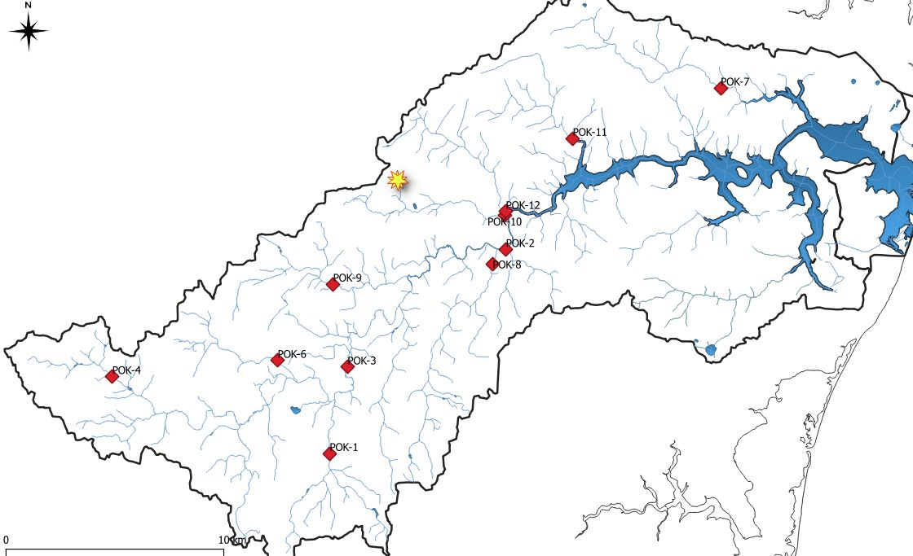

Tous les chunks jusqu'à "merge03" ne sont pas évalués (eval=F) puisque ceux-ci
sont désormais inutiles après la création du fichier de données en format RData
qui est chargé ci-dessous dans le chunk "charger_Pok2001.2022.RData".


```{r Charger_librairies, include=F, message=F, warning=F}

library("ggpubr") # pour la fonction ggarrange 
library("ggplot2")
library("car")

# ggpubr qui permet de rassembler plusieurs plots
library("ggplot2") # to do sophisticated ("high-level") plots
library("stats") # 

# library() # list available libraries (not necessarily loaded)
# library(lib.loc=.Library)
library("car") # pour la fonction "scatterplot"
library("psych") # pour la fonction "describe"
library("ggfortify", warn.conflicts=T) 
# to do sophisticated ("high-level") plots, namely "autoplot"
# install.packages("skimr")
# library("skimr")
# "skimr" permet d'obtenir des stats et des mini-histogrammes
# install.packages("DataExplorer")
# library(DataExplorer)
# "DataExplorer" pour obtenir un rapport html des statistiques de base

# installed.packages() 
# (.packages()) # to list loaded libraries at startup.

# .libPaths() # where libraries read from.

# or...
# .packages(all.available = TRUE) # to list all packages installed
# ... but not necessarily loaded with command "library"

# system.file(package='stats') # to check where is package
# find.package("utils")
# (.packages()) # to list loaded libraries

```

```{r Effacer_tout}
# Dernière modification 2024-06-27 15:04
# Supprimer tous les objets en mémoire avant d'exécuter le script
rm(list=ls(all=TRUE)) # to erase, remove, delete objects from environment
oldpar=par(no.readonly=TRUE) # to keep original graphical parameters
```

```{r set_dir}
# setwd("C:/Users/mrdos/OneDrive/Documents/Shippagan_mai_aout_2024/Analyse_R_sum/Github")
# getwd()
# list.files()

# Répertoire pour Gaël
setwd("~/Shippagan_mai_aout_2024/Analyse_R_sum/Ranalyse")


# Répertoire pour Alain
# setwd("/media/alain/ap2To/UMCS_bak/Documents/SUPERVISION/Gael/github_Gael")
# Je préfère y aller par le menu au début d'une session d'analyse:
# Session > Set Working Directory > To Source File Location

getwd()
# list.files()
list.files(all.files=T, pattern="RData")
```


```{r charger_Pok2001.2022.RData}

load("./Pok2001.2022.RData")

```

```{r Sous_groupes, tributaires, echo=F, eval=F, warning=F}
# Créer des sous-groupes par tributaire (à complèté si néccessaire)
Malt=subset(Pok2001.2022, Station2=="Malt 11")
dim(Malt) # 16 x 85
summary(Malt$Date)

strwrap("Faire de même pour les onze autres stations (pendant l'été 2024).")

```


```{r Tableau_2001_etc,  include=F, message=F, warning=F}
# Créer un tableau par année
Year2001=subset(Pok2001.2022, Year=="2001")
dim(Year2001)
levels(Pok2001.2022$Station2)

Year2002=subset(Pok2001.2022, Year=="2002")
dim(Year2002)
levels(Pok2001.2022$Station2)

Year2021=subset(Pok2001.2022, Year=="2021")
dim(Year2021)
levels(Pok2001.2022$Station2)

Year2022=subset(Pok2001.2022, Year=="2022")
dim(Year2022)
levels(Pok2001.2022$Station2)
```


```{r Periods, include=F, message=F, warning=F}
# Créer un tableau avec les données de la période 1 seulement 2001_2002:
Period1=subset(Pok2001.2022, Period=="2001-2002")
dim(Period1)
# Créer un tableau avec les données de la période 2 seulement 2021_2022:
Period2=subset(Pok2001.2022, Period=="2021-2022")
dim(Period2)
```

```{r analyses_chimie_bv_meteo}

strwrap("2024-06-26 Le tableau complet des données de chimie, 
        caractéristiques territoriales et météo est enfin assemblé
        et prêt à être analysé.")

ggplot(Pok2001.2022,aes(x=temp_moy_C,y=Temp_eau_YSI_degC)) +
geom_point()


ggplot(Pok2001.2022,aes(x=Temp_eau_YSI_degC,y=Conductivity_microS_cm)) +
geom_point()

sub2=subset(Pok2001.2022,!is.na(Temp_eau_YSI_degC),
            select=c(Ordre1_m_amont, Ordre2_m_amont,Ordre3_m_amont,
                    Temp_eau_YSI_degC, Conductivity_microS_cm, pH_units,SS_mg_L))

dim(sub2)
pairs(sub2)

```


```{r INTRO_PCA}

# Montrer la ressemblance (ou la distance) entre les stations
# en termes de température lors de la première campagne (2001-08-01)

y1=subset(Pok2001.2022,Date=="2001-08-01", 
          select=c("Station","Temp_eau_YSI_degC", "Conductivity_microS_cm",
                   "pH_units", "Colour_TCU","Carbon_Total_Organic_mg_L"))
dim(y1)
class(y1)
str(y1)
summary(y1)
summary(y1$Temp_eau_YSI_degC)

# Utiliser png("titre"...) pour exporter un graphique.
# Ne pas oublier d'éteindre le moteur graphique avec dev.off()
# png("slide01_temp_1_axis.png", width=800, height=200, units="px", pointsize=12)
plot(0, xlim = c(0, 30),  axes=FALSE, type = "n", xlab = "", ylab = "")
axis(3, at = y1$Temp_eau_YSI_degC, labels = y1$Temp_eau_YSI_degC)
axis(1, at = y1$Temp_eau_YSI_degC, labels = y1$Station, las=3)

# dev.off()

# On peut dire que les station Pok-05 et Pok-04 se ressemblent.
# Au contraire, les stations Pok-05 et Pok-12 ne se ressemblent pas...
# du moins si on ne tient compte que de la température

```

```{r pH_vs_temp}

# On considérant une 2e variable (2e dimenstion, 2e axe), on constate
# que Pok-05 et Pok-01 sont aussi différents que Pok-05 et Pok-
summary(y1$Temp_eau_YSI_degC)
# png("slide02_temp_pH.png", width=800, height=800, units="px", pointsize=18)
plot(y1$Temp_eau_YSI_degC, y1$pH_units,pch="", xlim=c(7,28))
text(y1$Temp_eau_YSI_degC, y1$pH_units, y1$Station)
# dev.off()

# On pourrait répéter le processus avec 3 axes...
# Montrer la projection d'un stylo ou tout autre objet
# Montrer qu'il existe une orientation de l'objet qui permet 
# de maximiser l'information projetée en deux dimensions. 

```

```{r Couleur_vs_COT}
# Couleur et carbone
summary(y1$Carbon_Total_Organic_mg_L)
# png("slide03_couleur_COT.png", width=660, height=660, units="px", pointsize=18)
plot(y1$Carbon_Total_Organic_mg_L,y1$Colour_TCU,  pch="",xlim=c(0.5,3.5))
text(y1$Carbon_Total_Organic_mg_L,y1$Colour_TCU, y1$Station)
# dev.off()
cor(y1$Colour_TCU, y1$Carbon_Total_Organic_mg_L)
cor(y1$Carbon_Total_Organic_mg_L, y1$Colour_TCU)
# On pourrait créer un seul axe qui retiendrait 90% de l'info...
# Retenons que Pok-07 et Pok-12 présentent de fortes valeurs de COT et de couleur
# tandis que Pok-09 et Pok-04 présentent de faibles valeurs.
```


```{r PCA_couleur_COT}

rownames(y1)=y1$Station

y1pca=subset(y1,select=c(Colour_TCU,Carbon_Total_Organic_mg_L))
pca1=prcomp(y1pca, scale=T)
summary(pca1)
# png("slide04_pca_couleur_COT.png", width=700, height=700, units="px", pointsize=18)
biplot(pca1)
# dev.off()
# On retrouve le même groupement de stations le long du premier axe
# qui renferme 97% de la variation conjointe.


```

```{r PCA_5_params}
y2pca=subset(y1,select=c("Temp_eau_YSI_degC", "Conductivity_microS_cm",
                   "pH_units", "Colour_TCU","Carbon_Total_Organic_mg_L"))
pca2=prcomp(y2pca, scale=T)
summary(pca2)
# png("slide05_pca_5_params.png", width=800, height=800, units="px", pointsize=18)
biplot(pca2)
# dev.off()

# On pourra distinguer les années, saison ou stations lorsque le jeu de
# données complet sera utilisé, grâce à "autoplot"
autoplot(pca2, label=T, data=y1, 
         size=3, colour="Station", shape='Station', loadings=T, 
         loadings.label=T, loadings.label.size=4) +
 scale_shape_manual(values=1:nlevels(y1$Station)) +
  theme_bw() + 
  theme(legend.position = "bottom") + 
  ggtitle("ACP, 5 paramètres 2001-08-01")
```

```{r pH_vs_cond}

strwrap("La précédente ACP suggère que le pH et la conductivité sont liés. 
        Voyons voir avec un grahpique de dispersion.")


plot(y1$Conductivity_microS_cm, y1$pH_units, pch="")
text(y1$Conductivity_microS_cm, y1$pH_units, y1$Station)

strwrap("Les eaux douces sont plus saturées en CO2 (respiration microbienne, etc.) et donc
        plus acides ques les eaux marines où l'activité photosynthétique peut-être plus élevée...
        À vérifier ou confirmer.")
```


# INTRO

Les eaux des rivières ont de multiples usages pour les humains. Cette ressource naturellement est un facteur très important dans le développement territorial, elle participe au développement économique, social et environnemental. Influencer par différents indicateurs environnementaux ils affectent les propriétés et composition physico-chimique qui détermine la caractéristique et la qualité de cette eau. Généralement, elles sont destinées à servir à plusieurs fins comme diverses activités très importantes dans la vie quotidienne et des activités économiques d’un territoire, en particulier l’irrigation, l’approvisionnement en eau, la pêche et l’agriculture, etc. 
 
Parmi les nombreux facteurs qui influences la qualité des eaux de surface dans leur ensemble deux de ces facteurs sont les vecteurs principaux des impacts liés à la qualité des eaux. On distingue la croissance démographie et l’urbanisation.  Ces deux facteurs proviennent de la transformation des terres qui est la résultante de différents secteurs et facteurs liées à l’environnement, au climat et aux activités humaines. Ont à la population (la démographie), l'urbanisation, l'industrialisation, la topographie, le tourisme, les politiques d'aménagement, la construction, la migration, le changement climatique, la distance avec le littoral, etc. Tous sont des facteurs de transformation des terres et surtout des terres côtières. L'augmentation de la population à l’échelle mondiale, les facteurs de développement des zones urbaines, la concentration industrielle et le tourisme sont les éléments qui propulsent la transformation des terres primaires et naturelles. 25% des études nous démontre que les transformations des terres côtières sont à l’origines de la démographie et de l’urbanisation. 37% des études couvres l’impact de ces transformations avec précision dans treize 13 domaines. L’agriculture, l'aquaculture, la température de l'air, le stock de carbone, la sécheresse, l'écosystème, les inondations, les glissements de terrain, la température de la surface terrestre (LST) qui font 8,3% des études. 5% pour la migration et l’occupation, la population, les intrusions de la salinité et la qualité de l’eau font 3,3% des cas d’études. Tandis que 13,3% des cas étudier sont sur la cause de la transformation causé par la dégradation des écosystèmes naturels qui sont aussi à l’origine des inondations et des glissements de terrains. Ces conséquences déséquilibrent la biodiversité et engendrent l’extinctions de diverses espèces. Seulement 4% des études visent les stratégies d’adaptation face aux conséquences de transformation de ces terres {Nguyen, 2024}.


# MÉTHODES

## Description du site à l'étude:

La rivière Pokemouche est située au nord-est du Nouveau-Brunswick, dans le bassin versant de la péninsule acadienne. Elle s'étend sur une longueur d'environ 41 kilomètres avec une superficie d'environ 20,8 km². L'entourage de la région est constitué d’un mélange de zones urbaines, agricoles et naturelles. La rivière Pokemouche est généralement alimentée par les précipitations, la fonte des neiges et les eaux de ruissèlement, avec des débits saisonniers qui varient de manière très considérable. Elle traverse plusieurs terres par son étendue, notamment des zones boisées, des terres agricoles et des zones urbaines, ce qui peut impacter la qualité de l’eau. Nous avons aussi l’agriculture, l’industrie et l’urbanisation qui sont des activités dans le bassin versant qui peuvent aussi influencer la qualité de l’eau de la rivière. 

Le suivi de la qualité de l'eau de la rivière Pokemouche a été effectué ~~en deux temps, en 2001-2002 et en 2021-2022 soit 20 ans après~~ __à douze stations situées pour la plupart à l'embouchure des tributaires de la branche principale. Le choix des stations a été déterminé par l'équipe du Cgerp lors de sa fondation en 2001, et le premier rapport du groupe ne donne pas de détails sur les raisons qui ont motivé l'emplacement des stations [@cgerp_comite_2003]__. Nos données ont été collectées à partir de 12 stations de surveillance réparties tout au long de la rivière, de l’amont à l’aval suivant le sens de l’écoulement de la rivières (de l’est à l’ouest), avec des prélèvements effectués 4 à 5 fois par an pour observer le dessin de la variation saisonnière (été vs automne) et celle observé en 20 ans plus tard.

AP 2024-06-19 Parler à Jean-Luc pour en savoir plus sur ce qui a guidé la sélection des
stations.



## Le bassin dans son ensemble

Un bassin hydrographique, encore appelé bassin versant, est une surface géographique délimitée par des courants et des lignes d’eau, se déversant les unes dans les autres, constituée d’un point plus haut qui est l’amont et d’un point le plus bas qui est l’aval ( __référence__ ). Au Nouveau-Brunswick, le règlement sur la classification des eaux ( __référence__ ) se regroupe en eaux souterraines et eaux de surface. Nous distinguons les cours d’eau comme les rivières et leurs tributaires ; les lacs, les étangs, les réservoirs et les eaux des milieux humides. Nous pouvons y ajouter aussi des eaux estuariennes qui sont des zones stratégiques où une rivière rencontre et dilue l’eau marine, et l’eau dans les terres humides associée à ces estuaires (GNB, Classification des eaux du N-B, 2002). 

Le bassin hydrographique de la rivière Pokemouche __couvre environ 504 km^2^ et__ peut être divisé en 12 sous-bassins versants. ~~Le bassin hydrographique de la péninsule acadienne couvre environ 504 kilomètres carrés, avec une superficie de 44,316 hectares.~~ 75% de ces terres sont des terres privées et 25% représentent l’ensemble des terres de l’État ( _référence__ ). Le bassin hydrographique de la rivière Pokemouche abrite à peu près 13,000 personnes composées de deux villages, Paquetville et St-Isidore, dans une zone profondément rurale. Dans le bassin, les populations sont des pêcheurs, des travailleurs dans les tourbières, des agriculteurs et des propriétaires de terres boisées [@cgerp_comite_2003].

## Description de la disposition des stations

Les stations sont disposées ~~stratégiquement~~, réparties de l'amont à l’aval et sur toute l'étendue de la rivière afin de permettre d'avoir une vision de la variation et de l'évolution de la qualité de l'eau sur toute sa longueur. Au total, nous disposons de 12 stations, la plupart étant situées sur les différents ruisseaux qui se déversent dans le cours d'eau de la rivière Pokemouche. 

~~Nos données~~ Les rivières ~~à l’étude~~ ont été échantillonnées  quatre fois par année en 2001, 2002, 2021, 2022 ~~en été et en automne~~, sur ces 12 stations soit le 1er août, le 1er septembre, le 1er octobre et le 1er novembre. ~~Cet été 2024, nous allons collecter davantage de données liées à la composition du territoire, les données géospatiales, quelque données physico-chimique et poursser les annalyses statistiques.~~

__AP 2024-06-19 Expliqure au lecteur l'ordre dans lequel tu présentes les stations. Toujours suivre le même ordre pour ne pas fatiguer le lecteur.__ 

### Station 06 :

La station 06 est alimentée par le ruisseau Morisson, qui est d'ordre trois (03). À cette station, on note un fond sableux ; la berge est érodée et grugée par l'eau du ruisseau. Cela est souvent dû à des facteurs tels que l'écoulement, la variation saisonnière, la composition du sol, etc. La berge de la station 06 est entourée de graminées et d'arbustes. Un peu plus loin sur la berge, on peut voir des groseilles pousser, ainsi que des conifères et des épinettes.Sa largeur est de 4,3m.

La station 06 se trouve aussi dans une zone de culture de bleuetière, où un vaste territoire a été déboisé, une autre pour la culture et une autre en forêt naturelle. Sur la station six (06) avait été installé le barrage de castor et un pont construit sur la station qui sert de passage, mais qui a été détruit ainsi que le barrage. D'un autre côté, le fond là où la largeur du ruisseau se réduit, l'eau a un fond rempli de gravier. On a des dépots de particules dans le fond de notre ruisseau. On a la présence d'érosion sur la station avec une session très travaillés pour l'infrastructure routière. La surface de notre ruisseau est  plainnement à lair libre.

### Station 04:

La station 04 est la tête de notre rivière et le ruisseau de cette station est d'ordre trois (03). Cette station est située dans une zone de culture de bleuetière. Tout à côté de la station, il y a une route en terre fréquentée pour accéder au site de bleuetière. Sur les berges de la station, il y a la présence de colonies de mousse (sphaigne) avec des peupliers des marais en début de floraison. Sur notre station est installé un ponceau et un îlot. La station est plus profonde que la station 06, un barrage de castor y avait été installé 9 ans en arrière, ce qui a créé de l'érosion sur la station. Le fond de la station est constitué de gravier et d'aulnes à côté. Sur la berge, on trouve des algues et de la boue, ce qui pourrait expliquer la présence d'une source à proximité. La station est humide en raison de la présence de sphaigne. Sur cette station on à des algues dans le fond de l'eau. Sa largeur est de 7m. La surface de notre ruisseau est  plainnement à lair libre.


### Station 09

La station 09 est une station située au milieu d'une zone d'arbustes un peu naturelle. Elle est drainé par le ruisseau de trout qui est un ruisseau d'ordre trois (03. Juste à côté de la station, il y a une route pour piétons. Le fond de l'eau est sableux avec la berge érodée et on observe des graminées et des arbustes sur la berge. Le fond de l'eau est clair et présente une transparence à la lumière. Sur les berges ont poussé des groseilles. La surface de notre ruisseau est pleinement à l'air libre.


### Station 03:

La station 03 est drainée par un ruisseau d'ordre 05. Elle est située sur un territoire naturel modifié. Le territoire a été déboisé des dizaines d'années en arrière, ce que nous devons confirmer avec la carte cartographique. À côté de la station, il y a une route qui y donne accès et est souvent fréquentée par les voitures, les pêcheurs et autres. La berge de notre station est rocheuse avec un fond aussi rocheux (des roches difficilement altérables) et en pente. C'est un milieu pleinement inondable qui est submergé d'aulnes et absence de ponceau. Il y a aussi la présence de tonneaux et l'apport d'eau souterraine. Sur la station, on observe aussi les ligneux qui sont en tas et le débit au niveau de la station est très fort et bien plus profond que les autres stations. La zone de cette station contien des habitat non loins avec des fermes de boeuf 


### Station 01: 

La station 01 est une station d'ordre 04 alimenté par le ruisseau de haute bouche sud. Directement située à côté d'une grande route de bitume. La station est alimentée par un ruisseau d'ordre quatre (04). Elle est située en bordure d'un milieu forestier, où on voit des épinettes, des sapins et des bouleaux. L'eau de la station n'est pas transparente, le fond est vaseux et peu profond. Le fond est aussi sableux avec des roches et des algues. Sur les berges, de petits arbustes et ensuite des roches (facilement dégradables) qui séparent la station de la route. Deux ponceaux de deux mètres de diamètre y sont installés. La surface de l'eau est couverte par le feuillage et est à l'ombre de la lumière sur un côté et la bordure forestière qui se trouve du côté droit de la station. Une deuxième partie de la station est à ciel ouvert. L'entourage est dominé par les aulnes et semble être une plaine humide.

  
  
###  Station 08: 

La station 08 est une station drainée par le ruisseau Swell, qui est un ruisseau d'ordre trois (03). La station a été déboisée en 2022 et 2024. Cette station a son ruisseau à ciel ouvert, complètement exposé à la lumière. Elle est située aussi à côté d'une grande route de bitume avec une pente en pic de la route vers la station. Elle se retrouve au centre des arbustes pleins sur un côté et déboisé sur un deuxième côté. On y retrouve des bouleaux, des conifères, etc. Il est observé plusieurs débris ligneux très peu dégradés. Un milieu découvert sans végétation couvrante et présence des aulnes. Présence d'un seul ponceau. Le fond de cette station est très vaseux.

### Station 02:

La station 02 est une station située à côté d'un pont pour piétons et cyclistes. Elle est drainée par le ruisseau Suggary et est un ruisseau d'ordre trois (03). La berge de la station est constituée de graminées, de bétulacées et de conifères. À proximité, il y a un chemin de terre qui a été aménagé pour les voitures. Un petit habitat à côté et un peu plus loin la grande route. Sur la station, il y a un ponceau d'environ deux (02) mètres de diamètre, le fond de cette station est sableux et étirant avec des algues dans le fond. Sur le site, on a une grosse averse, sur un côté, on a un versant plus à pic qui se verse directement dans le ruisseau. Autour, un territoire rempli de petits arbres et sur le côté de la pente du ruisseau, des arbres plus fréquents.


### Station 05 :

La station 05 est aussi située sur un ruisseau d'ordre 03 et drainée par le ruisseau McConnell. La station se trouve sur le sentier de VTT, un territoire fréquenté à pied ou à vélo. Elle est située à côté d'un pont en métal qui n'influence pas fortement la station. C'est une station complètement à ciel ouvert. Les berges sont entourées de petits arbustes avec moins de sable sur elles à cause du niveau de l'eau qui est plus haut. Sur cette station, on y trouve un pont en bois qui n'influence pas le milieu et l'écoulement de l'eau. On enregistre une dominance des aulnes, des graminées. Cette station est en plaine inondable. Sur la berge, on y trouve des bouleaux et des épinettes. Sur la station, le courant d'eau semble très faible où on rencontre une différence pour déterminer l'amont et l'aval. Présence des algues dans le fond de l'eau.


### Station 07:

La station 07 est une station drainée par le ruisseau Waegh, qui est un ruisseau d'ordre trois (03). La station est à ciel ouvert et située à côté d'un pont en bois juste pour piétons. Dans le fond de l'eau, on observe la présence de plantes qui poussent en hiver sur l'eau. On a aussi la présence de grenouilles sur les lieux. La station 07 se trouve sur un territoire fortement aménagé et dont l'eau est canalisée de manière naturelle. L'eau est transparente et laisse passer la lumière. L'écoulement est normal à vue d'œil et sur les sites, on a une installation de ferme de porcs un peu plus loin. La nature présente des arbustes sur un côté de la station, les berges sont bien solides et le fond de l'eau aussi avec des graviers dans le fond de l'eau. La station est loin des routes et un peu sur un endroit très fréquenté par les humains et les pêcheurs.


### Station 11:

La station 11 est une station drainée par le ruisseau Maltempec, qui est un ruisseau d'ordre trois (03). Elle est située en plein milieu de la forêt, un peu loin des routes et des infrastructures. Tout autour de la station, on voit des arbustes. Sur les berges, on remarque des débris d'arbres et de bois. L'eau de la station n'est pas profonde, le fond est sableux. Sur le site, il y a des plantes aquatiques, un ancien barrage y était installé, le tributaire de Maltempète se trouve à 100 mètres de la station. La station est à ciel dégagé. Un peu plus loin, on a des résidences, des forêts naturelles très naturelles loin des infrastructures.


### Station 10:

La station 10 est une station drainée par le ruisseau Maltempec, qui est d'ordre trois (03). L'étendue de la rivière se trouve à ciel ouvert et est située directement à côté d'une autoroute. À la station, l'eau est peu profonde avec un fond sableux et des débris au fond. Sur les berges de la station, le sol est un bas-fond, très humide et boueux. La présence de plantes des zones très humides y pousse en grande quantité. De l'autre côté de la station, il y a une forêt, et elle présente une configuration d'une plaine du côté de la route. On observe la présence d'arbres qui poussent avec un léger débordement de branches vers la rivière.


### Station 12:

La station 12 est une station drainée par le ruisseau Dempsey, qui est d'ordre trois (03). La station est très profonde, plus que toutes les autres stations étudiées. Le fond de l'eau est très vaseux et boueux. Il a tendance à s'affaisser. Elle est directement à côté d'une grande autoroute et un ponceau en béton y a été construit en 1996. Sur les berges, il y a la présence de roches qui ont été placées à cause de l'aménagement du site. La largeur du site a été estimée à environ 15 mètres car la profondeur et la densité de l'eau au fond du ruisseau sont très denses. À la surface de l'eau, on a du mal à déterminer le sens de l'écoulement de la station. L'aval du ruisseau est à ciel ouvert alors que l'amont est rempli d'arbres qui lui font de l'ombre. La végétation sur la station est déboisée. Dans le fond du ruisseau, on trouve des débris.


### station 4

la station 04 est une station situé sur un territoire vaste a coté de culture de bleuetière. un territoire vastement déboisé. La station 04  a sont cours d'eau à ciel ouvert avec une eau peu profond. Sur cette station il y à la présence des mousses, présences de gravier (une roche non dégradable) avec une présence des algues avec une berge très boueuse. ce qui la caractérise d'une station humide, absences de roche dégradable ou altérable. 
 


### station 08

Comme la station 08 est à exposée avec le ciel, et une route à coté et des matières en dissous dans le fond. Il a aussi un fond vaseux prèsque meme caractéristique que la station 01  mais juste qu'ici la suface ou l'étendure de l'eau est petit avec une petie l'argeur et très peuprofond 

### Sation 07  

Elle présente le meme cas mais jusque en 2001-2002 la conductivité est très peu variable casi négligeable ce qui peut etre la cause de l'absence de route, un territoire très boisé, moin exposé au soleil, reaménagé et sans des particule ou substance dissous dans le fond. Juste une présence de pond pour piéton qui influence très peu la rivière à ce niveau.

## Cgerp et les échantillonnages réalisés

Le comité de gestion environnementale de la rivière Pokemouche a effectué les premiers échantillonnages que j’ai à ma disposition. Cette base de données est constituée de 56 paramètres étudiés, tous prélevés quatre à cinq fois chaque automne et été en 2001-2002, qui constitue une première période d’échantillonnages, et en 2021-2022, qui constitue une deuxième période. C'est sur ces données que nous allons nous appuyer pour étudier la variation de la qualité de l’eau sur une période de 20 ans, en regardant les variations inter-annuelles pour chaque période, ainsi que les variations saisonnières. Ces échantillonnages ont été effectués avec la même méthodologie à la surface de l’eau, car la rivière Pokemouche est peu profonde, soit environ un mètre de profondeur. Cela signifie que la qualité de l’eau en profondeur de la rivière sera quasiment la même qu’en surface.

Les analyses ont été faites dans les laboratoires... en suivant la méthode... La limite de détection des paramètres...

## Description des paramètres physico-chimiques à l'étude

Parmi les 56 paramètres qui ont fait l'objet d'un suivi, nous allons décrire les plus importants, soit ceux qui influencent le plus la qualité de l’eau de notre rivière et dont j’aimerais étudier la variation. Ces paramètres sont répartis en trois groupes différents, dont les paramètres physico-chimiques comme la température, le pH, la turbidité (NTU), la conductivité, l’oxygène dissous, les nutriments, etc. Les paramètres biologiques, tels que les coliformes fécaux, et les métaux comme le plomb (Pb), le cadmium (Cd), le mercure (Hg), et le zinc (Zn), etc. (Bricha, S., Ounine, K., Oulkheir, S., El Haloui, N., & Attarassi, B. 2007).

### La température: 

La température de l'eau est mesurée en degrés Celsius (°C) ou en degré Kelvin (K), mais dans notre étude, elle sera en degrés Celsius. Elle varie en fonction des saisons, de la profondeur à laquelle elle est mesurée, ou même de sa proximité des sources de chaleur, comme l'exposition au soleil ou même des activités humaines. La température de l'eau a un impact sur la solubilité des gaz, la croissance des organismes aquatiques, et la chimie de l'eau.

###   Le pH:

Le pH mesure l'acidité ou l’alcalinité de l'eau. Nous le mesurons sur une échelle de 0 à 14, où 7 est neutre, tout pH inférieur à 7 est acide et supérieur à 7 est basique. Le pH de l'eau peut affecter la disponibilité des nutriments, la toxicité des métaux lourds, la santé des organismes aquatiques, et la disparition de certaines espèces.

###   La turbidité

La turbidité consiste à mesurer la clarté de l'eau en mesurant la quantité de particules en suspension. Elle est souvent mesurée en unités de turbidité (NTU). Lorsque la turbidité est élevée, cela peut être causé par des sédiments, des particules organiques, ou des polluants, et peut affecter la transmission de la lumière à travers l’eau, la photosynthèse, et la santé des écosystèmes aquatiques.

###  La conductivité:

La conductivité mesure la capacité de l'eau à conduire le courant électrique, ce qui est influencé par la présence de minéraux dissous, tels que les sels et les métaux (comme les océans). Elle est souvent mesurée en microsiemens par centimètre (µS/cm) ou en millisiemens par centimètre (ms/cm). La conductivité de l'eau peut nous permettre de savoir s'il y a présence de contaminants, et dans certains cas, nous pouvons l'utiliser comme indicateur de la salinité ou de la dureté de l'eau.

### L'oxygène dissous

L'oxygène dissous mesure la quantité d'oxygène dissous dans l'eau, nécessaire à la respiration des organismes aquatiques. Nous le mesurons en milligrammes par litre (mg/L) ou en pourcentage de saturation. Le niveau d'oxygène dissous varie en fonction de la température, de l'altitude, de la pression atmosphérique, et de la présence de matière organique ou de polluants dans l’eau.


###   La couleur

### autreschoses

Les nutriments, tels que l'azote (sous forme de nitrate, nitrite, ammonium) et le phosphore (sous forme de phosphate), sont essentiels à la croissance des plantes aquatiques et des algues. Cependant, un excès de nutriments peut entraîner une propagation excessive d'algues, appelée eutrophisation, ce qui peut entraîner une diminution de l'oxygène dissous et des problèmes de qualité de l'eau.


### les coliformes

Les coliformes fécaux sont des bactéries qui sont généralement présentes dans les intestins des animaux (y compris les mammifères, dont les humains) et se retrouvent fréquemment dans les matières fécales. Ils sont souvent utilisés comme indicateurs de contamination fécale dans l'eau, car leur présence indique la possible présence de pathogènes d'origine fécale qui peuvent être dangereux pour la santé humaine. Les coliformes fécaux sont généralement exprimés en nombre de colonies formant unités (CFU) par 100 millilitres (ml) d'eau. Une concentration élevée de coliformes fécaux dans l'eau peut indiquer une contamination fécale récente et un risque potentiel de maladies d'origine hydrique. Cependant, il est important de noter que la présence de coliformes fécaux dans l'eau ne signifie pas nécessairement qu'elle est dangereuse pour la consommation, car d'autres facteurs, tels que le type de coliformes présents et la présence de pathogènes spécifiques, doivent être pris en compte.

###  Les métaux :

Ces éléments que nous allons vous décrire sont des polluants courants dans l'eau qui peuvent avoir des effets néfastes sur la santé humaine et celle des écosystèmes aquatiques.
Le Plomb (Pb) : Le plomb est l’un des métaux lourds toxiques qui affectent souvent notre système nerveux, les reins, le sang et le développement du cerveau, surtout chez les enfants. Il provient généralement de la corrosion ou de l’altération des tuyaux en plomb, des conduites d'eau et de diverses activités industrielles.

Le Cadmium (Cd) : Le cadmium est également un métal toxique qui provoque des problèmes rénaux, des troubles osseux et des dommages pulmonaires. Il est souvent associé à des activités industrielles telles que la production de batteries, l'exploitation minière et le traitement des métaux.

Le Mercure (Hg) : Le mercure est l’un des métaux lourds qui a des effets toxiques sur notre système nerveux central, les reins et le système immunitaire, entre autres. Il est souvent associé à la combustion de combustibles fossiles, à la production de chlorure de vinyle et à d'autres activités industrielles.

Le Zinc (Zn) : Le zinc est un oligo-élément essentiel à de nombreux processus biologiques, mais à des concentrations élevées dans l'eau, il devient toxique pour les organismes aquatiques. Le zinc provient de diverses sources, notamment des activités industrielles, de l'agriculture et de l'érosion des sols.

Nous mesurons ces éléments en microgrammes par litre (µg/L) conformément aux réglementations et normes strictes qui limitent les concentrations de ces métaux dans l'eau potable et les eaux de surface pour protéger la santé humaine et l'environnement.
En général, tous ces paramètres sont essentiels pour évaluer la qualité de l'eau et comprendre l'état des écosystèmes aquatiques.


# RÉSULTATS ET DISCUSSION

AP 2024-06-19 Dans la description des variations, toujours essayer de suivre le
même patron: 1) un énoncé ou deux sur la variabilité entre stations et entre périodes 
(box-plot); 2) un énoncé sur la variabilité saisonnière (graphique des campagnes);
3) un énconé sur les recommandations canadiennes; 4) un énoncé sur les valeurs
obervées comparées au recommandations canadiennes.

## Température, variabilité spatiale


```{r, echo=F, message=F, warning=F, fig.cap = "Variations de la température entre les douze stations à l'étude (présentées de l'ouest vers l'est) pour la période 1 (2001, 2002) et 2 (2021-2022)"}
# AP 2024-06-13 Essayer l'option "fig.cap" ci-dessus, ici et partout.
# Température variabilité spatiale
ggplot(aes(y=Temp_eau_YSI_degC, x=Station2, fill=Period), data=Pok2001.2022) + geom_boxplot() +
  theme(axis.text.x = element_text(angle = 45, hjust=1),axis.text=element_text(size=12),
        axis.title=element_text(size=14,face="bold"))+
  ggtitle("Variation  de la température à 20ans entre les deux Period")
```

Commentaire:

Il n'y a pas de grande différente de température entre les deux périodes. Certaines stations ont été échantillonnées à des periodes chaudes comme la station 11 (Maltempec) et à des periodes froides comme la station 09 (Trout).


Les températures en 2021-2022 indique une une plus grande variabilité par rapport à celle de la période 2001_2002. (a cause de la taille des boîtes)

Les moustaches son plus longues et présent sur tout les stations en 2001_2002 (période 1) que sur les stations en 2021_2022 (période 2). Cela indique une grande variabilité dans les données de la période 1.

On observe plus de valeurs aberrantes et uniquement sur les stations en 2001_2002. Ce qui indique des anomalies ou une variabilité extrême sur les stations 01, 03, 08, 11 et 07.
 


```{r, echo=F, message=F, warning=F, include=F}

# Pour crée un graphique qui montre les ligne de variation de tout les dates(periode) entre la variable et tous les stations

scatterplot(Period1$Temp_eau_YSI_degC~Period1$Date | Period1$Station2,
            smooth=F)
```


### Les 04 graph en un pour la Température.

```{r, eval=F, echo=F}
ggarrange(Tempg2001, Tempg2002, Tempg2021, Tempg2022, ncol=2, nrow=2)
```

### Autre manière de voir les variations saisonnières sur quatre années: 
traiter la date comme "Campagne no" (voir la création de la variable 
"Campagne" au début du script).

```{r, echo=F}

Tempg2001_2022=ggplot(aes(y=Temp_eau_YSI_degC, x=Campagne), data=Pok2001.2022) + 
  scale_shape_manual(values=1:nlevels(Pok2001.2022$Station2)) +
  geom_line(aes(color=Station2, linetype=Station2)) + 
  geom_point(aes(color=Station2, shape=Station2)) +
   theme_bw()
Tempg2001_2022

```

Commentaire du graphique des quatre années :

Certaines stations montrent des pics à des dates (numéros de campagnes) similaires, Cela suggère une possibilité de corrélation ou des facteurs communs qui affectent ces mesures.

Le pic de baisse de la température à la période une est plus basse que le pic de basse observé en ces mêmes dates (numéro de campagne) à la période 2.

À quoi est due la baisse de température à la période 1 pour que la température baisse moins à la périodes 2 à la même date.

Les stations à la tête du bassin ont les basse température à la période 2.

Les stations 11 (Malt) et 12 (Dempsey) ont les températures les plus élevées au cours des deux période d'étude (le 1er août 2001). 


La station 08 (Sewell) présente la température la plus basse dans la période 01 et la station 02 (Suggary) dans la période 02.


Les questions auxquelles on peut répondre :

La température qui a baissé en pics lors de la période 01 a-t-elle influencé certains paramètres ? Ont-elles été causées par des facteurs météorologiques, climatiques ou des causes territoriales à prendre en compte ?


Remarque :

La station 12 est à ciel ouvert et sur un côté à un territoire déboisé et de l'autoroute, et plus on a moins d'arbres, moins on a de pluie et plus la température est élevée. Mais ce déboisement a eu lieu en 2023, qu'en est-il du territoire en 2001 ? Mais la station 11 est en plein milieu de la forêt.


## Oxygène dissous

### variabilité spatiale : Oxygène dissous

```{r, echo=F, include=T, message=F, warning=F}

# boxplot(Pok2001.2022$Oxyg_dissous_YSI_mg_L ~  Pok2001.2022$Station)

ggplot(aes(y=Oxyg_dissous_YSI_mg_L, x=Station2, fill=Period), data=Pok2001.2022) + geom_boxplot() +

  theme(axis.text.x = element_text(angle = 45, hjust=1),axis.text=element_text(size=12),

        axis.title=element_text(size=14,face="bold"))+
  ggtitle("Variation  de l'oxygène dissous à 20ans entre les deux Period")
summary(Pok2001.2022$Oxyg_dissous_YSI_mg_L)
```

Commentaire:

La teneur en oxygène dissous de la période 1 (2001-2002) est généralement plus basse que la teneur en oxygène dissous de la période 2 (2021-2022) et ce sur toute les stations.

La teneur en oxygène dissous indique une plus grande variabilité à la période 2 (2021-2022) sur les station à la tête du bassin (allant de la station 4 à 12). Au pied ( l'exutoire) du bassin (allant de la station 10 à 05)la teneur en oxygène indique une plus grande variabilité à la période 1 (2001-2002).(la taille des box plots)

Les moustaches son plus longues et présent sur tout les stations au cours des deux période 2. Cela indique une grande variabilité dans les données de la période 1 et 2.

On observe les valeurs aberrantes uniquement sur les stations au pied de la rivière.


La norme canadienne des recommandations du CCME (Conseil canadien des ministres de l’Environnement) dit que pour:

L'eau d'une rivière, d'un ruisseau ou d'un cours d'eau en période d'été ou à une à une température normal doivent avoir une teneur en oxygène dissous de 6mg/l pour les petites espèces biologique à un niveau rudimentaire et de 5,5mg/l pour les espèces a un niveau superieur.


L'eau des montagne, situé dans les endroits en haute altitude ou en période de froid (hivernale) doivent avoir une teneur en oxygène dissous de 9,5mg/l pour les petites espèces biologique à un niveau rudimentaire et de 6,5 mg/l pour tout les autres espèces.


Nos valeur varient entre 4,420mg/l et 13,130mg/l d'oxygènes dissous sauffe quelque valeur abérente observé sur les station 09 et 12.

### Graphique de la variation de l'oxygène dissous sur chacun des station en 2001

```{r, eval=F, echo=F, message=F, warning=F}

O2g2001=ggplot(aes(y=Oxyg_dissous_YSI_mg_L, x=Date, group=Station2, shape=Station2, color=Station2 ), data=Year2001) + scale_shape_manual(values=1:nlevels(Year2001$Station2)) +
  geom_line() + 
  geom_point() +
  scale_x_date(date_breaks = "1 month", date_labels = "%d %b %Y")+
  theme_bw()
O2g2001
summary(Year2001$Oxyg_dissous_YSI_mg_L)

```

Commentaire du graphique 2001:
 
Dans l'ensemble, les stations ont vu leur concentration en oxygène diminuer d'environ 1-2 mg/L entre le 1er août 2001 et le 1er novembre 2001. La station 10 (Pollard) a gardé une allure presque constante (peu variable et faible), tandis que la station 02 (Suggary) a connu une baisse continue et linéaire, avec la plus faible teneur en 2001. Quant à la station 05 (M Conell), ayant la teneur la plus élevée, elle a baissé en piqué jusqu'au début de l'automne pour devenir presque constante. La teneur en oxygène dissous à varié entre 7,3mg/l et 12,1mg/l en 2001

### Graphique de la variation de l'oxygène dissous sur chacun des stations en 2002

```{r, eval=F, echo=F, message=F, warning=F}
O2g2002=ggplot(aes(y=Oxyg_dissous_YSI_mg_L, x=Date, group=Station2, shape=Station2, color=Station2 ), data=Year2002) + 
  scale_shape_manual(values=1:nlevels(Year2001$Station2)) +
  geom_line() + 
  geom_point() +
  scale_x_date(date_breaks = "1 month", date_labels = "%d %b %Y")+
  theme_bw()
O2g2002

summary(Year2002$Oxyg_dissous_YSI_mg_L)

```

Commentaire du graphique 2002:
 
En 2002, les variations saisonnière d’oxygène étaient synchrone entre les stations. La stations Suggary étant la plus oxygénée et la station Dempsey la moins oxygénée.

La station 09 a varié avec des baisse et hausse aigu ayant la plus faible teneur le 1er octorbre 2002. La station 06 a varié prèsque a la constance avec le plus haute teneur de meme que la station 06. Les variation saisonnière en 2002 sont comprise entre 4,42mg/L et 11,240mg/L. Ce graphique nous renseigne sur une faible teneur en oxygène en 2002 par rapport à l'an 2001, et avec une plus baisse teneur en 2001.


### Graphique de la variation de l'oxygène dissous sur chacun des stations en 2021

```{r, eval=F, echo=F, message=F, warning=F}
O2g2021=ggplot(aes(y=Oxyg_dissous_YSI_mg_L, x=Date, group=Station2, shape=Station2, color=Station2 ), data=Year2021) + scale_shape_manual(values=1:nlevels(Year2001$Station2)) +
  geom_line() + 
  geom_point() +
  scale_x_date(date_breaks = "1 month", date_labels = "%d %b %Y")+
  theme_bw()
O2g2021
summary(Year2021$Oxyg_dissous_YSI_mg_L)
```
Commentaire du graphique 2021:
 
À tous les station on observe une hausse sur toute les saisons. 20 années après en 2021 la teneur en oxygène dissous est comprise entre 7,94mg/L et 12,14mg/L comme en 2001.  À la station 10 (Pollard) on observe une grande baisse d'environs (50%) et une forte teneur à la station 02 (Sugarry) et 09 (Trout) toujours augmentant avec les plus grande teneur.
 

### Graphique de la variation de l'oxygène dissous sur chacun des stations en 2022

```{r, eval=F, echo=F, message=F, warning=F}

O2g2022=ggplot(aes(y=Oxyg_dissous_YSI_mg_L, x=Date, group=Station2, shape=Station2, color=Station2 ), data=Year2022) + scale_shape_manual(values=1:nlevels(Year2001$Station2)) +
  geom_line() + 
  geom_point() +
scale_x_date(date_breaks = "1 month", date_labels = "%d %b %Y")+
  theme_bw()
O2g2022

summary(Year2022$Oxyg_dissous_YSI_mg_L)

```
Commentaire du graphique:
 
On remarque d'abord par rapport au autres années que la teneur en oxygène dissous a plus été élevé et est comprise entre 8.28mg/L et  13.13mg/L. La teneur à tous les station ont connu de faible variation prèsque linéaire, contrairement à la station 07 et 10 qui ont connu le plus de baisse (45%)et(50%) à la fin de la saison. La station 02 a la fin de la saison à la plus haute teneur et la station 06 à coté.


### Graphique de la variation de l'oxygène dissous sur chacun des stations entre period: 2001_2002

```{r, eval=F, echo=F, message=F, warning=F}
O2Period01=ggplot(aes(y=Oxyg_dissous_YSI_mg_L, x=Date, group=Station2, shape=Station2, color=Station2 ), data=Period1) + scale_shape_manual(values=1:nlevels(Year2001$Station2)) +
  geom_line() + 
  geom_point() +
  scale_x_date(date_breaks = "1 month", date_labels = "%d %b %Y")+
  theme_bw()
O2Period01

```
Commentaire:


### Graphique de la variation de l'oxygène dissous sur chacun des stations entre period: 2021_2022

```{r, eval=F, echo=F, message=F, warning=F}
O2Period02=ggplot(aes(y=Oxyg_dissous_YSI_mg_L, x=Date, group=Station2, shape=Station2, color=Station2 ), data=Period2) + scale_shape_manual(values=1:nlevels(Year2001$Station2)) +
  geom_line() + 
  geom_point() +
  scale_x_date(date_breaks = "1 month", date_labels = "%d %b %Y")+
  theme_bw()
O2Period02
```

Commentaire du graphique 2021_2022:

On remarque que la variation periodique de 2021 à 2022 est comprise entre 7mg/L et plus de 13mg/L. On constat que malgré la variation saisonnière de hausse et de baisse qui se remarque sur les stations entre les deux année a augmentanter. Sur cette periode on remarque bien l'allure de la station 01 qui à connu de forte baisse et hausse avec la plus faible teneur de la periode et la station 02 avec la plis forte teneur durant la periode. 


```{r, echo=F, message=F, warning=F, include=F}

# Pour crée un graphique qui montre les ligne de variation de tout les dates(periode) entre la variable et tous les stations et aussi entre les variable

scatterplot(Period1$Oxyg_dissous_YSI_mg_L~Period1$Date | Period1$Station2,  smooth=F)

scatterplot(Pok2001.2022$Oxyg_dissous_YSI_mg_L~Pok2001.2022$Temp_eau_YSI_degC | Pok2001.2022$Year, smooth=F)
```

Graphique de bas niveau: syntax simple, mais possibilités plus limitées Plutôt que de créer 48 sous-tableaus (12 stations x 4 années), contrôler la fenêtre temporelle avec "xlim" pour chacune des 12 stations...


### Les 04 graph en un pour l'oxygène dissous.

```{r, eval=F, echo=F}
ggarrange(O2g2001, O2g2002, O2g2021, O2g2022, ncol=2, nrow=2)
```

### Autre manière de voir les variations saisonnières sur quatre années: 

Traiter la date comme "Campagne no" (voir la création de la variable 
"Campagne" au début du script).

```{r, eval=F, include=F}
Pok2001.2022$Campagne
Pok2001.2022$Station2
```

```{r, echo=F}

O2g2001_2022b=ggplot(aes(y=Oxyg_dissous_YSI_mg_L, x=Campagne), data=Pok2001.2022) + 
  scale_shape_manual(values=1:nlevels(Pok2001.2022$Station2)) +
  geom_line(aes(color=Station2, linetype=Station2)) + 
  geom_point(aes(color=Station2, shape=Station2)) +
   theme_bw()

O2g2001_2022b

```


Commentaire du graphique des quatre années :

La teneur en oxygène dissous indique un grand pic en baisse sur tous les stations à la 

La teneur en oxygène dissous a considérablement baissé sur toutes les stations en octobre 2002. L'eau est très faiblement oxygénée sur toutes les stations en octobre 2002.

Les plus faibles teneurs en oxygène sont celles enregistrées sur la station 09 (Trout) et 12 (Dempsey).

Lors de la période 01 en 2001, la teneur en oxygène a baissé de manière synchronisée sur toutes les stations durant toutes les saisons. En 2002, lors de la période d'été, l'eau est très oxygénée sur toutes les stations et en automne, l'eau est devenue très faiblement oxygénée sur toutes les stations. Alors qu'en la deuxième période (2021-2022), la teneur en oxygène a augmenté de manière synchrone et continue sur toutes les stations et sur les deux ans.

L'eau de la station 02 (Suggary) est la plus faiblement oxygénée en novembre 2001. En octobre 2002 et durant toute la période deux, elle est l'une des stations les plus oxygénées.

La station 12 (Dempsey) présente l'allure de l'eau la moins oxygénée durant toutes les deux périodes.

Remarque :

La température a aussi baissé en novembre 2001 et 2002, cela a peut-être influencé la teneur en oxygène de cette période.

Question :

Qu'est-ce qui s'est vraiment passé sur toutes les stations en novembre 2002 ? Y a-t-il un facteur qui a causé la désoxygénation durant cette saison et sur ces stations ?


##  Conductivity_microS_cm 

### Conductivité variabilité spatiale 

```{r, echo=F, message=F, warning=F}

ggplot(aes(y=Conductivity_microS_cm, x=Station2, fill=Period), data=Pok2001.2022) + geom_boxplot() +

  theme(axis.text.x = element_text(angle = 45, hjust=1),axis.text=element_text(size=12),

        axis.title=element_text(size=14,face="bold"))+
  ggtitle("Variation  de la Conductivité à 20ans entre les deux Period")
```

Commentaire:

La conductivité est plus élevé sur tout les stations à la période 2001-2002 de plus que la conductivité en 2021-2021, sauf sur la station 10 qui a une conductivité plus élevé en 2021-2022.

La station 4 se démarque par les valeurs de conductivités environ deux fois moins élevées qu’aux autres stations. (partie Résultats). 

(interprétation), on peut dire «En effet, la station 4 est la plus reculée d’entres toutes les stations le long de la branche principale; elle est la plus éloignée de l’influence des marées… Il n’est donc pas surprenant qu’elle affiche les plus faibles valeurs de conductivité.


La conductivité présente une plus grande variabilité 20ans plus tard et ce sur les stations 01, 08 et 07. 

La turbidité de la station 01, 08, 10 et 07 indiquent plus de variabilité dans les données en 2021-2022 de plus que celle de 20ans en arrière.

La conductivité lors de la période 01 présente des valeurs abbérentes forte sur les station 02 et 07. mais à la période 02 ils indique des valeurs abbérente faible de la conductivité sur les stations 03, 09, 12, 11. ces valeurs nous indique soit une anomalie ou une variabilité extrème sur ces stations a ces périodes.


### Graphique de la variation de la Conductivité sur chacun des station en 2001

```{r, eval=F, echo=F, message=F, warning=F}
Condg2001=ggplot(aes(y=Conductivity_microS_cm, x=Date, 
                group=Station2, shape=Station2, color=Station2), data=Year2001) + 
  scale_shape_manual(values=1:nlevels(Year2001$Station2)) +
  geom_line() + 
  geom_point() +
  scale_x_date(date_labels = "%d %b", breaks=c(as.Date("2001-08-01"), as.Date("2001-09-01"),
                                              as.Date("2001-10-01"), as.Date("2001-11-01"),
                                             as.Date("2001-12-01"))) +
  ggtitle("2001") +
  theme_bw()
Condg2001
```

Commentaire du graphique:

 La conductivité  n’a pas vraiment varié, ils ont baissé de (9%) à tous les stations soit une variation presque constante. La station 4 a la plus faible conductivité sur tous les prélèvements de l’an 2001. Les plus grandes conductivités  sont celle de la station 01 et 10. La station 08 a augmenter de 27% en octobre pour baisser de 36.6% en novembre.

NB: si les autre son presque constant faut donc regarder ce qui se passe à la station 08.


	 

### Graphique de la variation de la Conductivité sur chacun des stations en 2002


```{r, eval=F, echo=F, message=F, warning=F}
Condg2002=ggplot(aes(y=Conductivity_microS_cm, x=Date, 
                group=Station2, shape=Station2, color=Station2), data=Year2002) + 
  scale_shape_manual(values=1:nlevels(Year2001$Station2)) +
  geom_line() + 
  geom_point() +
  scale_x_date(date_labels = "%d %b", breaks=c(as.Date("2001-08-01"), as.Date("2001-09-01"),
                                              as.Date("2001-10-01"), as.Date("2001-11-01"),
                                             as.Date("2001-12-01"))) +
  ggtitle("2002") +
  theme_bw()
Condg2002
```

Commentaire du graphique:
 
La plus basse conductivité a été enregistré sur la sation 04 sur tout la saison d'échantillonage avec un écart d'environs 75micro Sm_cm. la conductivité à augmenté de septembre à novembre à la station une avec la plus grande conductivité. seul en sep et Oct les plus grande observation on été faites.


### Graphique de la variation de la Conductivité sur chacun des stations en 2021

```{r, eval=F, echo=F, message=F, warning=F}
Condg2021=ggplot(aes(y=Conductivity_microS_cm, x=Date, 
                group=Station2, shape=Station2, color=Station2), data=Year2021) + 
  scale_shape_manual(values=1:nlevels(Year2001$Station2)) +
  geom_line() + 
  geom_point() +
  scale_x_date(date_labels = "%d %b", breaks=c(as.Date("2001-08-01"), as.Date("2001-09-01"),
                                              as.Date("2001-10-01"), as.Date("2001-11-01"),
                                             as.Date("2001-12-01"))) +
  ggtitle("2021") +
  theme_bw()
Condg2021
```

Commentaire du graphique:
 
La conductivité  a baisser à tous les stations. La station 04  à la plus basse conductivité  a toutes les saisons en 2021.  la conductivité à varié entre 50 micros SCM à 200 micros SCM. La station 01 et 10 ont les plus grandes conductivités, avant que la station 01 ne connaisse une grande baisse (66%). 

NB: la plus faible conductivité est en 2021 ainsi que la plus grande et c’est en cette année on observe de grande variation.


### Graphique de la variation de la Conductivité sur chacun des stations en 2022

```{r, eval=F, echo=F, message=F, warning=F}
Condg2022=ggplot(aes(y=Conductivity_microS_cm, x=Date, 
                group=Station2, shape=Station2, color=Station2), data=Year2022) + 
  scale_shape_manual(values=1:nlevels(Year2001$Station2)) +
  geom_line() + 
  geom_point() +
  scale_x_date(date_labels = "%d %b", breaks=c(as.Date("2001-08-01"), as.Date("2001-09-01"),
                                              as.Date("2001-10-01"), as.Date("2001-11-01"),
                                             as.Date("2001-12-01"))) +
  ggtitle("2022") +
  theme_bw()

Condg2022
```

Commentaire du graphique:
 
La conductivité à légèrement varier, avec les courbes presque constants sauf à la station 01 et 10.  sur la station 04 on à la plus faible conductivité. De la fin de l’été jusqu’en octobre la conductivité a augmenter à la station 01pour baisser de 27,3% jusqu’en novembre (NB: la plus grande variation par rapport au autre station)


### Graphique de la variation de la Conductivité sur chacun des stations entre period: 2001_2002

```{r, eval=F, echo=F, message=F, warning=F}
CondPeriod01=ggplot(aes(y=Conductivity_microS_cm, x=Date, 
                group=Station2, shape=Station2, color=Station2), data=Period1) + 
  scale_shape_manual(values=1:nlevels(Year2001$Station2)) +
  geom_line() + 
  geom_point() +
  scale_x_date(date_labels = "%d %b", breaks=c(as.Date("2001-08-01"), as.Date("2001-09-01"),
                                              as.Date("2001-10-01"), as.Date("2001-11-01"),
                                             as.Date("2001-12-01"))) +
  ggtitle("2001_2002") +
  theme_bw()
CondPeriod01
```

Commentaire:

La conductivité de la station 4 demeure plus la plus basse. La conductivité  de la station 01 a varié en baissé en 2001 pour augmenter en 2002 avec la plus grande conductivité sur toutes les stations des deux années de la période. La conductivité  durant toute la période a augmenté avec de petite variation en 2001 et une augmentation continue en  2002. À la fin de l’été 2001 jusqu’en octobre et de la fin de l’été 2002 jusqu’en septembre la conductivité augmente à la station 08 pour baisser d’octorbre en novembre 2001 et de septembre en novembre 2002. (NB: voir ce qui influence la variation à cette saison .) 


### Graphique de la variation de la Conductivité sur chacun des stations entre period: 2021_2022

```{r, eval=F, echo=F, message=F, warning=F}
CondPeriod02=ggplot(aes(y=Conductivity_microS_cm, x=Date, 
                group=Station2, shape=Station2, color=Station2), data=Period2) + 
  scale_shape_manual(values=1:nlevels(Year2001$Station2)) +
  geom_line() + 
  geom_point() +
  scale_x_date(date_labels = "%d %b", breaks=c(as.Date("2001-08-01"), as.Date("2001-09-01"),
                                              as.Date("2001-10-01"), as.Date("2001-11-01"),
                                             as.Date("2001-12-01"))) +
  ggtitle("2021_2022") +
  theme_bw()
CondPeriod02
```

Commentaire:

La conductivité de la station 4 a la plus basse conductivité de la période. En générale la conductivité a plus baissé en 2021 qu’en 2022.  À la fin de l’été en 2021 les conductivités sont plus haut que les conductivités à la fin de l’automne et on observe aussi une augmentation de la conductivité durant les deux saisons. Ce qui n’est pas le cas en 2022 ou la variation a augmenté à tous les stations mais casi constant sauf à la station 01 avec un grand baisse(27,3%).


```{r, echo=F, message=F, warning=F, include=F}

scatterplot(Period1$Conductivity_microS_cm~Period1$Date | Period1$Station2,
            smooth=F)
```

### Les 04 graph en un pour la COnductivité

```{r, echo=F, eval=F}
ggarrange(Condg2001, Condg2002, Condg2021, Condg2022, ncol=2, nrow=2)
```

### Autre manière de voir les variations saisonnières sur quatre années: 
traiter la date comme "Campagne no" (voir la création de la variable 

"Campagne" au début du script).

```{r, echo=F}

Condg2001_2022=ggplot(aes(y=Conductivity_microS_cm , x=Campagne), data=Pok2001.2022) + 
  scale_shape_manual(values=1:nlevels(Pok2001.2022$Station2)) +
  geom_line(aes(color=Station2, linetype=Station2)) + 
  geom_point(aes(color=Station2, shape=Station2)) +
   theme_bw()
Condg2001_2022

```

Commentaire du graphique des quatre années :

La conductivité a baissé à toutes les stations en septembre et en octobre 2021.

L'eau à la station 04 (La tête des stations) durant toutes les deux périodes a la plus faible conductivité.

Il y a aussi la station 11 qui présente aussi une faible conductivité par rapport aux autres stations.

Les stations 01 (Br sud amont) et 10 (Pollard) ont enregistré les plus fortes conductivités lors des périodes 01 et 02.

Question :

Qu'est-ce qui s'est passé pour que la conductivité baisse sur toutes les stations en septembre et octobre 2021 ?

Remarque :

La station 04, étant la tête du ruisseau et aussi une rivière d'ordre 3, est susceptible de ne pas trop être drainée par de grands ruisseaux et aussi moins influencée par plusieurs facteurs environnementaux et territoriaux surtout car elle se retrouve en tête du ruisseau. Elle n'a pas été influencée par les facteurs territoriaux lors de l'écoulement sur le bassin.

La station 01 (Br sud amont) est un ruisseau d'ordre 4, ce qui peut influencer la conductivité de l'eau à cette station. L'eau de cette station est aussi trouble avec des matières organiques déposées dans le fond de l'eau et d'un fond très vaseux. Elle est aussi sans doute influencée par l'autoroute à côté et les roches facilement dégradables qui sont sur les berges. 

##  pH !!!!!!!!!!!!!!!!! À CORRIGER !!!!!!!!!!!!!!!!!!!

### pH variabilité spatiale 


```{r, echo=F, message=F, warning=F}

ggplot(aes(y=Temp_eau_YSI_degC, x=Station2, fill=Period), data=Pok2001.2022) + geom_boxplot() +

  theme(axis.text.x = element_text(angle = 45, hjust=1),axis.text=element_text(size=12),

        axis.title=element_text(size=14,face="bold"))+
  ggtitle("Variation  de la température à 20ans entre les deux Period")
```

Commentaire:


Le pH sur les deux périodes n'ont pas beaucoup varié et cela prèsque sur tous les stations.

Le pH de la stations 08 indique une plus grande variabilité sur la période 2021-2022 par rapport au pH en 2001-2002.

le pH de la periode 01 présente une plus grand variabilité de données par rapport à la période 02.

Le pH présentes beaucoup de valeur abérante uniquement sur la periode de 2001-2002, ce qui indique des anomalies ou une variabilité extreme sur les stations 02 03 08 12 11 et 07.


### Graphique de la variation du pH sur chacun des station en 2001:

```{r, eval=F, echo=F, message=F, warning=F}
pHg2001=ggplot(aes(y=pH_units, x=Date, 
                group=Station2, shape=Station2, color=Station2), data=Year2001) + 
  scale_shape_manual(values=1:nlevels(Year2001$Station2)) +
  geom_line() + 
  geom_point() +
  scale_x_date(date_labels = "%d %b", breaks=c(as.Date("2001-08-01"), as.Date("2001-09-01"),
                                              as.Date("2001-10-01"), as.Date("2001-11-01"),
                                             as.Date("2001-12-01"))) +
  ggtitle("2001") +
  theme_bw()
pHg2001

Year2001$Date
subset(Year2001, Date=="2001-10-31", select=c("Station", "pH_units"))

subset(Pok2001.2022, Date=="2001-10-31" & Station=="Pok-02")
```

 Commentaire du graphique:
 
Le pH a baissé a toutes les stations de la fin de l’été à la fin de l’automne. À la fin de l’automne le pH de la station 02 est la plus élevé de tout les station pour baisser à la plus basse pH. En 2001 le pH est compris entre 7.4 et 8.2. le plus grand pH est observé à la station 01 à la fin de l’été de aout à septembre. Le plus bas pH est celle de la station. 


	 

### Graphique de la variation du pH sur chacun des stations en 2002

```{r, eval=F, echo=F, message=F, warning=F}
pHg2002=ggplot(aes(y=pH_units, x=Date, 
                group=Station2, shape=Station2, color=Station2), data=Year2002) + 
  scale_shape_manual(values=1:nlevels(Year2001$Station2)) +
  geom_line() + 
  geom_point() +
  scale_x_date(date_labels = "%d %b", breaks=c(as.Date("2001-08-01"), as.Date("2001-09-01"),
                                              as.Date("2001-10-01"), as.Date("2001-11-01"),
                                             as.Date("2001-12-01"))) +
  ggtitle("2002") +
  theme_bw()
pHg2002
```

Commentaire du graphique:
 
Le pH n’a pas varié il est prèsque constant sur tout les station sauf à la station 01, 05. Le plus bas pH est observé à la station 04 sur tooute les saisons. La station 01 à le pH le plus élevé et à augmenté de fin aout en septembre pour baisser de septembre jusqu’en novembre. Le pH de la station a eu le meme allure que le pH de la station 01


### Graphique de la variation du pH sur chacun des stations en 2021

```{r, eval=F, echo=F, message=F, warning=F}
pHg2021=ggplot(aes(y=pH_units, x=Date, 
                group=Station2, shape=Station2, color=Station2), data=Year2021) + 
  scale_shape_manual(values=1:nlevels(Year2001$Station2)) +
  geom_line() + 
  geom_point() +
  scale_x_date(date_labels = "%d %b", breaks=c(as.Date("2001-08-01"), as.Date("2001-09-01"),
                                              as.Date("2001-10-01"), as.Date("2001-11-01"),
                                             as.Date("2001-12-01"))) +
  ggtitle("2021") +
  theme_bw()
pHg2021
```
 
Commentaire du graphique:
 
Le pH le plus bas est observe sur la station 04. le pH le plus élevé est à la station 08. Le plus haut pH est observe sur les stations 08, 06, 07, le  premier septembre. 


### Graphique de la variation du pH sur chacun des stations en 2022

```{r, eval=F, echo=F, message=F, warning=F}
pHg2022=ggplot(aes(y=pH_units, x=Date, 
                group=Station2, shape=Station2, color=Station2), data=Year2022) + 
  scale_shape_manual(values=1:nlevels(Year2001$Station2)) +
  geom_line() + 
  geom_point() +
  scale_x_date(date_labels = "%d %b", breaks=c(as.Date("2001-08-01"), as.Date("2001-09-01"),
                                              as.Date("2001-10-01"), as.Date("2001-11-01"),
                                             as.Date("2001-12-01"))) +
  ggtitle("2022") +
  theme_bw()
pHg2022
``` 
Commentaire du graphique:
 
Le pH a augmenté à tous les stations le premier septembre sauf à la station 04 qui à le plus bas pH. La station 01 à le pH le plus élevé. LepH à varié entre 7 et 8. De la fin de l’été au début de l’automne (01 septembre) le pH a augmenté  à tous les stations et graduellement baisser ainsi de suite à tout les stations. Sauf à la station 04 le pH a baissé graduelement Durant les deux saisons.


### Graphique de la variation du pH sur chacun des stations entre period: 2001_2002

```{r, eval=F, echo=F, message=F, warning=F}
pHPeriod01=ggplot(aes(y=pH_units, x=Date, 
                group=Station2, shape=Station2, color=Station2), data=Period1) + 
  scale_shape_manual(values=1:nlevels(Year2001$Station2)) +
  geom_line() + 
  geom_point() +
  scale_x_date(date_labels = "%d %b", breaks=c(as.Date("2001-08-01"), as.Date("2001-09-01"),
                                              as.Date("2001-10-01"), as.Date("2001-11-01"),
                                             as.Date("2001-12-01"))) +
  ggtitle("2001_2002") +
  theme_bw()
pHPeriod01
```

Commentaire:

Le pH en 2001 à baissé avec une allure décroissante. En 2002 le pH a augmenté à la fin de l’été pour ensuite baisser jusqu’a la fin de l’automne. En 2002 certaine station ont augmenté de pH. La plus haut pH est obtenu en 2001 et le plus bas en 2002.


### Graphique de la variation du pH sur chacun des stations entre period: 2021_2022

```{r, eval=F, echo=F, message=F, warning=F}
pHPeriod02=ggplot(aes(y=pH_units, x=Date, 
                group=Station2, shape=Station2, color=Station2), data=Period2) + 
  scale_shape_manual(values=1:nlevels(Year2001$Station2)) +
  geom_line() + 
  geom_point() +
  scale_x_date(date_labels = "%d %b", breaks=c(as.Date("2001-08-01"), as.Date("2001-09-01"),
                                              as.Date("2001-10-01"), as.Date("2001-11-01"),
                                             as.Date("2001-12-01"))) +
  ggtitle("2021_2022") +
  theme_bw()
pHPeriod02
```

Commentaire:

Le pH en 2021 aaugment a la fin de l’été pour en suite baissé  et augmenté à la fin de l’automne sauf le cas de la station 08 qui baisse de la fin de l’été jusqu’en octobre pour augmenté à la fin de l’automne. En 2022 l’éffet est contraire qu’en 2021, le pH augment de la fin de l’été jusqu’au 1er septembre pour baisséjusqu’à la fin de l’automne sauf à la station 04 ou deja depuis la fin de l’été le pH baisse jusqu’a la fin de l’automne.

```{r, echo=F, message=F, warning=F, include=F}


scatterplot(Period1$pH_units~Period1$Date | Period1$Station2,
            smooth=F)
```


### Les 04 graph en un pour la COnductivité

```{r, echo=F, eval=F}

ggarrange(pHg2001, pHg2002, pHg2021, pHg2022, ncol=2, nrow=2)

```

### Autre manière de voir les variations saisonnières sur quatre années: 
traiter la date comme "Campagne no" (voir la création de la variable 
"Campagne" au début du script).

```{r, echo=F}

pHg2001_2022=ggplot(aes(y=pH_units , x=Campagne), data=Pok2001.2022) + 
  scale_shape_manual(values=1:nlevels(Pok2001.2022$Station2)) +
  geom_line(aes(color=Station2, linetype=Station2)) + 
  geom_point(aes(color=Station2, shape=Station2)) +
   theme_bw()
pHg2001_2022

```

COmmentaire du graph des quatre années:

##  Turbidité

### Turbidité variabilité spatiale 


```{r, echo=F, message=F, warning=F}

dim(Pok2001.2022)
sub1tub=subset(Pok2001.2022, Turbidity_NTU<20)
dim(sub1tub)

ggplot(aes(y=Turbidity_NTU, x=Station2, fill=Period), data=sub1tub) + geom_boxplot() +

  theme(axis.text.x = element_text(angle = 45, hjust=1),axis.text=element_text(size=12),

        axis.title=element_text(size=14,face="bold"))+
  ggtitle("Variation  de la turbidité à 20ans entre les deux Period")
```

J'ai exclu deux valeur de la station 01 en 2001_2002 par la fonction subset(deux valeur plus grand que 20 NTU):
sub1tub=subset(Pok2001.2022, Turbidity_NTU<20)
dim(sub1tub)

Commentaire:


Une médiane plus élevée indique une valeur de turbidité plus élevée.


La turbidité indique une plus grande variabilité en 2001-2002 sur les stations 02, 01, 08, 12, 11 et 05 par rapport à la turbidité 20ans après. (la tubidité à baissé 20ans après à ces station).

La turbidité en 2021-2022 a une plus grande variabilité sur les stations 04, 06, 09, 10, et 07 par rapport à la turbidité 20en arrière.

La plus grande variabilité s'est observé sur les stations 08 et 01.

La turbidité présente très moins de variabilité des données sur la majorité des stations en 2001-2002 et 20ans après 


Les moustaches au niveau de la station 08,02 et 12 en 2001-2002 et à la station 02 en 2021-2022 ce qui nous indique une grande variabilité dans les données.


La turbidité présente plus de valeurs abbérente dans les deux périodes ce qui indique la présences d'anomalies ou une variabilité extrême dans la periode une sur les stations 01, 03, 09, 11 et 05. De même que sur les stations 02, 03, 08, 12, 11 et 05 sur la periode deux.

Par rapport aux recommndations des normes cannadiennes en période d’écoulement limpide, l’augmentation induite de turbidité par rapport à la valeur de fond ne doit pas dépasser 8 NTU. 


Dans le cas de notre rivière presque à tout les stations on est comprise entre cette valeur alors qu'au stat09 en 2001-2002 une valeur abbérente se retrouve au dela de cette valeur. Sur cette meme periode quelque station seraproche des 8 NTU. 


### Graphique de la variation de la Turbidité sur chacun des station en 2001
```{r, eval=F, echo=F, message=F, warning=F}
Turbg2001=ggplot(aes(y=Turbidity_NTU, x=Date, 
                group=Station2, shape=Station2, color=Station2), data=Year2001) + 
  scale_shape_manual(values=1:nlevels(Year2001$Station2)) +
  geom_line() + 
  geom_point() +
  scale_x_date(date_breaks = "1 month", date_labels = "%B %Y") 
  ggtitle("2001") +
  theme_bw()
Turbg2001
```

 
Commentaire du graphique:
 
La station 01 à la turbidité la plus élevé. En plus de la fin de l’été au premier septembre la turbidité était constante et compris entre 5 et 10 NTU. À l’automne du 1er septembre au 1er octobre la turbidité de l’eau a fortement augmenté (90%) et ensuite baissé aussi de 90% à la fin de l’automne. Au niveau de toutes les autres stations la turbidité à varié entre 0 et 10 NTU. La turbidité la plus élevé est de 44NTU.


	 

### Graphique de la variation de la turbidité sur chacun des stations en 2002

```{r, eval=F, echo=F, message=F, warning=F}
Turbg2002=ggplot(aes(y=Turbidity_NTU, x=Date, 
                group=Station2, shape=Station2, color=Station2), data=Year2002) + 
  scale_shape_manual(values=1:nlevels(Year2001$Station2)) +
  geom_line() + 
  geom_point() +
  scale_x_date(date_breaks = "1 month", date_labels = "%B %Y")
  ggtitle("2002") +
  theme_bw()
Turbg2002
``` 
Commentaire du graphique:
 
Les pH qui ont le plus varié sont ceux de la station 08 et 12. la station 08 à baissé de la fin de l'été jusqu'en Septembre pour augmenter d'environs 65,7% de septembre en fin novembre. la station 12  fais l'inverse elle augmente de la fin d'été jusqu'en septembre pour aqytteindre le plus haut pH avans de baissé de 21,4% jusqu'à la fin de l'automne. (lors de la saison d'été à l'automne on observe une variation remarquable 2002).
on observe une petite tendance de variation à la station 05 par raport aux autre stations.

 
### Graphique de la variation de la Turbidité sur chacun des stations en 2021

```{r, eval=F, echo=F, message=F, warning=F}
Turbg2021=ggplot(aes(y=Turbidity_NTU, x=Date, 
                group=Station2, shape=Station2, color=Station2), data=Year2021) + 
  scale_shape_manual(values=1:nlevels(Year2001$Station2)) +
  geom_line() + 
  geom_point() +
  scale_x_date(date_breaks = "1 month", date_labels = "%B %Y")
  ggtitle("2021") +
  theme_bw()
Turbg2021
```
 
Commentaire du graphique:
 
Le pH des stations 01, 08 et 05 sont ceux qui ont les plus varié avec le plus pH. Le premier septembre presque toutes les station on un pH élevé sauf le 02, 11, 3. Le pH de la station 01 à augmenté de la fin de l'été jusqu'en 1er septembre avec la plus grande valeur du pH pour fortement baissé de 62,5% jusqu'en fin novembre. Sur la station 08 on observe une baisse j'usqu'au premier septembre pour en suite augmenté avant de baissé jusqu'à la fin de l'été. La station 02 et 11 ont le plus bas pH.


### Graphique de la variation de la Turbidité sur chacun des stations en 2022

```{r, eval=F, echo=F, message=F, warning=F}
Turbg2022=ggplot(aes(y=Turbidity_NTU, x=Date, 
                group=Station2, shape=Station2, color=Station2), data=Year2022) + 
  scale_shape_manual(values=1:nlevels(Year2001$Station2)) +
  geom_line() + 
  geom_point() +
  scale_x_date(date_breaks = "1 month", date_labels = "%B %Y")+
  ggtitle("2022") +
  theme_bw()
Turbg2022
``` 
Commentaire du graphique:
 
Tout les pH ont augmenté sur tout les stations durant les saisons sauf à la station 04. Le pH au niveau des autre stations sont uniforme et assandant.les stations 01 et 08 ont connus une augmentation continuel ayant les plus grands pH, surtout la station 8 à observé. La saison de la fin d'été au début de l'automne (1er sept) sur tout les station le pH a augmenté sauf à la station 03. Lors de la saison d'automne (octobre en fin novembre) à tout les station le pH à augmenté sauf à la station 04. 


### Graphique de la variation de la Turbidité sur chacun des stations entre period: 2001_2002

```{r, eval=F, echo=F, message=F, warning=F}
TurbPeriod01=ggplot(aes(y=Turbidity_NTU, x=Date, 
                group=Station2, shape=Station2, color=Station2), data=Period1) + 
  scale_shape_manual(values=1:nlevels(Year2001$Station2)) +
  geom_line() + 
  geom_point() +
  scale_x_date(date_breaks = "1 month", date_labels = "%B")+
  ggtitle("2001_2002") +
  theme_bw()
TurbPeriod01
```

Commentaire:

Le pH a plus varié en 2001 lors de la première période qu'à l'an 2002. le pH de la station 01 à extrainement augmenté le premier octobre 2001. le pH à varié entre 0 et 45 en 2001 et entre 0 et 10 en 2002 soit une différence de 35 log.les pH en 2001 ont augmenté et baissé durant les deux saison à la station 08, 09 et 11 contrairement en 2002 ou seul les station 08 et 12 qui ont varié. la station 8 à aussi augmenté avant de baissé et la station 11  baissé avants d'augmenté.


### Graphique de la variation de la Turbidité sur chacun des stations entre period: 2021_2022

```{r, eval=F, echo=F, message=F, warning=F}
TurbPeriod02=ggplot(aes(y=Turbidity_NTU, x=Date, 
                group=Station2, shape=Station2, color=Station2), data=Period2) + 
  scale_shape_manual(values=1:nlevels(Year2001$Station2)) +
  geom_line() + 
  geom_point() +
  scale_x_date(date_breaks = "1 month", date_labels = "%B %Y") + ggtitle("2021_2022") +
  theme_bw()
TurbPeriod02
```

Commentaire:

le pH le plus élevé est celle de la station 01 en 2021 et la station 08 en 2022. Sur la deuxieme periode ce sont les meme station qui on leurs turbidités plus élevé. La turbidité de l'eau est très minimes à cause de la vriation de 0 à 6 NTU.


```{r, eval=F, echo=F, message=F, warning=F, include=F}


scatterplot(Period1$Turbidity_NTU~Period1$Date | Period1$Station2,
            smooth=F)
```

### Les 04 graph en un pour la COnductivité

```{r, echo=F, eval=F}

ggarrange(Turbg2001, Turbg2002, Turbg2021, Turbg2022, ncol=2, nrow=2)

```

### Autre manière de voir les variations saisonnières sur quatre années: 

```{r, echo=F, message=F, warning=F}

Turbg2001_2022=ggplot(aes(y=Turbidity_NTU , x=Campagne), data=Pok2001.2022) + 
  scale_shape_manual(values=1:nlevels(Pok2001.2022$Station2)) +
  geom_line(aes(color=Station2, linetype=Station2)) + 
  geom_point(aes(color=Station2, shape=Station2)) +
   theme_bw()
Turbg2001_2022

```

#### Supprimer points, méthode 1

Supprimer points déviants en créant un subset

```{r turbLT10a, echo=F,message=F, warning=F}
# dim(Pok2001.2022)
turbLT10=subset(Pok2001.2022, Turbidity_NTU<10)
# dim(turbLT10)
# Deux points ont été exclus
# Reprendre le même code mais changer "data=Pok2001.2022" pour "data=turbLT10"
TurbgLT10=ggplot(aes(y=Turbidity_NTU , x=Campagne), data=turbLT10) + 
  scale_shape_manual(values=1:nlevels(Pok2001.2022$Station2)) +
  geom_line(aes(color=Station2, linetype=Station2)) + 
  geom_point(aes(color=Station2, shape=Station2)) +
   theme_bw()
TurbgLT10

```

#### Supprimer points déviants, méthode 2

Supprimer points déviants en modifiant l'axe des Y

```{r turbLT10b, echo=F, message=F, warning=F}

TurbgLT10b=ggplot(aes(y=Turbidity_NTU , x=Campagne), data=Pok2001.2022) + 
  scale_shape_manual(values=1:nlevels(Pok2001.2022$Station2)) +
  geom_line(aes(color=Station2, linetype=Station2)) + 
  geom_point(aes(color=Station2, shape=Station2)) +
  ylim(0,10) + theme_bw()
TurbgLT10b

```


Commentaire du graphique des quatre années :

La turbidité de l'eau à la station 01 (Br sud amont) est très élevée, de 70% par rapport à la turbidité enregistrée durant toute la période 01 et 02 et ce sur toute les stations.

La turbidité a augmenté sur toutes les stations en octobre 2001.

La station 08 présente une turbidité plus élevée durant les deux périodes que les autres stations.

La station 04 a la plus faible turbidité lors de la période 01 et la station 02 lors de la période 02.

Remarque :

La turbidité est élevée à toutes les stations en octobre 2001, mais sur la station 01, pourquoi cette hausse en pic ? Je sais que l'eau de la station est trouble en 2024 et qu'elle est près de l'autoroute et avec des roches altérables sur le bord. Alors qu'est-ce qui s'est passé en 2001 sur cette station et surtout sur toutes les stations, même si elles sont peut-être négligeables par rapport à celle de la station 01. Et le fait que toutes les stations ont subi une tendance à cette période me permet de dire que cela n'est pas dû à des erreurs de mesure.


## Couleur

### Couleur variabilité spatiale 


```{r, echo=F, message=F, warning=F}

ggplot(aes(y=Colour_TCU, x=Station2, fill=Period), data=Pok2001.2022) + geom_boxplot() +

  theme(axis.text.x = element_text(angle = 45, hjust=1),axis.text=element_text(size=12),

        axis.title=element_text(size=14,face="bold"))+
  ggtitle("Variation  de la couleur à 20 ans entre les deux Period")

```

J'ai voulu exclu une valeur celle de la station 01 qui est plus éloigné en prennant moi de 190 mais je remarque que trois valeurs ont été exclu doc je peux dis que cette sendance est correcte. et ca n'a rien changer à l'allure de la des graphiques.

dim(Pok2001.2022)
sub1cou=subset(Pok2001.2022, Colour_TCU<190)
dim(sub1cou)


Commentaire:


La teneur de la couleur de l'eau augmente sur les stations  graduellement de la station 04 jusqu'à la station 05.

Les couleurs n'ont pas vraiment augmenté sur tout les autres stations en 2001-2002 et 20ans après mais uniquement sur les stations 07 et 05.


La couleur au niveau des stations 05 et 07 sont très élevé 20ans après les couleurs obtenu en 2001-2002. A ces memes stations les données indique une très grande variabilité de la couleur.

La couleurs de l'eau a la station 08 indique une grande variabilité en 2001-2002 de plus qu'en 2021-2022.


On observe plus de valeur abbérentes sur les stations 04, 02, 01, 10 et 07 en 2001-2002 et aussi plus de valeur abbérentes sur les stations 04, 06, 03, 12, 10 et 11 en 2021-2022.

La plus grande valeur abbérentes est observé sur la station 01 en 2001-2002. 

la teneur de la couleur varie entre 0 et 200 NTU.

Par rapport au recommandation des normes canadienne pour la qualité des eaux la couleur d'une eau naturelle est situé en dessous de 5mg/l pour les eaux très limpide et 1200 mg/l pour les eaux sombres et tourbeusess. 

Dans le cas de notre rivière on peux qualifié la nature de cette eau de propre car elle présente une teneur sombre de 16,66% sur les stations 07 et 05 en 2021-2022 et une teneur de 6,25% sombre en 2001-2002. 

Par rapport au autre station ont peut les qualifiés d'eau limpide

L'Eau en 2001-2002 est plus limpide qu'en 2021-2022.


### Graphique de la variation de la Couleur sur chacun des stations en 2001

```{r, eval=F, echo=F, message=F, warning=F}
Coulg2001=ggplot(aes(y=Colour_TCU, x=Date, 
                group=Station2, shape=Station2, color=Station2), data=Year2001) + 
  scale_shape_manual(values=1:nlevels(Year2001$Station2)) +
  geom_line() + 
  geom_point() +
  scale_x_date(date_breaks = "1 month", date_labels = "%B %Y")+
  ggtitle("2001") +
  theme_bw()
Coulg2001

Year2001$Date
subset(Year2001, Date=="2001-08-31", select=c("Station", "Colour_TCU"))


```

 
Commentaire du graphique:
 
 La couleur de l'eau est plus élevé à la station 01 et cela le premier octobre. les stations 05, 07 et 08 à la fin de l'automne en novembre on les teuneurs plus élevé. le reste des station.La couleur sur cette station varie entre 0 et 200, ou 09 stations varient entre 0 et 30 TCU.


	 

### Graphique de la variation de la Couleur sur chacun des stations en 2002

```{r, eval=F, echo=F, message=F, warning=F}
Coulg2002=ggplot(aes(y=Colour_TCU, x=Date, 
                group=Station2, shape=Station2, color=Station2), data=Year2002) + 
  scale_shape_manual(values=1:nlevels(Year2001$Station2)) +
  geom_line() + 
  geom_point() +
  scale_x_date(date_breaks = "1 month", date_labels = "%B %Y")+
  ggtitle("2002") +
  theme_bw()
Coulg2002
``` 
Commentaire du graphique:
 
la station 02 à la plus faible teneur en couleur et tout les autres stations varient entre 0 et 30 TCU. Les station dont la teneur de la ccouleur à grandement varié sont les stations 12, 05, et 07. ces trois stations ont une teneur qui varient entre 20 et 80. la plus grande teneur est celle de la station 05, qui varie entre 80 et 75 TCU avec une grande baisse en septembre pour remonter en pique.


### Graphique de la variation de la Couleur sur chacun des stations en 2021

```{r, eval=F, echo=F, message=F, warning=F}
Coulg2021=ggplot(aes(y=Colour_TCU, x=Date, 
                group=Station2, shape=Station2, color=Station2), data=Year2021) + 
  scale_shape_manual(values=1:nlevels(Year2001$Station2)) +
  geom_line() + 
  geom_point() +
  scale_x_date(date_breaks = "1 month", date_labels = "%B %Y")+
  ggtitle("2021") +
  theme_bw()
Coulg2021
```
 
Commentaire du graphique:
 
Les plus grandes teneur en couleur sont les station 05 et 07 qui varient entre 0 et 180 TCU. La station 02 à la plus faible teneur en courleur. Les station 05 et 07 ont augmenté en pique en septembre jusqu'en octobre pour legerement baissé.


### Graphique de la variation de la Couleur sur chacun des stations en 2022

```{r, eval=F, echo=F, message=F, warning=F}
Coulg2022=ggplot(aes(y=Colour_TCU, x=Date, 
                group=Station2, shape=Station2, color=Station2), data=Year2022) + 
  scale_shape_manual(values=1:nlevels(Year2001$Station2)) +
  geom_line() + 
  geom_point() +
  scale_x_date(date_breaks = "1 month", date_labels = "%B %Y")+
  ggtitle("2022") +
  theme_bw()
Coulg2022
``` 
Commentaire du graphique:
 
Toujour la couleur lada station 05 et 07 ont les plus grande teneur en couleur. Elle ont aussi augmenté de septembre jusqu'en novembre. la station 08 aussi à legement augmenté d'aout jusqu'en novembre. la teneur a varié entre 0 et 150 TCU. la station 02 a toujour la plus faible teneur en couleur.


### Graphique de la variation de la Couleur sur chacun des stations  entre period: 2001_2002

```{r, eval=F, echo=F, message=F, warning=F}
CoulPeriod01=ggplot(aes(y=Colour_TCU, x=Date, 
                group=Station2, shape=Station2, color=Station2), data=Period1) + 
  scale_shape_manual(values=1:nlevels(Year2001$Station2)) +
  geom_line() + 
  geom_point() +
  scale_x_date(date_breaks = "1 month", date_labels = "%B %Y")+
  ggtitle("2001_2002") +
  theme_bw()
CoulPeriod01
```

Commentaire:

La teneur en couleur la plus grande est celle de la station 01 en octobre 2001. durans la periodes 01 ce sont les stations 05,07 et 08 qui ont grandement varié. ces trois station on plus augmenté en 2001 qu'en 2002. en 2002 ils ont aussi augmenté mais moins qu'en 2002.


### Graphique de la variation de la Couleur sur chacun des stations entre period: 2021_2022

```{r, eval=F, echo=F, message=F, warning=F}
CoulPeriod02=ggplot(aes(y=Colour_TCU, x=Date, 
                group=Station2, shape=Station2, color=Station2), data=Period2) + 
  scale_shape_manual(values=1:nlevels(Year2001$Station2)) +
  geom_line() + 
  geom_point() +
  scale_x_date(date_breaks = "1 month", date_labels = "%B %Y")+
  ggtitle("2021_2022") +
  theme_bw()
CoulPeriod02
```

Commentaire:

Durant toutes la periodes 02 les stations 05 et 07 sont les plus élevé que tout les autre station et cela de septembre en octobre pour juste légerement baissé en novembre. En 2022 elles sont les plus qui ont augmenter mais moins qu'en 2021. la station 08 à augmenter continuellement de 2021 en 2022 mais un peu moin que les stations 05 et 07. (un phénomène en est surement la cause entre septembre et novembre de ces années à voir ...)


```{r, echo=F, message=F, warning=F, include=F}
## Pour crée un graphique qui montre les ligne de variation de tout les dates(periode) entre la variable et tous les stations

scatterplot(Period1$Colour_TCU~Period1$Date | Period1$Station2,
            smooth=F)
```


### Les 04 graph en un pour la COnductivité

```{r, echo=F, eval=F}

ggarrange(Coulg2001, Coulg2002, Coulg2021, Coulg2022, ncol=2, nrow=2)

```

### Autre manière de voir les variations saisonnières sur quatre années: 
traiter la date comme "Campagne no" (voir la création de la variable 

"Campagne" au début du script).

```{r, echo=F}

Coulg2001_2022=ggplot(aes(y=Colour_TCU , x=Campagne), data=Pok2001.2022) + 
  scale_shape_manual(values=1:nlevels(Pok2001.2022$Station2)) +
  geom_line(aes(color=Station2, linetype=Station2)) + 
  geom_point(aes(color=Station2, shape=Station2)) +
   theme_bw()
Coulg2001_2022

```

Commentaire du graphique des quatre années :

La couleur de l'eau est très élevée à la station 01 (Br sud amont) seulement en octobre 2001 et enregistre la couleur la plus élevée.

Les stations 05 (McConnell) et 07 (Waugh) ont aussi très fortement augmenté en novembre 2001, 2002. 20 ans après, elles ont encore plus augmenté, plus qu'en la période 01, et ce en octobre 2021 et en octobre et novembre 2022.

La couleur la plus faible est celle de la station 02 (Suggary).

Ce paramètre est marqué par des pics spécifique.

Question :

Qu'est-ce qui s'est passé sur les stations 05 et 07 en novembre 2001 et 2002 ? Encore plus, 20 ans plus tard en octobre 2021 et 2022 ? Qu'est-ce qui s'est passé en octobre 2001 sur la station 01 ?

Quel facteur affecte la couleur de l'eau sur ces stations en ces périodes ? Est-ce des territoires déboisés ?

Remarque :

La station 07 est une station aménagée, non loin d'une ferme de porc, cela peut agir sur la couleur de l'eau. La station 05, elle, est un peu au milieu d'un territoire déboisé non loin de l'autoroute et sur les berges on observe des débris et une pente du territoire converge l'eau vers cette station. La berge est remplie de petites plantes, mais à quoi cela est dû reste à savoir.


## Carbone organique dissous

### Carbone organique dissous variabilité spatiale


```{r, echo=F, message=F, warning=F}

ggplot(aes(y=Carbon_Total_Organic_mg_L, x=Station2, fill=Period), data=Pok2001.2022) + geom_boxplot() +

  theme(axis.text.x = element_text(angle = 45, hjust=1),axis.text=element_text(size=12),

        axis.title=element_text(size=14,face="bold"))+
  ggtitle("Variation  du Carbone Organique dissous à 20ans entre les deux Period")
```

Commentaire:

La teneur en carbone organique dissous est faible en 2001-2002 qu'en 2021-2022. 

La teneur en carbone organique dissous est plus élevé sur les stations 01, 08, 07 et 05 en 2021-2022 de plus que 20ans en arrière.


La teneur en COD indique une plus grande variabilité aux stations 01 et 08 en 2001-2002 de plus que 20ans plus tard.

alors ue sur les stations 11, 07 et 05 ils indique une plus grande variabilité en 2021-2022 que 20ans en arrière.

Des moustaches plus longues indiquent une plus grande variabilité dans les données.


Les moustaches m'indiquent une plus grande variabilité des données sur les stations 07, 05 dans les deux periodes et plus en 2001-2002 sur la station 08 et aussi plus sur la stations 12 et 11 en 2021-2021


Les valeurs abbérentes s'observe plus en 2001-2002 sur les stations 04, 02, 10 et 07 ce qui indique des anomaliess ou une variabilité extrême sur ces station à cette période.


```{r, eval=F, echo=F, message=F, warning=F}
CTOg2001=ggplot(aes(y=Carbon_Total_Organic_mg_L, x=Date, 
                group=Station2, shape=Station2, color=Station2), data=Year2001) + 
  scale_shape_manual(values=1:nlevels(Year2001$Station2)) +
  geom_line() + 
  geom_point() +
  scale_x_date(date_breaks = "1 month", date_labels = "%B %Y")+
  ggtitle("2001") +
  theme_bw()
CTOg2001
```

 
Commentaire du graphique:
 
La teneur en CTO a continuellement augmenté  de aout à novembre à a station 08. Les plus grande teneur ont été enregistré d'octobre en Novembre. La station 04 à la plus faible teneur en CTO sauf en octobre. la plus forte teneur est la station 07.


	 

### Graphique de la variation du Carbon Total Organic sur chacun des stations en 2002

```{r, eval=F, echo=F, message=F, warning=F}
CTOg2002=ggplot(aes(y=Carbon_Total_Organic_mg_L, x=Date, 
                group=Station2, shape=Station2, color=Station2), data=Year2002) + 
  scale_shape_manual(values=1:nlevels(Year2001$Station2)) +
  geom_line() + 
  geom_point() +
  scale_x_date(date_breaks = "1 month", date_labels = "%B %Y")+
  ggtitle("2002") +
  theme_bw()
CTOg2002
``` 
Commentaire du graphique:
 
La teneur en CTO à varié entre 0 et 12 mg/l et la plus forte teneur est enrégistré sur les stations 05, 07 et 08. Ces trois station on baisé de teneur d'aout en septembre et fortement augmenté (75%) de septembre jusqu'en novembre. Ces trois station sont à garder à l'oeil (meme chose pour la couleur). La station 02 et 04 a la plus faible teneur (lui aussi à garder à l'oeil meme chose avec la couleur). la plus forte teneur est la station 07.


### Graphique de la variation du Carbon Total Organic sur chacun des stations en 2021
```{r, eval=F, echo=F, message=F, warning=F}
CTOg2021=ggplot(aes(y=Carbon_Total_Organic_mg_L, x=Date, 
                group=Station2, shape=Station2, color=Station2), data=Year2021) + 
  scale_shape_manual(values=1:nlevels(Year2001$Station2)) +
  geom_line() + 
  geom_point() +
  scale_x_date(date_breaks = "1 month", date_labels = "%B %Y")+
  ggtitle("2021") +
  theme_bw()
CTOg2021
```
 
Commentaire du graphique:
 
Comme au précedant la station 04 et 02 on les plus basse teneur en CTO. Et les plus élevé les stations 05 et 07. De Septembre en octobre ils ont augmenté en pique pour en suite légement baissé en novembre. La teneur en CTO varie ici entre 0 et 18 mg/l. la plus forte teneur est la station 07.


### Graphique de la variation du Carbon Total Organic sur chacun des stations en 2022
```{r, eval=F, echo=F, message=F, warning=F}
CTOg2022=ggplot(aes(y=Carbon_Total_Organic_mg_L, x=Date, 
                group=Station2, shape=Station2, color=Station2), data=Year2022) + 
  scale_shape_manual(values=1:nlevels(Year2001$Station2)) +
  geom_line() + 
  geom_point() +
  scale_x_date(date_breaks = "1 month", date_labels = "%B %Y")+
  ggtitle("2022") +
  theme_bw()
CTOg2022
``` 
Commentaire du graphique:
 
La plus faibe teneur est celle de la station 02. les stations 05,07 et 08  ont les plus grande teneur en CTO et ont continuelement augmenté D'aout en novembre. la plus forte teneur est la station 07.


### Graphique de la variation du Carbon Total Organic sur chacun des stations entre period: 2001_2002
```{r, eval=F, echo=F, message=F, warning=F}
CTOPeriod01=ggplot(aes(y=Carbon_Total_Organic_mg_L, x=Date, 
                group=Station2, shape=Station2, color=Station2), data=Period1) + 
  scale_shape_manual(values=1:nlevels(Year2001$Station2)) +
  geom_line() + 
  geom_point() +
  scale_x_date(date_breaks = "1 month", date_labels = "%B %Y")+
  ggtitle("2001_2002") +
  theme_bw()
CTOPeriod01
```

Commentaire:

EN periode 01 la teneur en CTO à augmenté plus en 2001 qu'en 2002. En 2001 la teneur à augmenté d'octobre en novembre. et en 2002  la teneur à augmenté de septembre en novembre. cela s'observe sur les stations 07, 05 et 08.


### Graphique de la variation du Carbon Total Organic sur chacun des stations entre period: 2021_2022
```{r, eval=F, echo=F, message=F, warning=F}
CTOPeriod02=ggplot(aes(y=Carbon_Total_Organic_mg_L, x=Date, 
                group=Station2, shape=Station2, color=Station2), data=Period2) + 
  scale_shape_manual(values=1:nlevels(Year2001$Station2)) +
  geom_line() + 
  geom_point() +
  scale_x_date(date_breaks = "1 month", date_labels = "%B %Y")+
  ggtitle("2021_2022") +
  theme_bw()
CTOPeriod02
```

Commentaire:

Les plus grande teneur ont été observé sur les stations 07 et 05. en 2021 la teneur était plus élevé à la station 07 qu'en 2022. à la station 05 la teneur était plus élevé en 2022 qu'en 2021.Sur les deux station en 2021 la teneur est monté en pique de septembre en octobre pour légèrement baissé en novembre, mais en 2022 la teneur à augmenté d'aout en novembre.


```{r, echo=F, message=F, warning=F, include=F}

## Pour crée un graphique qui montre les ligne de variation de tout les dates(periode) entre la variable et tous les stations

scatterplot(Period1$Carbon_Total_Organic_mg_L~Period1$Date | Period1$Station2,
            smooth=F)
```


### Les 04 graph en un pour la COnductivité

```{r, eval=F}

ggarrange(CTOg2001, CTOg2002, CTOg2021, CTOg2022, ncol=2, nrow=2)

```

### Autre manière de voir les variations saisonnières sur quatre années: 
traiter la date comme "Campagne no" (voir la création de la variable 

"Campagne" au début du script).

```{r, echo=F}

CTOg2001_2022=ggplot(aes(y=Carbon_Total_Organic_mg_L , x=Campagne), data=Pok2001.2022) + 
  scale_shape_manual(values=1:nlevels(Pok2001.2022$Station2)) +
  geom_line(aes(color=Station2, linetype=Station2)) + 
  geom_point(aes(color=Station2, shape=Station2)) +
   theme_bw()
CTOg2001_2022

```

Commentaire du graphique des quatre années :

Conformément à la couleur de l'eau sur les stations 05 (McConnell), 07 (Waugh) et 08 (Sewell) en novembre 2001 et 2002, et octobre 2021 et novembre 2022, la concentration en carbone organique totale a aussi augmenté à ces périodes, et ce en pic.

Toutes les autres stations ont aussi augmenté à ces mêmes moments des périodes.

La station 02 (Suggary) a la plus faible teneur en COT (carbone organique totale) durant les deux périodes, et ce surtout lors de la deuxième période.

Ce paramètre est marqué par des pics.

Remarque :

Toutes les stations présentent une même tendance d'augmentation à ces dates, cela peut donc être dû à un phénomène territorial mais plus aux facteurs météorologiques ou climatiques à cause de la répétition de la même tendance sur toutes les stations.

## Contribution du carbone à la couleur

```{r carbone_couleur, echo=F, fig.cap = "Couleur en fonction de la concentration de carbone organique pour les 12 stations et 16 dates d'échantillonnage"}


scatterplot(Pok2001.2022$Colour_TCU+1 ~ Pok2001.2022$Carbon_Total_Organic_mg_L+1,
            log="xy")

```

## E_coli 

### E_coli variabilité spatiale 

```{r, echo=F, message=F, warning=F}
# AP 2024-06-13 J'ai corrigé le nom de la variable E.coli dans subset
sub1ecoli= subset(Pok2001.2022, E.coli_MPN_100.mL<1500)
# sub1ecoli
dim(sub1ecoli)

ggplot(aes(y=E.coli_MPN_100.mL, x=Station2, fill=Period), data=sub1ecoli) + 
  geom_boxplot() +
  theme(axis.text.x = element_text(angle = 45, hjust=1),
        axis.text=element_text(size=12),
        axis.title=element_text(size=14,face="bold")) +
  ggtitle("Variation  des E_coli à 20 ans entre les deux Period")

```

Commentaire: 

La teneur en bacterie E_coli sont plus élevé uniquement sur les stations  10, 07 et 05 en 2001-2002 et ont une présence très négligeableen ces meme station en 2021-2022.

sur tout les station en 2021-2022 les la teneur en E_Coli sont très faible.

Les E_colis présente une tres grande variabilité sur la station 10, 07 et 05.

Des moustaches plus longues indiquent une plus grande variabilité dans les données.

les E_coli ont une longue variabilité trop élevé sur la station 10 et une longue variabilité élevé et faible sur la station 07.

Beaucoup de valeurs aberrantes peuvent indiquer des anomalies ou une variabilité extrême dans certaines stations ou périodes.

Les E_coli présentent beaucoup de valeurs abbérentes trops élevé prèsque sur tout les stations ce qui nous indique peut etre une anomalies ou une variabilité extrême dans autres station ou la concentration des E_coli  sont tres élevé.


```{r, eval=F, echo=F, message=F, warning=F}
Ecolig2001=ggplot(aes(y=E.coli_MPN_100.mL, x=Date, 
                group=Station2, shape=Station2, color=Station2), data=Year2001) + 
  scale_shape_manual(values=1:nlevels(Year2001$Station2)) +
  geom_line() + 
  geom_point() +
  scale_x_date(date_breaks = "1 month", date_labels = "%B %Y")+
  ggtitle("2001") +
  theme_bw()
Ecolig2001
```

 
Commentaire du graphique:
 
La concentration des E_coli à varié en 2002 entre 0 et 2000mg/l. La concentration des E_coli à la station 07 est la plus élevé en aout jusqu'en novembre. Mais en octobre la concentration à augmenté en pique à tout les stations.la station 01 a la concentration la plus élevé de 2000 mg/l cette saison. 
(pourquoi la concentration augment à tout les stationsn en oct 2001 et qu'e s'est il passé pour qu'on ait ces valeurs)


	 

### Graphique de la variation du Carbon Total Organic sur chacun des stations en 2002

```{r, eval=F, echo=F, message=F, warning=F}
Ecolig2002=ggplot(aes(y=E.coli_MPN_100.mL, x=Date, 
                group=Station2, shape=Station2, color=Station2), data=Year2002) + 
  scale_shape_manual(values=1:nlevels(Year2001$Station2)) +
  geom_line() + 
  geom_point() +
  scale_x_date(date_breaks = "1 month", date_labels = "%B %Y")+
  ggtitle("2002") +
  theme_bw()
Ecolig2002

``` 
Commentaire du graphique:
 
La concentration des E_coli ont augmenté et baissé sur les stations 07, 10 et 05 lors de la saison du fin d'été à la saison de fin d'automne.La concentration la plus élevé est celle de la station 10 en aout pour complètement baisser jusqu'a la fin de l'automne. En aout comme sur tout les autre station la concentration était faible avant d'augmenter jusqu'a 300mg/l en septembre pour baisser jusqu'en novembre à la station 05. A la station 07 elle continue à augmenté d'aout en octobre jusqua attein la concentration la plus élevé d'environs 700mg/l pour fortement baisser jusqu'en novembre (en dessous de 100mg/l). La concentration des E_coli à varié en 2002 entre 0 et 200mg/l.


### Graphique de la variation du Carbon Total Organic sur chacun des stations en 2021

```{r, eval=F, echo=F, message=F, warning=F}
Ecolig2021=ggplot(aes(y=E.coli_MPN_100.mL, x=Date, 
                group=Station2, shape=Station2, color=Station2), data=Year2021) + 
  scale_shape_manual(values=1:nlevels(Year2001$Station2)) +
  geom_line() + 
  geom_point() +
  scale_x_date(date_breaks = "1 month", date_labels = "%B %Y")+
  ggtitle("2021") +
  theme_bw()
Ecolig2021
```
 
Commentaire du graphique:
 
La concentration des E_coli sont comprise entre 0 et 230mg/l. La plus grande concentration est cele de la station 02 qui a augmenté en pique en septembre pour avoir la valeur la plus élevé d'environs 235mg/l pour ensuite baisser jusqu'avoir la plus basse concentration en novembre. la plus basse concentration est celle de la station 04.

###  Graphique de la variation du Carbon Total Organic sur chacun des stations en 2022

```{r, eval=F, echo=F, message=F, warning=F}
Ecolig2022=ggplot(aes(y=E_coli_MPN_100.mL, x=Date, 
                group=Station2, shape=Station2, color=Station2), data=Year2022) + 
  scale_shape_manual(values=1:nlevels(Year2001$Station2)) +
  geom_line() + 
  geom_point() +
  scale_x_date(date_breaks = "1 month", date_labels = "%B %Y")+
  ggtitle("2022") +
  theme_bw()
Ecolig2022
``` 
Commentaire du graphique:
 
La concentration des E_coli sont comprise entre 0 et 1050mg/l. La plus grande concentration est observé sur les station 10 et 06 en septembre. La station 10 à la plus forte concentration d'environ 1000mg/l à coté de la station 06 qui à environs 
 mg/l. la concentration est faible sur tout les autres station mais en septembre ils ont tous variées.


### Graphique de la variation du Carbon Total Organic sur chacun des stations entre period: 2001_2002

```{r, eval=F, echo=F, message=F, warning=F}
EcoliPeriod01=ggplot(aes(y=E_coli_MPN_100.mL, x=Date, 
                group=Station2, shape=Station2, color=Station2), data=Period1) + 
  scale_shape_manual(values=1:nlevels(Year2001$Station2)) +
  geom_line() + 
  geom_point() +
  scale_x_date(date_breaks = "1 month", date_labels = "%B %Y")+
  ggtitle("2001_2002") +
  theme_bw()
EcoliPeriod01
```

Commentaire:

LA concentration est très élevé en  rapport a 
 par rapport à l'an 2002 on observe une mutiplication par deux de la concentration en 2002. En 2001 la concentration à varié entre0 et 2000mg/l et en 2002 entre 0 et 750mg/l c'est à dit la concentration des E_coli en 2001 on doublement baisser en 2002. Ces grandes augmentation ont été observé lors de la saison d'automne en octobre 2001 et en septembre en 2002


### Graphique de la variation du Carbon Total Organic sur chacun des stations entre period: 2021_2022

```{r, eval=F, echo=F, message=F, warning=F}
EcoliPeriod02=ggplot(aes(y=E_coli_MPN_100.mL, x=Date, 
                group=Station2, shape=Station2, color=Station2), data=Period2) + 
  scale_shape_manual(values=1:nlevels(Year2001$Station2)) +
  geom_line() + 
  geom_point() +
  scale_x_date(date_breaks = "1 month", date_labels = "%B %Y")+
  ggtitle("2021_2022") +
  theme_bw()
EcoliPeriod02
```

Commentaire:

Contriarement à la période précedent 2001-2002, la concentration 
cette periode à augmenté de 2021 en 2022. En 2021 En 2021 la concentration est comprise entre 0 et 250mg/l et cette augmentation est enregistré au début de la saison d'automne en septembre. en 2022 la concentration à quadiplé (comprise entre 0 et 1050mg/L) et cette augmentation s'est observé aussi au début de la saison d'automne en septembre.


```{r, eval=F, echo=F, message=F, warning=F, include=F}

## Pour crée un graphique qui montre les ligne de variation de tout les dates(periode) entre la variable et tous les stations


scatterplot(Period1$E.coli_MPN_100.mL~Period1$Date | Period1$Station2,
            smooth=F)
```


### Les 04 graph en un pour la COnductivité

```{r, eval=F, eval=F}

ggarrange(Ecolig2001, Ecolig2002, Ecolig2021, Ecolig2022, ncol=2, nrow=2)

```

### Autre manière de voir les variations saisonnières sur quatre années: 


```{r, echo=F}

Ecolig2001_2022=ggplot(aes(y=E.coli_MPN_100.mL , x=Campagne), data=Pok2001.2022) + 
  scale_shape_manual(values=1:nlevels(Pok2001.2022$Station2)) +
  geom_line(aes(color=Station2, linetype=Station2)) + 
  geom_point(aes(color=Station2, shape=Station2)) +
   theme_bw()
Ecolig2001_2022

```

Commentaire du graphique des quatre années :

Les bactéries E_coli ont une concentration très élevée et en pic sur toutes les stations en octobre 2001. 

En septembre 2022, on observe encore un pic de bactéries E_coli dans les eaux sur toutes les stations, mais en baisse de 50% par rapport à celle en 2001.

Les stations 01, 10, 09, 03, 07 et 4 présentent une plus grande concentration de bactéries en 2001 contrairement à celle obtenu en 2022 où ce sont seulement les stations 10 et 01 qui présentent les plus grandes concentrations.

Le plus grand pic de bactéries est celui de la station 01 et 10.

Les stations 07 et 10 présentent les plus grands pics en 2002.

La concentration de l'eau en bactéries est très élevée en 2001 par rapport à la concentration en 2022, elle a baissé de 50%.

Remarque :

La station 07 a une porcherie pas loin d'elle ce qui peut etre à cause à son niveau mais les autres on dois creuser.

Question :

Quelle est la cause des bactéries dans l'eau des stations 01, 10, 09, 03, 07 et 02 en 2001 et des stations 10 et 01 en 2022 ?


## Phosphore 

### Phosphore variabilité spatiale 


```{r, echo=F, message=F, warning=F}

#dim(Pok2001.2022)
#sub1ecoli=subset(Pok2001.2022, Phosphorus_Total_mg_L)
#dim(sub1ecoli)

ggplot(aes(y=Phosphorus_Total_mg_L, x=Station2, fill=Period), data=sub1ecoli) + 
  geom_boxplot() +
  theme(axis.text.x = element_text(angle = 45, hjust=1),
        axis.text=element_text(size=12),
        axis.title=element_text(size=14,face="bold")) +
  ggtitle("Variation  du phosphore à 20 ans entre les deux Period")

```

Commentaire: 

Le phosphore est plus faible sur tous les stations à la période de 2001-2002 et plus élevé 20ans après sur tout les stations.

le phosphore de la station 10 est extrêmement élevé à la deuxième période et ce plus que celle de toutes les autre stations.

Le phosphore de la station 01 est très négligeable à la période 02.

Le phosphore à la plus grande variabilité sur la station 10 en 2021, plus grand de tout les deux période. Elle présente aussi une grande variabilité des données forte.

les données de la période 02 présente plus de valeur abbérente, et ce sur les station 04 0201 08 et 11.

le phosphore à varié entre 0 et 0,06 mg/l


```{r, eval=F, echo=F, message=F, warning=F}
Phosg2001=ggplot(aes(y=Phosphorus_Total_mg_L, x=Date, 
                group=Station2, shape=Station2, color=Station2), data=Year2001) + 
  scale_shape_manual(values=1:nlevels(Year2001$Station2)) +
  geom_line() + 
  geom_point() +
  scale_x_date(date_breaks = "1 month", date_labels = "%B %Y")+
  ggtitle("2001") +
  theme_bw()
Phosg2001
```

 
Commentaire du graphique:
 
Le phosphore présente la plus grande valeur sur la station 12 en octobre et on on observe une penchant qui augmente sur prèsque tout les stations a cette meme date de la saison.


	 

### Graphique de la variation du Carbon Total Organic sur chacun des stations en 2002

```{r, eval=F, echo=F, message=F, warning=F}
Phosg2002=ggplot(aes(y=Phosphorus_Total_mg_L, x=Date, 
                group=Station2, shape=Station2, color=Station2), data=Year2002) + 
  scale_shape_manual(values=1:nlevels(Year2001$Station2)) +
  geom_line() + 
  geom_point() +
  scale_x_date(date_breaks = "1 month", date_labels = "%B %Y")+
  ggtitle("2002") +
  theme_bw()
Phosg2002


``` 
Commentaire du graphique:
 
Le phosphore de la station 10 et 08  sont les plus élevé à la fin de l'été en aout. Il varie entre 0,005 et 0,020 mg/l. Le phosphore sur tout les stations ont baissé  d'aut en novembre.


### Graphique de la variation du Carbon Total Organic sur chacun des stations en 2021

```{r, eval=F, echo=F, message=F, warning=F}
Phosg2021=ggplot(aes(y=Phosphorus_Total_mg_L, x=Date, 
                group=Station2, shape=Station2, color=Station2), data=Year2021) + 
  scale_shape_manual(values=1:nlevels(Year2001$Station2)) +
  geom_line() + 
  geom_point() +
  scale_x_date(date_breaks = "1 month", date_labels = "%B %Y")+
  ggtitle("2021") +
  theme_bw()
Phosg2021
```
 
Commentaire du graphique:
 

Le phosphore de la station 10 est la plus élevé de tout les stations de l'été en automne. Lest autres station n'ont pas vraiment varié.


### Graphique de la variation du Carbon Total Organic sur chacun des stations en 2022

```{r, eval=F, echo=F, message=F, warning=F}
Phosg2022=ggplot(aes(y=Phosphorus_Total_mg_L, x=Date, 
                group=Station2, shape=Station2, color=Station2), data=Year2022) + 
  scale_shape_manual(values=1:nlevels(Year2001$Station2)) +
  geom_line() + 
  geom_point() +
  scale_x_date(date_breaks = "1 month", date_labels = "%B %Y")+
  ggtitle("2022") +
  theme_bw()
Phosg2022
``` 
Commentaire du graphique:
 
Le phosphore de la station 10 en cette années est aussi élevé que cette années que celle de toutes les autre stations et cela de l'été à l'automne. 

le phosphore sur les autres stations sont prèsque identique


### Graphique de la variation du Carbon Total Organic sur chacun des stations entre period: 2001_2002

```{r, eval=F, echo=F, message=F, warning=F}
PhosPeriod01=ggplot(aes(y=Phosphorus_Total_mg_L, x=Date, 
                group=Station2, shape=Station2, color=Station2), data=Period1) +
  scale_shape_manual(values=1:nlevels(Year2001$Station2)) +
  geom_line() + 
  geom_point() +
  scale_x_date(date_breaks = "1 month", date_labels = "%B %Y")+
  ggtitle("2001_2002") +
  theme_bw()
PhosPeriod01
```

Commentaire:

Le phosphore de la période 01 à la plus haute et faible teneur en 2002. le phosphore à plus baissé en 2002 qu'en 2001.  


### Graphique de la variation du Carbon Total Organic sur chacun des stations entre period: 2021_2022

```{r, eval=F, echo=F, message=F, warning=F}
PhosPeriod02=ggplot(aes(y=Phosphorus_Total_mg_L, x=Date, 
                group=Station2, shape=Station2, color=Station2), data=Period2) + 
  scale_shape_manual(values=1:nlevels(Year2001$Station2)) +
  geom_line() + 
  geom_point() +
  scale_x_date(date_breaks = "1 month", date_labels = "%B %Y")+
  ggtitle("2021_2022") +
  theme_bw()
PhosPeriod02
```

Commentaire:


La station 10 sur toute la péeriode 02 à la plus grande teneur en phosphore. sur toute la période le phosphore de la station 10 à augmenté de aout en septembre et ensuite baissé jusqu.en novembre.

La station 02 présente une allure de la station la plus faible de toutes la période.


```{r, echo=F, message=F, warning=F, include=F}

## Pour crée un graphique qui montre les ligne de variation de tout les dates(periode) entre la variable et tous les stations


scatterplot(Period1$Phosphorus_Total_mg_L~Period1$Date | Period1$Station2,
            smooth=F)
```

### Les 04 graph en un pour la COnductivité

```{r, eval=F}

ggarrange(Phosg2001, Phosg2002, Phosg2021, Phosg2022, ncol=2, nrow=2)

```

### Autre manière de voir les variations saisonnières sur quatre années: 

Traiter la date comme "Campagne no" (voir la création de la variable "Campagne" au début du script).

```{r, echo=F}

Phosg2001_2022=ggplot(aes(y=Phosphorus_Total_mg_L , x=Campagne), data=Pok2001.2022) + 
  scale_shape_manual(values=1:nlevels(Pok2001.2022$Station2)) +
  geom_line(aes(color=Station2, linetype=Station2)) + 
  geom_point(aes(color=Station2, shape=Station2)) +
   theme_bw()
Phosg2001_2022

```

Commentaire du graphique des quatre années :

La teneur en phosphore a augmenté dans l'eau au niveau de la station 10 durant la période 02.

Le phosphore a augmenté en pic pendant la deuxième période sur la station 10 en septembre 2021 et en septembre 2022.

Toutes les autres stations ont augmenté de manière synchrone en octobre 2001 et encore plus en août 2021.

Question :

À quoi est due cette augmentation synchrone sur toutes les stations en ces dates ?

## Azote sous forme de nitrate (NO3-)

### Nitrate variabilité spatiale 


```{r, echo=F, message=F, warning=F}


ggplot(aes(y=Nitrate_as_N_mg_L, x=Station2, fill=Period), data=Pok2001.2022) + 
  geom_boxplot() +
  theme(axis.text.x = element_text(angle = 45, hjust=1),
        axis.text=element_text(size=12),
        axis.title=element_text(size=14,face="bold")) +
  ggtitle("Variation  des Nitrates à 20 ans entre les deux Period")

```

Commentaire: 


La concentration de Nitrate est très élevé Sur la station 10 en 2021-2022 de plus qu'en 2001-2002. 

Le nitrate de la station 10 et 05 est plus élevé que celle des autres stations.

Le nitrate est très faible sur tous les stations en 2001-2002 et très élevé 20ans après. 

Le nitrate présente une plus grande variabilité en 2001-2002 sur les stations 02 et 08 qu'en 20221-2022.

les plus grande variabilité sont observé en 2021-2022 sur les stations 10 et 05, et c'est les plus grandes variabilité de tous les périodes.

On observe une plus grande variabilité de données sur la station 10

Le nitrate présente plus de forte valeur abbérente sur les 12, 11, et 07 en 2021-2022


```{r, eval=F, echo=F, message=F, warning=F}

Nitrateg2001=ggplot(aes(y=Nitrate_as_N_mg_L, x=Date, 
                group=Station2, shape=Station2, color=Station2), data=Year2001) + 
  scale_shape_manual(values=1:nlevels(Year2001$Station2)) +
  geom_line() + 
  geom_point() +
  scale_x_date(date_breaks = "1 month", date_labels = "%B %Y")+
  ggtitle("2001") +
  theme_bw()

Nitrateg2001
```

 
Commentaire du graphique:
 
Les station 10 et 05 ont les plus grande teneur en nitrate et on observe une grande baisse au niveau de la station 05 de septembre en novembre.

La plus basse teneur en nitrate est celle de la station  07.


	 

### Graphique de la variation de l'Azote sur chacun des stations en 2002

```{r, eval=F, echo=F, message=F, warning=F}
Nitrateg2002=ggplot(aes(y=Nitrate_as_N_mg_L, x=Date, 
                group=Station2, shape=Station2, color=Station2), data=Year2002) + 
  scale_shape_manual(values=1:nlevels(Year2001$Station2)) +
  geom_line() + 
  geom_point() +
  scale_x_date(date_breaks = "1 month", date_labels = "%B %Y")+
  ggtitle("2002") +
  theme_bw()
Nitrateg2002


``` 
Commentaire du graphique:
 
La station 07 à toujour la plus faible teneur en nitrate. 
Le nitrate de la station 10 baisse en pique d'aout en octobre pour legerement hausser en novembre.


### Graphique de la variation de l'Azote Organic sur chacun des stations en 2021

```{r, eval=F, echo=F, message=F, warning=F}
Nitrateg2021=ggplot(aes(y=Nitrate_as_N_mg_L, x=Date, 
                group=Station2, shape=Station2, color=Station2), data=Year2021) + 
  scale_shape_manual(values=1:nlevels(Year2001$Station2)) +
  geom_line() + 
  geom_point() +
  scale_x_date(date_breaks = "1 month", date_labels = "%B %Y")+
  ggtitle("2021") +
  theme_bw()
Nitrateg2021
```
 
Commentaire du graphique:
 
Le nitrate de la station 10 à la plus forte teneur d'aout en novembre.
La station 05 était constatnt de aout en septembre et ensuite augmentéjusqu'en novembre.
Le nitrate de la station 07 est toujour la plus faible.

### Graphique de la variation de l'Azote sur chacun des stations en 2022

```{r, eval=F, echo=F, message=F, warning=F}
Nitrateg2022=ggplot(aes(y=Nitrate_as_N_mg_L, x=Date, 
                group=Station2, shape=Station2, color=Station2), data=Year2022) + 
  scale_shape_manual(values=1:nlevels(Year2001$Station2)) +
  geom_line() + 
  geom_point() +
  scale_x_date(date_breaks = "1 month", date_labels = "%B %Y")+
  ggtitle("2022") +
  theme_bw()
Nitrateg2022
``` 
Commentaire du graphique:
 
Le nitrate de la station 10 est la plus élevé et augment d'aout en novembre.
Le station 05  est la deuxieme plus élevé et qui à légèrement baissé.


### Graphique de la variation de l'Azote sur chacun des stations entre period: 2001_2002

```{r, eval=F, echo=F, message=F, warning=F}
NitratePeriod01=ggplot(aes(y=Nitrate_as_N_mg_L, x=Date, 
                group=Station2, shape=Station2, color=Station2), data=Period1) + 
  scale_shape_manual(values=1:nlevels(Year2001$Station2)) +
  geom_line() + 
  geom_point() +
  scale_x_date(date_breaks = "1 month", date_labels = "%B %Y")+
  ggtitle("2001_2002") +
  theme_bw()
NitratePeriod01
```

Commentaire:

Le nitrate a plus baisser en 2002 qu'en 2001 et la plus forte valeur est enrégistrer en 2002


### Graphique de la variation de l'Azote sur chacun des stations entre period: 2021_2022

```{r, eval=F, echo=F, message=F, warning=F}
NitratePeriod02=ggplot(aes(y=Nitrate_as_N_mg_L, x=Date, 
                group=Station2, shape=Station2, color=Station2), data=Period2) + 
  scale_shape_manual(values=1:nlevels(Year2001$Station2)) +
  geom_line() + 
  geom_point() +
  scale_x_date(date_breaks = "1 month", date_labels = "%B %Y")+
  ggtitle("2021_2022") +
  theme_bw()
NitratePeriod02
```

Commentaire:

Le nitrate des station 10 et 05  sont les plus élevé de tous la période 2021-2022.
Le nitrate en 2022 à plus augmenté qu'en 2021 sur la station 10.

Le nitrate sur la station 05 à augmenté en 2021 et à legerement baissé en 2022.


```{r, eval=F, echo=F, message=F, warning=F, include=F}


scatterplot(Period1$Nitrate_as_N_mg_L~Period1$Date | Period1$Station2,
            smooth=F)
```


### Les 04 graph en un pour le nitrate

```{r, eval=F}

ggarrange(Nitrateg2001, Nitrateg2002, Nitrateg2021, Nitrateg2022, ncol=2, nrow=2)

```

### Autre manière de voir les variations saisonnières sur quatre années: 


```{r, echo=F}

Nitrateg2001_2022=ggplot(aes(y=Nitrate_as_N_mg_L , x=Campagne), data=Pok2001.2022) + 
  scale_shape_manual(values=1:nlevels(Pok2001.2022$Station2)) +
  geom_line(aes(color=Station2, linetype=Station2)) + 
  geom_point(aes(color=Station2, shape=Station2)) +
   theme_bw()
Nitrateg2001_2022

```

Commentaire du graphique des quatre années :

La concentration de nitrate est plus élevée dans la deuxième période des analyses que la concentration à la période 01 sur les stations 10 (Pollard) et 05 (McConnell).

En général, les plus faibles concentrations ont été observées en 2001-2002. Avec un pic sur tous les stations en août 2002

La concentration la plus basse est celle à la station 07.

Les stations 05 et 10 sont un peu plus proches de l'autoroute, mais leurs berges sont très humides et sont des tourbières avec des plantes qui poussent aux alentours (je ne connais pas le nom des plantes, c'est pour cela que je ne les ai pas citées. 


#Analyse du deuxième objectifs

```{r, echo=f}
names (Pok2001.2022) 


```

```{r, echo=F, message=F, warning=F}


ggplot(aes(y=sup_drainee_km2_sbv, x=Station2, fill=Period), data=Pok2001.2022) + 
  geom_boxplot() +
  theme(axis.text.x = element_text(angle = 45, hjust=1),
        axis.text=element_text(size=12),
        axis.title=element_text(size=14,face="bold")) +
  ggtitle("Variation  des Nitrates à 20 ans entre les deux Period")

```
```{r}
# une régression linéaire pour analyser la relation entre la dureté de l'eau 
#(mesurée en mg/L de CaCO3) et la station de mesure.
koko <- lm(Pok2001.2022$sup_drainee_km2_sbv ~ Pok2001.2022$sup_drainee_km2_sbv)
summary(koko)

anova(koko)

# Effectuer une analyse de variance pour quantifier la contribution des variables explicatives
anova_model <- aov(sup_drainee_km2_sbv ~ NF_km2_supdrainee_1990 + NF_km2_supdrainee_2020, data = Pok2001.2022)
summary(anova_model)

```

```{r, eval=F, echo=F, message=F, warning=F}
Ecolig2002=ggplot(aes(y=longueur_route_km_sbv, x=Date, 
                group=Station2, shape=Station2, color=Station2), data=Year2002) + 
  scale_shape_manual(values=1:nlevels(Year2001$Station2)) +
  geom_line() + 
  geom_point() +
  scale_x_date(date_breaks = "1 month", date_labels = "%B %Y")+
  ggtitle("2002") +
  theme_bw()
Ecolig2002

``` 

```{r, echo=F}

Drainageg2001_2022=ggplot(aes(y=NF_km2_supdrainee_2020 , x=NF_km2_supdrainee_1990), data=Pok2001.2022) + 
  scale_shape_manual(values=1:nlevels(Pok2001.2022$Station2)) +
  geom_line(aes(color=Station2, linetype=Station2)) + 
  geom_point(aes(color=Station2, shape=Station2)) +
   theme_bw()
Drainageg2001_2022

```


```{r}

#tapply(Pok2001.2022$sup_km2_sbv, Pok2001.2022$Period, summary)
plot(Pok2001.2022$sup_km2_sbv~Pok2001.2022$sup_drainee_km2_sbv)
cor.test(Pok2001.2022$sup_km2_sbv, Pok2001.2022$sup_drainee_km2_sbv,
method=c('pearson'))

```

# Code Alain ce 03/07/2024

```{r ordre2}
# 2024-07-03
# Créer un sous-tabeau avec les 12 stations (une seule date)
Pok0=subset(Pok2001.2022, Date=="2001-08-01",
       select=c(Station, Station2, Date, Long, Ordre, Dist_amont_station_m, 
                Somme_ordre_1.5))
dim(Pok0)
```
 
```{r ordonner_long}
# 2024-07-03
# Voici comment se suivent les stations de l'ouest vers l'est:
Pok1=Pok0[order(Pok0$Long),]
plot(Pok1$Long, pchr="")
text(Pok1$Long,, Pok1$Station)
 
 
```
 
```{r ordonner_parcours_long}
# 2024-07-03
# Ordonner selon le parcours le plus long en amont de la station
 
Pok2=Pok0[order(Pok0$Dist_amont_station_m),]
plot(Pok2$Dist_amont_station_m, pch="")
text(Pok2$Dist_amont_station_m,, Pok2$Station)
 
```
 
```{r ordonner_somme_parcours_amont}
# 2024-07-03
# Ordonner selon la somme des longueurs en amont
 
Pok3=Pok0[order(Pok0$Somme_ordre_1.5),]
plot(Pok3$Somme_ordre_1.5, pch="")
text(Pok3$Somme_ordre_1.5,, Pok3$Station)
 
```
 
 
```{r analyses_chimie_bv_meteo}
 
strwrap("2024-06-26 Le tableau complet des données de chimie, 
        caractéristiques territoriales et météo est enfin assemblé
        et prêt à être analysé.")

# Temp_eau_YSI_degC
# Oxyg_dissous_YSI_mg_L
# Conductivity_microS_cm
# pH_units
# Turbidity_NTU
# Colour_TCU
# Carbon_Total_Organic_mg_L
# E.coli_MPN_100.mL
# Phosphorus_Total_mg_L
# Nitrate_as_N_mg_L
  
  
scatterplot(Pok2001.2022$precip.tot.7jours,Pok2001.2022$Colour_TCU,   
              groups=Pok2001.2022$Year, smooth=F, by.groups=T, regLine=F)
 
scatterplot(Pok2001.2022$Somme_ordre_1.5,Pok2001.2022$Colour_TCU,   
              groups=Pok2001.2022$Year, smooth=F, by.groups=T, regLine=F)

scatterplot(Colour_TCU ~ Carbon_Total_Organic_mg_L | Year,  
            data=Pok2001.2022, smooth=F, by.groups=F)
 
 
 
ggplot(Pok2001.2022,aes(x=Temp_eau_YSI_degC,y=Conductivity_microS_cm)) +
geom_point()
 
sub2=subset(Pok2001.2022,!is.na(Temp_eau_YSI_degC),
            select=c(Ordre1_m_amont, Ordre2_m_amont,Ordre3_m_amont,
                    Temp_eau_YSI_degC, Conductivity_microS_cm, pH_units,SS_mg_L))
 
dim(sub2)
pairs(sub2)
#names(Pok2001.2022)
 
```

# Gaël essaie avec les données

```{r analyses_chimie_bv_meteo}
 
strwrap("2024-07-03 : Analyse de relation entre les variables")
 
 
scatterplot(Pok2001.2022$precip.tot.7jours,Pok2001.2022$Colour_TCU,   
              groups=Pok2001.2022$Year, smooth=F, by.groups=T, regLine=F)
 
scatterplot(Pok2001.2022$Somme_ordre_1.5,Pok2001.2022$Colour_TCU,   
              groups=Pok2001.2022$Year, smooth=F, by.groups=T, regLine=T)

scatterplot(Colour_TCU ~ Carbon_Total_Organic_mg_L | Year,  
            data=Pok2001.2022, smooth=F, by.groups=F)
 
 
 
ggplot(Pok2001.2022,aes(x=Temp_eau_YSI_degC,y=Conductivity_microS_cm)) +
geom_point()
 
sub2=subset(Pok2001.2022,!is.na(Temp_eau_YSI_degC),
            select=c(Ordre1_m_amont, Ordre2_m_amont,Ordre3_m_amont,
                    Temp_eau_YSI_degC, Conductivity_microS_cm, pH_units,SS_mg_L))
 
dim(sub2)
pairs(sub2)
 
```

# ordre

```{r analyses_ordre_vs_Paramètres}
 
strwrap("2024-06-26 relaction entre les ordres des rivières et les paramètres que j'analyse")

 # Ordre

```

# Somme des ordres de tous les ordres

```{r analyses_S_ordreVSparamètres}
 
strwrap("2024-06-26 relaction entre la somme de tous les ordres des rivières et les paramètres que j'analyse")

 # Somme_ordre_1.5
```


# la longueur totale du sous bassin

```{r analyses_Longueur_totale_m_sous_bassin_vs_Paramètres}
 
strwrap("2024-06-26 relaction entre la longueur totale du sous bassin et les paramètres que j'analyse")

 # Longueur_totale_m_sous_bassin

```

# la superficie du sous bassin

```{r analyses_la superficie du sous bassin_vs_Paramètres}
 
strwrap("2024-06-26 relaction entre la superficie du sous bassin et les paramètres que j'analyse")

 # sup_km2_sbv

```

# la superficie drainée du sous bassin

```{r analyses_la superficie drainée du sous bassin_vs_Paramètres}
 
strwrap("2024-06-26 relaction entre la superficie drainée du sous bassin et les paramètres que j'analyse")

 # sup_drainee_km2_sbv
```

# la longueur de route dans le sous bassin versant 

```{r analyses_la superficie drainée du sous bassin_vs_Paramètres}
 
strwrap("2024-06-26 relaction entre la longueur de route dans le sous bassin versant et les paramètres que j'analyse")

 # longueur_route_km_sbv 

```

# la surperficie non forêt drainée en 1990 

```{r analyses_la surperficie non forêt drainée_vs_Paramètres}
 
strwrap("2024-06-26 relaction entre la surperficie non forêt drainée et les paramètres que j'analyse")

 # NF_km2_supdrainee_1990

```

# la surperficie non forêt drainée en 2020 

```{r analyses_la surperficie non forêt drainée_vs_Paramètres}
 
strwrap("2024-06-26 relaction entre la surperficie non forêt drainée et les paramètres que j'analyse")

 # NF_km2_supdrainee_2020
 
```


# les terres utilisées pour l'industries en 1990 

```{r analyses_l'industries_vs_Paramètres}
 
strwrap("2024-06-26 relaction entre l'industries et les paramètres que j'analyse")

 # IND_km2_supdrainee_1990

```

# les terres utilisées pour l'industries en 2020 

```{r analyses_l'industries_vs_Paramètres}
 
strwrap("2024-06-26 relaction entre l'industries et les paramètres que j'analyse")

 # IND_km2_supdrainee_2020
 
```


# les terres utilisées pour les résidences, milieux urbaines et rurales en 1990 

```{r analyses_les résidences, milieux urbaines et rurales_vs_Paramètres}
 
strwrap("2024-06-26 relaction entre les résidences, milieux urbaines, les rurales et les paramètres que j'analyse")

 # SET_km2_supdrainee_1990
```

# les terres utilisées pour les résidences, milieux urbaines et rurales en 2020 

```{r analyses_les résidences, milieux urbaines et rurales_vs_Paramètres}
 
strwrap("2024-06-26 relaction entre les résidences, milieux urbaines, les rurales et les paramètres que j'analyse")

 # SET_km2_supdrainee_2020
 
```

# les terres utilisées pour le transport et service publiques en 1990 

```{r analyses_le transport et service publiques_vs_Paramètres}
 
strwrap("2024-06-26 relaction entre le transport, les services publiques et les paramètres que j'analyse")

 # INF_km2_supdrainee_1990
```

# les terres utilisées pour le transport et les services publiques en 2020 

```{r analyses_le transport et les services publiques_vs_Paramètres}
 
strwrap("2024-06-26 relaction entre le transport, les services publiques et les paramètres que j'analyse")

 # INF_km2_supdrainee_2020
 
```


# les terres utilisées pour les activités récréatives en 1990 

```{r analyses_les activités récréatives_vs_Paramètres}
 


```

# les terres utilisées pour les activités récréatives en 2020 

```{r analyses_les activités récréatives_vs_Paramètres}
 
strwrap("2024-06-26 relaction entre les activités récréatives et les paramètres que j'analyse")

 # REC_km2_supdrainee_2020
 
```

# les terres utilisées pour les activités récréatives en 2020 

```{r analyses_les activités récréatives_vs_Paramètres}
 
strwrap("2024-06-26 relaction entre les activités récréatives et les paramètres que j'analyse")

 #REC_km2_supdrainee_2020
 
```

# les pourcentage de AGR 

```{r }
 #names(Pok2001.2022)


```


# la surperficie forêt drainée en 1990 en %

```{r analyses_la surperficie forêt drainée_vs_Paramètres}
 
strwrap("2024-06-26 relaction entre la surperficie forêt drainée et les paramètres que j'analyse")

 # FO_km2_supdrainee_1990
Pok2001.2022$pctFO_km2_supdrainee_1990 = (Pok2001.2022$FO_km2_supdrainee_1990 /      Pok2001.2022$sup_drainee_km2_sbv)

 scatterplot(pctFO_km2_supdrainee_1990 ~ Temp_eau_YSI_degC | Year,  
            data=Pok2001.2022, smooth=F, by.groups=F)
 
 scatterplot(pctFO_km2_supdrainee_1990 ~ Oxyg_dissous_YSI_mg_L | Year,  
            data=Pok2001.2022, smooth=F, by.groups=F)
 
 scatterplot(pctFO_km2_supdrainee_1990 ~ Conductivity_microS_cm | Year,  
            data=Pok2001.2022, smooth=F, by.groups=F)
 
 scatterplot(pctFO_km2_supdrainee_1990 ~ pH_units | Year,  
            data=Pok2001.2022, smooth=F, by.groups=F)
 
 scatterplot(pctFO_km2_supdrainee_1990 ~ Turbidity_NTU | Year,  
            data=Pok2001.2022, smooth=F, by.groups=F)
 
 scatterplot(pctFO_km2_supdrainee_1990 ~ Colour_TCU | Year,  
            data=Pok2001.2022, smooth=F, by.groups=F)
 
 scatterplot(pctFO_km2_supdrainee_1990 ~ Carbon_Total_Organic_mg_L | Year,  
            data=Pok2001.2022, smooth=F, by.groups=F)
 
 scatterplot(pctFO_km2_supdrainee_1990 ~ E.coli_MPN_100.mL | Year,  
            data=Pok2001.2022, smooth=F, by.groups=F)
 
 scatterplot(pctFO_km2_supdrainee_1990 ~ Phosphorus_Total_mg_L | Year,  
            data=Pok2001.2022, smooth=F, by.groups=F)
 
scatterplot(pctFO_km2_supdrainee_1990 ~ Nitrate_as_N_mg_L | Year,  
            data=Pok2001.2022, smooth=F, by.groups=F)


```


# forêt 1990

```{r analyses_la surperficie forêt drainée_vs_Paramètres}
 
strwrap("2024-06-26 relaction entre la surperficie forêt drainée et les paramètres que j'analyse")

 # FO_km2_supdrainee_1990


 scatterplot(FO_km2_supdrainee_1990 ~ Temp_eau_YSI_degC | Year,  
            data=Pok2001.2022, smooth=F, by.groups=F)
 
 scatterplot(FO_km2_supdrainee_1990 ~ Oxyg_dissous_YSI_mg_L | Year,  
            data=Pok2001.2022, smooth=F, by.groups=F)
 
 scatterplot(FO_km2_supdrainee_1990 ~ Conductivity_microS_cm | Year,  
            data=Pok2001.2022, smooth=F, by.groups=F)
 
 scatterplot(FO_km2_supdrainee_1990 ~ pH_units | Year,  
            data=Pok2001.2022, smooth=F, by.groups=F)
 
 scatterplot(FO_km2_supdrainee_1990 ~ Turbidity_NTU | Year,  
            data=Pok2001.2022, smooth=F, by.groups=F)
 
 scatterplot(FO_km2_supdrainee_1990 ~ Colour_TCU | Year,  
            data=Pok2001.2022, smooth=F, by.groups=F)
 
 scatterplot(FO_km2_supdrainee_1990 ~ Carbon_Total_Organic_mg_L | Year,  
            data=Pok2001.2022, smooth=F, by.groups=F)
 
 scatterplot(FO_km2_supdrainee_1990 ~ E.coli_MPN_100.mL | Year,  
            data=Pok2001.2022, smooth=F, by.groups=F)
 
 scatterplot(FO_km2_supdrainee_1990 ~ Phosphorus_Total_mg_L | Year,  
            data=Pok2001.2022, smooth=F, by.groups=F)
 
scatterplot(FO_km2_supdrainee_1990 ~ Nitrate_as_N_mg_L | Year,  
            data=Pok2001.2022, smooth=F, by.groups=F)
```


# la surperficie forêt drainée en 2020 

```{r analyses_la surperficie forêt drainée_vs_Paramètres}
 
strwrap("2024-06-26 relaction entre la surperficie forêt drainée et les paramètres que j'analyse")

 # FO_km2_supdrainee_2020
```


# la surperficie forêt drainée en 2020 

```{r analyses_la surperficie forêt drainée_vs_Paramètres}
 
strwrap("2024-06-26 relaction entre la surperficie forêt drainée et les paramètres que j'analyse")

 # FO_km2_supdrainee_2020
```

# les terres utilisées pour l'agriculture, pdt ligneux, champs et pâturage en 1990 

```{r analyses_l'agriculture, pdt ligneux, champs et pâturage_vs_Paramètres}
 
strwrap("2024-06-26 relaction entre l'agriculture, les pdts ligneux, les champs, les  pâturage et les paramètres que j'analyse")

 # AGR_km2_supdrainee_1990
 
Pok2001.2022$pctAGR_km2_supdrainee_1990 = (Pok2001.2022$AGR_km2_supdrainee_1990 /      Pok2001.2022$sup_drainee_km2_sbv)

 scatterplot(pctAGR_km2_supdrainee_1990 ~ Temp_eau_YSI_degC | Year,  
            data=Pok2001.2022, smooth=F, by.groups=F)
 
 scatterplot(AGR_km2_supdrainee_1990 ~ Oxyg_dissous_YSI_mg_L | Year,  
            data=Pok2001.2022, smooth=F, by.groups=F)
 
 scatterplot(AGR_km2_supdrainee_1990 ~ Conductivity_microS_cm | Year,  
            data=Pok2001.2022, smooth=F, by.groups=F)
 
 scatterplot(AGR_km2_supdrainee_1990 ~ pH_units | Year,  
            data=Pok2001.2022, smooth=F, by.groups=F)
 
 scatterplot(AGR_km2_supdrainee_1990 ~ Turbidity_NTU | Year,  
            data=Pok2001.2022, smooth=F, by.groups=F)
 
 scatterplot(AGR_km2_supdrainee_1990 ~ Colour_TCU | Year,  
            data=Pok2001.2022, smooth=F, by.groups=F)
 
 scatterplot(AGR_km2_supdrainee_1990 ~ Carbon_Total_Organic_mg_L | Year,  
            data=Pok2001.2022, smooth=F, by.groups=F)
 
 scatterplot(AGR_km2_supdrainee_1990 ~ E.coli_MPN_100.mL | Year,  
            data=Pok2001.2022, smooth=F, by.groups=F)
 
 scatterplot(AGR_km2_supdrainee_1990 ~ Phosphorus_Total_mg_L | Year,  
            data=Pok2001.2022, smooth=F, by.groups=F)
 
 scatterplot(AGR_km2_supdrainee_1990 ~ Nitrate_as_N_mg_L | Year,  
            data=Pok2001.2022, smooth=F, by.groups=F)


```

# les terres utilisées pour l'agriculture, pdt ligneux, champs et pâturage en 2020 

```{r analyses_lagriculture, les pdts ligneux, les champs, les  pâturage_vs_Paramètres}
 
strwrap("2024-06-26 relaction entre l'agriculture, les pdts ligneux, les champs, les  pâturage et les paramètres que j'analyse")

 # AGR_km2_supdrainee_2020
 Pok2001.2022$pctAGR_km2_supdrainee_2020 = (Pok2001.2022$AGR_km2_supdrainee_2020/Pok2001.2022$sup_drainee_km2_sbv)

 scatterplot(pctAGR_km2_supdrainee_2020 ~ Temp_eau_YSI_degC | Year,  
            data=Pok2001.2022, smooth=F, by.groups=F)
 
 
 scatterplot(AGR_km2_supdrainee_2020 ~ Oxyg_dissous_YSI_mg_L | Year,  
            data=Pok2001.2022, smooth=F, by.groups=F)
 
 scatterplot(AGR_km2_supdrainee_2020 ~ Conductivity_microS_cm | Year,  
            data=Pok2001.2022, smooth=F, by.groups=F)
 
 scatterplot(AGR_km2_supdrainee_2020 ~ pH_units | Year,  
            data=Pok2001.2022, smooth=F, by.groups=F)
 
 scatterplot(AGR_km2_supdrainee_2020 ~ Turbidity_NTU | Year,  
            data=Pok2001.2022, smooth=F, by.groups=F)
 
 scatterplot(AGR_km2_supdrainee_2020 ~ Colour_TCU | Year,  
            data=Pok2001.2022, smooth=F, by.groups=F)
 
 scatterplot(AGR_km2_supdrainee_2020 ~ Carbon_Total_Organic_mg_L | Year,  
            data=Pok2001.2022, smooth=F, by.groups=F)
 
 scatterplot(AGR_km2_supdrainee_2020 ~ E.coli_MPN_100.mL | Year,  
            data=Pok2001.2022, smooth=F, by.groups=F)
 
 scatterplot(AGR_km2_supdrainee_2020 ~ Phosphorus_Total_mg_L | Year,  
            data=Pok2001.2022, smooth=F, by.groups=F)
 
 scatterplot(AGR_km2_supdrainee_2020 ~ Nitrate_as_N_mg_L | Year,  
            data=Pok2001.2022, smooth=F, by.groups=F)


```

# Ce lundi 08 juillets 2024
## la surperficie forêt drainée en 2020 

```{r analyses_la surperficie forêt drainée_vs_Paramètres, eval=FALSE}
 
 scatterplot(pctAGR_km2_supdrainee_2020 ~ Temp_eau_YSI_degC | Year,  
            data=Pok2001.2022, smooth=F, by.groups=F)
 scatterplot(AGR_km2_supdrainee_2020 ~ Oxyg_dissous_YSI_mg_L | Year,  
            data=Pok2001.2022, smooth=F, by.groups=F)
 scatterplot(AGR_km2_supdrainee_2020 ~ Conductivity_microS_cm | Year,  
            data=Pok2001.2022, smooth=F, by.groups=F)
 scatterplot(AGR_km2_supdrainee_2020 ~ pH_units | Year,  
            data=Pok2001.2022, smooth=F, by.groups=F)
 scatterplot(AGR_km2_supdrainee_2020 ~ Turbidity_NTU | Year,  
            data=Pok2001.2022, smooth=F, by.groups=F)
 scatterplot(AGR_km2_supdrainee_2020 ~ Colour_TCU | Year,  
            data=Pok2001.2022, smooth=F, by.groups=F)
 scatterplot(AGR_km2_supdrainee_2020 ~ Carbon_Total_Organic_mg_L | Year,  
            data=Pok2001.2022, smooth=F, by.groups=F)
 scatterplot(AGR_km2_supdrainee_2020 ~ E.coli_MPN_100.mL | Year,  
            data=Pok2001.2022, smooth=F, by.groups=F)
 scatterplot(AGR_km2_supdrainee_2020 ~ Phosphorus_Total_mg_L | Year,  
            data=Pok2001.2022, smooth=F, by.groups=F)
 scatterplot(AGR_km2_supdrainee_2020 ~ Nitrate_as_N_mg_L | Year,  
            data=Pok2001.2022, smooth=F, by.groups=F)

# names(Pok2001.2022)
```

# Je crée  un graphique de dispersion pour montrer la relation entre mes variables dépendant (paramètres de la qualité de l'eau) et indépendant (Caractéristique territoriaux)

# Superficie de terre brûlé et paramètre

## Temp_VS_superficie_brûlé

```{r Temp_VS_superficie_brûlé}
# Créer un graphique pour l'année 2000
p1 <- ggplot(Pok2001.2022, aes(x=B_km2_supdrainee_1990, y=Temp_eau_YSI_degC)) +
  geom_point() +
  geom_smooth(method=lm, se=FALSE, color="red") +
  labs(title="Relation entre Température et la superficies brûlé en 1990",
       x="B_km2_supdrainee_1990",
       y="Temp_eau_YSI_degC")
# Créer un graphique pour l'année 2020
p2 <- ggplot(Pok2001.2022, aes(x=B_km2_supdrainee_2020, y=Temp_eau_YSI_degC)) +
  geom_point() +
  geom_smooth(method=lm, se=FALSE, color="blue") +
  labs(title="Relation entre Température et la superficies brûlé en 2020",
       x="B_km2_supdrainee_2020",
       y="Temp_eau_YSI_degC")
# Afficher les graphiques
print(p1)
print(p2)
ggarrange(p1, p2,  ncol=2, nrow=1)


```


Voici une interprétation possible de ce graphique :

La dispersion des point sur le graphique ne montre aucune tendance de hausse et de baisse. Cela suggère qu'il y absence de forte relation linéaire entre la température et les terres brûles en 1990

Au point y=0, on 'a une concentration des points le long de la ligne horizontal ce qui suggère un absence de changement de la température quelque soit la valeur de la superficie brûlé.

La répartition des points au dessus comme en dessous de la ligne horizontale, indique des variation des température pour difféentes valeur de terre brûlé en 1990.


Ce graphique suggère que les terres brûler (déforestations ) n'a pas d'effet direct simple sur la température. Cela pourrait impliquer que d'autres facteurs pourraient influencer les changements de température

## Oxygène_dissous_VS_superficie_brûlé

```{r Oxygène_dissous_VS_superficie_brûlé}
# Créer un graphique pour l'année 2000
p1 <- ggplot(Pok2001.2022, aes(x=B_km2_supdrainee_1990, y=Oxyg_dissous_YSI_mg_L)) +
  geom_point() +
  geom_smooth(method=lm, se=FALSE, color="red") +
  labs(title="Relation entre l'Oxygène_dissous et la superficies brûlé en 1990",
       x="B_km2_supdrainee_1990",
       y="Oxyg_dissous_YSI_mg_L")
# Créer un graphique pour l'année 2020
p2 <- ggplot(Pok2001.2022, aes(x=B_km2_supdrainee_2020, y=Oxyg_dissous_YSI_mg_L)) +
  geom_point() +
  geom_smooth(method=lm, se=FALSE, color="blue") +
  labs(title="Relation entre l'Oxygène_dissous et la superficie brûlé en 2020",
       x="B_km2_supdrainee_2020",
       y="Oxyg_dissous_YSI_mg_L")
# Afficher les graphiques
print(p1)
print(p2)
ggarrange(p1, p2,  ncol=2, nrow=1)

```

## Conductivity_VS_superficie_brûlé

```{r Conductivity_VS_superficie_brûlé}
# Créer un graphique pour l'année 2000
p1 <- ggplot(Pok2001.2022, aes(x=B_km2_supdrainee_1990, y=Conductivity_microS_cm)) +
  geom_point() +
  geom_smooth(method=lm, se=FALSE, color="red") +
  labs(title="Relation entre la Conductivité et la superficie brûlé en 1990",
       x="B_km2_supdrainee_1990",
       y="Conductivity_microS_cm")
# Créer un graphique pour l'année 2020
p2 <- ggplot(Pok2001.2022, aes(x=B_km2_supdrainee_2020, y=Conductivity_microS_cm)) +
  geom_point() +
  geom_smooth(method=lm, se=FALSE, color="blue") +
  labs(title="Relation entre la Conductivité et la superficie brûlé en 2020",
       x="B_km2_supdrainee_2020",
       y="Conductivity_microS_cm")
# Afficher les graphiques
print(p1)
print(p2)
ggarrange(p1, p2,  ncol=2, nrow=1)

```

## pH_VS_superficie_brûlé

```{r pH_VS_superficie_brûlé}
# Créer un graphique pour l'année 2000
p1 <- ggplot(Pok2001.2022, aes(x=B_km2_supdrainee_1990, y=pH_units)) +
  geom_point() +
  geom_smooth(method=lm, se=FALSE, color="red") +
  labs(title="Relation entre le pH et la superficie brûlé en 1990",
       x="B_km2_supdrainee_1990",
       y="pH_units")
# Créer un graphique pour l'année 2020
p2 <- ggplot(Pok2001.2022, aes(x=B_km2_supdrainee_2020, y=pH_units)) +
  geom_point() +
  geom_smooth(method=lm, se=FALSE, color="blue") +
  labs(title="Relation entre le pH et la superficie brûlé en 2020",
       x="B_km2_supdrainee_2020",
       y="pH_units")
# Afficher les graphiques
print(p1)
print(p2)
ggarrange(p1, p2,  ncol=2, nrow=1)

```

## turbidité_VS_superficie_brûlé

```{r turbidité_VS_superficie_brûlé}
# Créer un graphique pour l'année 2000
p1 <- ggplot(Pok2001.2022, aes(x=B_km2_supdrainee_1990, y=Turbidity_NTU)) +
  geom_point() +
  geom_smooth(method=lm, se=FALSE, color="red") +
  labs(title="Relation entre la turbidité et la superficie brûlé en 1990",
       x="B_km2_supdrainee_1990",
       y="Turbidity_NTU")
# Créer un graphique pour l'année 2020
p2 <- ggplot(Pok2001.2022, aes(x=B_km2_supdrainee_2020, y=Turbidity_NTU)) +
  geom_point() +
  geom_smooth(method=lm, se=FALSE, color="blue") +
  labs(title="Relation entre la turbidité et la superficie brûlé en 2020",
       x="B_km2_supdrainee_2020",
       y="Turbidity_NTU")
# Afficher les graphiques
print(p1)
print(p2)
ggarrange(p1, p2,  ncol=2, nrow=1)

```


## Couleur_VS_superficie_brûlé

```{r Couleur_VS_superficie_brûlé}
# Créer un graphique pour l'année 2000
p1 <- ggplot(Pok2001.2022, aes(x=B_km2_supdrainee_1990, y=Colour_TCU)) +
  geom_point() +
  geom_smooth(method=lm, se=FALSE, color="red") +
  labs(title="Relation entre la couleur et la superficie brûlé en 1990",
       x="B_km2_supdrainee_1990",
       y="Colour_TCU")
# Créer un graphique pour l'année 2020
p2 <- ggplot(Pok2001.2022, aes(x=B_km2_supdrainee_2020, y=Colour_TCU)) +
  geom_point() +
  geom_smooth(method=lm, se=FALSE, color="blue") +
  labs(title="Relation entre la turbidité et la superficie brûlé en 2020",
       x="B_km2_supdrainee_2020",
       y="Colour_TCU")
# Afficher les graphiques
print(p1)
print(p2)
ggarrange(p1, p2,  ncol=2, nrow=1)

```


## COT_VS_superficie_brûlé

```{r COT_VS_superficie_brûlé}
# Créer un graphique pour l'année 2000
p1 <- ggplot(Pok2001.2022, aes(x=B_km2_supdrainee_1990, y=Carbon_Total_Organic_mg_L)) +
  geom_point() +
  geom_smooth(method=lm, se=FALSE, color="red") +
  labs(title="Relation entre le COT et la superficie brûlé en 1990",
       x="B_km2_supdrainee_1990",
       y="Carbon_Total_Organic_mg_L")
# Créer un graphique pour l'année 2020
p2 <- ggplot(Pok2001.2022, aes(x=B_km2_supdrainee_2020, y=Carbon_Total_Organic_mg_L)) +
  geom_point() +
  geom_smooth(method=lm, se=FALSE, color="blue") +
  labs(title="Relation entre le COT et la superficie brûlé en 2020",
       x="B_km2_supdrainee_2020",
       y="Carbon_Total_Organic_mg_L")
# Afficher les graphiques
print(p1)
print(p2)
ggarrange(p1, p2,  ncol=2, nrow=1)

```

## Coliforme_VS_superficie_brûlé

```{r Coliforme_VS_superficie_brûlé}
# Créer un graphique pour l'année 2000
p1 <- ggplot(Pok2001.2022, aes(x=B_km2_supdrainee_1990, y=E.coli_MPN_100.mL)) +
  geom_point() +
  geom_smooth(method=lm, se=FALSE, color="red") +
  labs(title="Relation entre les coliformes et la superficie brûlé en 1990",
       x="B_km2_supdrainee_1990",
       y="E.coli_MPN_100.mL")
# Créer un graphique pour l'année 2020
p2 <- ggplot(Pok2001.2022, aes(x=B_km2_supdrainee_2020, y=E.coli_MPN_100.mL)) +
  geom_point() +
  geom_smooth(method=lm, se=FALSE, color="blue") +
  labs(title="Relation entre les coliformes et la superficie brûlé en 2020",
       x="B_km2_supdrainee_2020",
       y="E.coli_MPN_100.mL")
# Afficher les graphiques
print(p1)
print(p2)
ggarrange(p1, p2,  ncol=2, nrow=1)

```

## phosphore_VS_Champs

```{r phosphore_VS_Champs}
# Créer un graphique pour l'année 2000
p1 <- ggplot(Pok2001.2022, aes(x=B_km2_supdrainee_1990, y=Phosphorus_Total_mg_L)) +
  geom_point() +
  geom_smooth(method=lm, se=FALSE, color="red") +
  labs(title="Relation entre le phosphore et la superficie brûlé en 1990",
       x="B_km2_supdrainee_1990",
       y="Phosphorus_Total_mg_L")
# Créer un graphique pour l'année 2020
p2 <- ggplot(Pok2001.2022, aes(x=B_km2_supdrainee_2020, y=Phosphorus_Total_mg_L)) +
  geom_point() +
  geom_smooth(method=lm, se=FALSE, color="blue") +
  labs(title="Relation entre le phosphore et la superficie brûlé en 2020",
       x="B_km2_supdrainee_2020",
       y="Phosphorus_Total_mg_L")
# Afficher les graphiques
print(p1)
print(p2)
ggarrange(p1, p2,  ncol=2, nrow=1)

```

## Nitrate_VS_superficie_brûlé

```{r Nitrate_VS_superficie_brûlé}
# Créer un graphique pour l'année 2000
p1 <- ggplot(Pok2001.2022, aes(x=B_km2_supdrainee_1990, y=Nitrate_as_N_mg_L)) +
  geom_point() +
  geom_smooth(method=lm, se=FALSE, color="red") +
  labs(title="Relation entre le nitrate et la superficie brûlé en 1990",
       x="B_km2_supdrainee_1990",
       y="Nitrate_as_N_mg_L")
# Créer un graphique pour l'année 2020
p2 <- ggplot(Pok2001.2022, aes(x=B_km2_supdrainee_2020, y=Nitrate_as_N_mg_L)) +
  geom_point() +
  geom_smooth(method=lm, se=FALSE, color="blue") +
  labs(title="Relation entre le nitrate et la superficie brûlé en 2020",
       x="B_km2_supdrainee_2020",
       y="Nitrate_as_N_mg_L")
# Afficher les graphiques
print(p1)
print(p2)
ggarrange(p1, p2,  ncol=2, nrow=1)

```


# Superficie de champs et paramètre

## Temp_VS_Champs

```{r Temp_VS_Champs}
# Créer un graphique pour l'année 2000
p1 <- ggplot(Pok2001.2022, aes(x=F_km2_supdrainee_1990, y=Temp_eau_YSI_degC)) +
  geom_point() +
  geom_smooth(method=lm, se=FALSE, color="red") +
  labs(title="Relation entre Température et la superficies des champs en 1990",
       x="F_km2_supdrainee_1990",
       y="Temp_eau_YSI_degC")
# Créer un graphique pour l'année 2020
p2 <- ggplot(Pok2001.2022, aes(x=F_km2_supdrainee_2020, y=Temp_eau_YSI_degC)) +
  geom_point() +
  geom_smooth(method=lm, se=FALSE, color="blue") +
  labs(title="Relation entre Température et la superficies des champs en 2020",
       x="F_km2_supdrainee_2020",
       y="Temp_eau_YSI_degC")
# Afficher les graphiques
print(p1)
print(p2)
ggarrange(p1, p2,  ncol=2, nrow=1)


```

## Oxygène_dissous_VS_Champs

```{r Oxygène_dissous_VS_Champs}
# Créer un graphique pour l'année 2000
p1 <- ggplot(Pok2001.2022, aes(x=F_km2_supdrainee_1990, y=Oxyg_dissous_YSI_mg_L)) +
  geom_point() +
  geom_smooth(method=lm, se=FALSE, color="red") +
  labs(title="Relation entre l'Oxygène_dissous et la superficie des champs en 1990",
       x="F_km2_supdrainee_1990",
       y="Oxyg_dissous_YSI_mg_L")
# Créer un graphique pour l'année 2020
p2 <- ggplot(Pok2001.2022, aes(x=F_km2_supdrainee_2020, y=Oxyg_dissous_YSI_mg_L)) +
  geom_point() +
  geom_smooth(method=lm, se=FALSE, color="blue") +
  labs(title="Relation entre l'Oxygène_dissous et la superficie des champs en 2020",
       x="F_km2_supdrainee_2020",
       y="Oxyg_dissous_YSI_mg_L")
# Afficher les graphiques
print(p1)
print(p2)
ggarrange(p1, p2,  ncol=2, nrow=1)

```

## Conductivity_VS_Champs

```{r Conductivity_VS_Champs}
# Créer un graphique pour l'année 2000
p1 <- ggplot(Pok2001.2022, aes(x=F_km2_supdrainee_1990, y=Conductivity_microS_cm)) +
  geom_point() +
  geom_smooth(method=lm, se=FALSE, color="red") +
  labs(title="Relation entre la Conductivité et la superficie des champs en 1990",
       x="F_km2_supdrainee_1990",
       y="Conductivity_microS_cm")
# Créer un graphique pour l'année 2020
p2 <- ggplot(Pok2001.2022, aes(x=F_km2_supdrainee_2020, y=Conductivity_microS_cm)) +
  geom_point() +
  geom_smooth(method=lm, se=FALSE, color="blue") +
  labs(title="Relation entre la Conductivité et la superficie des champs en 2020",
       x="F_km2_supdrainee_2020",
       y="Conductivity_microS_cm")
# Afficher les graphiques
print(p1)
print(p2)
ggarrange(p1, p2,  ncol=2, nrow=1)

```

## pH_VS_Champs

```{r pH_VS_Champs}
# Créer un graphique pour l'année 2000
p1 <- ggplot(Pok2001.2022, aes(x=F_km2_supdrainee_1990, y=pH_units)) +
  geom_point() +
  geom_smooth(method=lm, se=FALSE, color="red") +
  labs(title="Relation entre le pH et la superficie des champs en 1990",
       x="F_km2_supdrainee_1990",
       y="pH_units")
# Créer un graphique pour l'année 2020
p2 <- ggplot(Pok2001.2022, aes(x=F_km2_supdrainee_2020, y=pH_units)) +
  geom_point() +
  geom_smooth(method=lm, se=FALSE, color="blue") +
  labs(title="Relation entre le pH et la superficie des champs en 2020",
       x="F_km2_supdrainee_2020",
       y="pH_units")
# Afficher les graphiques
print(p1)
print(p2)
ggarrange(p1, p2,  ncol=2, nrow=1)

```

## turbidité_VS_Champs

```{r turbidité_VS_Champs}
# Créer un graphique pour l'année 2000
p1 <- ggplot(Pok2001.2022, aes(x=F_km2_supdrainee_1990, y=Turbidity_NTU)) +
  geom_point() +
  geom_smooth(method=lm, se=FALSE, color="red") +
  labs(title="Relation entre la turbidité et la superficie des champs en 1990",
       x="F_km2_supdrainee_1990",
       y="Turbidity_NTU")
# Créer un graphique pour l'année 2020
p2 <- ggplot(Pok2001.2022, aes(x=F_km2_supdrainee_2020, y=Turbidity_NTU)) +
  geom_point() +
  geom_smooth(method=lm, se=FALSE, color="blue") +
  labs(title="Relation entre la turbidité et la superficie des champs en 2020",
       x="F_km2_supdrainee_2020",
       y="Turbidity_NTU")
# Afficher les graphiques
print(p1)
print(p2)
ggarrange(p1, p2,  ncol=2, nrow=1)

```


## Couleur_VS_Champs

```{r Couleur_VS_Champs}
# Créer un graphique pour l'année 2000
p1 <- ggplot(Pok2001.2022, aes(x=F_km2_supdrainee_1990, y=Colour_TCU)) +
  geom_point() +
  geom_smooth(method=lm, se=FALSE, color="red") +
  labs(title="Relation entre la couleur et la superficie des champs en 1990",
       x="F_km2_supdrainee_1990",
       y="Colour_TCU")
# Créer un graphique pour l'année 2020
p2 <- ggplot(Pok2001.2022, aes(x=F_km2_supdrainee_2020, y=Colour_TCU)) +
  geom_point() +
  geom_smooth(method=lm, se=FALSE, color="blue") +
  labs(title="Relation entre la turbidité et la superficie des champs en 2020",
       x="F_km2_supdrainee_2020",
       y="Colour_TCU")
# Afficher les graphiques
print(p1)
print(p2)
ggarrange(p1, p2,  ncol=2, nrow=1)

```


## COT_VS_Champs

```{r COT_VS_Champs}
# Créer un graphique pour l'année 2000
p1 <- ggplot(Pok2001.2022, aes(x=F_km2_supdrainee_1990, y=Carbon_Total_Organic_mg_L)) +
  geom_point() +
  geom_smooth(method=lm, se=FALSE, color="red") +
  labs(title="Relation entre le COT et la superficie des champs en 1990",
       x="F_km2_supdrainee_1990",
       y="Carbon_Total_Organic_mg_L")
# Créer un graphique pour l'année 2020
p2 <- ggplot(Pok2001.2022, aes(x=F_km2_supdrainee_2020, y=Carbon_Total_Organic_mg_L)) +
  geom_point() +
  geom_smooth(method=lm, se=FALSE, color="blue") +
  labs(title="Relation entre le COT et la superficie des champs en 2020",
       x="F_km2_supdrainee_2020",
       y="Carbon_Total_Organic_mg_L")
# Afficher les graphiques
print(p1)
print(p2)
ggarrange(p1, p2,  ncol=2, nrow=1)

```

## Coliforme_VS_Champs

```{r Coliforme_VS_Champs}
# Créer un graphique pour l'année 2000
p1 <- ggplot(Pok2001.2022, aes(x=F_km2_supdrainee_1990, y=E.coli_MPN_100.mL)) +
  geom_point() +
  geom_smooth(method=lm, se=FALSE, color="red") +
  labs(title="Relation entre les coliformes et la superficie des champs en 1990",
       x="F_km2_supdrainee_1990",
       y="E.coli_MPN_100.mL")
# Créer un graphique pour l'année 2020
p2 <- ggplot(Pok2001.2022, aes(x=F_km2_supdrainee_2020, y=E.coli_MPN_100.mL)) +
  geom_point() +
  geom_smooth(method=lm, se=FALSE, color="blue") +
  labs(title="Relation entre les coliformes et la superficie des champs en 2020",
       x="F_km2_supdrainee_2020",
       y="E.coli_MPN_100.mL")
# Afficher les graphiques
print(p1)
print(p2)
ggarrange(p1, p2,  ncol=2, nrow=1)

```

## phosphore_VS_Champs

```{r phosphore_VS_Champs}
# Créer un graphique pour l'année 2000
p1 <- ggplot(Pok2001.2022, aes(x=F_km2_supdrainee_1990, y=Phosphorus_Total_mg_L)) +
  geom_point() +
  geom_smooth(method=lm, se=FALSE, color="red") +
  labs(title="Relation entre le phosphore et la superficie des champs en 1990",
       x="F_km2_supdrainee_1990",
       y="Phosphorus_Total_mg_L")
# Créer un graphique pour l'année 2020
p2 <- ggplot(Pok2001.2022, aes(x=F_km2_supdrainee_2020, y=Phosphorus_Total_mg_L)) +
  geom_point() +
  geom_smooth(method=lm, se=FALSE, color="blue") +
  labs(title="Relation entre le phosphore et la superficie des champs en 2020",
       x="F_km2_supdrainee_2020",
       y="Phosphorus_Total_mg_L")
# Afficher les graphiques
print(p1)
print(p2)
ggarrange(p1, p2,  ncol=2, nrow=1)

```

## Nitrate_VS_Champs

```{r Nitrate_VS_Champs}
# Créer un graphique pour l'année 2000
p1 <- ggplot(Pok2001.2022, aes(x=F_km2_supdrainee_1990, y=Nitrate_as_N_mg_L)) +
  geom_point() +
  geom_smooth(method=lm, se=FALSE, color="red") +
  labs(title="Relation entre le nitrate et la superficie des champs en 1990",
       x="F_km2_supdrainee_1990",
       y="Nitrate_as_N_mg_L")
# Créer un graphique pour l'année 2020
p2 <- ggplot(Pok2001.2022, aes(x=F_km2_supdrainee_2020, y=Nitrate_as_N_mg_L)) +
  geom_point() +
  geom_smooth(method=lm, se=FALSE, color="blue") +
  labs(title="Relation entre le nitrate et la superficie des champs en 2020",
       x="F_km2_supdrainee_2020",
       y="Nitrate_as_N_mg_L")
# Afficher les graphiques
print(p1)
print(p2)
ggarrange(p1, p2,  ncol=2, nrow=1)

```

# Superficie déboisé et paramètre

## Temp_VS_Coupe_blancs

```{r Temp_VS_Coupe_blancs}
# Créer un graphique pour l'année 2000
p1 <- ggplot(Pok2001.2022, aes(x=C_km2_supdrainee_1990, y=Temp_eau_YSI_degC)) +
  geom_point() +
  geom_smooth(method=lm, se=FALSE, color="red") +
  labs(title="Relation entre Température et les superficies déboisés en 1990",
       x="C_km2_supdrainee_1990",
       y="Temp_eau_YSI_degC")
# Créer un graphique pour l'année 2020
p2 <- ggplot(Pok2001.2022, aes(x=C_km2_supdrainee_2020, y=Temp_eau_YSI_degC)) +
  geom_point() +
  geom_smooth(method=lm, se=FALSE, color="blue") +
  labs(title="Relation entre Température et les superficies déboisés en 2020",
       x="C_km2_supdrainee_2020",
       y="Temp_eau_YSI_degC")
# Afficher les graphiques
print(p1)
print(p2)
ggarrange(p1, p2,  ncol=2, nrow=1)


```

## Oxygène_dissous_VS_Coupe_blancs 

```{r Oxygène_dissous_VS_Coupe_blancs}
# Créer un graphique pour l'année 2000
p1 <- ggplot(Pok2001.2022, aes(x=C_km2_supdrainee_1990, y=Oxyg_dissous_YSI_mg_L)) +
  geom_point() +
  geom_smooth(method=lm, se=FALSE, color="red") +
  labs(title="Relation entre l'Oxygène_dissous et les superficies déboisés en 1990",
       x="C_km2_supdrainee_1990",
       y="Oxyg_dissous_YSI_mg_L")
# Créer un graphique pour l'année 2020
p2 <- ggplot(Pok2001.2022, aes(x=C_km2_supdrainee_2020, y=Oxyg_dissous_YSI_mg_L)) +
  geom_point() +
  geom_smooth(method=lm, se=FALSE, color="blue") +
  labs(title="Relation entre l'Oxygène_dissous et les superficies déboisés en 2020",
       x="C_km2_supdrainee_2020",
       y="Oxyg_dissous_YSI_mg_L")
# Afficher les graphiques
print(p1)
print(p2)
ggarrange(p1, p2,  ncol=2, nrow=1)

```

## Conductivity_VS_Champs

```{r Conductivity_VS_Champs}
# Créer un graphique pour l'année 2000
p1 <- ggplot(Pok2001.2022, aes(x=C_km2_supdrainee_1990, y=Conductivity_microS_cm)) +
  geom_point() +
  geom_smooth(method=lm, se=FALSE, color="red") +
  labs(title="Relation entre la Conductivité et les superficies déboisés en 1990",
       x="C_km2_supdrainee_1990",
       y="Conductivity_microS_cm")
# Créer un graphique pour l'année 2020
p2 <- ggplot(Pok2001.2022, aes(x=C_km2_supdrainee_2020, y=Conductivity_microS_cm)) +
  geom_point() +
  geom_smooth(method=lm, se=FALSE, color="blue") +
  labs(title="Relation entre la Conductivité et les superficies déboisés en 2020",
       x="C_km2_supdrainee_2020",
       y="Conductivity_microS_cm")
# Afficher les graphiques
print(p1)
print(p2)
ggarrange(p1, p2,  ncol=2, nrow=1)

```

## pH_VS_Champs

```{r pH_VS_Champs}
# Créer un graphique pour l'année 2000
p1 <- ggplot(Pok2001.2022, aes(x=C_km2_supdrainee_1990, y=pH_units)) +
  geom_point() +
  geom_smooth(method=lm, se=FALSE, color="red") +
  labs(title="Relation entre le pH et les superficies déboisés en 1990",
       x="C_km2_supdrainee_1990",
       y="pH_units")
# Créer un graphique pour l'année 2020
p2 <- ggplot(Pok2001.2022, aes(x=C_km2_supdrainee_2020, y=pH_units)) +
  geom_point() +
  geom_smooth(method=lm, se=FALSE, color="blue") +
  labs(title="Relation entre le pH et les superficies déboisés en 2020",
       x="C_km2_supdrainee_2020",
       y="pH_units")
# Afficher les graphiques
print(p1)
print(p2)
ggarrange(p1, p2,  ncol=2, nrow=1)

```

## turbidité_VS_Champs

```{r turbidité_VS_Champs}
# Créer un graphique pour l'année 2000
p1 <- ggplot(Pok2001.2022, aes(x=C_km2_supdrainee_1990, y=Turbidity_NTU)) +
  geom_point() +
  geom_smooth(method=lm, se=FALSE, color="red") +
  labs(title="Relation entre la turbidité et les superficies déboisés en 1990",
       x="C_km2_supdrainee_1990",
       y="Turbidity_NTU")
# Créer un graphique pour l'année 2020
p2 <- ggplot(Pok2001.2022, aes(x=C_km2_supdrainee_2020, y=Turbidity_NTU)) +
  geom_point() +
  geom_smooth(method=lm, se=FALSE, color="blue") +
  labs(title="Relation entre la turbidité et les superficies déboisés en 2020",
       x="C_km2_supdrainee_2020",
       y="Turbidity_NTU")
# Afficher les graphiques
print(p1)
print(p2)
ggarrange(p1, p2,  ncol=2, nrow=1)

```


## Couleur_VS_Champs

```{r Couleur_VS_Champs}
# Créer un graphique pour l'année 2000
p1 <- ggplot(Pok2001.2022, aes(x=C_km2_supdrainee_1990, y=Colour_TCU)) +
  geom_point() +
  geom_smooth(method=lm, se=FALSE, color="red") +
  labs(title="Relation entre la couleur et les superficies déboisés en 1990",
       x="C_km2_supdrainee_1990",
       y="Colour_TCU")
# Créer un graphique pour l'année 2020
p2 <- ggplot(Pok2001.2022, aes(x=C_km2_supdrainee_2020, y=Colour_TCU)) +
  geom_point() +
  geom_smooth(method=lm, se=FALSE, color="blue") +
  labs(title="Relation entre la turbidité et les superficies déboisés en 2020",
       x="C_km2_supdrainee_2020",
       y="Colour_TCU")
# Afficher les graphiques
print(p1)
print(p2)
ggarrange(p1, p2,  ncol=2, nrow=1)

```


## COT_VS_Champs

```{r COT_VS_Champs}
# Créer un graphique pour l'année 2000
p1 <- ggplot(Pok2001.2022, aes(x=C_km2_supdrainee_1990, y=Carbon_Total_Organic_mg_L)) +
  geom_point() +
  geom_smooth(method=lm, se=FALSE, color="red") +
  labs(title="Relation entre le COT et les superficies déboisés en 1990",
       x="C_km2_supdrainee_1990",
       y="Carbon_Total_Organic_mg_L")
# Créer un graphique pour l'année 2020
p2 <- ggplot(Pok2001.2022, aes(x=C_km2_supdrainee_2020, y=Carbon_Total_Organic_mg_L)) +
  geom_point() +
  geom_smooth(method=lm, se=FALSE, color="blue") +
  labs(title="Relation entre le COT et les superficies déboisés en 2020",
       x="C_km2_supdrainee_2020",
       y="Carbon_Total_Organic_mg_L")
# Afficher les graphiques
print(p1)
print(p2)
ggarrange(p1, p2,  ncol=2, nrow=1)

```

## Coliforme_VS_Champs

```{r Coliforme_VS_Champs}
# Créer un graphique pour l'année 2000
p1 <- ggplot(Pok2001.2022, aes(x=C_km2_supdrainee_1990, y=E.coli_MPN_100.mL)) +
  geom_point() +
  geom_smooth(method=lm, se=FALSE, color="red") +
  labs(title="Relation entre les coliformes et les superficies déboisés en 1990",
       x="C_km2_supdrainee_1990",
       y="E.coli_MPN_100.mL")
# Créer un graphique pour l'année 2020
p2 <- ggplot(Pok2001.2022, aes(x=C_km2_supdrainee_2020, y=E.coli_MPN_100.mL)) +
  geom_point() +
  geom_smooth(method=lm, se=FALSE, color="blue") +
  labs(title="Relation entre les coliformes et les superficies déboisés en 2020",
       x="C_km2_supdrainee_2020",
       y="E.coli_MPN_100.mL")
# Afficher les graphiques
print(p1)
print(p2)
ggarrange(p1, p2,  ncol=2, nrow=1)

```

## phosphore_VS_Champs

```{r phosphore_VS_Champs}
# Créer un graphique pour l'année 2000
p1 <- ggplot(Pok2001.2022, aes(x=C_km2_supdrainee_1990, y=Phosphorus_Total_mg_L)) +
  geom_point() +
  geom_smooth(method=lm, se=FALSE, color="red") +
  labs(title="Relation entre le phosphore et les superficies déboisés en 1990",
       x="C_km2_supdrainee_1990",
       y="Phosphorus_Total_mg_L")
# Créer un graphique pour l'année 2020
p2 <- ggplot(Pok2001.2022, aes(x=C_km2_supdrainee_2020, y=Phosphorus_Total_mg_L)) +
  geom_point() +
  geom_smooth(method=lm, se=FALSE, color="blue") +
  labs(title="Relation entre le phosphore et les superficies déboisés en 2020",
       x="C_km2_supdrainee_2020",
       y="Phosphorus_Total_mg_L")
# Afficher les graphiques
print(p1)
print(p2)
ggarrange(p1, p2,  ncol=2, nrow=1)

```

## Nitrate_VS_Champs

```{r Nitrate_VS_Champs}
# Créer un graphique pour l'année 2000
p1 <- ggplot(Pok2001.2022, aes(x=C_km2_supdrainee_1990, y=Nitrate_as_N_mg_L)) +
  geom_point() +
  geom_smooth(method=lm, se=FALSE, color="red") +
  labs(title="Relation entre le nitrate et les superficies déboisés en 1990",
       x="C_km2_supdrainee_1990",
       y="Nitrate_as_N_mg_L")
# Créer un graphique pour l'année 2020
p2 <- ggplot(Pok2001.2022, aes(x=C_km2_supdrainee_2020, y=Nitrate_as_N_mg_L)) +
  geom_point() +
  geom_smooth(method=lm, se=FALSE, color="blue") +
  labs(title="Relation entre le nitrate et les superficies déboisés en 2020",
       x="C_km2_supdrainee_2020",
       y="Nitrate_as_N_mg_L")
# Afficher les graphiques
print(p1)
print(p2)
ggarrange(p1, p2,  ncol=2, nrow=1)

```

# Données méthéorologique

# Précipitation toale et paramètre

## Temp_VS_précipitation_total

```{r Temp_VS_précipitation_total}
# Créer un graphique pour l'année 2000
p1 <- ggplot(Pok2001.2022, aes(x=precip_tot_mm, y=Temp_eau_YSI_degC)) +
  geom_point() +
  geom_smooth(method=lm, se=FALSE, color="red") +
  labs(title="Relation entre Température et la précipitation totale en mm",
       x="precip_tot_mm",
       y="Temp_eau_YSI_degC")
# Créer un graphique pour l'année 2020
p2 <- ggplot(Pok2001.2022, aes(x=precip_tot_indic, y=Temp_eau_YSI_degC)) +
  geom_point() +
  geom_smooth(method=lm, se=FALSE, color="blue") +
  labs(title="Relation entre Température et la précipitation totale indice",
       x="precip_tot_indic",
       y="Temp_eau_YSI_degC")
# Afficher les graphiques
print(p1)
print(p2)
ggarrange(p1, p2,  ncol=2, nrow=1)


```

## Oxygène_dissous_VS_précipitation_total 

```{r Oxygène_dissous_VS_précipitation_total}
# Créer un graphique pour l'année 2000
p1 <- ggplot(Pok2001.2022, aes(x=precip_tot_mm, y=Oxyg_dissous_YSI_mg_L)) +
  geom_point() +
  geom_smooth(method=lm, se=FALSE, color="red") +
  labs(title="Relation entre l'Oxygène_dissous et la précipitation totale en mm",
       x="precip_tot_mm",
       y="Oxyg_dissous_YSI_mg_L")
# Créer un graphique pour l'année 2020
p2 <- ggplot(Pok2001.2022, aes(x=precip_tot_indic, y=Oxyg_dissous_YSI_mg_L)) +
  geom_point() +
  geom_smooth(method=lm, se=FALSE, color="blue") +
  labs(title="Relation entre l'Oxygène_dissous et la précipitation totale indice",
       x="precip_tot_indic",
       y="Oxyg_dissous_YSI_mg_L")
# Afficher les graphiques
print(p1)
print(p2)
ggarrange(p1, p2,  ncol=2, nrow=1)

```

## Conductivity_VS_précipitation_total

```{r Conductivity_VS_précipitation_total}
# Créer un graphique pour l'année 2000
p1 <- ggplot(Pok2001.2022, aes(x=precip_tot_mm, y=Conductivity_microS_cm)) +
  geom_point() +
  geom_smooth(method=lm, se=FALSE, color="red") +
  labs(title="Relation entre la Conductivité et la précipitation totale en mm",
       x="precip_tot_mm",
       y="Conductivity_microS_cm")
# Créer un graphique pour l'année 2020
p2 <- ggplot(Pok2001.2022, aes(x=precip_tot_indic, y=Conductivity_microS_cm)) +
  geom_point() +
  geom_smooth(method=lm, se=FALSE, color="blue") +
  labs(title="Relation entre la Conductivité et la précipitation totale indice",
       x="precip_tot_indic",
       y="Conductivity_microS_cm")
# Afficher les graphiques
print(p1)
print(p2)
ggarrange(p1, p2,  ncol=2, nrow=1)

```

## pH_VS_précipitation_total

```{r pH_VS_précipitation_total}
# Créer un graphique pour l'année 2000
p1 <- ggplot(Pok2001.2022, aes(x=precip_tot_mm, y=pH_units)) +
  geom_point() +
  geom_smooth(method=lm, se=FALSE, color="red") +
  labs(title="Relation entre le pH et la précipitation totale en mm",
       x="precip_tot_mm",
       y="pH_units")
# Créer un graphique pour l'année 2020
p2 <- ggplot(Pok2001.2022, aes(x=precip_tot_indic, y=pH_units)) +
  geom_point() +
  geom_smooth(method=lm, se=FALSE, color="blue") +
  labs(title="Relation entre le pH et la précipitation totale indice",
       x="precip_tot_indic",
       y="pH_units")
# Afficher les graphiques
print(p1)
print(p2)
ggarrange(p1, p2,  ncol=2, nrow=1)

```

## turbidité_VS_précipitation_total

```{r turbidité_VS_précipitation_total}
# Créer un graphique pour l'année 2000
p1 <- ggplot(Pok2001.2022, aes(x=precip_tot_mm, y=Turbidity_NTU)) +
  geom_point() +
  geom_smooth(method=lm, se=FALSE, color="red") +
  labs(title="Relation entre la turbidité et la précipitation totale en mm",
       x="precip_tot_mm",
       y="Turbidity_NTU")
# Créer un graphique pour l'année 2020
p2 <- ggplot(Pok2001.2022, aes(x=precip_tot_indic, y=Turbidity_NTU)) +
  geom_point() +
  geom_smooth(method=lm, se=FALSE, color="blue") +
  labs(title="Relation entre la turbidité et la précipitation totale indice",
       x="precip_tot_indic",
       y="Turbidity_NTU")
# Afficher les graphiques
print(p1)
print(p2)
ggarrange(p1, p2,  ncol=2, nrow=1)

```


## Couleur_VS_précipitation_total

```{r Couleur_VS_précipitation_total}
# Créer un graphique pour l'année 2000
p1 <- ggplot(Pok2001.2022, aes(x=precip_tot_mm, y=Colour_TCU)) +
  geom_point() +
  geom_smooth(method=lm, se=FALSE, color="red") +
  labs(title="Relation entre la couleur et la précipitation totale en mm",
       x="precip_tot_mm",
       y="Colour_TCU")
# Créer un graphique pour l'année 2020
p2 <- ggplot(Pok2001.2022, aes(x=precip_tot_indic, y=Colour_TCU)) +
  geom_point() +
  geom_smooth(method=lm, se=FALSE, color="blue") +
  labs(title="Relation entre la turbidité et la précipitation totale indice",
       x="precip_tot_indic",
       y="Colour_TCU")
# Afficher les graphiques
print(p1)
print(p2)
ggarrange(p1, p2,  ncol=2, nrow=1)

```


## COT_VS_précipitation_total

```{r COT_VS_précipitation_total}
# Créer un graphique pour l'année 2000
p1 <- ggplot(Pok2001.2022, aes(x=precip_tot_mm, y=Carbon_Total_Organic_mg_L)) +
  geom_point() +
  geom_smooth(method=lm, se=FALSE, color="red") +
  labs(title="Relation entre le COT et la précipitation totale en mm",
       x="precip_tot_mm",
       y="Carbon_Total_Organic_mg_L")
# Créer un graphique pour l'année 2020
p2 <- ggplot(Pok2001.2022, aes(x=precip_tot_indic, y=Carbon_Total_Organic_mg_L)) +
  geom_point() +
  geom_smooth(method=lm, se=FALSE, color="blue") +
  labs(title="Relation entre le COT et la précipitation totale indice",
       x="precip_tot_indic",
       y="Carbon_Total_Organic_mg_L")
# Afficher les graphiques
print(p1)
print(p2)
ggarrange(p1, p2,  ncol=2, nrow=1)

```

## Coliforme_VS_précipitation_total

```{r Coliforme_VS_précipitation_total}
# Créer un graphique pour l'année 2000
p1 <- ggplot(Pok2001.2022, aes(x=precip_tot_mm, y=E.coli_MPN_100.mL)) +
  geom_point() +
  geom_smooth(method=lm, se=FALSE, color="red") +
  labs(title="Relation entre les coliformes et la précipitation totale en mm",
       x="precip_tot_mm",
       y="E.coli_MPN_100.mL")
# Créer un graphique pour l'année 2020
p2 <- ggplot(Pok2001.2022, aes(x=precip_tot_indic, y=E.coli_MPN_100.mL)) +
  geom_point() +
  geom_smooth(method=lm, se=FALSE, color="blue") +
  labs(title="Relation entre les coliformes et la précipitation totale indice",
       x="precip_tot_indic",
       y="E.coli_MPN_100.mL")
# Afficher les graphiques
print(p1)
print(p2)
ggarrange(p1, p2,  ncol=2, nrow=1)

```

## phosphore_VS_précipitation_total

```{r phosphore_VS_précipitation_total}
# Créer un graphique pour l'année 2000
p1 <- ggplot(Pok2001.2022, aes(x=precip_tot_mm, y=Phosphorus_Total_mg_L)) +
  geom_point() +
  geom_smooth(method=lm, se=FALSE, color="red") +
  labs(title="Relation entre le phosphore et la précipitation totale en mm",
       x="precip_tot_mm",
       y="Phosphorus_Total_mg_L")
# Créer un graphique pour l'année 2020
p2 <- ggplot(Pok2001.2022, aes(x=precip_tot_indic, y=Phosphorus_Total_mg_L)) +
  geom_point() +
  geom_smooth(method=lm, se=FALSE, color="blue") +
  labs(title="Relation entre le phosphore et la précipitation totale indice",
       x="precip_tot_indic",
       y="Phosphorus_Total_mg_L")
# Afficher les graphiques
print(p1)
print(p2)
ggarrange(p1, p2,  ncol=2, nrow=1)

```

## Nitrate_VS_précipitation_total

```{r Nitrate_VS_précipitation_total}
# Créer un graphique pour l'année 2000
p1 <- ggplot(Pok2001.2022, aes(x=precip_tot_mm, y=Nitrate_as_N_mg_L)) +
  geom_point() +
  geom_smooth(method=lm, se=FALSE, color="red") +
  labs(title="Relation entre le nitrate et la précipitation totale en mm",
       x="precip_tot_mm",
       y="Nitrate_as_N_mg_L")
# Créer un graphique pour l'année 2020
p2 <- ggplot(Pok2001.2022, aes(x=precip_tot_indic, y=Nitrate_as_N_mg_L)) +
  geom_point() +
  geom_smooth(method=lm, se=FALSE, color="blue") +
  labs(title="Relation entre le nitrate et la précipitation totale indice",
       x="precip_tot_indic",
       y="Nitrate_as_N_mg_L")
# Afficher les graphiques
print(p1)
print(p2)
ggarrange(p1, p2,  ncol=2, nrow=1)

```

# Ce Mardi 09 juillet 2024


# Neige totale et paramètre

## Temp_VS_neige_total

```{r Temp_VS_neige_total}
# Créer un graphique pour l'année 2000
p1 <- ggplot(Pok2001.2022, aes(x=neige_tot_cm, y=Temp_eau_YSI_degC)) +
  geom_point() +
  geom_smooth(method=lm, se=FALSE, color="red") +
  labs(title="Relation entre Température et la neige totale en mm",
       x="neige_tot_cm",
       y="Temp_eau_YSI_degC")
# Créer un graphique pour l'année 2020
p2 <- ggplot(Pok2001.2022, aes(x=neige_tot_indic, y=Temp_eau_YSI_degC)) +
  geom_point() +
  geom_smooth(method=lm, se=FALSE, color="blue") +
  labs(title="Relation entre Température et la neige totale indice",
       x="neige_tot_indic",
       y="Temp_eau_YSI_degC")
# Afficher les graphiques
print(p1)
print(p2)
ggarrange(p1, p2,  ncol=2, nrow=1)


```

## Oxygène_dissous_VS_neige_total 

```{r Oxygène_dissous_VS_neige_total}
# Créer un graphique pour l'année 2000
p1 <- ggplot(Pok2001.2022, aes(x=neige_tot_cm, y=Oxyg_dissous_YSI_mg_L)) +
  geom_point() +
  geom_smooth(method=lm, se=FALSE, color="red") +
  labs(title="Relation entre l'Oxygène_dissous et la neige totale en mm",
       x="neige_tot_cm",
       y="Oxyg_dissous_YSI_mg_L")
# Créer un graphique pour l'année 2020
p2 <- ggplot(Pok2001.2022, aes(x=neige_tot_indic, y=Oxyg_dissous_YSI_mg_L)) +
  geom_point() +
  geom_smooth(method=lm, se=FALSE, color="blue") +
  labs(title="Relation entre l'Oxygène_dissous et la neige totale indice",
       x="neige_tot_indic",
       y="Oxyg_dissous_YSI_mg_L")
# Afficher les graphiques
print(p1)
print(p2)
ggarrange(p1, p2,  ncol=2, nrow=1)

```

## Conductivity_VS_neige_total

```{r Conductivity_VS_neige_total}
# Créer un graphique pour l'année 2000
p1 <- ggplot(Pok2001.2022, aes(x=neige_tot_cm, y=Conductivity_microS_cm)) +
  geom_point() +
  geom_smooth(method=lm, se=FALSE, color="red") +
  labs(title="Relation entre la Conductivité et la neige totale en mm",
       x="neige_tot_cm",
       y="Conductivity_microS_cm")
# Créer un graphique pour l'année 2020
p2 <- ggplot(Pok2001.2022, aes(x=neige_tot_indic, y=Conductivity_microS_cm)) +
  geom_point() +
  geom_smooth(method=lm, se=FALSE, color="blue") +
  labs(title="Relation entre la Conductivité et la neige totale indice",
       x="neige_tot_indic",
       y="Conductivity_microS_cm")
# Afficher les graphiques
print(p1)
print(p2)
ggarrange(p1, p2,  ncol=2, nrow=1)

```

## pH_VS_neige_total

```{r pH_VS_neige_total}
# Créer un graphique pour l'année 2000
p1 <- ggplot(Pok2001.2022, aes(x=neige_tot_cm, y=pH_units)) +
  geom_point() +
  geom_smooth(method=lm, se=FALSE, color="red") +
  labs(title="Relation entre le pH et la neige totale en mm",
       x="neige_tot_cm",
       y="pH_units")
# Créer un graphique pour l'année 2020
p2 <- ggplot(Pok2001.2022, aes(x=neige_tot_indic, y=pH_units)) +
  geom_point() +
  geom_smooth(method=lm, se=FALSE, color="blue") +
  labs(title="Relation entre le pH et la neige totale indice",
       x="neige_tot_indic",
       y="pH_units")
# Afficher les graphiques
print(p1)
print(p2)
ggarrange(p1, p2,  ncol=2, nrow=1)

```

## turbidité_VS_neige_total

```{r turbidité_VS_neige_total}
# Créer un graphique pour l'année 2000
p1 <- ggplot(Pok2001.2022, aes(x=neige_tot_cm, y=Turbidity_NTU)) +
  geom_point() +
  geom_smooth(method=lm, se=FALSE, color="red") +
  labs(title="Relation entre la turbidité et la neige totale en mm",
       x="neige_tot_cm",
       y="Turbidity_NTU")
# Créer un graphique pour l'année 2020
p2 <- ggplot(Pok2001.2022, aes(x=neige_tot_indic, y=Turbidity_NTU)) +
  geom_point() +
  geom_smooth(method=lm, se=FALSE, color="blue") +
  labs(title="Relation entre la turbidité et la neige totale indice",
       x="neige_tot_indic",
       y="Turbidity_NTU")
# Afficher les graphiques
print(p1)
print(p2)
ggarrange(p1, p2,  ncol=2, nrow=1)

```


## Couleur_VS_neige_total

```{r Couleur_VS_neige_total}
# Créer un graphique pour l'année 2000
p1 <- ggplot(Pok2001.2022, aes(x=neige_tot_cm, y=Colour_TCU)) +
  geom_point() +
  geom_smooth(method=lm, se=FALSE, color="red") +
  labs(title="Relation entre la couleur et la neige totale en mm",
       x="neige_tot_cm",
       y="Colour_TCU")
# Créer un graphique pour l'année 2020
p2 <- ggplot(Pok2001.2022, aes(x=neige_tot_indic, y=Colour_TCU)) +
  geom_point() +
  geom_smooth(method=lm, se=FALSE, color="blue") +
  labs(title="Relation entre la turbidité et la neige totale indice",
       x="neige_tot_indic",
       y="Colour_TCU")
# Afficher les graphiques
print(p1)
print(p2)
ggarrange(p1, p2,  ncol=2, nrow=1)

```


## COT_VS_neige_total

```{r COT_VS_neige_total}
# Créer un graphique pour l'année 2000
p1 <- ggplot(Pok2001.2022, aes(x=neige_tot_cm, y=Carbon_Total_Organic_mg_L)) +
  geom_point() +
  geom_smooth(method=lm, se=FALSE, color="red") +
  labs(title="Relation entre le COT et la neige totale en mm",
       x="neige_tot_cm",
       y="Carbon_Total_Organic_mg_L")
# Créer un graphique pour l'année 2020
p2 <- ggplot(Pok2001.2022, aes(x=neige_tot_indic, y=Carbon_Total_Organic_mg_L)) +
  geom_point() +
  geom_smooth(method=lm, se=FALSE, color="blue") +
  labs(title="Relation entre le COT et la neige totale indice",
       x="neige_tot_indic",
       y="Carbon_Total_Organic_mg_L")
# Afficher les graphiques
print(p1)
print(p2)
ggarrange(p1, p2,  ncol=2, nrow=1)

```

## Coliforme_VS_neige_total

```{r Coliforme_VS_neige_total}
# Créer un graphique pour l'année 2000
p1 <- ggplot(Pok2001.2022, aes(x=neige_tot_cm, y=E.coli_MPN_100.mL)) +
  geom_point() +
  geom_smooth(method=lm, se=FALSE, color="red") +
  labs(title="Relation entre les coliformes et la neige totale en mm",
       x="neige_tot_cm",
       y="E.coli_MPN_100.mL")
# Créer un graphique pour l'année 2020
p2 <- ggplot(Pok2001.2022, aes(x=neige_tot_indic, y=E.coli_MPN_100.mL)) +
  geom_point() +
  geom_smooth(method=lm, se=FALSE, color="blue") +
  labs(title="Relation entre les coliformes et la neige totale indice",
       x="neige_tot_indic",
       y="E.coli_MPN_100.mL")
# Afficher les graphiques
print(p1)
print(p2)
ggarrange(p1, p2,  ncol=2, nrow=1)

```

## phosphore_VS_neige_total

```{r phosphore_VS_neige_total}
# Créer un graphique pour l'année 2000
p1 <- ggplot(Pok2001.2022, aes(x=neige_tot_cm, y=Phosphorus_Total_mg_L)) +
  geom_point() +
  geom_smooth(method=lm, se=FALSE, color="red") +
  labs(title="Relation entre le phosphore et la neige totale en mm",
       x="neige_tot_cm",
       y="Phosphorus_Total_mg_L")
# Créer un graphique pour l'année 2020
p2 <- ggplot(Pok2001.2022, aes(x=neige_tot_indic, y=Phosphorus_Total_mg_L)) +
  geom_point() +
  geom_smooth(method=lm, se=FALSE, color="blue") +
  labs(title="Relation entre le phosphore et la neige totale indice",
       x="neige_tot_indic",
       y="Phosphorus_Total_mg_L")
# Afficher les graphiques
print(p1)
print(p2)
ggarrange(p1, p2,  ncol=2, nrow=1)

```

## Nitrate_VS_neige_total

```{r Nitrate_VS_neige_total}
# Créer un graphique pour l'année 2000
p1 <- ggplot(Pok2001.2022, aes(x=neige_tot_cm, y=Nitrate_as_N_mg_L)) +
  geom_point() +
  geom_smooth(method=lm, se=FALSE, color="red") +
  labs(title="Relation entre le nitrate et la neige totale en mm",
       x="neige_tot_cm",
       y="Nitrate_as_N_mg_L")
# Créer un graphique pour l'année 2020
p2 <- ggplot(Pok2001.2022, aes(x=neige_tot_indic, y=Nitrate_as_N_mg_L)) +
  geom_point() +
  geom_smooth(method=lm, se=FALSE, color="blue") +
  labs(title="Relation entre le nitrate et la neige totale indice",
       x="neige_tot_indic",
       y="Nitrate_as_N_mg_L")
# Afficher les graphiques
print(p1)
print(p2)
ggarrange(p1, p2,  ncol=2, nrow=1)

```


# Température maximal et minimal 2 jours avant et paramètre

## Temp_VS_Temp2jrs_total

```{r Temp_VS_Temp2jrs_total}
# Créer un graphique pour l'année 2000
p1 <- ggplot(Pok2001.2022, aes(x=Tmax2jours, y=Temp_eau_YSI_degC)) +
  geom_point() +
  geom_smooth(method=lm, se=FALSE, color="red") +
  labs(title="Relation entre Température et la Température max 2jrs avant",
       x="Tmax2jours",
       y="Temp_eau_YSI_degC")
# Créer un graphique pour l'année 2020
p2 <- ggplot(Pok2001.2022, aes(x=Tmin2jours, y=Temp_eau_YSI_degC)) +
  geom_point() +
  geom_smooth(method=lm, se=FALSE, color="blue") +
  labs(title="Relation entre Température et la Température min 2jrs avant",
       x="Tmin2jours",
       y="Temp_eau_YSI_degC")
# Afficher les graphiques
print(p1)
print(p2)
ggarrange(p1, p2,  ncol=2, nrow=1)


```

## Oxygène_dissous_VS_Temp2jrs_total 

```{r Oxygène_dissous_VS_Temp2jrs_total}
# Créer un graphique pour l'année 2000
p1 <- ggplot(Pok2001.2022, aes(x=Tmax2jours, y=Oxyg_dissous_YSI_mg_L)) +
  geom_point() +
  geom_smooth(method=lm, se=FALSE, color="red") +
  labs(title="Relation entre l'Oxygène_dissous et la Température max 2jrs avant",
       x="Tmax2jours",
       y="Oxyg_dissous_YSI_mg_L")
# Créer un graphique pour l'année 2020
p2 <- ggplot(Pok2001.2022, aes(x=Tmin2jours, y=Oxyg_dissous_YSI_mg_L)) +
  geom_point() +
  geom_smooth(method=lm, se=FALSE, color="blue") +
  labs(title="Relation entre l'Oxygène_dissous et la Température min 2jrs avant",
       x="Tmin2jours",
       y="Oxyg_dissous_YSI_mg_L")
# Afficher les graphiques
print(p1)
print(p2)
ggarrange(p1, p2,  ncol=2, nrow=1)

```

## Conductivity_VS_Temp2jrs_total

```{r Conductivity_VS_Temp2jrs_total}
# Créer un graphique pour l'année 2000
p1 <- ggplot(Pok2001.2022, aes(x=Tmax2jours, y=Conductivity_microS_cm)) +
  geom_point() +
  geom_smooth(method=lm, se=FALSE, color="red") +
  labs(title="Relation entre la Conductivité et la Température max 2jrs avant",
       x="Tmax2jours",
       y="Conductivity_microS_cm")
# Créer un graphique pour l'année 2020
p2 <- ggplot(Pok2001.2022, aes(x=Tmin2jours, y=Conductivity_microS_cm)) +
  geom_point() +
  geom_smooth(method=lm, se=FALSE, color="blue") +
  labs(title="Relation entre la Conductivité et la Température min 2jrs avant",
       x="Tmin2jours",
       y="Conductivity_microS_cm")
# Afficher les graphiques
print(p1)
print(p2)
ggarrange(p1, p2,  ncol=2, nrow=1)

```

## pH_VS_Temp2jrs_total

```{r pH_VS_Temp2jrs_total}
# Créer un graphique pour l'année 2000
p1 <- ggplot(Pok2001.2022, aes(x=Tmax2jours, y=pH_units)) +
  geom_point() +
  geom_smooth(method=lm, se=FALSE, color="red") +
  labs(title="Relation entre le pH et la Température max 2jrs avant",
       x="Tmax2jours",
       y="pH_units")
# Créer un graphique pour l'année 2020
p2 <- ggplot(Pok2001.2022, aes(x=Tmin2jours, y=pH_units)) +
  geom_point() +
  geom_smooth(method=lm, se=FALSE, color="blue") +
  labs(title="Relation entre le pH et la Température min 2jrs avant",
       x="Tmin2jours",
       y="pH_units")
# Afficher les graphiques
print(p1)
print(p2)
ggarrange(p1, p2,  ncol=2, nrow=1)

```

## turbidité_VS_Temp2jrs_total

```{r turbidité_VS_Temp2jrs_total}
# Créer un graphique pour l'année 2000
p1 <- ggplot(Pok2001.2022, aes(x=Tmax2jours, y=Turbidity_NTU)) +
  geom_point() +
  geom_smooth(method=lm, se=FALSE, color="red") +
  labs(title="Relation entre la turbidité et la Température max 2jrs avant",
       x="Tmax2jours",
       y="Turbidity_NTU")
# Créer un graphique pour l'année 2020
p2 <- ggplot(Pok2001.2022, aes(x=Tmin2jours, y=Turbidity_NTU)) +
  geom_point() +
  geom_smooth(method=lm, se=FALSE, color="blue") +
  labs(title="Relation entre la turbidité et la Température min 2jrs avant",
       x="Tmin2jours",
       y="Turbidity_NTU")
# Afficher les graphiques
print(p1)
print(p2)
ggarrange(p1, p2,  ncol=2, nrow=1)

```


## Couleur_VS_Temp2jrs_total

```{r Couleur_VS_Temp2jrs_total}
# Créer un graphique pour l'année 2000
p1 <- ggplot(Pok2001.2022, aes(x=Tmax2jours, y=Colour_TCU)) +
  geom_point() +
  geom_smooth(method=lm, se=FALSE, color="red") +
  labs(title="Relation entre la couleur et la Température max 2jrs avant",
       x="Tmax2jours",
       y="Colour_TCU")
# Créer un graphique pour l'année 2020
p2 <- ggplot(Pok2001.2022, aes(x=Tmin2jours, y=Colour_TCU)) +
  geom_point() +
  geom_smooth(method=lm, se=FALSE, color="blue") +
  labs(title="Relation entre la turbidité et la Température min 2jrs avant",
       x="Tmin2jours",
       y="Colour_TCU")
# Afficher les graphiques
print(p1)
print(p2)
ggarrange(p1, p2,  ncol=2, nrow=1)

```


## COT_VS_Temp2jrs_total

```{r COT_VS_Temp2jrs_total}
# Créer un graphique pour l'année 2000
p1 <- ggplot(Pok2001.2022, aes(x=Tmax2jours, y=Carbon_Total_Organic_mg_L)) +
  geom_point() +
  geom_smooth(method=lm, se=FALSE, color="red") +
  labs(title="Relation entre le COT et la Température max 2jrs avant",
       x="Tmax2jours",
       y="Carbon_Total_Organic_mg_L")
# Créer un graphique pour l'année 2020
p2 <- ggplot(Pok2001.2022, aes(x=Tmin2jours, y=Carbon_Total_Organic_mg_L)) +
  geom_point() +
  geom_smooth(method=lm, se=FALSE, color="blue") +
  labs(title="Relation entre le COT et la Température min 2jrs avant",
       x="Tmin2jours",
       y="Carbon_Total_Organic_mg_L")
# Afficher les graphiques
print(p1)
print(p2)
ggarrange(p1, p2,  ncol=2, nrow=1)

```

## Coliforme_VS_Temp2jrs_total

```{r Coliforme_VS_Temp2jrs_total}
# Créer un graphique pour l'année 2000
p1 <- ggplot(Pok2001.2022, aes(x=Tmax2jours, y=E.coli_MPN_100.mL)) +
  geom_point() +
  geom_smooth(method=lm, se=FALSE, color="red") +
  labs(title="Relation entre les coliformes et la Température max 2jrs avant",
       x="Tmax2jours",
       y="E.coli_MPN_100.mL")
# Créer un graphique pour l'année 2020
p2 <- ggplot(Pok2001.2022, aes(x=Tmin2jours, y=E.coli_MPN_100.mL)) +
  geom_point() +
  geom_smooth(method=lm, se=FALSE, color="blue") +
  labs(title="Relation entre les coliformes et la Température min 2jrs avant",
       x="Tmin2jours",
       y="E.coli_MPN_100.mL")
# Afficher les graphiques
print(p1)
print(p2)
ggarrange(p1, p2,  ncol=2, nrow=1)

```

## phosphore_VS_Temp2jrs_total

```{r phosphore_VS_Temp2jrs_total}
# Créer un graphique pour l'année 2000
p1 <- ggplot(Pok2001.2022, aes(x=Tmax2jours, y=Phosphorus_Total_mg_L)) +
  geom_point() +
  geom_smooth(method=lm, se=FALSE, color="red") +
  labs(title="Relation entre le phosphore et la Température max 2jrs avant",
       x="Tmax2jours",
       y="Phosphorus_Total_mg_L")
# Créer un graphique pour l'année 2020
p2 <- ggplot(Pok2001.2022, aes(x=Tmin2jours, y=Phosphorus_Total_mg_L)) +
  geom_point() +
  geom_smooth(method=lm, se=FALSE, color="blue") +
  labs(title="Relation entre le phosphore et la Température min 2jrs avant",
       x="Tmin2jours",
       y="Phosphorus_Total_mg_L")
# Afficher les graphiques
print(p1)
print(p2)
ggarrange(p1, p2,  ncol=2, nrow=1)

```

## Nitrate_VS_Temp2jrs_total

```{r Nitrate_VS_Temp2jrs_total}
# Créer un graphique pour l'année 2000
p1 <- ggplot(Pok2001.2022, aes(x=Tmax2jours, y=Nitrate_as_N_mg_L)) +
  geom_point() +
  geom_smooth(method=lm, se=FALSE, color="red") +
  labs(title="Relation entre le nitrate et la Température max 2jrs avant",
       x="Tmax2jours",
       y="Nitrate_as_N_mg_L")
# Créer un graphique pour l'année 2020
p2 <- ggplot(Pok2001.2022, aes(x=Tmin2jours, y=Nitrate_as_N_mg_L)) +
  geom_point() +
  geom_smooth(method=lm, se=FALSE, color="blue") +
  labs(title="Relation entre le nitrate et la Température min 2jrs avant",
       x="Tmin2jours",
       y="Nitrate_as_N_mg_L")
# Afficher les graphiques
print(p1)
print(p2)
ggarrange(p1, p2,  ncol=2, nrow=1)

```


# Précipitation 2 jours et 21 jours avant les prélèvements et paramètre

## Temp_VS_Précip_2_21_jrs_total

```{r Temp_VS_Précip_2_21_jrs_total}
# Créer un graphique pour l'année 2000
p1 <- ggplot(Pok2001.2022, aes(x=precip.tot.2jours, y=Temp_eau_YSI_degC)) +
  geom_point() +
  geom_smooth(method=lm, se=FALSE, color="red") +
  labs(title="Relation entre Température et la Précipitation 2jrs avant",
       x="precip.tot.2jours",
       y="Temp_eau_YSI_degC")
# Créer un graphique pour l'année 2020
p2 <- ggplot(Pok2001.2022, aes(x=precip.tot.21jours, y=Temp_eau_YSI_degC)) +
  geom_point() +
  geom_smooth(method=lm, se=FALSE, color="blue") +
  labs(title="Relation entre Température et la Précipitation 21jrs avant",
       x="precip.tot.21jours",
       y="Temp_eau_YSI_degC")
# Afficher les graphiques
print(p1)
print(p2)
ggarrange(p1, p2,  ncol=2, nrow=1)


```

## Oxygène_dissous_VS_Précip_2_21_jrs_total 

```{r Oxygène_dissous_VS_Précip_2_21_jrs_total}
# Créer un graphique pour l'année 2000
p1 <- ggplot(Pok2001.2022, aes(x=precip.tot.2jours, y=Oxyg_dissous_YSI_mg_L)) +
  geom_point() +
  geom_smooth(method=lm, se=FALSE, color="red") +
  labs(title="Relation entre l'Oxygène_dissous et la Précipitation 2jrs avant",
       x="precip.tot.2jours",
       y="Oxyg_dissous_YSI_mg_L")
# Créer un graphique pour l'année 2020
p2 <- ggplot(Pok2001.2022, aes(x=precip.tot.21jours, y=Oxyg_dissous_YSI_mg_L)) +
  geom_point() +
  geom_smooth(method=lm, se=FALSE, color="blue") +
  labs(title="Relation entre l'Oxygène_dissous et la Précipitation 21jrs avant",
       x="precip.tot.21jours",
       y="Oxyg_dissous_YSI_mg_L")
# Afficher les graphiques
print(p1)
print(p2)
ggarrange(p1, p2,  ncol=2, nrow=1)

```

## Conductivity_VS_Précip_2_21_jrs_total

```{r Conductivity_VS_Précip_2_21_jrs_total}
# Créer un graphique pour l'année 2000
p1 <- ggplot(Pok2001.2022, aes(x=precip.tot.2jours, y=Conductivity_microS_cm)) +
  geom_point() +
  geom_smooth(method=lm, se=FALSE, color="red") +
  labs(title="Relation entre la Conductivité et la Précipitation 2jrs avant",
       x="precip.tot.2jours",
       y="Conductivity_microS_cm")
# Créer un graphique pour l'année 2020
p2 <- ggplot(Pok2001.2022, aes(x=precip.tot.21jours, y=Conductivity_microS_cm)) +
  geom_point() +
  geom_smooth(method=lm, se=FALSE, color="blue") +
  labs(title="Relation entre la Conductivité et la Précipitation 21jrs avant",
       x="precip.tot.21jours",
       y="Conductivity_microS_cm")
# Afficher les graphiques
print(p1)
print(p2)
ggarrange(p1, p2,  ncol=2, nrow=1)

```

## pH_VS_Précip_2_21_jrs_total

```{r pH_VS_Précip_2_21_jrs_total}
# Créer un graphique pour l'année 2000
p1 <- ggplot(Pok2001.2022, aes(x=precip.tot.2jours, y=pH_units)) +
  geom_point() +
  geom_smooth(method=lm, se=FALSE, color="red") +
  labs(title="Relation entre le pH et la Précipitation 2jrs avant",
       x="precip.tot.2jours",
       y="pH_units")
# Créer un graphique pour l'année 2020
p2 <- ggplot(Pok2001.2022, aes(x=precip.tot.21jours, y=pH_units)) +
  geom_point() +
  geom_smooth(method=lm, se=FALSE, color="blue") +
  labs(title="Relation entre le pH et la Précipitation 21jrs avant",
       x="precip.tot.21jours",
       y="pH_units")
# Afficher les graphiques
print(p1)
print(p2)
ggarrange(p1, p2,  ncol=2, nrow=1)

```

## turbidité_VS_Précip_2_21_jrs_total

```{r turbidité_VS_Précip_2_21_jrs_total}
# Créer un graphique pour l'année 2000
p1 <- ggplot(Pok2001.2022, aes(x=precip.tot.2jours, y=Turbidity_NTU)) +
  geom_point() +
  geom_smooth(method=lm, se=FALSE, color="red") +
  labs(title="Relation entre la turbidité et la Précipitation 2jrs avant",
       x="precip.tot.2jours",
       y="Turbidity_NTU")
# Créer un graphique pour l'année 2020
p2 <- ggplot(Pok2001.2022, aes(x=precip.tot.21jours, y=Turbidity_NTU)) +
  geom_point() +
  geom_smooth(method=lm, se=FALSE, color="blue") +
  labs(title="Relation entre la turbidité et la Précipitation 21jrs avant",
       x="precip.tot.21jours",
       y="Turbidity_NTU")
# Afficher les graphiques
print(p1)
print(p2)
ggarrange(p1, p2,  ncol=2, nrow=1)

```


## Couleur_VS_Précip_2_21_jrs_total

```{r Couleur_VS_Précip_2_21_jrs_total}
# Créer un graphique pour l'année 2000
p1 <- ggplot(Pok2001.2022, aes(x=precip.tot.2jours, y=Colour_TCU)) +
  geom_point() +
  geom_smooth(method=lm, se=FALSE, color="red") +
  labs(title="Relation entre la couleur et la Précipitation 2jrs avant",
       x="precip.tot.2jours",
       y="Colour_TCU")
# Créer un graphique pour l'année 2020
p2 <- ggplot(Pok2001.2022, aes(x=precip.tot.21jours, y=Colour_TCU)) +
  geom_point() +
  geom_smooth(method=lm, se=FALSE, color="blue") +
  labs(title="Relation entre la turbidité et la Précipitation 21jrs avant",
       x="precip.tot.21jours",
       y="Colour_TCU")
# Afficher les graphiques
print(p1)
print(p2)
ggarrange(p1, p2,  ncol=2, nrow=1)

```


## COT_VS_Précip_2_21_jrs_total

```{r COT_VS_Précip_2_21_jrs_total}
# Créer un graphique pour l'année 2000
p1 <- ggplot(Pok2001.2022, aes(x=precip.tot.2jours, y=Carbon_Total_Organic_mg_L)) +
  geom_point() +
  geom_smooth(method=lm, se=FALSE, color="red") +
  labs(title="Relation entre le COT et la Précipitation 2jrs avant",
       x="precip.tot.2jours",
       y="Carbon_Total_Organic_mg_L")
# Créer un graphique pour l'année 2020
p2 <- ggplot(Pok2001.2022, aes(x=precip.tot.21jours, y=Carbon_Total_Organic_mg_L)) +
  geom_point() +
  geom_smooth(method=lm, se=FALSE, color="blue") +
  labs(title="Relation entre le COT et la Précipitation 21jrs avant",
       x="precip.tot.21jours",
       y="Carbon_Total_Organic_mg_L")
# Afficher les graphiques
print(p1)
print(p2)
ggarrange(p1, p2,  ncol=2, nrow=1)

```

## Coliforme_VS_Précip_2_21_jrs_total

```{r Coliforme_VS_Précip_2_21_jrs_total}
# Créer un graphique pour l'année 2000
p1 <- ggplot(Pok2001.2022, aes(x=precip.tot.2jours, y=E.coli_MPN_100.mL)) +
  geom_point() +
  geom_smooth(method=lm, se=FALSE, color="red") +
  labs(title="Relation entre les coliformes et la Précipitation 2jrs avant",
       x="precip.tot.2jours",
       y="E.coli_MPN_100.mL")
# Créer un graphique pour l'année 2020
p2 <- ggplot(Pok2001.2022, aes(x=precip.tot.21jours, y=E.coli_MPN_100.mL)) +
  geom_point() +
  geom_smooth(method=lm, se=FALSE, color="blue") +
  labs(title="Relation entre les coliformes et la Précipitation 21jrs avant",
       x="precip.tot.21jours",
       y="E.coli_MPN_100.mL")
# Afficher les graphiques
print(p1)
print(p2)
ggarrange(p1, p2,  ncol=2, nrow=1)

```

## phosphore_VS_Précip_2_21_jrs_total

```{r phosphore_VS_Précip_2_21_jrs_total}
# Créer un graphique pour l'année 2000
p1 <- ggplot(Pok2001.2022, aes(x=precip.tot.2jours, y=Phosphorus_Total_mg_L)) +
  geom_point() +
  geom_smooth(method=lm, se=FALSE, color="red") +
  labs(title="Relation entre le phosphore et la Précipitation 2jrs avant",
       x="precip.tot.2jours",
       y="Phosphorus_Total_mg_L")
# Créer un graphique pour l'année 2020
p2 <- ggplot(Pok2001.2022, aes(x=precip.tot.21jours, y=Phosphorus_Total_mg_L)) +
  geom_point() +
  geom_smooth(method=lm, se=FALSE, color="blue") +
  labs(title="Relation entre le phosphore et la Précipitation 21jrs avant",
       x="precip.tot.21jours",
       y="Phosphorus_Total_mg_L")
# Afficher les graphiques
print(p1)
print(p2)
ggarrange(p1, p2,  ncol=2, nrow=1)

```

## Nitrate_VS_Précip_2_21_jrs_total

```{r Nitrate_VS_Précip_2_21_jrs_total}
# Créer un graphique pour l'année 2000
p1 <- ggplot(Pok2001.2022, aes(x=precip.tot.2jours, y=Nitrate_as_N_mg_L)) +
  geom_point() +
  geom_smooth(method=lm, se=FALSE, color="red") +
  labs(title="Relation entre le nitrate et la Précipitation 2jrs avant",
       x="precip.tot.2jours",
       y="Nitrate_as_N_mg_L")
# Créer un graphique pour l'année 2020
p2 <- ggplot(Pok2001.2022, aes(x=precip.tot.21jours, y=Nitrate_as_N_mg_L)) +
  geom_point() +
  geom_smooth(method=lm, se=FALSE, color="blue") +
  labs(title="Relation entre le nitrate et la Précipitation 21jrs avant",
       x="precip.tot.21jours",
       y="Nitrate_as_N_mg_L")
# Afficher les graphiques
print(p1)
print(p2)
ggarrange(p1, p2,  ncol=2, nrow=1)

```


```{r}

# Installer et charger le package rpart
if (!require(rpart)) {
  install.packages("rpart")
}
library(rpart)

# Supposons que df est votre dataframe
# paramètre est la variable indépendante
# TA, WL, MN, DE, AS, EF, SS, DD, SE, DR, AD, SF sont les variables dépendantes

# Créer l'arbre de régression
arbre <- rpart(Temp_eau_YSI_degC ~ Ordre + Dist_amont_station_m + Longueur_totale_m_sous_bassin + sup_km2_sbv + sup_drainee_km2_sbv + longueur_route_km_sbv + temp_min_C + temp_moy_C + temp_max_C + neige_tot_cm + pluie_tot_mm + precip_tot_mm + neige_sol_cm + Tmax2jours + Tmin2jours + precip.tot.2jours + precip.tot.21jours, data = Pok2001.2022, method = "anova")

# Imprimer l'arbre de régression
printcp(arbre)

# Tracer l'arbre de régression
plot(arbre, uniform = TRUE, main = "Arbre de régression pour paramètre")
text(arbre, use.n = TRUE, all = TRUE, cex = .8)


```


```{r, eval=FALSE}

# Installer et charger le package rpart
if (!require(rpart)) {
  install.packages("rpart")
}
library(rpart)

# Supposons que df est votre dataframe
# paramètre est la variable indépendante
# TA, WL, MN, DE, AS, EF, SS, DD, SE, DR, AD, SF sont les variables dépendantes

# Créer l'arbre de régression
arbre <- rpart(Ordre ~ Temp_eau_YSI_degC + Oxyg_dissous_YSI_mg_L + Conductivity_microS_cm + pH_units + Turbidity_NTU + Colour_TCU + Carbon_Total_Organic_mg_L + E.coli_MPN_100.mL + Phosphorus_Total_mg_L + Nitrate_as_N_mg_L, data = Pok2001.2022, method = "anova")

# Imprimer l'arbre de régression
printcp(arbre)

# Tracer l'arbre de régression
plot(arbre, uniform = TRUE, main = "Arbre de régression pour paramètre")
text(arbre, use.n = TRUE, all = TRUE, cex = .8)

#

#Ordre + Dist_amont_station_m + Longueur_totale_m_sous_bassin + sup_km2_sbv + sup_drainee_km2_sbv + longueur_route_km_sbv + temp_min_C + temp_moy_C + temp_max_C + neige_tot_cm + pluie_tot_mm + precip_tot_mm + neige_sol_cm + Tmax2jours + Tmin2jours + precip.tot.2jours + precip.tot.21jours
```


```{r}


# Installer et charger le package rpart.plot
if (!require(rpart.plot)) {
  install.packages("rpart.plot")
}
library(rpart.plot)

# Créer l'arbre de régression
arbre <- rpart(Ordre ~ Temp_eau_YSI_degC + Oxyg_dissous_YSI_mg_L + Conductivity_microS_cm + pH_units + Turbidity_NTU + Colour_TCU + Carbon_Total_Organic_mg_L + E.coli_MPN_100.mL + Phosphorus_Total_mg_L + Nitrate_as_N_mg_L, data = Pok2001.2022, method = "anova")

# Tracer un arbre de régression plus joli et très présentable
rpart.plot(arbre, type = 3, extra = 101, under = TRUE, fallen.leaves = TRUE,
           main = "Arbre de régression pour paramètre")


```


#Ce mercredi 10 juillet 2024


```{r}
# Temp_eau_YSI_degC
# Oxyg_dissous_YSI_mg_L
# Conductivity_microS_cm
# pH_units
# Turbidity_NTU
# Colour_TCU
# Carbon_Total_Organic_mg_L
# E.coli_MPN_100.mL
# Phosphorus_Total_mg_L
# Nitrate_as_N_mg_L
#
names(Pok2001.2022)
```


# RÉFÉRENCES


# RÉFÉRENCES
